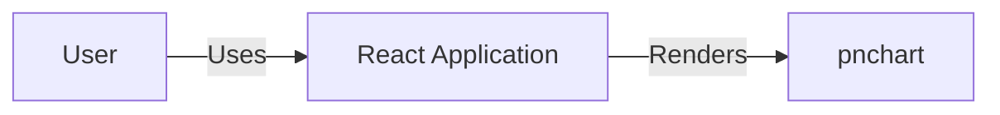
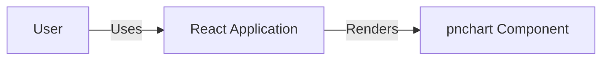
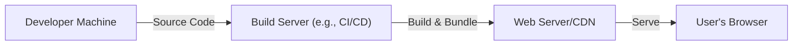
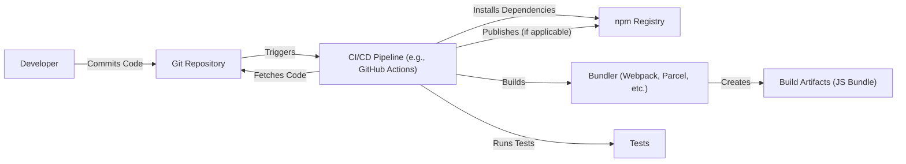

Okay, let's create a design document for the `pnchart` project.

# BUSINESS POSTURE

Business Priorities and Goals:

*   Provide a simple, easy-to-use, and visually appealing way to display pie/donut charts in React applications.
*   Offer a lightweight and performant charting solution, minimizing the impact on application bundle size and rendering speed.
*   Enable developers to quickly integrate charts into their projects with minimal configuration.
*   Provide customization options for chart appearance and behavior.
*   Open-source the project to foster community contributions and transparency.

Most Important Business Risks:

*   **Data Integrity:** Incorrect or misleading chart rendering due to faulty logic or input data.
*   **Performance Degradation:** Slow chart rendering or excessive resource consumption impacting the overall application performance.
*   **Security Vulnerabilities:** Potential vulnerabilities, such as Cross-Site Scripting (XSS), if user-provided data is not properly handled.
*   **Maintainability:** Difficulty in maintaining and updating the codebase due to poor design or lack of documentation.
*   **Accessibility:** Charts not being accessible to users with disabilities, limiting the reach and inclusivity of the application.

# SECURITY POSTURE

Existing Security Controls:

*   security control: The project is written in TypeScript, which provides static typing and helps prevent common JavaScript errors that could lead to security vulnerabilities.
*   security control: The project uses React, a well-established library with a strong focus on security. React's component-based architecture and virtual DOM help mitigate some common web vulnerabilities.
*   security control: The project has a `SECURITY.md` file, indicating a commitment to addressing security concerns and providing a channel for reporting vulnerabilities.
*   security control: The project has a `LICENSE` file, indicating that the project is open-source and subject to community scrutiny.

Accepted Risks:

*   accepted risk: The project currently does not have dedicated security audits or penetration testing.
*   accepted risk: The project relies on external dependencies (React), which could introduce vulnerabilities if those dependencies are not kept up-to-date.
*   accepted risk: The project does not explicitly sanitize user-provided data before rendering it in the chart, potentially opening up XSS vulnerabilities.

Recommended Security Controls:

*   security control: Implement input validation and sanitization for all user-provided data, especially data used for labels, tooltips, or other text elements within the chart.
*   security control: Regularly update dependencies to their latest versions to patch any known security vulnerabilities.
*   security control: Consider adding a Content Security Policy (CSP) to mitigate the risk of XSS attacks.
*   security control: Perform regular security audits and penetration testing to identify and address potential vulnerabilities.
*   security control: Implement automated security checks in the build process, such as static code analysis and dependency vulnerability scanning.

Security Requirements:

*   Authentication: Not applicable, as the project is a client-side charting library and does not handle user authentication.
*   Authorization: Not applicable, as the project does not manage user roles or permissions.
*   Input Validation:
    *   All user-provided data should be validated to ensure it conforms to expected types and formats.
    *   Data used for labels, tooltips, or other text elements should be sanitized to prevent XSS attacks.
    *   Numerical data should be validated to prevent unexpected values that could cause rendering errors or crashes.
*   Cryptography: Not applicable, as the project does not handle sensitive data requiring encryption.

# DESIGN

## C4 CONTEXT

Element Descriptions:

*   Element:
    *   Name: User
    *   Type: Person
    *   Description: A person who interacts with a React application that uses the pnchart library.
    *   Responsibilities: Views and interacts with the charts displayed in the application.
    *   Security controls: Browser security features, user authentication and authorization within the React application (if applicable).

*   Element:
    *   Name: pnchart
    *   Type: Software System
    *   Description: A React library for rendering pie and donut charts.
    *   Responsibilities: Receives data and configuration options from the React application and renders the corresponding chart.
    *   Security controls: Input validation, sanitization, secure coding practices.

*   Element:
    *   Name: React Application
    *   Type: Software System
    *   Description: A web application built using the React library that utilizes pnchart to display charts.
    *   Responsibilities: Provides data and configuration to pnchart, handles user interactions, and manages the overall application state.
    *   Security controls: React security features, application-specific security measures (e.g., authentication, authorization, input validation).

## C4 CONTAINER

Element Descriptions:

*   Element:
    *   Name: User
    *   Type: Person
    *   Description: A person who interacts with a React application that uses the pnchart library.
    *   Responsibilities: Views and interacts with the charts displayed in the application.
    *   Security controls: Browser security features, user authentication and authorization within the React application (if applicable).

*   Element:
    *   Name: pnchart Component
    *   Type: Container
    *   Description: The core component of the pnchart library, responsible for rendering the chart.
    *   Responsibilities: Receives data and configuration options, processes the data, and renders the SVG elements for the chart.
    *   Security controls: Input validation, sanitization, secure coding practices.

*   Element:
    *   Name: React Application
    *   Type: Software System
    *   Description: A web application built using the React library that utilizes pnchart to display charts.
    *   Responsibilities: Provides data and configuration to pnchart, handles user interactions, and manages the overall application state.
    *   Security controls: React security features, application-specific security measures (e.g., authentication, authorization, input validation).

## DEPLOYMENT

Possible Deployment Solutions:

1.  **Bundled with React Application:** The most common scenario is that `pnchart` is installed as an npm package and bundled together with the React application using a bundler like Webpack, Parcel, or Rollup. The resulting bundle is then deployed to a web server or CDN.
2.  **Standalone Script (UMD):** `pnchart` could be built as a UMD (Universal Module Definition) module, allowing it to be included directly in a web page via a `<script>` tag. This is less common for React components but is a possibility.
3.  **Embedded in other libraries/frameworks:** `pnchart` could be integrated into other libraries or frameworks that build on top of React.

Chosen Deployment Solution (1. Bundled with React Application):

Element Descriptions:

*   Element:
    *   Name: Developer Machine
    *   Type: Workstation
    *   Description: The developer's local machine where the code is written and tested.
    *   Responsibilities: Code development, testing, and committing changes to a version control system.
    *   Security controls: Local security measures (e.g., firewall, antivirus), secure coding practices.

*   Element:
    *   Name: Build Server (e.g., CI/CD)
    *   Type: Server
    *   Description: A server that automates the build, testing, and deployment process.
    *   Responsibilities: Fetches code from the repository, runs tests, builds the application bundle, and deploys it to the web server.
    *   Security controls: Access controls, secure build environment, dependency vulnerability scanning, SAST.

*   Element:
    *   Name: Web Server/CDN
    *   Type: Server
    *   Description: A web server or Content Delivery Network (CDN) that hosts the application bundle and serves it to users.
    *   Responsibilities: Serves the application files to users' browsers.
    *   Security controls: HTTPS, WAF, DDoS protection, access controls.

*   Element:
    *   Name: User's Browser
    *   Type: Client
    *   Description: The user's web browser where the application runs.
    *   Responsibilities: Downloads and executes the application code, renders the UI, and handles user interactions.
    *   Security controls: Browser security features, CSP.

## BUILD

Build Process Description:

1.  **Code Commit:** A developer commits code changes to the Git repository (e.g., GitHub).
2.  **CI Trigger:** The commit triggers a CI/CD pipeline (e.g., GitHub Actions, Jenkins).
3.  **Fetch Code:** The CI pipeline fetches the latest code from the repository.
4.  **Install Dependencies:** The CI pipeline installs project dependencies using npm (or yarn).
5.  **Run Tests:** The CI pipeline runs unit tests and other automated tests.
6.  **Build:** The CI pipeline uses a bundler (e.g., Webpack, Parcel) to create a production-ready bundle of the `pnchart` library and the React application.
7.  **Publish (Optional):** If `pnchart` is being published as a separate package, the CI pipeline might publish it to the npm registry.
8.  **Security Checks:**
    *   security control: **Dependency Vulnerability Scanning:** The CI pipeline should include a step to scan project dependencies for known vulnerabilities (e.g., using `npm audit` or a dedicated security tool).
    *   security control: **Static Code Analysis (SAST):** The CI pipeline should include a static code analysis tool (e.g., ESLint with security plugins, SonarQube) to identify potential security issues in the code.
    *   security control: **Linting:** The CI pipeline should enforce code style and best practices using a linter (e.g., ESLint).

# RISK ASSESSMENT

Critical Business Processes:

*   Rendering accurate and visually appealing charts.
*   Providing a smooth and performant user experience.
*   Maintaining the library's code quality and security.

Data to Protect and Sensitivity:

*   **Chart Data:** The data used to generate the charts. Sensitivity depends on the specific application. If the application displays sensitive data (e.g., financial data, personal information), then the chart data is also sensitive.
*   **User-Provided Configuration:** User-provided options for customizing the chart's appearance. Sensitivity is generally low, but improper handling could lead to XSS vulnerabilities.
*   **Source Code:** The library's source code. Sensitivity is moderate, as vulnerabilities in the code could be exploited.

# QUESTIONS & ASSUMPTIONS

Questions:

*   What specific types of data will be displayed using `pnchart` in typical use cases? This will help determine the sensitivity of the data and the appropriate security measures.
*   Are there any specific performance requirements or constraints for the library?
*   Are there any plans to add features that might introduce new security concerns (e.g., user interaction with the chart, data export)?
*   What is the expected level of user technical expertise? This will influence the design of the API and documentation.

Assumptions:

*   BUSINESS POSTURE: The primary goal is to provide a simple and easy-to-use charting library for React applications.
*   BUSINESS POSTURE: The project is open-source and community contributions are welcome.
*   SECURITY POSTURE: The project is primarily a client-side library and does not handle sensitive user data directly.
*   SECURITY POSTURE: The React application using `pnchart` is responsible for its own security, including authentication and authorization.
*   DESIGN: The library will be used primarily within React applications and bundled using a module bundler.
*   DESIGN: The library will be published to the npm registry.
*   DESIGN: The build process will include automated tests and security checks.