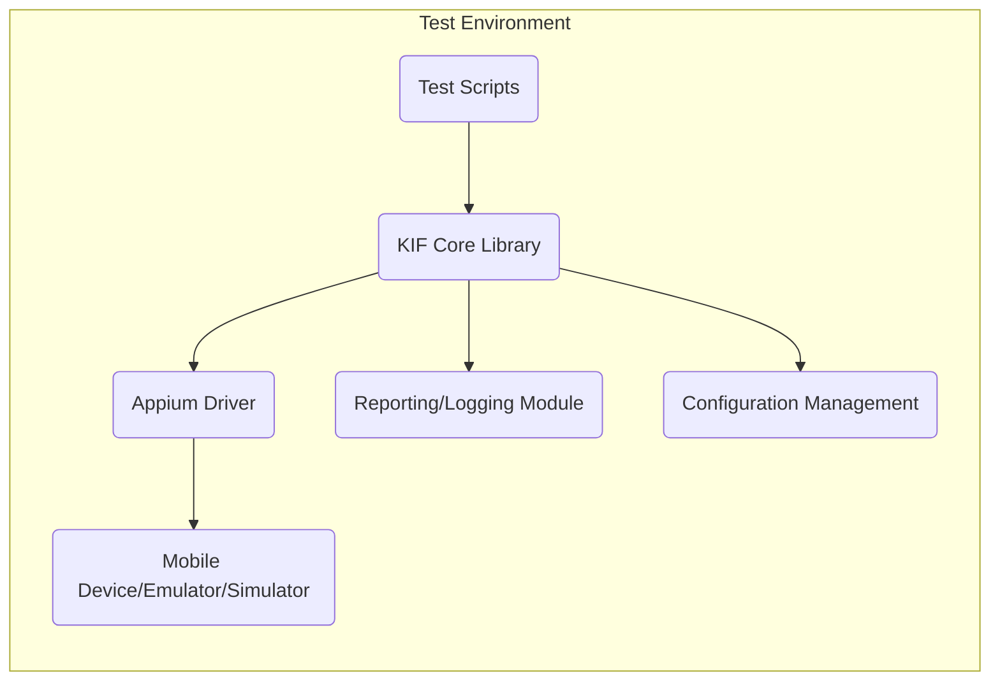

# Project Design Document: KIF Framework

**Version:** 1.1
**Date:** October 26, 2023
**Author:** AI Software Architect

## 1. Introduction

This document provides an enhanced architectural design of the KIF (Keep It Functional) framework, as represented by the project available at [https://github.com/kif-framework/kif](https://github.com/kif-framework/kif). This revised design document aims to provide greater clarity and detail, serving as a robust foundation for subsequent threat modeling activities. It clearly outlines the key components, their interactions, data flows, and deployment considerations of the framework.

### 1.1. Purpose

The primary purpose of this document is to offer a more detailed and refined architectural overview of the KIF framework. This enhanced understanding of the system's structure and behavior is crucial for identifying a wider range of potential security vulnerabilities and attack vectors during the threat modeling process.

### 1.2. Scope

This document expands upon the previous version by providing more specific details about the core architectural components and their interactions within the KIF framework. It maintains its focus on the logical and physical structure of the system, including:

*   Detailed responsibilities of key components
*   Specific data exchanged between components
*   Comprehensive list of external dependencies and integrations with examples
*   Elaborated deployment scenarios and considerations

This document continues to avoid detailed implementation specifics of individual modules or functions within the KIF framework, maintaining a focus on the architectural level.

### 1.3. Target Audience

This document is intended for the same audience as the previous version, with the expectation of providing more in-depth information:

*   Security engineers and architects responsible for threat modeling the KIF framework.
*   Development team members involved in the design, development, and maintenance of KIF.
*   Operations team members responsible for deploying and managing KIF.

## 2. System Overview

The KIF framework remains a functional testing framework primarily focused on mobile application UI testing. It empowers developers and testers to create automated UI tests that simulate user interactions with mobile applications. The framework continues to abstract the complexities of interacting with different mobile platforms (iOS and Android), offering a higher-level and more user-friendly API for test creation.

## 3. Architectural Design

The KIF framework's architecture is further detailed below, providing a clearer picture of the interaction between its components.

### 3.1. Key Components

*   **Test Scripts:** These are user-authored scripts, typically in Ruby, utilizing the KIF API to define test scenarios. They specify the sequence of actions to be performed on the target mobile application. These scripts contain the core logic of the tests.
*   **KIF Core Library:** This remains the central component, orchestrating test execution. It interprets commands from the **Test Scripts**, manages interactions with the **Appium Driver**, and coordinates reporting. It encapsulates the core logic of the KIF framework.
*   **Appium Driver:** KIF relies on Appium as its underlying automation engine. The **KIF Core Library** communicates with the **Appium Driver** using the WebDriver protocol to send commands to the mobile device. This component handles the platform-specific details of interacting with iOS and Android.
*   **Mobile Device/Emulator/Simulator:** This is the execution environment for the target mobile application. It receives commands from the **Appium Driver** and reflects the actions performed by the tests. This environment can be a physical device, an emulator on a developer's machine, or a simulator in a cloud environment.
*   **Reporting/Logging Module:** This component is responsible for generating comprehensive test reports. It captures logs, screenshots (upon failure or as configured), and the overall pass/fail status of each test. This information is crucial for analyzing test results and identifying issues.
*   **Configuration Management:** This component handles the loading and management of configuration parameters necessary for test execution. This includes device capabilities (e.g., platform version, device name), application details (e.g., bundle ID, app path), and other environment-specific settings.

### 3.2. Component Diagram

### 3.3. Data Flow

The data flow during a test execution is more precisely defined as follows:

1. The test execution is initiated with the **Test Scripts**, which contain the test logic written using the KIF API.
2. The **Test Scripts** send commands (e.g., "tap button", "enter text") to the **KIF Core Library** through its exposed API.
3. The **KIF Core Library** interprets these high-level commands and translates them into specific WebDriver commands understood by the **Appium Driver**.
4. The **KIF Core Library** sends these WebDriver commands to the **Appium Driver** over a network connection (typically HTTP).
5. The **Appium Driver** forwards these commands to the **Mobile Device/Emulator/Simulator** using platform-specific automation frameworks (e.g., XCUITest for iOS, UI Automator/Espresso for Android).
6. The **Mobile Device/Emulator/Simulator** executes the actions on the target application and sends back the execution status and any relevant data (e.g., UI element properties) to the **Appium Driver**.
7. The **Appium Driver** relays this information back to the **KIF Core Library**.
8. The **KIF Core Library** processes the results and updates the **Reporting/Logging Module** with detailed information about each step, including logs, screenshots (if configured or on failure), and the final outcome.
9. The **Configuration Management** component provides necessary configuration data (loaded from files or environment variables) to the **KIF Core Library** at the start of the test execution, influencing how the tests interact with the mobile environment.

### 3.4. External Integrations

The KIF framework commonly integrates with the following external systems and tools, with specific examples:

*   **CI/CD Pipelines:**  Integration with systems like Jenkins, GitLab CI, GitHub Actions to automate test execution as part of the build process. This allows for continuous feedback on application quality.
*   **Test Management Systems:** Integration with platforms like TestRail, Zephyr to report test results, track test coverage, and manage test cases. This provides a centralized view of testing efforts.
*   **Cloud-Based Device Farms:** Services like Sauce Labs, BrowserStack, AWS Device Farm allow KIF tests to be executed on a wide variety of real devices and OS versions hosted in the cloud.
*   **Logging and Monitoring Systems:** Integration with tools like Splunk, ELK stack for centralized logging and monitoring of test execution and potential issues.

## 4. Security Considerations (Detailed)

This section expands on the security considerations, providing more specific examples of potential risks:

*   **Test Script Security:**
    *   **Risk:** Malicious scripts could perform unintended actions on the device (e.g., data deletion, unauthorized network access).
    *   **Risk:** Poorly written scripts might expose sensitive data or credentials within the script itself.
    *   **Mitigation:** Implement code review processes for test scripts, enforce secure coding practices, and consider using parameterized inputs to avoid hardcoding sensitive information.
*   **Communication Security:**
    *   **Risk:** Communication between the **KIF Core Library** and the **Appium Driver** (typically HTTP) could be intercepted, potentially exposing test commands or data.
    *   **Risk:** Communication between the **Appium Driver** and the **Mobile Device/Emulator/Simulator** could be vulnerable if not properly secured.
    *   **Mitigation:** Consider using HTTPS for communication between components, especially in non-local environments. Ensure the underlying Appium setup is secure.
*   **Dependency Management:**
    *   **Risk:** Vulnerabilities in external libraries used by KIF (e.g., Appium client libraries, Ruby gems) could be exploited to compromise the testing environment.
    *   **Mitigation:** Regularly update dependencies, use vulnerability scanning tools to identify and address known vulnerabilities, and follow secure dependency management practices.
*   **Access Control:**
    *   **Risk:** Unauthorized access to the test environment could allow malicious actors to manipulate tests, access sensitive data, or disrupt the testing process.
    *   **Mitigation:** Implement strong authentication and authorization mechanisms for accessing the test environment, including the infrastructure running KIF and the devices under test.
*   **Data Security:**
    *   **Risk:** Sensitive data used in test scripts (e.g., user credentials, API keys) or generated during test execution (e.g., screenshots containing personal information) could be exposed if not handled securely.
    *   **Mitigation:** Avoid hardcoding sensitive data in scripts, use secure storage mechanisms for credentials, and implement appropriate data masking or anonymization techniques. Securely store and manage test reports.
*   **Logging Security:**
    *   **Risk:** Logs generated by the framework might inadvertently contain sensitive information, which could be exposed if logs are not properly secured.
    *   **Mitigation:** Implement secure logging practices, redact sensitive information from logs, and restrict access to log files.

## 5. Deployment Considerations

The deployment of the KIF framework involves setting up an execution environment, with the following more detailed considerations:

*   **Local Development Environment:**
    *   Often involves installing necessary dependencies (Ruby, Appium, device drivers) directly on the developer's machine.
    *   Security considerations are typically lower but still relevant for protecting developer workstations.
*   **CI/CD Infrastructure:**
    *   Requires provisioning build agents or dedicated testing servers with the necessary software and configurations.
    *   Security is crucial here, as these environments often have access to sensitive code and infrastructure. Secure configuration and access controls are essential.
*   **Cloud-Based Testing Platforms:**
    *   Leverages the security measures implemented by the cloud provider.
    *   Users need to ensure secure configuration of their accounts and projects within the platform. Data transmission to and from the cloud platform should be secured.
*   **Containerization (e.g., Docker):**
    *   Deploying KIF and its dependencies within containers can provide a consistent and isolated environment.
    *   Security considerations include securing the container images and the container runtime environment.

## 6. Technology Stack

The KIF framework utilizes the following key technologies:

*   **Primary Programming Language:** Ruby (as evident from the project repository).
*   **Mobile Automation Framework:** Appium (utilizing WebDriver protocol).
*   **Supported Mobile Platforms:** iOS and Android.
*   **Dependency Management (Ruby):** Bundler is likely used for managing Ruby gem dependencies.
*   **Possible Testing Framework Integration:**  May integrate with testing frameworks like RSpec or Minitest for structuring tests.

## 7. Future Considerations

Potential future enhancements or changes to the KIF framework that could impact its architecture and security include:

*   **Expanding Platform Support:** Adding support for new mobile operating systems or emerging technologies (e.g., Flutter, React Native specific testing).
*   **Advanced Reporting and Analytics:** Implementing more sophisticated reporting features, including dashboards, trend analysis, and integration with analytics platforms.
*   **Enhanced Tooling and Integrations:** Providing better integration with IDEs, debugging tools, and other developer workflows.
*   **Improved Security Features:** Incorporating built-in security features like secure credential management or enhanced logging controls.
*   **Performance Optimization:** Optimizing the framework for faster test execution and reduced resource consumption.

This enhanced document provides a more detailed and comprehensive architectural overview of the KIF framework. It serves as a more robust foundation for conducting a thorough threat model, enabling the identification of a wider range of potential vulnerabilities and the design of more effective security mitigations.