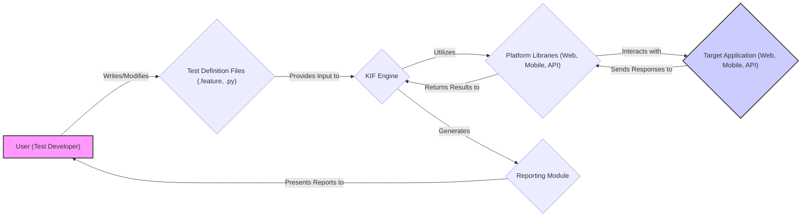
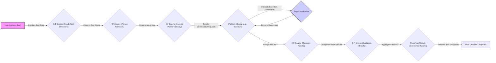

## Project Design Document: KIF Framework (Improved)

**1. Introduction**

This document provides an enhanced and detailed design overview of the Keyword Integration Framework (KIF), an open-source test automation framework available at [https://github.com/kif-framework/kif](https://github.com/kif-framework/kif). This document aims to provide a comprehensive and improved understanding of the framework's architecture, components, and data flow, serving as a robust foundation for subsequent threat modeling activities. This revision builds upon the previous version by providing more specific details and examples.

**2. Goals**

*   Clearly and precisely define the architecture and components of the KIF framework with more specific examples.
*   Describe the interactions between different components in greater detail, including the types of data exchanged.
*   Outline the data flow within the framework with enhanced clarity and accuracy.
*   Identify key technologies and dependencies, providing specific library examples where applicable.
*   Provide a more robust basis for identifying potential security vulnerabilities and threats by elaborating on potential risks.

**3. System Overview**

KIF is a keyword-driven test automation framework primarily used for testing web applications, mobile applications, and APIs. It empowers users to define test cases using a human-readable keyword syntax, effectively abstracting away the intricate implementation details of interacting with the target application.

The core functionality of KIF revolves around interpreting these keyword-based test definitions and executing the corresponding actions against the designated target system. It achieves cross-platform compatibility through the utilization of platform-specific libraries or drivers.

**4. Component Details**

*   **User (Test Developer):** The individual responsible for the creation, maintenance, and execution of test automation scripts using the KIF framework. They directly interact with the framework by authoring and modifying test definition files and initiating test runs.
    *   Example actions: Writing `.feature` files with Gherkin syntax, creating Python step definitions, running KIF commands from the command line.

*   **Test Definition Files:** These files contain the test cases, typically written in a human-readable syntax. Common formats include Gherkin syntax in `.feature` files or Python code in `.py` files. They meticulously define the steps of each test and the expected outcomes using predefined keywords.
    *   Storage format: Plain text files.
    *   Content examples:
        *   `.feature`: `Given I am on the login page`, `When I enter username "testuser"`, `Then I should see the dashboard`.
        *   `.py`: Python functions mapping keywords to actions (e.g., `def given_i_am_on_the_login_page(): ...`).
    *   Potential sensitive data: Credentials, API keys, Personally Identifiable Information (PII) used for testing.

*   **KIF Engine:** This is the central processing unit of the framework. Its core responsibilities include:
    *   Parsing the **Test Definition Files** to understand the test steps.
    *   Interpreting the keywords found within the test definitions and mapping them to specific executable actions.
    *   Orchestrating the sequential execution of individual test steps.
    *   Managing the interaction with the appropriate **Platform Libraries** based on the target application type.
    *   Collecting and aggregating test results from the executed steps.
    *   Example actions: Reading `.feature` files, identifying the keyword "Click Button", calling the corresponding function in the web platform library.

*   **Platform Libraries (Web, Mobile, API):** These are specialized modules or drivers that provide the necessary functions and methods to interact with different types of target applications. They abstract the platform-specific complexities.
    *   **Web:**  Typically leverages libraries such as Selenium WebDriver or Playwright to automate interactions with web browsers.
        *   Example actions: Opening a browser, navigating to a URL, clicking a button, entering text into a field.
    *   **Mobile:**  Commonly utilizes tools like Appium to interact with native and hybrid mobile applications on both Android and iOS platforms.
        *   Example actions: Launching an app, tapping on an element, scrolling, entering text.
    *   **API:**  Often employs libraries like the Requests library in Python or similar HTTP clients to send requests and receive responses from RESTful or other APIs.
        *   Example actions: Sending a GET request, sending a POST request with JSON data, verifying the status code of a response.
    *   Functionality: Handle low-level communication protocols and interaction mechanisms specific to each platform.

*   **Target Application (Web, Mobile, API):** This is the software system under test. KIF interacts with this application by simulating user actions or sending API requests, as defined in the test cases.
    *   Examples: A website, a mobile app, a REST API endpoint.

*   **Reporting Module:** This component is responsible for generating comprehensive reports that summarize the outcomes of test executions.
    *   Output formats: HTML, XML, JSON, console output.
    *   Content: Details of passed, failed, and skipped tests, execution time, logs, screenshots (if configured), error messages.
    *   Example tools: Integration with reporting libraries like Allure or generation of custom reports.

**5. Data Flow**

The typical sequence of data flow during a test execution is as follows:

1. The **User** initiates the test execution process, specifying the location of the **Test Definition Files** to be executed.
2. The **KIF Engine** reads and parses the specified **Test Definition Files**, extracting the test steps and keywords.
3. For each step in the test case, the **KIF Engine** identifies the corresponding keyword that dictates the action to be performed.
4. Based on the identified keyword and the target application type, the **KIF Engine** invokes the appropriate function or method within the relevant **Platform Library**.
5. The selected **Platform Library** interacts with the **Target Application**, sending commands or requests as necessary and receiving responses.
6. The **Target Application** processes the received requests and returns corresponding results or data.
7. The **Platform Library** relays the results and data back to the **KIF Engine**.
8. The **KIF Engine** evaluates the received results against the expected outcomes defined within the test case.
9. The **KIF Engine** aggregates the results of all executed steps and passes this information to the **Reporting Module**.
10. The **Reporting Module** processes the received results and generates comprehensive reports, which are then presented to the **User**.

**6. Key Technologies and Dependencies**

*   **Core Programming Language:** Primarily Python.
*   **Underlying Testing Framework:** Often built upon or integrates with established Python testing frameworks such as `unittest`, `pytest`, or `behave`.
*   **Web Interaction Libraries:** Examples include Selenium WebDriver, Playwright, Cypress (though KIF might integrate with these rather than being built on them directly).
*   **Mobile Interaction Frameworks:**  Primarily Appium for cross-platform mobile automation.
*   **API Interaction Libraries:**  Commonly uses the Requests library for making HTTP requests. Other options might include `httpx`.
*   **Reporting Libraries:** May integrate with libraries like Allure Framework, HTMLTestRunner, or generate custom reports using libraries like Jinja2.
*   **Configuration Management:** Likely utilizes configuration files in formats like YAML, JSON, or INI, or through Python files to manage settings, environment variables, and parameters.

**7. Deployment and Execution Environment**

*   **Typical Deployment:** KIF is generally executed from a local development machine, within a Continuous Integration/Continuous Delivery (CI/CD) pipeline (e.g., Jenkins, GitLab CI, GitHub Actions), or on dedicated test automation infrastructure.
*   **Execution Prerequisites:**
    *   Python interpreter (specific version requirements may apply).
    *   Installation of KIF and its dependencies via `pip` (Python package installer).
    *   For web testing: Installation of target web browsers (e.g., Chrome, Firefox) and the corresponding browser drivers (e.g., ChromeDriver, GeckoDriver) compatible with the browser versions. These drivers need to be accessible in the system's PATH or configured within KIF.
    *   For mobile testing: Setup and configuration of an Appium server, along with either a mobile emulator/simulator (e.g., Android Emulator, iOS Simulator) or a physical mobile device connected and configured for testing. Necessary SDKs (e.g., Android SDK) might also be required.
    *   For API testing: No specific UI components are needed, but network connectivity to the target API endpoint is essential.
*   **Configuration:** Configuration files often specify:
    *   Browser types and driver locations.
    *   Appium server details (if mobile testing is involved).
    *   Base URLs for web applications or API endpoints.
    *   Reporting output directories and formats.
    *   Credentials or API keys (ideally managed securely).

**8. Security Considerations (Detailed)**

This section provides a more detailed overview of security considerations relevant for threat modeling, expanding on potential risks associated with each component.

*   **Test Definition Files:**
    *   **Threat:** Storage of sensitive information (credentials, API keys, PII) in plain text within these files.
        *   **Impact:** Unauthorized access to these files could lead to credential compromise or data breaches.
    *   **Threat:** Risk of malicious code injection if test definitions allow for arbitrary code execution or if the parsing logic is vulnerable.
        *   **Impact:** Could lead to unauthorized actions on the target application or the execution environment.
    *   **Threat:** Unauthorized modification of test logic by malicious actors.
        *   **Impact:** Could lead to bypassing security checks or introducing vulnerabilities in the target application during testing.

*   **KIF Engine:**
    *   **Threat:** Vulnerabilities in the parsing logic of the engine could be exploited by crafting malicious test definitions, leading to code injection or denial-of-service.
        *   **Impact:** Potential compromise of the testing environment or the target application.
    *   **Threat:** Improper handling or insecure loading of external libraries or modules.
        *   **Impact:** Introduction of vulnerabilities present in the dependencies.
    *   **Threat:** Insufficient input validation when processing test data or configuration.
        *   **Impact:** Could lead to unexpected behavior or security vulnerabilities.

*   **Platform Libraries:**
    *   **Threat:** Exploitation of known security vulnerabilities within the underlying libraries like Selenium or Appium.
        *   **Impact:** Could allow attackers to gain control of the browser or mobile device being used for testing.
    *   **Threat:** Incorrect or insecure configuration of these libraries, potentially exposing sensitive information or allowing unintended actions on the target application.
        *   **Impact:** Data leakage or unauthorized modifications.
    *   **Threat:** Man-in-the-middle attacks if communication between the platform libraries and the target application is not secured (e.g., using HTTPS).
        *   **Impact:** Interception of sensitive data exchanged during testing.

*   **Target Application Interaction:**
    *   **Threat:** The framework's ability to interact with the target application could be misused to trigger unintended actions, such as creating, modifying, or deleting data without proper authorization if test cases are not carefully designed and controlled.
        *   **Impact:** Data corruption or unauthorized access.
    *   **Threat:** Exposure of vulnerabilities in the target application through automated testing, which could be discovered and exploited by malicious actors if the testing environment is not isolated.
        *   **Impact:**  Vulnerability disclosure before remediation.

*   **Reporting Module:**
    *   **Threat:** Reports might contain sensitive data extracted from the target application or details of security vulnerabilities discovered during testing.
        *   **Impact:** Information disclosure if reports are not securely stored and accessed.
    *   **Threat:** Unauthorized access to reports could reveal confidential information about the application's functionality and security posture.
        *   **Impact:**  Exposure of intellectual property or security weaknesses.

*   **Configuration:**
    *   **Threat:** Storage of sensitive information like database credentials, API keys, or other secrets in configuration files.
        *   **Impact:** Credential compromise if configuration files are not properly secured.
    *   **Threat:** Insecure transmission or storage of configuration data.
        *   **Impact:**  Exposure of sensitive configuration parameters.

*   **Dependencies:**
    *   **Threat:** Use of third-party libraries with known security vulnerabilities.
        *   **Impact:** Introduction of vulnerabilities into the KIF framework itself.
    *   **Threat:** Lack of proper dependency management and security scanning of dependencies.
        *   **Impact:**  Unawareness of potential vulnerabilities.

**9. Future Considerations (Potential Extensions)**

*   Enhanced integration with cloud-based testing platforms and services (e.g., cloud-based browser farms, mobile device clouds).
*   Advanced reporting and analytics capabilities, including dashboards and trend analysis.
*   Expanded support for additional platforms, technologies, and testing methodologies (e.g., performance testing, security testing integrations).
*   Implementation of improved security features within the framework itself, such as secure credential management, encrypted storage of sensitive data, and role-based access control for test definitions and execution.
*   Integration with vulnerability scanning tools to automatically identify potential security issues in test definitions or the framework's dependencies.

This improved document provides a more detailed and comprehensive understanding of the KIF framework's design, offering a stronger foundation for conducting a thorough and effective threat model to identify potential security risks and develop appropriate mitigation strategies.