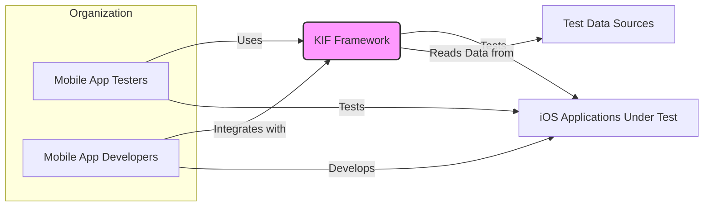
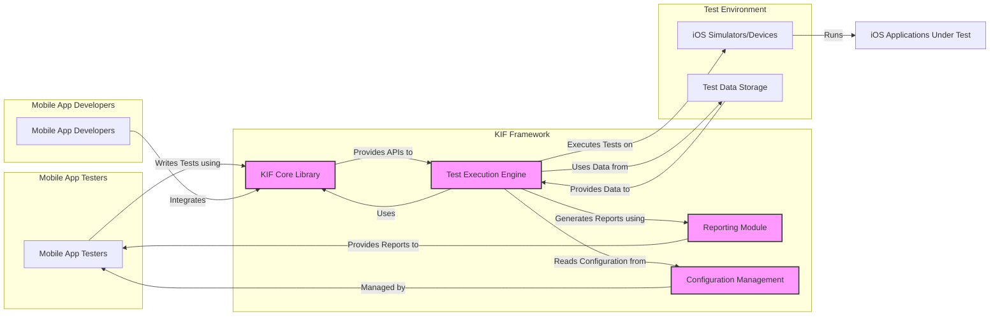
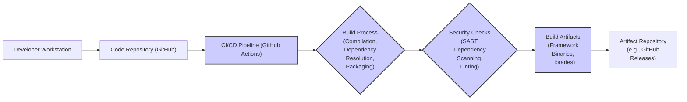

# BUSINESS POSTURE

The KIF framework is designed to facilitate automated UI testing for iOS applications. The primary business priority for adopting such a framework is to improve software quality and accelerate the release cycle by automating regression testing and ensuring consistent user experience across application updates. By automating UI tests, development teams can reduce manual testing effort, identify UI defects earlier in the development lifecycle, and gain confidence in the stability of their applications before release.

Key business goals that KIF aims to solve include:

*   Reduced time to market for iOS applications by streamlining testing processes.
*   Improved software quality and reduced bug count in released applications through comprehensive UI testing.
*   Lower testing costs by automating repetitive manual testing tasks.
*   Increased consistency and reliability of UI testing across different application versions and environments.

Most important business risks associated with adopting KIF include:

*   Risk of test failures leading to delays in release cycles if the framework is not robust or tests are poorly designed.
*   Risk of false positives or negatives in test results, potentially leading to undetected bugs or unnecessary delays.
*   Risk of security vulnerabilities within the KIF framework itself, which could be exploited to compromise test environments or even the applications under test if not properly secured.
*   Risk of data breaches if sensitive test data or application credentials are not handled securely within the testing process and framework.
*   Risk of vendor lock-in if the organization becomes overly reliant on a specific testing framework and faces challenges migrating away from it in the future.

# SECURITY POSTURE

Existing security controls and accepted risks for the KIF project are currently not explicitly documented within the provided GitHub repository. Based on common open-source project practices and the nature of a testing framework, we can infer the following:

security control: Code is hosted on GitHub, providing version control and transparency. Implemented by: GitHub platform.
security control: Open-source nature allows for community review and contribution, potentially leading to identification and patching of security vulnerabilities. Implemented by: Open-source community model.
accepted risk: Reliance on community contributions for security fixes may lead to delays in addressing vulnerabilities compared to commercially supported products.
accepted risk: Lack of formal security audits or penetration testing may leave unknown vulnerabilities unaddressed.
accepted risk: Security of test environments and data handling within test scripts is the responsibility of the users of the framework, not the framework itself.

Recommended security controls to implement as high priority:

security control: Implement automated static application security testing (SAST) scans on the KIF codebase as part of the CI/CD pipeline to identify potential vulnerabilities in the framework code itself.
security control: Introduce dependency scanning to identify and manage known vulnerabilities in third-party libraries used by KIF.
security control: Establish a process for reporting and handling security vulnerabilities, including a security policy and contact information.
security control: Provide security guidelines and best practices for users of the KIF framework, focusing on secure test script development and handling of sensitive data in tests.
security control: Consider performing periodic security audits or penetration testing of the KIF framework by security professionals.

Security requirements for the KIF project:

authentication: Not directly applicable to the KIF framework itself as it is a library. Authentication is relevant in the context of systems where KIF is used, such as test execution environments or reporting dashboards.
authorization: Within the framework, authorization might be relevant for controlling access to test execution, results, or configuration settings if KIF is extended with such features. In its current form, authorization is primarily managed by the underlying operating system and file system permissions where KIF is used.
input validation: Input validation is crucial for KIF to prevent injection attacks or unexpected behavior. This includes validating test scripts, configuration files, and any data passed to the framework during test execution. Input validation should be implemented at all boundaries where external data enters the framework.
cryptography: Cryptography may be required if KIF needs to handle sensitive data within test scripts or configuration, such as API keys or credentials. Secure storage and transmission of sensitive data should be ensured using appropriate cryptographic techniques. If KIF is extended to support secure communication with tested applications, TLS/SSL and other cryptographic protocols should be used.

# DESIGN

## C4 CONTEXT



Context Diagram Elements:

*   Name: Mobile App Testers
    *   Type: Person
    *   Description: Quality assurance engineers and testers responsible for writing and executing UI tests for iOS applications.
    *   Responsibilities: Define test cases, write test scripts using KIF framework, execute tests, analyze test results, report defects.
    *   Security controls: Access control to test environments, secure storage of test credentials, training on secure testing practices.

*   Name: Mobile App Developers
    *   Type: Person
    *   Description: Software engineers responsible for developing and maintaining iOS applications.
    *   Responsibilities: Develop application code, integrate KIF framework into development workflow, review test results, fix defects identified by tests.
    *   Security controls: Secure coding practices, code review processes, access control to development environments and code repositories.

*   Name: KIF Framework
    *   Type: Software System
    *   Description: Open-source UI testing framework for iOS applications, providing APIs and tools for automating user interface interactions and assertions.
    *   Responsibilities: Provide APIs for UI test automation, execute test scripts, generate test reports, interact with iOS applications under test.
    *   Security controls: Input validation, dependency scanning, SAST, secure build process, security guidelines for users.

*   Name: iOS Applications Under Test
    *   Type: Software System
    *   Description: iOS mobile applications being tested using the KIF framework. These are the target applications for UI testing.
    *   Responsibilities: Functionality being tested, providing user interface for interaction, processing user inputs.
    *   Security controls: Application security controls (authentication, authorization, input validation, etc.), secure deployment, regular security testing.

*   Name: Test Data Sources
    *   Type: External System
    *   Description: External systems or data sources that provide data required for test execution, such as databases, APIs, or configuration files.
    *   Responsibilities: Provide test data, store and manage test data, ensure data integrity and availability.
    *   Security controls: Access control to test data, data encryption at rest and in transit, data validation, secure data storage and backup.

## C4 CONTAINER



Container Diagram Elements:

*   Name: KIF Core Library
    *   Type: Library
    *   Description: The core component of the KIF framework, providing the API and implementation for UI test automation. Includes classes and methods for interacting with UI elements, performing actions, and making assertions.
    *   Responsibilities: Expose API for test script development, implement UI interaction logic, handle communication with iOS accessibility APIs.
    *   Security controls: Input validation within API methods, SAST, dependency scanning, secure coding practices.

*   Name: Test Execution Engine
    *   Type: Application
    *   Description: Responsible for running test scripts written using the KIF Core Library. Orchestrates test execution flow, manages test sessions, and interacts with iOS simulators or devices.
    *   Responsibilities: Load and execute test scripts, manage test execution lifecycle, interact with iOS simulators/devices, collect test results, pass results to reporting module.
    *   Security controls: Secure handling of test scripts, access control to execution environment, logging and monitoring of test execution, input validation of test script inputs.

*   Name: Reporting Module
    *   Type: Library/Application
    *   Description: Generates test reports based on the results of test execution. Can produce various report formats (e.g., HTML, JUnit) and provide summaries, logs, and failure details.
    *   Responsibilities: Aggregate test results, generate test reports in different formats, provide user-friendly visualization of test outcomes.
    *   Security controls: Secure generation of reports, prevention of information leakage in reports, access control to reports if stored centrally.

*   Name: Configuration Management
    *   Type: Configuration Files/Service
    *   Description: Manages configuration settings for the KIF framework and test execution environment. This may include settings for simulators, devices, test data sources, and reporting options.
    *   Responsibilities: Store and manage configuration settings, provide access to configuration parameters, ensure consistent configuration across test environments.
    *   Security controls: Secure storage of configuration files, access control to configuration settings, encryption of sensitive configuration data (e.g., credentials).

*   Name: iOS Simulators/Devices
    *   Type: Infrastructure
    *   Description: Physical iOS devices or software simulators used to run the iOS applications under test and execute KIF tests.
    *   Responsibilities: Provide runtime environment for iOS applications, simulate user interactions, execute application code.
    *   Security controls: Secure configuration of simulators/devices, isolation of test environments, regular patching and updates, physical security for devices.

*   Name: Test Data Storage
    *   Type: Data Store
    *   Description: Storage for test data used by KIF tests. This could be file systems, databases, or external services.
    *   Responsibilities: Store test data, provide access to test data for test execution, ensure data integrity and availability.
    *   Security controls: Access control to test data storage, data encryption at rest, secure data backup and recovery.

## DEPLOYMENT

For KIF, deployment primarily refers to its integration into a testing environment. A common deployment scenario is within a developer's local machine or a CI/CD pipeline. Let's focus on CI/CD pipeline deployment for automated testing.

```mermaid
flowchart LR
    subgraph "Developer Workstation"
        A["Developer"]
        B["Code Repository (GitHub)"]
    end
    subgraph "CI/CD Pipeline (e.g., GitHub Actions)"
        C["CI Server"]
        D["Build Agent"]
        E["Test Execution Environment (iOS Simulators)"]
        F["Test Results Storage"]
    end

    A -- "Commits Code to" --> B
    B -- "Triggers" --> C
    C -- "Orchestrates Build and Test on" --> D
    D -- "Downloads KIF and Application Code from" --> B
    D -- "Builds and Deploys Application to" --> E
    D -- "Executes KIF Tests on" --> E
    E -- "Runs Tests against" --> "iOS Applications Under Test"
    D -- "Uploads Test Results to" --> F
    F -- "Provides Access to Test Reports for" --> A & B

    style C fill:#ccf,stroke:#333,stroke-width:2px
    style D fill:#ccf,stroke:#333,stroke-width:2px
    style E fill:#ccf,stroke:#333,stroke-width:2px
    style F fill:#ccf,stroke:#333,stroke-width:2px
```

Deployment Diagram Elements (CI/CD Pipeline):

*   Name: CI Server (e.g., GitHub Actions)
    *   Type: Application Server
    *   Description: Central server orchestrating the CI/CD pipeline. Manages workflows, triggers builds and tests, and integrates with other tools.
    *   Responsibilities: Pipeline orchestration, workflow management, build and test triggering, integration with code repository and reporting tools.
    *   Security controls: Access control to CI server, secure configuration of CI pipelines, audit logging, secure communication with build agents and other systems.

*   Name: Build Agent
    *   Type: Compute Instance (VM/Container)
    *   Description: Executes build and test jobs as instructed by the CI server. Provides the environment for building the application and running KIF tests.
    *   Responsibilities: Build application code, deploy application to test environment, execute KIF tests, collect test results, upload results to CI server.
    *   Security controls: Secure hardening of build agent instances, isolation of build environments, access control to build agents, secure storage of build artifacts and test results on the agent.

*   Name: Test Execution Environment (iOS Simulators)
    *   Type: Compute Instance (VM/Container)
    *   Description: Environment where iOS simulators or devices are provisioned to run the applications under test and execute KIF tests.
    *   Responsibilities: Provide runtime environment for iOS applications and simulators, execute KIF tests, simulate user interactions.
    *   Security controls: Secure configuration of test environments, isolation of test environments, access control to test environments, secure disposal of test environments after use.

*   Name: Test Results Storage
    *   Type: Data Store
    *   Description: Storage for test results generated by KIF tests. This could be integrated into the CI/CD system or a separate reporting database.
    *   Responsibilities: Store test results, provide access to test reports, ensure data integrity and availability of test results.
    *   Security controls: Access control to test results storage, data encryption at rest, secure backup and recovery of test results.

## BUILD



Build Process Description:

The build process for KIF, like many software projects, starts with developers committing code changes to a code repository, in this case, GitHub. This action typically triggers an automated CI/CD pipeline, such as GitHub Actions, which is a common practice for open-source projects hosted on GitHub.

The CI/CD pipeline initiates the build process, which involves several key steps:

1.  Compilation: The source code of the KIF framework is compiled into executable binaries or libraries suitable for distribution and use.
2.  Dependency Resolution: The build system resolves and manages dependencies on external libraries or components required by KIF. This ensures that all necessary components are included in the build.
3.  Packaging: The compiled binaries and necessary resources are packaged into distributable artifacts, such as libraries or archives, ready for use by developers or for deployment in test environments.
4.  Security Checks: As a crucial step in a secure build process, automated security checks are performed on the codebase and dependencies. These checks include:
    *   Static Application Security Testing (SAST): SAST tools analyze the source code for potential security vulnerabilities without executing the code.
    *   Dependency Scanning: Tools scan the project's dependencies to identify known vulnerabilities in third-party libraries.
    *   Linting: Code linters check the code for stylistic and programmatic errors, which can sometimes have security implications.
5.  Build Artifacts: The output of the build process is a set of build artifacts, which may include compiled framework binaries, libraries, and any other necessary files for using or distributing KIF.
6.  Artifact Repository: The final build artifacts are typically stored in an artifact repository. For open-source projects on GitHub, a common practice is to use GitHub Releases to store and distribute the build artifacts, making them available for users to download and integrate into their projects.

Security controls in the build process:

security control: Automated CI/CD pipeline ensures consistent and repeatable builds, reducing the risk of manual errors and inconsistencies. Implemented by: GitHub Actions.
security control: Source code is hosted in a version control system (GitHub), providing traceability and integrity of code changes. Implemented by: GitHub.
security control: Security checks (SAST, dependency scanning, linting) are integrated into the build pipeline to automatically identify potential vulnerabilities. Implemented by: CI/CD pipeline configuration and security tools.
security control: Access control to the CI/CD pipeline and artifact repository to prevent unauthorized modifications or access to build artifacts. Implemented by: GitHub and CI/CD platform access controls.
security control: Code review process before merging code changes to the main branch to ensure code quality and security. Implemented by: Development team practices.

# RISK ASSESSMENT

Critical business processes protected by KIF are:

*   Software Release Cycle: KIF aims to ensure the quality of iOS applications before release, directly impacting the speed and reliability of the software release cycle. Failures in KIF or its misuse could lead to undetected bugs and delayed releases.
*   User Experience: By automating UI testing, KIF helps maintain a consistent and positive user experience across different versions of iOS applications. Issues in KIF could lead to UI defects that negatively impact user satisfaction.

Data being protected and its sensitivity:

*   Test Scripts: Test scripts written for KIF might contain sensitive information, such as application credentials, API keys, or business logic details. Sensitivity: Medium to High, depending on the information embedded and the applications being tested.
*   Test Data: Test data used by KIF tests can include realistic or synthetic data that might mimic production data. Sensitivity: Low to High, depending on the nature of the test data and its resemblance to sensitive production data.
*   Test Results and Reports: Test results and reports may contain information about application behavior and potential vulnerabilities discovered during testing. Sensitivity: Low to Medium, as they can reveal insights into application security posture.
*   KIF Framework Code: The source code of the KIF framework itself. Sensitivity: Medium, as vulnerabilities in the framework could impact all users of KIF and potentially the security of applications tested with it.
*   Configuration Data: Configuration settings for KIF and test environments might include credentials or sensitive settings. Sensitivity: Medium to High, depending on the nature of the configuration data.

# QUESTIONS & ASSUMPTIONS

Questions:

*   What is the intended deployment environment for KIF tests? (e.g., local developer machines, dedicated test environments, cloud-based test farms)
*   What types of applications will be tested using KIF? (e.g., internal applications, customer-facing applications, applications handling sensitive data)
*   Are there specific regulatory compliance requirements that the testing process needs to adhere to? (e.g., GDPR, HIPAA, PCI DSS)
*   What is the process for managing and storing test data? Are there any specific security requirements for test data handling?
*   Is there a dedicated security team involved in reviewing and approving the use of KIF and the associated testing processes?
*   What is the expected scale of KIF usage? (e.g., number of tests, frequency of test execution, number of users)

Assumptions:

*   KIF will be used primarily for automated regression testing of iOS applications within a CI/CD pipeline.
*   Test environments are assumed to be isolated from production environments but may still contain sensitive data.
*   Users of KIF are expected to follow secure coding practices when writing test scripts, but guidance and tooling can improve security.
*   The organization adopting KIF has a general awareness of software security best practices and aims to improve the security posture of their software development lifecycle.
*   The open-source nature of KIF is considered acceptable, and the organization is willing to accept the associated risks and responsibilities of using open-source software.