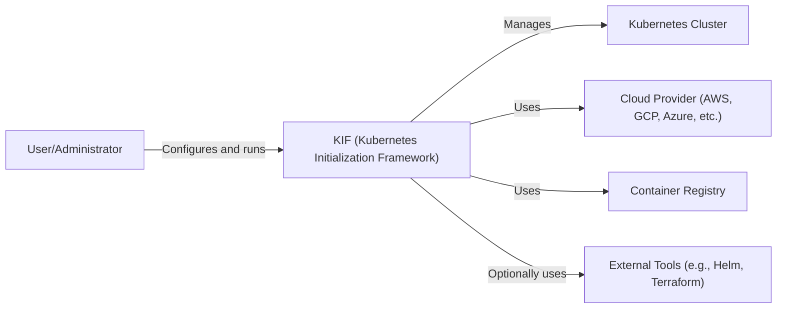
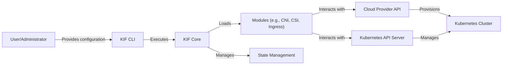
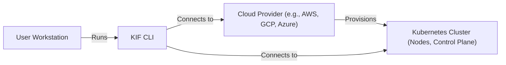
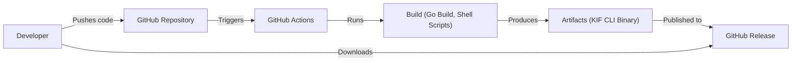

Okay, let's create a design document for the KIF (Kubernetes ইনিয়ালাইজেশন ফ্রেমওয়ার্ক) project.

# BUSINESS POSTURE

Business Priorities and Goals:

*   Simplify and standardize the process of initializing Kubernetes clusters.
*   Provide a modular and extensible framework for cluster setup.
*   Reduce the time and effort required to deploy Kubernetes clusters.
*   Improve the consistency and reliability of Kubernetes deployments.
*   Enable infrastructure-as-code practices for Kubernetes cluster initialization.
*   Support a variety of Kubernetes distributions and cloud providers.

Most Important Business Risks:

*   Inconsistent cluster configurations leading to operational issues.
*   Security vulnerabilities in the cluster setup process.
*   Lack of flexibility to adapt to changing infrastructure requirements.
*   Complexity in managing and updating cluster configurations.
*   Vendor lock-in due to tightly coupled infrastructure components.
*   Downtime or service disruption during cluster initialization or updates.

# SECURITY POSTURE

Existing Security Controls:

*   security control: Utilizes Kubernetes-native security features (RBAC, Network Policies, etc.) where applicable, as configured by modules.
*   security control: Leverages infrastructure-as-code principles, enabling version control and auditability of cluster configurations.
*   security control: Supports modularity, allowing users to select and configure only the necessary components, reducing the attack surface.
*   security control: The project is open-source, allowing for community review and contributions to improve security.

Accepted Risks:

*   accepted risk: The framework itself does not enforce specific security policies; it relies on the user to configure modules appropriately.
*   accepted risk: The security of the resulting Kubernetes cluster depends on the security of the underlying infrastructure and the chosen modules.
*   accepted risk: The framework does not currently have a formal security audit process.

Recommended Security Controls:

*   security control: Implement a mechanism for verifying the integrity and authenticity of modules (e.g., digital signatures).
*   security control: Integrate with security scanning tools to identify vulnerabilities in cluster configurations and dependencies.
*   security control: Provide a default set of secure configurations for common use cases.
*   security control: Develop a comprehensive security guide and documentation.
*   security control: Establish a process for handling security vulnerabilities and reporting.

Security Requirements:

*   Authentication:
    *   The framework should support secure authentication to the Kubernetes API server.
    *   User authentication should be handled by the underlying Kubernetes cluster and configured identity providers.
    *   Service accounts should be used for internal communication within the cluster, with minimal necessary privileges.
*   Authorization:
    *   Role-Based Access Control (RBAC) should be used to manage access to Kubernetes resources.
    *   The framework should provide mechanisms for configuring RBAC policies.
    *   Principle of least privilege should be applied to all components and users.
*   Input Validation:
    *   All user-provided input (e.g., module configurations) should be validated to prevent injection attacks and other vulnerabilities.
    *   Configuration files should be validated against a schema.
*   Cryptography:
    *   TLS should be used for all communication between components and with the Kubernetes API server.
    *   Secrets management should be handled securely, leveraging Kubernetes Secrets or external secret stores.
    *   Encryption at rest should be considered for sensitive data stored within the cluster.

# DESIGN

## C4 CONTEXT

Element Descriptions:

*   User/Administrator:
    *   Name: User/Administrator
    *   Type: Person
    *   Description: The person responsible for configuring and running KIF to initialize a Kubernetes cluster.
    *   Responsibilities: Provides configuration input to KIF, monitors the initialization process, and manages the resulting cluster.
    *   Security controls: Authentication and authorization to interact with KIF and the target environment.
*   KIF (Kubernetes Initialization Framework):
    *   Name: KIF (Kubernetes Initialization Framework)
    *   Type: Software System
    *   Description: The framework that orchestrates the initialization of a Kubernetes cluster.
    *   Responsibilities: Parses configuration, executes modules, manages dependencies, and interacts with the cloud provider and Kubernetes API.
    *   Security controls: Input validation, modular design, secure communication with external systems.
*   Kubernetes Cluster:
    *   Name: Kubernetes Cluster
    *   Type: Software System
    *   Description: The target Kubernetes cluster being initialized.
    *   Responsibilities: Runs containerized workloads, provides services, and manages resources.
    *   Security controls: RBAC, Network Policies, Pod Security Policies (or equivalent), Secrets management.
*   Cloud Provider (AWS, GCP, Azure, etc.):
    *   Name: Cloud Provider
    *   Type: Software System
    *   Description: The underlying infrastructure provider for the Kubernetes cluster.
    *   Responsibilities: Provides compute, storage, networking, and other resources for the cluster.
    *   Security controls: IAM, network security groups, encryption at rest and in transit.
*   Container Registry:
    *   Name: Container Registry
    *   Type: Software System
    *   Description: A repository for storing container images used by the Kubernetes cluster.
    *   Responsibilities: Stores and serves container images.
    *   Security controls: Authentication, authorization, image scanning.
*   External Tools (e.g., Helm, Terraform):
    *   Name: External Tools
    *   Type: Software System
    *   Description: Optional tools that can be integrated with KIF for specific tasks.
    *   Responsibilities: Varies depending on the tool.
    *   Security controls: Depends on the specific tool and its configuration.

## C4 CONTAINER

Element Descriptions:

*   KIF CLI:
    *   Name: KIF CLI
    *   Type: Command-Line Interface
    *   Description: The command-line interface for interacting with KIF.
    *   Responsibilities: Parses user input, validates configuration, and triggers the initialization process.
    *   Security controls: Input validation.
*   KIF Core:
    *   Name: KIF Core
    *   Type: Application
    *   Description: The core logic of the KIF framework.
    *   Responsibilities: Manages the execution of modules, handles dependencies, and maintains state.
    *   Security controls: Secure coding practices, dependency management.
*   Modules (e.g., CNI, CSI, Ingress):
    *   Name: Modules
    *   Type: Libraries/Plugins
    *   Description: Reusable components that perform specific tasks during cluster initialization.
    *   Responsibilities: Configures specific aspects of the cluster, such as networking, storage, or ingress.
    *   Security controls: Input validation, secure communication with external systems, adherence to Kubernetes security best practices.
*   Cloud Provider API:
    *   Name: Cloud Provider API
    *   Type: API
    *   Description: The API provided by the cloud provider for managing resources.
    *   Responsibilities: Provisions and manages infrastructure resources.
    *   Security controls: Authentication, authorization, encryption.
*   Kubernetes API Server:
    *   Name: Kubernetes API Server
    *   Type: API
    *   Description: The central control plane component of Kubernetes.
    *   Responsibilities: Manages the state of the cluster, schedules workloads, and provides an API for interacting with the cluster.
    *   Security controls: Authentication, authorization, TLS encryption.
*   State Management:
    *   Name: State Management
    *   Type: Data Store
    *   Description: Stores the state of the initialization process.
    *   Responsibilities: Tracks the progress of the initialization, stores intermediate results, and enables idempotency.
    *   Security controls: Access control, potentially encryption.
* Kubernetes Cluster:
    *   Name: Kubernetes Cluster
    *   Type: Software System
    *   Description: The target Kubernetes cluster being initialized.
    *   Responsibilities: Runs containerized workloads.
    *   Security controls: RBAC, Network Policies.

## DEPLOYMENT

Possible Deployment Solutions:

1.  Local Execution: KIF can be run directly on a user's workstation or a dedicated management server.
2.  Containerized Execution: KIF can be packaged as a container image and run within a container orchestration platform (e.g., Docker, Kubernetes).
3.  Cloud-Based Execution: KIF can be run within a cloud-based environment (e.g., a cloud shell, a virtual machine).

Chosen Solution (Detailed Description): Local Execution

KIF is designed to be run locally on a user's workstation or a dedicated management server. This approach provides simplicity and direct control over the initialization process. The user downloads the KIF CLI and executes it with a configuration file specifying the desired cluster setup.

Element Descriptions:

*   User Workstation:
    *   Name: User Workstation
    *   Type: Physical/Virtual Machine
    *   Description: The machine where the KIF CLI is executed.
    *   Responsibilities: Runs the KIF CLI, provides the execution environment.
    *   Security controls: User authentication, operating system security.
*   KIF CLI:
    *   Name: KIF CLI
    *   Type: Application
    *   Description: The command-line interface for KIF.
    *   Responsibilities: Executes the initialization process.
    *   Security controls: Input validation.
*   Cloud Provider:
    *   Name: Cloud Provider
    *   Type: Infrastructure Provider
    *   Description: The cloud provider hosting the Kubernetes cluster.
    *   Responsibilities: Provides compute, storage, and networking resources.
    *   Security controls: IAM, network security, encryption.
*   Kubernetes Cluster:
    *   Name: Kubernetes Cluster
    *   Type: Infrastructure
    *   Description: The target Kubernetes cluster.
    *   Responsibilities: Runs containerized workloads.
    *   Security controls: Kubernetes-native security features.

## BUILD

The KIF project utilizes a combination of shell scripts and Go code. The build process is automated using GitHub Actions, providing a CI/CD pipeline.

Build Process Steps and Security Controls:

1.  Code Commit: Developers commit code to the GitHub repository.
    *   security control: Code review process to ensure code quality and security.
2.  GitHub Actions Trigger: A push to the repository triggers the GitHub Actions workflow.
3.  Build Environment Setup: The workflow sets up the build environment, including Go and any necessary dependencies.
4.  Linting: The code is checked for style and potential errors using linters.
    *   security control: Static analysis to identify potential code quality issues.
5.  Testing: Unit tests and integration tests are executed.
    *   security control: Automated testing to verify code functionality and prevent regressions.
6.  Build: The Go code is compiled into a binary executable (KIF CLI). Shell scripts are packaged.
7.  Artifact Creation: The build artifacts (KIF CLI binary) are created.
8.  Release: The artifacts are published as a GitHub Release.
    *   security control: Versioned releases for tracking and rollback.
9.  Optional Security Scanning:
    *   security control: Integration with SAST (Static Application Security Testing) tools to scan the code for vulnerabilities.
    *   security control: Dependency scanning to identify vulnerable dependencies.

# RISK ASSESSMENT

Critical Business Processes:

*   Kubernetes cluster provisioning and initialization.
*   Application deployment and management on Kubernetes.
*   Infrastructure-as-code management for Kubernetes clusters.

Data Sensitivity:

*   Configuration files: May contain sensitive information such as cloud provider credentials, API keys, and other secrets. Sensitivity: High.
*   Kubernetes cluster state: Contains information about the cluster configuration, running workloads, and potentially sensitive data stored within the cluster. Sensitivity: High.
*   User data: Depending on the applications running on the cluster, user data may be stored and processed. Sensitivity: Variable, depending on the application.

# QUESTIONS & ASSUMPTIONS

Questions:

*   What specific cloud providers and Kubernetes distributions are targeted for support?
*   What is the expected level of user expertise with Kubernetes and cloud infrastructure?
*   Are there any existing infrastructure-as-code tools or processes in use?
*   What are the specific requirements for secret management?
*   What is the desired level of customization and extensibility for the framework?
*   Are there any compliance requirements (e.g., HIPAA, PCI DSS) that need to be considered?

Assumptions:

*   BUSINESS POSTURE: The primary goal is to simplify and standardize Kubernetes cluster initialization.
*   BUSINESS POSTURE: Users have a basic understanding of Kubernetes concepts.
*   SECURITY POSTURE: The underlying cloud infrastructure is configured securely.
*   SECURITY POSTURE: Users will follow security best practices when configuring KIF modules.
*   DESIGN: The framework will be modular and extensible.
*   DESIGN: The primary deployment method will be local execution of the KIF CLI.
*   DESIGN: GitHub Actions will be used for CI/CD.