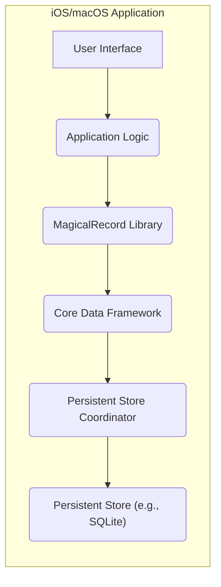
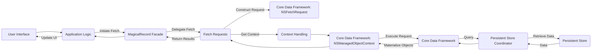
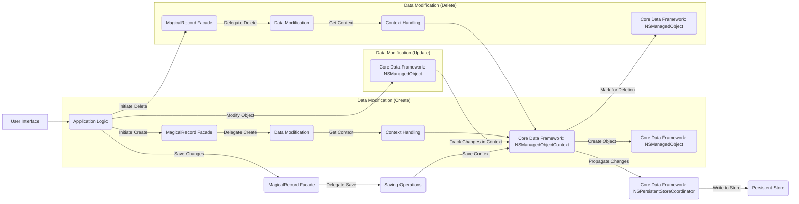

# Project Design Document: MagicalRecord

**Version:** 1.1
**Date:** October 26, 2023
**Author:** AI Software Architect

## 1. Introduction

This document provides an enhanced design overview of the MagicalRecord project, an Objective-C library designed to streamline interactions with Apple's Core Data framework. This detailed description of the library's architecture, components, and data flow is intended to serve as a foundation for comprehensive threat modeling. By clearly outlining the system's structure and behavior, we can more effectively identify potential security vulnerabilities.

## 2. Goals and Objectives

MagicalRecord's primary objective is to abstract the complexities inherent in using Apple's Core Data framework directly. It aims to provide a more developer-friendly and intuitive interface for common Core Data tasks. Specific goals include:

*   **Simplified Context Management:** To automate the creation and handling of `NSManagedObjectContext` instances, reducing boilerplate code.
*   **Intuitive Data Access:** To offer convenient and expressive methods for fetching, creating, updating, and deleting managed objects.
*   **Seamless Background Operations:** To facilitate the execution of Core Data operations on background threads, preventing main thread blocking and improving application responsiveness.
*   **Reduced Boilerplate:** To minimize the amount of repetitive code developers need to write when working with Core Data.
*   **Improved Code Readability:** To make Core Data interactions more readable and maintainable.

## 3. System Architecture

MagicalRecord functions as an embedded library within iOS and macOS applications. It does not operate as an independent service. Its architecture can be understood at two levels: its integration within an application and its internal component structure.

### 3.1. High-Level Architecture

This diagram illustrates how MagicalRecord fits within the broader application architecture:



*   **User Interface:** The application's user interface through which users interact with the application's data.
*   **Application Logic:** The application's business logic, which utilizes MagicalRecord to interact with the data layer.
*   **MagicalRecord Library:** The library itself, acting as a simplified interface to Core Data. It handles context management, fetching, saving, and other Core Data operations on behalf of the application logic.
*   **Core Data Framework:** Apple's framework responsible for managing the application's data model, including object lifecycle management, persistence, and querying. MagicalRecord leverages this framework.
*   **Persistent Store Coordinator:** A key component of Core Data that mediates between the managed object context and the persistent store.
*   **Persistent Store (e.g., SQLite):** The underlying storage mechanism where the application's data is physically stored. This could be SQLite, XML, binary files, or an in-memory store.

### 3.2. Component Architecture

Internally, MagicalRecord is composed of several interconnected components that work together to provide its simplified API:

*   **`MagicalRecord` Facade:** Serves as the primary entry point for developers. It offers static methods that delegate to the underlying components, providing a convenient and consistent API.
*   **Context Handling:** Manages the creation, retrieval, and lifecycle of `NSManagedObjectContext` instances. This includes handling main thread contexts, background contexts, and ensuring thread safety.
*   **Fetch Requests:** Provides an abstraction layer over `NSFetchRequest`, simplifying the process of querying data based on predicates, sort descriptors, and fetch limits.
*   **Data Modification:** Offers simplified methods for creating, updating, and deleting managed objects within a given context. This includes convenience methods for finding or creating entities.
*   **Saving Operations:** Handles the process of saving changes made within a context to the persistent store. This involves propagating changes up the context hierarchy.
*   **Background Processing:** Facilitates the execution of Core Data operations on background threads using Grand Central Dispatch (GCD), ensuring the main thread remains responsive.
*   **Setup and Configuration:** Responsible for initializing the Core Data stack, including loading the managed object model and setting up the persistent store coordinator.

```mermaid
graph LR
    subgraph "MagicalRecord Library"
        A["MagicalRecord Facade"]
        B["Context Handling"]
        C["Fetch Requests"]
        D["Data Modification"]
        E["Saving Operations"]
        F["Background Processing"]
        G["Setup and Configuration"]

        A --> B
        A --> C
        A --> D
        A --> E
        A --> F
        A --> G
        B --> "Core Data Framework"
        C --> "Core Data Framework"
        D --> "Core Data Framework"
        E --> "Core Data Framework"
        F --> "Core Data Framework"
        G --> "Core Data Framework"
    end
```

## 4. Data Flow

The flow of data within an application using MagicalRecord involves interactions between the application code, the library's components, the Core Data framework, and the persistent store.

### 4.1. Data Retrieval (Fetching)

1. The **Application Logic**, often triggered by a **User Interface** event, initiates a data fetch by calling a method on the **`MagicalRecord` Facade** (e.g., `+[MyEntity MR_findAll]`).
2. The **`MagicalRecord` Facade** delegates the request to the **Fetch Requests** component.
3. The **Fetch Requests** component constructs an `NSFetchRequest` based on the provided parameters or uses default configurations.
4. The **Fetch Requests** component obtains a suitable `NSManagedObjectContext` from the **Context Handling** component.
5. The **`NSManagedObjectContext`** executes the `NSFetchRequest` against the **Core Data Framework**.
6. The **Core Data Framework** queries the **Persistent Store Coordinator**.
7. The **Persistent Store Coordinator** retrieves the data from the **Persistent Store**.
8. The **Core Data Framework** materializes the raw data into `NSManagedObject` instances.
9. These `NSManagedObject` instances are returned to the **Fetch Requests** component.
10. The **Fetch Requests** component returns the results to the **`MagicalRecord` Facade**.
11. The **`MagicalRecord` Facade** returns the fetched `NSManagedObject` instances to the **Application Logic**.
12. The **Application Logic** then typically updates the **User Interface** with the retrieved data.



### 4.2. Data Modification (Create, Update, Delete)

1. The **Application Logic**, in response to a **User Interface** action or internal logic, initiates a data modification.
    *   **Create:** The **Application Logic** calls a creation method on the **`MagicalRecord` Facade** (e.g., `+[MyEntity MR_createEntity]`).
    *   **Update:** The **Application Logic** obtains an existing `NSManagedObject` and modifies its properties.
    *   **Delete:** The **Application Logic** calls a deletion method on the **`MagicalRecord` Facade** (e.g., `[myObject MR_deleteEntity]`).
2. The **`MagicalRecord` Facade** delegates the request to the appropriate component (e.g., **Data Modification** for create/delete).
3. The relevant component interacts with an `NSManagedObjectContext` obtained from the **Context Handling** component.
    *   **Create:** A new `NSManagedObject` is created within the context.
    *   **Update:** The changes are tracked within the context.
    *   **Delete:** The object is marked for deletion within the context.
4. When the **Application Logic** wants to persist the changes, it calls a save method on the **`MagicalRecord` Facade** (e.g., `+[NSManagedObjectContext MR_defaultContext] save:…`).
5. The **`MagicalRecord` Facade** delegates the save operation to the **Saving Operations** component.
6. The **Saving Operations** component triggers the save operation on the `NSManagedObjectContext`.
7. The `NSManagedObjectContext` propagates the changes to the **Persistent Store Coordinator**.
8. The **Persistent Store Coordinator** writes the changes to the **Persistent Store**.



## 5. Key Technologies

*   **Objective-C:** The primary programming language in which MagicalRecord is written.
*   **Core Data:** Apple's framework for managing the application's data model and persistence.
*   **Foundation Framework:** Provides essential object types and services used by MagicalRecord.
*   **Grand Central Dispatch (GCD):** Used for managing concurrent operations, particularly for background Core Data tasks.
*   **SQLite (or other persistent store types):** The default persistent store used by Core Data, though others are supported.

## 6. Security Considerations (For Threat Modeling)

When considering the security of applications using MagicalRecord, several areas warrant attention during threat modeling:

*   **Data at Rest Security:**
    *   **Threat:** Unauthorized access to the persistent store (e.g., SQLite database) could lead to the disclosure of sensitive data.
    *   **Consideration:** MagicalRecord itself does not provide encryption for data at rest. This is the responsibility of the application developer to implement using Core Data's encryption features or operating system-level encryption.
*   **Data in Transit Security (Internal):**
    *   **Threat:** While data within the application's memory space is generally not considered "in transit" in the network sense, improper handling of sensitive data within the application's processes could lead to unintended disclosure (e.g., logging sensitive information).
    *   **Consideration:**  Ensure that sensitive data handled by MagicalRecord is not inadvertently exposed through logging or other internal mechanisms.
*   **Input Validation and Data Integrity:**
    *   **Threat:**  Malicious or malformed data inserted into the Core Data store could lead to application crashes, data corruption, or even potential code injection if predicates are constructed dynamically from untrusted input.
    *   **Consideration:**  Application developers must implement robust input validation *before* saving data using MagicalRecord. Be cautious when constructing dynamic predicates.
*   **Access Control and Authorization:**
    *   **Threat:**  Unauthorized users or components might be able to access or modify data they shouldn't.
    *   **Consideration:** MagicalRecord does not provide built-in access control mechanisms. Authorization logic must be implemented at the application level to control which users or parts of the application can access or modify specific data.
*   **Secure Coding Practices:**
    *   **Threat:** Vulnerabilities in the application code that interacts with MagicalRecord could be exploited.
    *   **Consideration:**  Follow secure coding practices when using MagicalRecord, such as avoiding hardcoding sensitive information, properly handling errors, and being mindful of potential race conditions when dealing with concurrent contexts.
*   **Information Disclosure through Error Handling:**
    *   **Threat:**  Detailed error messages or logs generated by Core Data or MagicalRecord could inadvertently reveal sensitive information about the data model or underlying data.
    *   **Consideration:**  Review error handling and logging mechanisms to ensure they do not expose sensitive details.
*   **Side-Channel Attacks:**
    *   **Threat:**  While less likely, potential vulnerabilities could arise from observing the timing or resource consumption of Core Data operations performed through MagicalRecord.
    *   **Consideration:** Be aware of potential side-channel attack vectors, especially when dealing with highly sensitive data.

## 7. Assumptions and Constraints

*   **Developer Familiarity:** It is assumed that developers using MagicalRecord possess a solid understanding of Core Data principles and best practices.
*   **Correct Core Data Setup:** MagicalRecord relies on the underlying Core Data stack being correctly configured within the application. Misconfiguration can lead to unexpected behavior and potential security issues.
*   **Application-Level Security Responsibility:** The security of data managed by MagicalRecord is ultimately the responsibility of the application developer. MagicalRecord simplifies interactions but does not inherently enforce security policies.
*   **Scope of MagicalRecord:** MagicalRecord primarily focuses on simplifying local data persistence using Core Data. It does not handle networking, server-side logic, or other aspects of a distributed system. Security considerations for those aspects are outside the scope of MagicalRecord itself.
*   **No Built-in Security Features:** MagicalRecord does not include explicit security features like encryption or access control. These must be implemented by the application developer using other mechanisms.

This improved design document provides a more detailed and nuanced understanding of the MagicalRecord project, facilitating a more thorough and effective threat modeling process. By explicitly outlining the components, data flows, and security considerations, developers and security professionals can better identify and mitigate potential vulnerabilities in applications utilizing this library.