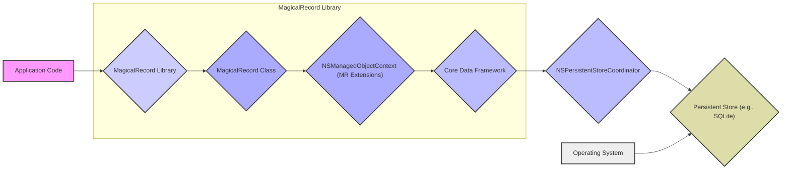

# Project Design Document: MagicalRecord

**Version:** 1.1
**Date:** October 26, 2023
**Author:** AI Software Architect

## 1. Introduction

This document provides an enhanced and more detailed design overview of the MagicalRecord project, an Objective-C library that simplifies working with Apple's Core Data framework. This revised document is specifically tailored to serve as a robust foundation for subsequent threat modeling activities. It offers a clear articulation of the architecture, components, data flow, and trust boundaries within the library and its interaction with the broader application environment.

## 2. Goals and Scope

The primary goal of this document is to provide a comprehensive and security-focused architectural description of MagicalRecord. The scope of this document includes:

*   A detailed overview of the library's purpose and functionality.
*   In-depth identification of key components, their responsibilities, and potential security implications.
*   A granular description of the data flow within the library and its interaction with the Core Data framework and the underlying operating system.
*   A thorough outline of potential security considerations, including potential threats and vulnerabilities based on the design.
*   Identification of trust boundaries within the system.

This document focuses on the logical, conceptual, and security-relevant aspects of MagicalRecord's architecture and its interaction with the underlying Core Data framework and the operating system. It does not delve into the specific implementation details of individual methods or classes within the library's source code, but rather focuses on the architectural implications.

## 3. High-Level Overview

MagicalRecord is an open-source Objective-C library designed to abstract and simplify common Core Data tasks, making them more accessible and less verbose for developers. It acts as a convenience layer on top of the standard Core Data API, providing a more intuitive interface for operations such as:

*   Streamlined setup of the Core Data stack, including the Managed Object Model, Persistent Store Coordinator, and Managed Object Contexts.
*   Simplified creation, fetching, updating, and deletion of managed objects using expressive syntax.
*   Facilitating background data operations through managed private contexts, preventing main thread blocking.
*   Easing the management of relationships between Core Data entities.
*   Providing helper methods for common data manipulation tasks.

The library's core objective is to enhance developer productivity and reduce the amount of boilerplate code typically associated with Core Data development in iOS, macOS, tvOS, and watchOS applications.

## 4. Architectural Design

MagicalRecord's architecture is characterized by its role as a set of extensions and utility methods layered upon the standard Core Data framework. It doesn't introduce entirely new architectural layers but rather provides a more user-friendly and efficient interface to the existing Core Data components.

### 4.1. Key Components

*   **`MagicalRecord` Class:** This serves as the primary interface for interacting with the library. It offers static class methods for initializing the Core Data stack, accessing default and background contexts, and initiating various data operations. This class acts as a central registry and factory for Core Data components.
    *   *Security Implication:* Incorrect initialization or configuration through this class could lead to insecure defaults or misconfigured data storage.
*   **Category Extensions on `NSManagedObjectContext`:** These extensions are the most frequently used part of the library. They augment `NSManagedObjectContext` with convenience methods for fetching (e.g., `MR_findFirst`, `MR_findAll`), creating (`MR_createEntity`), saving (`MR_save`), and deleting (`MR_deleteEntity`) managed objects. These extensions encapsulate common Core Data patterns.
    *   *Security Implication:* Vulnerabilities in these methods could lead to unauthorized data access or manipulation if not implemented carefully within MagicalRecord.
*   **Category Extensions on `NSEntityDescription`:** Provides helper methods for retrieving information about entity descriptions, often used internally by MagicalRecord's other components.
    *   *Security Implication:* While less directly involved in data manipulation, vulnerabilities here could potentially expose metadata about the data model.
*   **Category Extensions on `NSPersistentStoreCoordinator`:** Offers utilities for managing persistent stores, such as adding and retrieving stores.
    *   *Security Implication:* Misconfiguration of the persistent store coordinator could lead to data being stored insecurely or in unintended locations.
*   **Background Operations Management (Private Managed Object Contexts):** MagicalRecord simplifies the creation and management of private managed object contexts for performing Core Data operations on background threads. This is crucial for maintaining UI responsiveness.
    *   *Security Implication:* Improper handling of background contexts and merging changes could lead to data inconsistencies or race conditions, potentially exploitable in certain scenarios.
*   **Setup and Configuration Methods:** The library provides methods for initializing the Core Data stack with various configurations, including specifying the persistent store type (e.g., SQLite, in-memory, binary).
    *   *Security Implication:* The choice of persistent store and its configuration directly impacts data at rest security. MagicalRecord's setup methods influence this critical aspect.

### 4.2. Component Interactions and Data Flow

The following diagram illustrates the detailed data flow when an application uses MagicalRecord to interact with Core Data:

**Detailed Data Flow Description:**

1. **Application Code Invocation:** The application code initiates data operations by calling methods provided by the `MagicalRecord` class or the category extensions on `NSManagedObjectContext`.
2. **MagicalRecord Abstraction and Translation:** MagicalRecord's methods act as a facade, translating the developer's high-level intent into the more granular API calls required by the Core Data framework. For instance, `[MyEntity MR_findFirst]` is translated into the creation and execution of an `NSFetchRequest`.
3. **Core Data Framework Processing:** The Core Data framework takes over, managing the lifecycle of managed objects, handling data validation based on the data model, and orchestrating the interaction with the persistent store coordinator.
4. **Persistent Store Coordinator Mediation:** The persistent store coordinator acts as an intermediary, understanding the data model and directing data operations to the appropriate persistent store.
5. **Persistent Store Interaction:** The persistent store is the physical storage layer. For a SQLite store, this involves reading from and writing to the database file on disk. The operating system manages file system access.
6. **Operating System Involvement:** The operating system provides the underlying file system and security mechanisms for accessing and managing the persistent store.

### 4.3. Deployment View

MagicalRecord is integrated into an application as a static library or framework. It resides within the application's process space and directly utilizes the operating system's APIs for file system access when a file-based persistent store (like SQLite) is used.

## 5. Security Considerations and Potential Threats

Building upon the architectural design, here's an expanded discussion of security considerations and potential threats relevant to MagicalRecord:

*   **Data at Rest Security:** The security of data when the application is not running is paramount.
    *   **SQLite Encryption:** If using a SQLite store, the database file's encryption is a critical concern. MagicalRecord itself doesn't provide encryption. The application developer must implement encryption using techniques like:
        *   **SQLCipher:** A popular extension to SQLite that provides transparent encryption.
        *   **Core Data Encryption Options (Limited):**  While Core Data offers some encryption capabilities, they might not be sufficient for all security requirements.
        *   **Operating System Level Encryption:** Leveraging features like FileVault on macOS or Data Protection on iOS.
        *   *Potential Threat:* If the SQLite database is not encrypted, an attacker with physical access to the device or the application's data container could access sensitive information.
    *   **CloudKit Security:** If using CloudKit, security relies on Apple's infrastructure and the application's proper implementation of CloudKit security features.
        *   *Potential Threat:* Misconfigured CloudKit permissions or vulnerabilities in Apple's infrastructure could lead to unauthorized data access.
*   **Data in Transit Security (Primarily Internal):** While less of a concern for local storage, data moving within the application's process should be considered.
    *   *Potential Threat:* Although less likely, vulnerabilities within MagicalRecord or Core Data could potentially expose data during internal processing.
*   **Access Control:** MagicalRecord simplifies data operations but doesn't enforce access control. This is the responsibility of the application logic.
    *   *Potential Threat:* If the application doesn't implement proper authorization checks, users might be able to access or modify data they shouldn't.
*   **Input Validation and Data Integrity:** MagicalRecord relies on the application to validate data before saving.
    *   *Potential Threat:* Insufficient input validation can lead to data corruption, injection attacks (though less common with Core Data's parameterized queries), or denial-of-service if malformed data causes crashes.
*   **Dependency Vulnerabilities:** As a third-party library, MagicalRecord's dependencies (if any) and its own code could contain vulnerabilities.
    *   *Potential Threat:* Exploiting vulnerabilities in MagicalRecord could allow attackers to compromise the application's data or functionality. Regular updates and security scanning are crucial.
*   **Misuse of API and Threading Issues:** Incorrect usage of MagicalRecord's API, especially concerning threading and managed object context management, can lead to data corruption or crashes.
    *   *Potential Threat:* While primarily a reliability issue, data corruption could have security implications if it leads to unintended data exposure or manipulation. Race conditions could potentially be exploited.
*   **Information Disclosure through Error Handling and Logging:** Verbose error messages or logs could inadvertently expose sensitive information about the data model or underlying data.
    *   *Potential Threat:* Attackers could use this information to gain a better understanding of the application's data structure and potential vulnerabilities.
*   **SQL Injection (Less Direct):** While MagicalRecord uses Core Data's abstraction layer, which mitigates direct SQL injection, vulnerabilities in how MagicalRecord constructs fetch requests or handles predicates *could* potentially introduce risks if not carefully implemented.
    *   *Potential Threat:* Although less likely than direct SQL injection, poorly constructed queries could potentially be exploited.

## 6. Trust Boundaries

Identifying trust boundaries is crucial for threat modeling. In the context of MagicalRecord:

*   **Boundary 1: Application Code vs. MagicalRecord Library:** The application code trusts the MagicalRecord library to correctly and securely interact with Core Data.
*   **Boundary 2: MagicalRecord Library vs. Core Data Framework:** MagicalRecord relies on the security and integrity of the Core Data framework provided by Apple.
*   **Boundary 3: Core Data Framework vs. Persistent Store Coordinator:** Core Data trusts the persistent store coordinator to manage interactions with the underlying storage.
*   **Boundary 4: Persistent Store Coordinator vs. Persistent Store:** The persistent store coordinator trusts the persistent store (e.g., SQLite database) to securely store and retrieve data.
*   **Boundary 5: Persistent Store vs. Operating System:** The persistent store relies on the operating system for secure file system access and management.

Compromise at any of these boundaries could have security implications.

## 7. Potential Attack Surfaces

Based on the architecture and trust boundaries, potential attack surfaces include:

*   **MagicalRecord API:** Vulnerabilities in the methods provided by the `MagicalRecord` class and its category extensions could be exploited.
*   **Persistent Store:** If the persistent store is not adequately secured (e.g., unencrypted SQLite database), it represents a significant attack surface.
*   **Application Code Interactions:** Incorrect or insecure usage of MagicalRecord's API by the application developer can introduce vulnerabilities.
*   **Dependencies:** Vulnerabilities in any of MagicalRecord's dependencies could be exploited.

## 8. Future Considerations (Out of Scope for Initial Threat Modeling)

While not the focus of the initial threat modeling effort, future development or enhancements to MagicalRecord could consider:

*   **Built-in Encryption Support:** Providing more direct and easier-to-use mechanisms for encrypting the persistent store.
*   **Auditing and Logging Features:** Incorporating features to track data changes and access for auditing purposes.
*   **Enhanced Error Handling and Security Logging:** Providing more secure and informative error handling and logging capabilities.
*   **Secure Defaults:** Ensuring that the library's default configurations promote secure practices.

## 9. Diagrams

The detailed data flow diagram in section 4.2 provides a visual representation of the system's interactions.

## 10. Conclusion

This enhanced design document provides a more detailed and security-focused understanding of the MagicalRecord project's architecture, components, data flow, and trust boundaries. This information is essential for conducting a comprehensive threat model to identify potential security vulnerabilities and design appropriate mitigation strategies. The security considerations and potential attack surfaces outlined in this document serve as key inputs for this critical process.