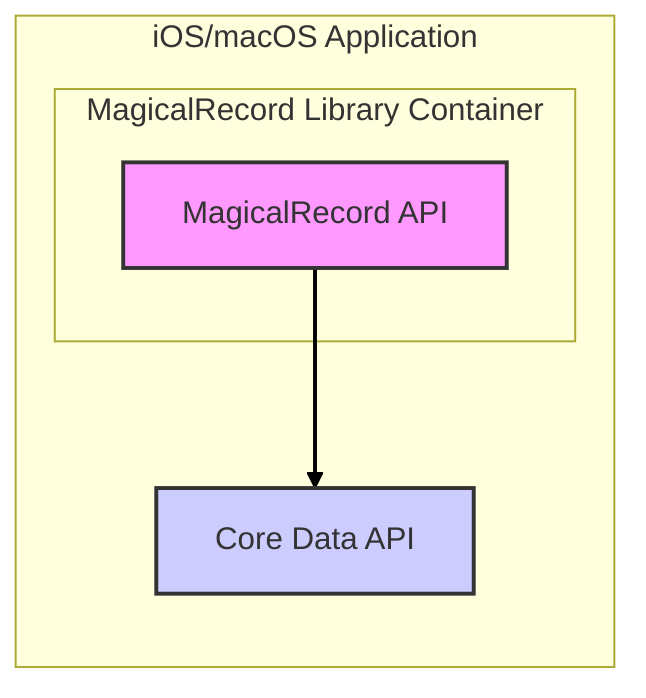
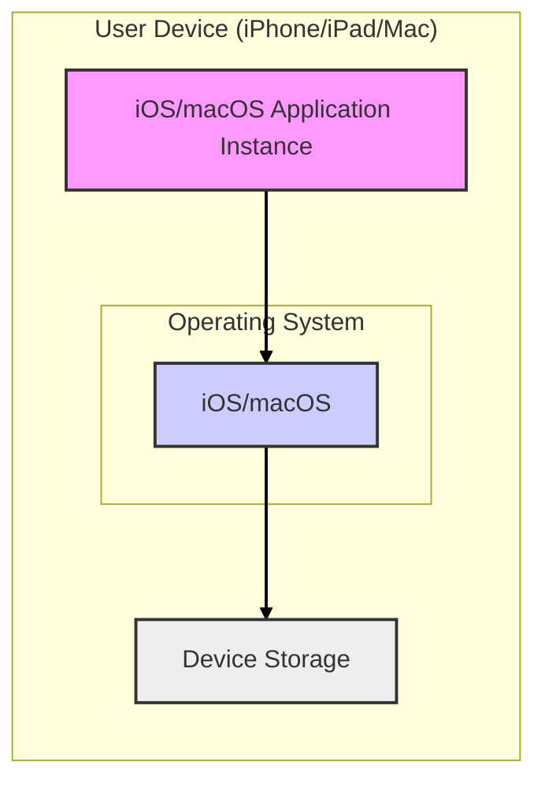

# BUSINESS POSTURE

- Business Priorities and Goals:
  - Priority: Simplify Core Data usage in iOS and macOS applications.
  - Goal: Provide a more developer-friendly and less verbose API for common Core Data operations, reducing boilerplate code and improving developer productivity.
  - Goal: Enhance code readability and maintainability for projects using Core Data.
  - Goal: Offer a robust and reliable abstraction layer over Core Data, handling common tasks and edge cases.

- Business Risks:
  - Business Risk: Adoption risk - If the library is not widely adopted, the effort invested in development and maintenance might not be justified in terms of community impact.
  - Business Risk: Maintenance risk -  As an open-source project, reliance on community contributions for ongoing maintenance and bug fixes can be a risk if community engagement declines.
  - Business Risk: Compatibility risk - Changes in Apple's Core Data framework or operating systems could break compatibility and require significant updates to the library.
  - Business Risk: Security vulnerability risk - Security flaws in the library could be exploited by malicious actors in applications that use it, potentially leading to data breaches or other security incidents. This risk is amplified by the library's role in data persistence.
  - Business Risk: Dependency risk - Applications using this library become dependent on it. Issues with the library can directly impact the functionality and stability of dependent applications.

# SECURITY POSTURE

- Existing Security Controls:
  - security control: Code review - Open-source nature allows for community code review, increasing the chance of identifying and fixing potential security vulnerabilities. Implemented through GitHub pull requests and community contributions.
  - security control: Static analysis - Developers likely use Xcode's built-in static analyzer and potentially other third-party static analysis tools during development. Implemented locally by developers during development.
  - security control: Dependency management - Uses standard dependency management tools like CocoaPods or Swift Package Manager, which provide some level of dependency integrity checks. Implemented through dependency managers configuration and processes.
  - accepted risk: Limited dedicated security testing - As an open-source project, dedicated security testing might be limited and rely on community contributions and general development practices.
  - accepted risk: Vulnerability disclosure process - The project likely relies on standard GitHub issue reporting for vulnerability disclosure, which might not be as structured as dedicated security vulnerability programs in larger organizations.

- Recommended Security Controls:
  - security control: Automated security scanning - Integrate automated security scanning tools (SAST, DAST, dependency scanning) into the CI/CD pipeline to proactively identify vulnerabilities.
  - security control: Security focused code review - Encourage security-focused code reviews, specifically looking for common vulnerability patterns in data handling and Core Data interactions.
  - security control: Vulnerability disclosure policy - Establish a clear vulnerability disclosure policy to guide security researchers and users on how to report security issues responsibly.
  - security control: Regular dependency updates - Implement a process for regularly updating dependencies to patch known vulnerabilities in third-party libraries.

- Security Requirements:
  - Authentication: Not directly applicable to a library. Authentication is handled by the applications that use this library. However, the library should not introduce vulnerabilities that could bypass application-level authentication.
  - Authorization: Not directly applicable to a library. Authorization is handled by the applications that use this library. The library should correctly handle data access permissions as defined by Core Data and the application logic.
  - Input Validation: Important. The library should handle data inputs safely and prevent common injection vulnerabilities (though less likely in the context of Core Data compared to SQL databases, but still relevant for data transformations and queries). Input validation should be implemented within the library where it processes external data or user inputs.
  - Cryptography: Potentially relevant if the library handles sensitive data that needs to be encrypted at rest or in transit. Core Data itself offers encryption options, and the library should not weaken or bypass these. If the library introduces new data handling features, consider if cryptographic measures are needed.

# DESIGN

## C4 CONTEXT

```mermaid
graph LR
    subgraph "Application Developer"
        A[Application Developer]
    end
    subgraph "iOS/macOS Application"
        B[iOS/macOS Application]
    end
    C[MagicalRecord Library]
    D[Apple Core Data Framework]
    E[CocoaPods/SPM]

    A --> B
    B --> C
    C --> D
    B --> E

    linkStyle 0,1,2,3,4 stroke-width:2px,stroke:black;
```

- Context Diagram Elements:
  - Element:
    - Name: Application Developer
    - Type: Person
    - Description: Software developers who build iOS and macOS applications.
    - Responsibilities: Develop applications using Swift or Objective-C, integrate libraries like MagicalRecord, and deploy applications to app stores or internal distribution channels.
    - Security controls: security control: Secure development practices, security control: Code review, security control: Static analysis.
  - Element:
    - Name: iOS/macOS Application
    - Type: Software System
    - Description: Applications built for Apple's iOS and macOS platforms that utilize Core Data for data persistence.
    - Responsibilities: Provide functionality to end-users, manage user data, interact with device hardware and operating system services, and ensure data security and privacy.
    - Security controls: security control: Application-level authentication, security control: Application-level authorization, security control: Input validation, security control: Data encryption, security control: Regular security updates.
  - Element:
    - Name: MagicalRecord Library
    - Type: Software System
    - Description: An open-source Objective-C and Swift library that simplifies the use of Apple's Core Data framework.
    - Responsibilities: Provide a simplified API for Core Data operations, abstract away boilerplate code, improve developer productivity, and ensure correct and efficient interaction with Core Data.
    - Security controls: security control: Input validation within the library, security control: Code review, security control: Static analysis, security control: Dependency management.
  - Element:
    - Name: Apple Core Data Framework
    - Type: Software System
    - Description: Apple's framework for managing the model layer data in applications. Provides object persistence and data management capabilities.
    - Responsibilities: Persist application data, manage data models, provide querying and data manipulation APIs, and handle data storage and retrieval.
    - Security controls: security control: Data encryption at rest (optional), security control: Access control mechanisms, security control: Framework-level security updates from Apple.
  - Element:
    - Name: CocoaPods/SPM
    - Type: Software System
    - Description: Dependency managers (CocoaPods and Swift Package Manager) used to integrate the MagicalRecord library into iOS/macOS applications.
    - Responsibilities: Manage library dependencies, download and integrate libraries into projects, and ensure dependency integrity.
    - Security controls: security control: Dependency integrity checks (checksums, signatures), security control: Source code repository security (GitHub).

## C4 CONTAINER



- Container Diagram Elements:
  - Element:
    - Name: MagicalRecord API
    - Type: Container - Library
    - Description: The MagicalRecord library itself, providing a simplified and developer-friendly API for interacting with Core Data. It's a set of Objective-C and Swift classes and methods.
    - Responsibilities: Expose a high-level API for Core Data operations (CRUD, fetching, relationships), abstract Core Data complexities, and handle data interactions on behalf of the application.
    - Security controls: security control: Input validation within API methods, security control: Secure coding practices in API implementation, security control: Code review of API implementation.
  - Element:
    - Name: Core Data API
    - Type: Container - Framework
    - Description: Apple's Core Data framework API, which MagicalRecord interacts with under the hood.
    - Responsibilities: Provide the underlying data persistence and management functionalities, handle data storage, querying, and transactions.
    - Security controls: security control: Framework-level security provided by Apple, security control: Data encryption at rest (configured via Core Data API), security control: Access control mechanisms within Core Data.

## DEPLOYMENT

- Deployment Architecture Options:
  - Option 1: Direct Application Deployment - iOS/macOS applications using MagicalRecord are directly deployed to user devices (iPhones, iPads, Macs) via the App Store, TestFlight, or enterprise distribution.
  - Option 2: Enterprise Application Deployment - Applications are deployed within an enterprise environment, potentially with more controlled distribution and infrastructure.

- Detailed Deployment Architecture (Option 1: Direct Application Deployment):



- Deployment Diagram Elements:
  - Element:
    - Name: iOS/macOS Application Instance
    - Type: Software Instance
    - Description: A running instance of an iOS or macOS application that incorporates the MagicalRecord library.
    - Responsibilities: Execute application logic, interact with the user, manage data using MagicalRecord and Core Data, and utilize device resources.
    - Security controls: security control: Application sandbox enforced by the OS, security control: Application-level security features (authentication, authorization), security control: Data protection mechanisms provided by the OS.
  - Element:
    - Name: iOS/macOS
    - Type: Infrastructure - Operating System
    - Description: Apple's iOS or macOS operating system running on the user's device.
    - Responsibilities: Provide a secure and stable environment for applications to run, manage system resources, enforce security policies, and provide APIs for hardware and software interactions.
    - Security controls: security control: Operating system security updates, security control: Application sandboxing, security control: System-level access controls, security control: Data protection APIs.
  - Element:
    - Name: Device Storage
    - Type: Infrastructure - Storage
    - Description: The persistent storage on the user's device (flash storage on iOS, SSD/HDD on macOS) where application data managed by Core Data is stored.
    - Responsibilities: Persistently store application data, ensure data integrity and availability, and provide storage access to the operating system and applications.
    - Security controls: security control: Device encryption (full disk encryption), security control: File system permissions, security control: Physical security of the device.

## BUILD

```mermaid
graph LR
    A[Developer] --> B{Code Changes};
    B --> C[Version Control (GitHub)];
    C --> D[CI System (GitHub Actions/Jenkins)];
    D --> E{Build & Test};
    E --> F{Security Scans (SAST, Dependency)};
    F --> G{Package (CocoaPod/SPM)};
    G --> H[Artifact Repository (CocoaPods/SPM Registry)];

    style A fill:#f9f,stroke:#333,stroke-width:2px
    style B fill:#eee,stroke:#333,stroke-width:2px
    style C fill:#ccf,stroke:#333,stroke-width:2px
    style D fill:#fcf,stroke:#333,stroke-width:2px
    style E fill:#eee,stroke:#333,stroke-width:2px
    style F fill:#eee,stroke:#333,stroke-width:2px
    style G fill:#eee,stroke:#333,stroke-width:2px
    style H fill:#ccf,stroke:#333,stroke-width:2px

    linkStyle 0,1,2,3,4,5,6 stroke-width:2px,stroke:black;
```

- Build Process Description:
  - Developer makes code changes and commits them to a version control system (GitHub).
  - Changes are pushed to a central repository, triggering the CI system (e.g., GitHub Actions, Jenkins).
  - The CI system automatically builds the library, runs unit tests, and performs static analysis and security scans (SAST, dependency vulnerability checks).
  - If build, tests, and security checks pass, the CI system packages the library into distributable formats (e.g., CocoaPod, Swift Package Manager package).
  - The packaged artifacts are published to a package registry (like CocoaPods repository or Swift Package Manager registry) for developers to consume.

- Build Process Security Controls:
  - security control: Version control - Using Git and GitHub to track code changes, manage branches, and facilitate code review. Implemented via GitHub.
  - security control: CI/CD automation - Automating the build, test, and security scanning process to ensure consistency and reduce manual errors. Implemented via CI system (GitHub Actions, Jenkins).
  - security control: Static Application Security Testing (SAST) - Automated SAST tools to scan the codebase for potential security vulnerabilities during the build process. Implemented within CI pipeline.
  - security control: Dependency scanning - Automated scanning of dependencies to identify known vulnerabilities in third-party libraries. Implemented within CI pipeline.
  - security control: Build environment security - Secure and hardened build environment to prevent build-time attacks and ensure integrity of build artifacts. Implemented by CI infrastructure and configuration.
  - security control: Code signing - Signing the released artifacts to ensure authenticity and integrity. (Potentially applicable for some distribution methods). Implemented during packaging and publishing steps.
  - security control: Access control to CI/CD system - Restricting access to the CI/CD system to authorized personnel to prevent unauthorized modifications to the build process. Implemented by CI system access management.

# RISK ASSESSMENT

- Critical Business Processes:
  - Critical Business Process: Development of iOS/macOS applications that rely on Core Data for data persistence.
  - Critical Business Process: Maintaining the integrity and reliability of application data managed by Core Data in applications using MagicalRecord.
  - Critical Business Process: Ensuring developer productivity and efficiency when working with Core Data.

- Data to Protect and Sensitivity:
  - Data: Source code of the MagicalRecord library. Sensitivity: Moderate. Confidentiality is less critical for open-source, but integrity and availability are important.
  - Data: Build artifacts (library packages). Sensitivity: Moderate. Integrity and availability are important to prevent supply chain attacks.
  - Data: Application data managed by applications using MagicalRecord. Sensitivity: Varies depending on the application. Could be highly sensitive (user personal data, financial data, etc.). The library should not compromise the confidentiality, integrity, or availability of this data.

# QUESTIONS & ASSUMPTIONS

- Questions:
  - What is the intended scope of security testing for the library? Are there plans for dedicated penetration testing or security audits?
  - What is the process for handling and responding to security vulnerability reports from the community?
  - Are there specific coding standards or security guidelines followed during development?
  - What is the expected deployment environment for applications using this library (e.g., are they primarily targeting enterprise environments or general public app stores)?
  - Is there any data encryption requirement for data handled by applications using this library beyond what Core Data provides?

- Assumptions:
  - Assumption: The primary users of this library are application developers familiar with iOS/macOS development and Core Data.
  - Assumption: Applications using this library will implement their own application-level security controls (authentication, authorization, etc.).
  - Assumption: The library is intended to simplify Core Data usage and not to introduce new security features or bypass existing Core Data security mechanisms.
  - Assumption: The development and maintenance of the library are primarily driven by community contributions and open-source principles.
  - Assumption: Security vulnerabilities will be addressed through community contributions and standard open-source development practices.