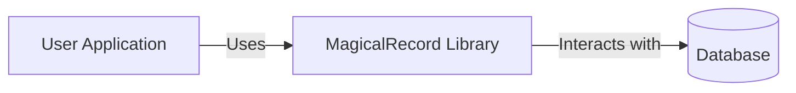
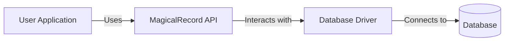
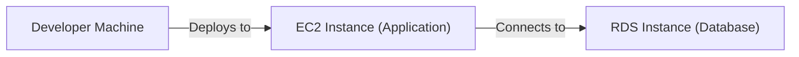
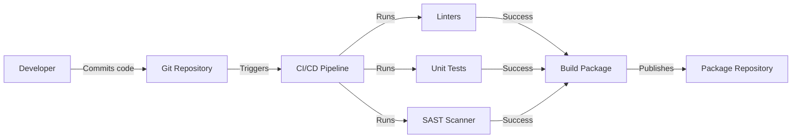

Okay, let's create a design document for the MagicalRecord project.

# BUSINESS POSTURE

Business Priorities and Goals:

*   Provide a simple, user-friendly interface for creating and managing database records.
*   Reduce the amount of boilerplate code required for basic database operations.
*   Offer a lightweight alternative to more complex ORM solutions.
*   Enable rapid prototyping and development of database-backed applications.
*   Support multiple database backends (currently SQLite, with potential for expansion).

Business Risks:

*   Data breaches due to vulnerabilities in the library or its dependencies.
*   Data corruption or loss due to bugs in the library.
*   Performance bottlenecks impacting application responsiveness.
*   Lack of compatibility with specific database features or configurations.
*   Limited adoption due to insufficient documentation or community support.
*   Inability to scale to handle large datasets or high traffic loads.
*   Dependency on external libraries that may introduce security or stability issues.

# SECURITY POSTURE

Existing Security Controls:

*   security control: The project uses parameterized queries (in `magicalrecord/functions.py`) to prevent SQL injection vulnerabilities. This is a crucial and fundamental security control.
*   security control: Basic input validation is likely performed implicitly by the database engine (e.g., type checking). However, explicit input validation within the library itself appears minimal.
*   security control: The project is open-source, allowing for community review and contributions, which can help identify and address security issues.

Accepted Risks:

*   accepted risk: The library's simplicity may come at the cost of advanced security features found in more comprehensive ORMs.
*   accepted risk: The project's reliance on external database drivers means that security is partially dependent on the security of those drivers.
*   accepted risk: Limited explicit input validation within the library itself increases the risk of application-level vulnerabilities if developers do not implement proper validation in their application code.
*   accepted risk: The project does not appear to have a formal secure development lifecycle (SDLC) process, increasing the risk of introducing vulnerabilities during development.
*   accepted risk: The project does not appear to have any built-in auditing or logging capabilities.

Recommended Security Controls:

*   Implement comprehensive input validation for all data handled by the library, including data types, lengths, and formats.
*   Establish a formal secure development lifecycle (SDLC) process, including security training for developers, code reviews, and security testing.
*   Consider adding support for data encryption at rest and in transit, depending on the target use cases.
*   Implement robust error handling and logging to aid in debugging and security incident response.
*   Regularly update dependencies to address known vulnerabilities.
*   Provide clear documentation on security best practices for using the library.
*   Consider adding support for prepared statements, even for databases where parameterized queries are the default, to further enhance security.

Security Requirements:

*   Authentication: Not directly applicable to the library itself, as it relies on the underlying database for authentication. However, the library should not interfere with or weaken the database's authentication mechanisms.
*   Authorization: Similarly, authorization is handled by the database. The library should not bypass or circumvent database-level authorization controls.
*   Input Validation: As mentioned above, comprehensive input validation is crucial to prevent various vulnerabilities, including SQL injection, cross-site scripting (XSS), and others.
*   Cryptography: If the library handles sensitive data, it should use appropriate cryptographic techniques to protect that data at rest and in transit. This may involve integrating with existing cryptographic libraries or providing wrappers for common cryptographic operations.

# DESIGN

## C4 CONTEXT

Element Descriptions:

*   Element:
    *   Name: User Application
    *   Type: External System (Application)
    *   Description: Any application that utilizes the MagicalRecord library to interact with a database.
    *   Responsibilities:
        *   Initiates database operations (create, read, update, delete).
        *   Provides data to be stored in the database.
        *   Processes data retrieved from the database.
        *   Handles user interactions and application logic.
    *   Security controls:
        *   Implement input validation.
        *   Handle authentication and authorization.
        *   Protect sensitive data.
        *   Follow secure coding practices.

*   Element:
    *   Name: MagicalRecord Library
    *   Type: Software System (Library)
    *   Description: A Python library that simplifies database interactions.
    *   Responsibilities:
        *   Provides an API for creating, reading, updating, and deleting database records.
        *   Translates API calls into database-specific queries.
        *   Manages database connections.
        *   Handles database errors.
    *   Security controls:
        *   Use parameterized queries to prevent SQL injection.
        *   Implement input validation (recommended).
        *   Follow secure coding practices.

*   Element:
    *   Name: Database
    *   Type: External System (Database)
    *   Description: The database system used to store data.
    *   Responsibilities:
        *   Stores and retrieves data.
        *   Enforces data integrity constraints.
        *   Handles concurrency and transactions.
        *   Provides security features (authentication, authorization, encryption).
    *   Security controls:
        *   Implement authentication and authorization.
        *   Enforce access controls.
        *   Provide data encryption (at rest and in transit).
        *   Regularly apply security patches.

## C4 CONTAINER

Element Descriptions:

*   Element:
    *   Name: User Application
    *   Type: External System (Application)
    *   Description: Any application that utilizes the MagicalRecord library.
    *   Responsibilities: Same as in C4 Context.
    *   Security controls: Same as in C4 Context.

*   Element:
    *   Name: MagicalRecord API
    *   Type: Container (Library API)
    *   Description: The public interface of the MagicalRecord library.
    *   Responsibilities:
        *   Provides functions for interacting with the database (e.g., `create`, `find`, `update`, `delete`).
        *   Abstracts away database-specific details.
    *   Security controls:
        *   Use parameterized queries.
        *   Implement input validation (recommended).

*   Element:
    *   Name: Database Driver
    *   Type: Container (Library/External Dependency)
    *   Description: The database-specific driver used to connect to and interact with the database (e.g., `sqlite3`).
    *   Responsibilities:
        *   Establishes connections to the database.
        *   Executes SQL queries.
        *   Returns results to the MagicalRecord API.
    *   Security controls:
        *   Use secure connection protocols (if applicable).
        *   Rely on the driver's built-in security features.

*   Element:
    *   Name: Database
    *   Type: External System (Database)
    *   Description: The database system used to store data.
    *   Responsibilities: Same as in C4 Context.
    *   Security controls: Same as in C4 Context.

## DEPLOYMENT

Possible Deployment Solutions:

1.  Local Development: The developer runs the application and the database locally on their machine.
2.  Cloud-Based (e.g., AWS, Azure, GCP): The application and database are deployed to a cloud provider's infrastructure.
3.  Containerized (e.g., Docker): The application and database are packaged as containers and deployed to a container orchestration platform (e.g., Kubernetes).
4.  Serverless: The application logic is deployed as serverless functions, and the database is accessed through a managed database service.

Chosen Deployment Solution (Example: Cloud-Based with AWS):

Element Descriptions:

*   Element:
    *   Name: Developer Machine
    *   Type: Infrastructure Node (Workstation)
    *   Description: The developer's local machine used for development and deployment.
    *   Responsibilities:
        *   Hosts the development environment.
        *   Runs deployment scripts.
    *   Security controls:
        *   Keep the operating system and software up to date.
        *   Use a firewall.
        *   Use strong passwords.

*   Element:
    *   Name: EC2 Instance (Application)
    *   Type: Infrastructure Node (Virtual Machine)
    *   Description: An Amazon EC2 instance running the application that uses MagicalRecord.
    *   Responsibilities:
        *   Hosts the application code.
        *   Handles incoming requests.
        *   Interacts with the database.
    *   Security controls:
        *   Use a secure AMI (Amazon Machine Image).
        *   Configure security groups to restrict network access.
        *   Use IAM roles to manage permissions.
        *   Regularly apply security patches.
        *   Enable logging and monitoring.

*   Element:
    *   Name: RDS Instance (Database)
    *   Type: Infrastructure Node (Managed Database Service)
    *   Description: An Amazon RDS instance hosting the database.
    *   Responsibilities:
        *   Provides a managed database service.
        *   Handles database backups and recovery.
        *   Provides security features (encryption, access control).
    *   Security controls:
        *   Configure security groups to restrict network access.
        *   Use IAM roles to manage permissions.
        *   Enable encryption at rest and in transit.
        *   Regularly apply security patches.
        *   Enable logging and monitoring.

## BUILD

The MagicalRecord project appears to be a relatively simple library without a complex build process. It doesn't seem to have dedicated CI pipelines. However, a secure build process should be implemented.

Build Process (Recommended):

1.  Developer writes code and commits to a Git repository (e.g., GitHub).
2.  A CI/CD pipeline (e.g., GitHub Actions) is triggered on each commit.
3.  The pipeline runs linters (e.g., `flake8`, `pylint`) to check for code style and potential errors.
4.  The pipeline runs unit tests (if any) to verify the functionality of the code.
5.  The pipeline runs a SAST (Static Application Security Testing) tool (e.g., `bandit`) to identify potential security vulnerabilities.
6.  If all checks pass, the pipeline builds a package (e.g., a Python wheel).
7.  The package is published to a package repository (e.g., PyPI).

# RISK ASSESSMENT

Critical Business Processes:

*   Data storage and retrieval: The core functionality of the library is to interact with a database. Any disruption to this process would impact applications using MagicalRecord.
*   Data integrity: Maintaining the accuracy and consistency of data is crucial. Corruption or loss of data could have significant consequences.

Data Sensitivity:

*   The sensitivity of the data handled by MagicalRecord depends entirely on the application using it. The library itself does not inherently handle any specific type of data.
*   Applications using MagicalRecord could potentially store highly sensitive data, such as personally identifiable information (PII), financial data, or health information.
*   The library should be treated as a potential pathway to sensitive data, and appropriate security measures should be taken.

# QUESTIONS & ASSUMPTIONS

Questions:

*   Are there any specific compliance requirements (e.g., GDPR, HIPAA) that need to be considered?
*   What are the expected performance requirements for applications using MagicalRecord?
*   What are the plans for future development and maintenance of the library?
*   Are there any existing security assessments or penetration test reports for the library?
*   What is the intended user base for this library (e.g., individual developers, small teams, large enterprises)?
*   What level of support and documentation is planned for the library?

Assumptions:

*   BUSINESS POSTURE: The primary goal is to provide a simple and easy-to-use database library. Performance and scalability are secondary concerns.
*   SECURITY POSTURE: The project has basic security measures in place (parameterized queries), but a more comprehensive security approach is needed.
*   DESIGN: The library is designed to be lightweight and easy to integrate into existing applications. It relies on external database drivers for database-specific functionality. The deployment model will vary depending on the application using the library. The build process is currently minimal but should be enhanced with automated security checks.