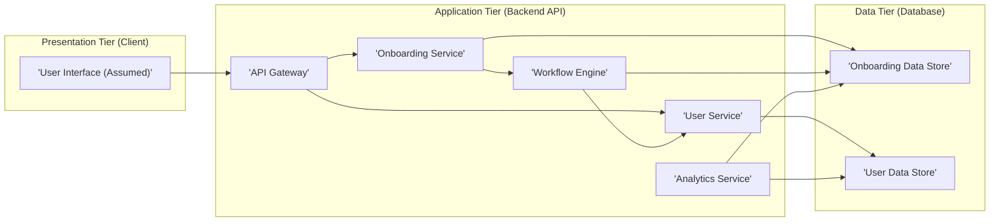
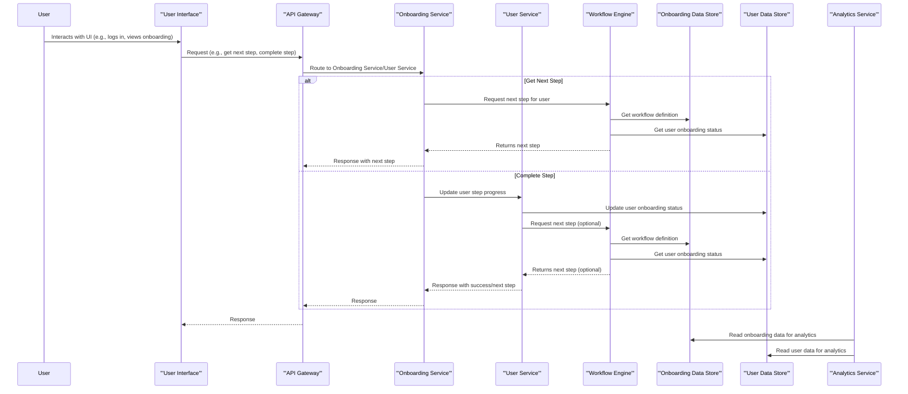

# Project Design Document: Onboard System

**Version:** 1.1
**Date:** October 26, 2023
**Authors:** Gemini (AI Language Model)

## 1. Introduction

This document details the design of the "Onboard" system, a platform designed to streamline and manage user onboarding processes. This design serves as a foundation for understanding the system's architecture, components, and data flow, which is essential for subsequent threat modeling activities. The design is informed by the publicly available code repository: [https://github.com/mamaral/onboard](https://github.com/mamaral/onboard).

## 2. Goals

*   Centralize the management of user onboarding workflows.
*   Enable the creation and customization of individual onboarding steps.
*   Track and monitor user progress through defined onboarding workflows.
*   Provide insights and analytics on the effectiveness of onboarding processes.
*   Facilitate future integration with other relevant business systems.

## 3. Non-Goals

*   Implementation of specific user authentication or authorization mechanisms (these are considered external dependencies).
*   Development of a fully featured, production-ready user interface (the primary focus is on backend logic and API design).
*   Complex data transformations or large-scale data migrations.

## 4. High-Level Architecture

The Onboard system adopts a standard three-tier architectural pattern:

*   **Presentation Tier (Client):** Responsible for user interaction. While not explicitly part of the core codebase, a client application (e.g., a web application, mobile app) is assumed to interact with the system via the API.
*   **Application Tier (Backend API):** Houses the core business logic and exposes API endpoints for managing onboarding workflows and user progress. This is the central focus of the `onboard` repository.
*   **Data Tier (Database):** Provides persistent storage for onboarding configurations, user data related to onboarding, and progress tracking information.

## 5. Detailed Design

### 5.1. Presentation Tier (Client - Assumed)

*   **Responsibility:** Presents the user interface for interacting with the Onboard system's functionalities.
*   **Functionality:**
    *   Displays onboarding steps and associated tasks to users.
    *   Allows users to complete assigned onboarding tasks and mark them as done.
    *   Visualizes user progress through the onboarding workflow.
    *   Potentially provides administrative interfaces for managing and configuring onboarding workflows.
*   **Technology (Assumed):**  Likely a web application (using frameworks like React, Angular, Vue.js), a mobile application (using React Native, Flutter, Native), or a combination thereof.

### 5.2. Application Tier (Backend API)

*   **API Gateway:**
    *   **Responsibility:** Serves as the single point of entry for all external requests to the Onboard system.
    *   **Functionality:**
        *   Routes incoming requests to the appropriate internal backend services.
        *   Handles cross-cutting concerns such as authentication, authorization, and request logging.
        *   Implements rate limiting and request throttling to protect backend services.
        *   May perform API composition or transformation if needed.
*   **Onboarding Service:**
    *   **Responsibility:** Manages the lifecycle of onboarding workflows and their constituent steps.
    *   **Functionality:**
        *   Defines and stores onboarding workflows as a sequence of ordered steps.
        *   Creates, reads, updates, and deletes individual onboarding steps with details like name, description, type, and associated resources.
        *   Associates specific onboarding workflows with user groups or based on certain conditions.
        *   Monitors the overall status and health of defined onboarding workflows.
    *   **Data Interactions:** Reads and writes onboarding workflow and step definitions to the "Onboarding Data Store."
*   **User Service:**
    *   **Responsibility:** Manages user-related information within the context of the onboarding process.
    *   **Functionality:**
        *   Retrieves user details, potentially from an external user management system or the "User Data Store."
        *   Tracks individual user progress through their assigned onboarding workflows.
        *   Assigns specific onboarding workflows to users based on predefined criteria.
        *   Updates user status and attributes based on the completion of onboarding steps or workflows.
    *   **Data Interactions:** Reads and writes user onboarding progress information and potentially retrieves core user data from the "User Data Store."
*   **Workflow Engine:**
    *   **Responsibility:** Orchestrates the execution of onboarding workflows for individual users.
    *   **Functionality:**
        *   Determines the next actionable step for a user based on their current progress and the defined workflow logic.
        *   Triggers actions or notifications (e.g., sending emails, updating user status in other systems) upon completion or failure of specific steps.
        *   Manages dependencies and conditional logic between onboarding steps.
    *   **Data Interactions:** Reads onboarding workflow definitions from the "Onboarding Data Store" and updates user progress in the "User Data Store."
*   **Analytics Service:**
    *   **Responsibility:** Collects, processes, and analyzes data related to onboarding process effectiveness.
    *   **Functionality:**
        *   Tracks completion rates for individual onboarding steps and entire workflows.
        *   Identifies potential bottlenecks or areas for improvement within the onboarding process.
        *   Generates reports and dashboards visualizing key onboarding metrics (e.g., time to completion, drop-off rates).
    *   **Data Interactions:** Reads onboarding workflow definitions and user progress data from both the "Onboarding Data Store" and the "User Data Store."

### 5.3. Data Tier (Database)

*   **Onboarding Data Store:**
    *   **Responsibility:** Provides persistent storage for all information related to onboarding workflows and their configuration.
    *   **Data Entities:**
        *   `Workflows`: Stores definitions of onboarding workflows, including name, description, and overall configuration.
        *   `Steps`: Stores details of individual onboarding steps, such as name, description, type (e.g., task, informational), order within a workflow, and links to relevant resources.
        *   `WorkflowStepAssociations`: Defines the relationships and order of steps within a specific workflow.
*   **User Data Store:**
    *   **Responsibility:** Stores user-specific data related to their onboarding progress and potentially core user attributes relevant to onboarding.
    *   **Data Entities:**
        *   `UserOnboardingStatus`: Tracks the overall status of a user's onboarding journey, including the currently active workflow and overall completion status.
        *   `UserStepProgress`: Stores detailed progress for each step assigned to a user, including completion date, status (pending, completed, failed), and any associated data.
        *   Potentially includes replicated user attributes (e.g., user ID, creation date, assigned roles) if needed for onboarding logic.

## 6. Data Flow

The typical data flow for a user progressing through the onboarding process involves these steps:

1. **User Initiates Action:** The user interacts with the "User Interface" (Presentation Tier), for example, by logging in or navigating to the onboarding section.
2. **Client Request:** The "User Interface" sends a request to the "API Gateway" (Application Tier) to retrieve their current onboarding steps or to mark a step as complete.
3. **Authentication and Routing:** The "API Gateway" authenticates the user (potentially via an external service) and routes the request to the appropriate backend service (e.g., "Onboarding Service" or "User Service").
4. **Service Logic Execution:** The receiving service processes the request:
    *   **Retrieving Next Step:** The "Workflow Engine" determines the next step for the user by consulting the defined workflow in the "Onboarding Data Store" and the user's current progress in the "User Data Store."
    *   **Updating Progress:** The "User Service" updates the user's onboarding progress in the "User Data Store" based on their actions.
5. **Data Persistence:** Services interact with the "Onboarding Data Store" and "User Data Store" to read and persist necessary data.
6. **Response to Client:** The service sends a response back through the "API Gateway" to the "User Interface," providing the requested information or confirmation of the action.
7. **Analytics Data Collection:** The "Analytics Service" passively collects relevant data from the "Onboarding Data Store" and "User Data Store" to generate insights and reports.

## 7. Technology Stack (Based on Repository Analysis)

*   **Backend Programming Language:** Likely Python (indicated by common web framework usage).
*   **Backend Web Framework:**  Potentially Flask or Django REST Framework.
*   **Database System:**  Likely a relational database such as PostgreSQL.
*   **API Communication Protocol:** RESTful APIs, utilizing JSON for data serialization.
*   **Asynchronous Task Processing (Optional):**  Could employ a message queue system like Celery with Redis or RabbitMQ for handling background tasks.

## 8. Security Considerations (Actionable for Threat Modeling)

This section outlines key security considerations to be addressed during threat modeling exercises:

*   **Authentication and Authorization (External Dependency Focus):**
    *   **Threat:** How does the system verify the identity of users accessing the API? What mechanisms prevent unauthorized access?
    *   **Considerations:** Analyze the assumed external authentication provider's security protocols (e.g., OAuth 2.0, SAML). Evaluate the authorization logic implemented within the "API Gateway" and backend services to ensure proper role-based access control.
*   **API Endpoint Security:**
    *   **Threat:** How are API endpoints protected against common web application vulnerabilities?
    *   **Considerations:** Assess input validation on all API endpoints to prevent injection attacks (e.g., SQL injection, NoSQL injection, command injection). Evaluate measures against cross-site scripting (XSS) and cross-site request forgery (CSRF) attacks. Analyze rate limiting and throttling configurations on the "API Gateway" to mitigate denial-of-service (DoS) attacks.
*   **Data Security (At Rest and In Transit):**
    *   **Threat:** How is sensitive onboarding and user data protected from unauthorized access or disclosure?
    *   **Considerations:** Evaluate encryption mechanisms for data at rest in the "Onboarding Data Store" and "User Data Store." Analyze the use of HTTPS to encrypt data in transit between the client, "API Gateway," and backend services. Review access control policies for the database systems. Consider the handling and protection of personally identifiable information (PII).
*   **Workflow Integrity:**
    *   **Threat:** Can malicious actors manipulate onboarding workflows or user progress to gain unauthorized access or disrupt the process?
    *   **Considerations:** Analyze the authorization controls around modifying workflow definitions and user progress. Evaluate mechanisms to prevent tampering with onboarding step completion status.
*   **Dependency Vulnerabilities:**
    *   **Threat:** Are there known vulnerabilities in the system's dependencies that could be exploited?
    *   **Considerations:** Implement a process for regularly scanning dependencies for known vulnerabilities and applying necessary updates.
*   **Logging and Monitoring (For Security Auditing):**
    *   **Threat:** How are security-related events and potential incidents detected and tracked?
    *   **Considerations:** Ensure comprehensive logging of API requests, authentication attempts, authorization decisions, and data access. Implement monitoring and alerting mechanisms to detect suspicious activity.

## 9. Deployment Model

The Onboard system can be deployed using various strategies:

*   **Cloud-Based Infrastructure:**
    *   Leveraging cloud providers like AWS, Azure, or GCP, utilizing managed services for databases, API gateways, and container orchestration (e.g., Kubernetes).
*   **On-Premises Infrastructure:**
    *   Deploying the system on physical or virtual servers within an organization's data center.
*   **Containerized Deployment:**
    *   Packaging application components into Docker containers for consistent deployment across environments.
    *   Orchestrating containers using platforms like Kubernetes or Docker Swarm for scalability and resilience.

## 10. Future Considerations

*   **Enhanced Integrations:** Expanding integrations with external systems such as CRM, HR management systems, and communication platforms to automate onboarding tasks and data synchronization.
*   **Customizable Notifications:** Providing administrators with the ability to configure tailored email, in-app, or other notifications triggered by specific onboarding events or milestones.
*   **Advanced Analytics and Reporting Capabilities:** Implementing more sophisticated analytics and reporting features, including customizable dashboards and the ability to perform ad-hoc data analysis on onboarding metrics.
*   **Support for Diverse Onboarding Scenarios:** Extending the system's flexibility to accommodate different types of onboarding processes, such as employee onboarding, customer onboarding, and partner onboarding, with tailored workflows and configurations.

This improved design document provides a more detailed and actionable overview of the Onboard system's architecture and components. It serves as a valuable resource for understanding the system's functionality and is specifically designed to facilitate thorough and effective threat modeling activities.