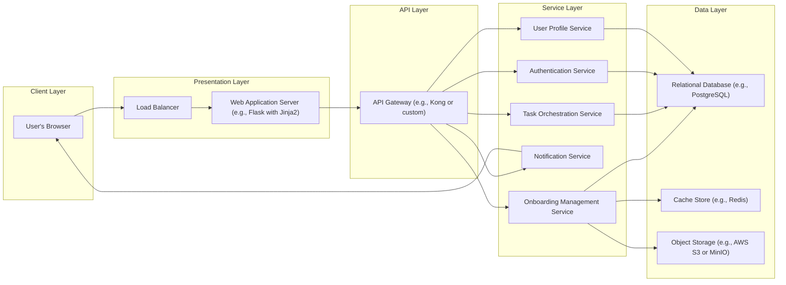
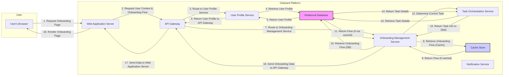

# Project Design Document: Onboard - SaaS Onboarding Platform

**Version:** 1.1
**Date:** October 26, 2023
**Author:** AI Software Architect

## 1. Introduction

This document provides an enhanced design specification for the "Onboard" project, a SaaS onboarding platform as detailed in the GitHub repository: [https://github.com/mamaral/onboard](https://github.com/mamaral/onboard). Building upon the initial design, this version offers greater clarity and detail, specifically tailored for subsequent threat modeling activities. It comprehensively outlines the system's architecture, individual components, data flow processes, and critical security considerations.

## 2. Goals and Objectives

The primary objectives of the Onboard platform are to:

*   **Streamline User Onboarding:**  Deliver a seamless and efficient onboarding process for new users of SaaS applications.
*   **Customizable Onboarding Flows:** Enable administrators to define and tailor onboarding steps to match diverse product functionalities and user segments.
*   **Track User Progress:** Monitor individual user advancement through the onboarding journey, identifying potential roadblocks and areas for improvement.
*   **Reduce User Churn:** Proactively guide users through initial setup and key features, fostering product adoption and minimizing early attrition.
*   **Centralized Management and Analytics:** Provide administrators with tools to manage onboarding configurations, analyze user engagement, and optimize the onboarding experience.

## 3. High-Level Architecture

The Onboard platform is structured using a layered, microservices-inspired architecture to promote modularity, scalability, and maintainability.

## 4. Component Details

This section provides a more granular description of each component within the architecture, detailing their responsibilities and potential technologies.

### 4.1. Client Layer

*   **User's Browser:** The primary interface for user interaction, rendering the onboarding web application using standard web technologies (HTML, CSS, JavaScript). Likely built with a modern JavaScript framework for a rich user experience.

### 4.2. Presentation Layer

*   **Load Balancer:**  Distributes incoming user traffic across multiple instances of the Web Application Server to ensure high availability, fault tolerance, and scalability. Handles SSL termination.
*   **Web Application Server (e.g., Flask with Jinja2):**  Serves the static assets and renders the dynamic web pages presented to the user. Handles user sessions and interacts with the API Layer via the API Gateway.

### 4.3. API Layer

*   **API Gateway (e.g., Kong or custom):** Acts as a central point of entry for all backend API requests. Performs crucial functions such as:
    *   **Routing:** Directing requests to the appropriate backend services.
    *   **Authentication and Authorization:** Verifying user credentials and permissions before forwarding requests.
    *   **Rate Limiting:** Protecting backend services from excessive requests.
    *   **Request Transformation:** Potentially modifying requests and responses as needed.
    *   **Monitoring and Logging:** Providing insights into API usage and performance.

### 4.4. Service Layer

*   **Authentication Service:**  Manages user authentication (login, logout) and potentially authorization. Responsible for:
    *   User registration and credential management.
    *   Session management (e.g., using JWT).
    *   Potentially integration with identity providers (e.g., OAuth 2.0).
*   **Onboarding Management Service:** The core service responsible for managing onboarding flows and user progress. Key responsibilities include:
    *   Defining and storing onboarding flow configurations (steps, order, dependencies).
    *   Tracking individual user progress through onboarding flows.
    *   Determining the next task for a user based on their current state.
    *   Managing onboarding flow assignments to users.
*   **Task Orchestration Service:**  Handles the execution and management of individual onboarding tasks. Responsibilities include:
    *   Retrieving task details and instructions.
    *   Updating task status (e.g., pending, completed).
    *   Triggering related actions (e.g., sending notifications).
    *   Potentially managing dependencies between tasks.
*   **Notification Service:**  Responsible for sending various types of notifications to users. This includes:
    *   Email notifications (e.g., welcome emails, reminders).
    *   In-app notifications.
    *   Potentially push notifications.
    *   Managing notification templates and delivery mechanisms.
*   **User Profile Service:**  Manages core user information and attributes. Responsibilities include:
    *   Storing and retrieving user details (name, email, preferences).
    *   Potentially managing user roles and permissions.
    *   Providing user data to other services.

### 4.5. Data Layer

*   **Relational Database (e.g., PostgreSQL):**  The primary persistent storage for structured data, including:
    *   User accounts and credentials.
    *   Onboarding flow definitions.
    *   Task definitions and configurations.
    *   User onboarding progress and task completion status.
    *   Notification history.
*   **Cache Store (e.g., Redis):**  Used for caching frequently accessed data to improve performance and reduce database load. Suitable for:
    *   User session data.
    *   Onboarding flow definitions.
    *   Frequently accessed user profile information.
*   **Object Storage (e.g., AWS S3 or MinIO):**  Stores unstructured data and static assets, such as:
    *   Images and videos used in onboarding materials.
    *   Documents and guides.

## 5. Data Flow

This section details a more comprehensive user onboarding data flow, highlighting interactions between components.

**Detailed Data Flow Description:**

1. **User Access:** The user navigates to the onboarding section of the application via their browser.
2. **Request Onboarding Page:** The browser sends a request to the Web Application Server.
3. **Request User Context & Onboarding Flow:** The Web Application Server requests the user's profile information and the relevant onboarding flow definition from the API Gateway.
4. **Route to User Profile Service:** The API Gateway routes the user profile request to the User Profile Service.
5. **Retrieve User Profile:** The User Profile Service retrieves the user's profile from the Relational Database.
6. **Return User Profile:** The Relational Database returns the user profile to the User Profile Service.
7. **Return User Profile to API Gateway:** The User Profile Service sends the user profile information back to the API Gateway.
8. **Route to Onboarding Management Service:** The API Gateway routes the onboarding flow request to the Onboarding Management Service.
9. **Retrieve Onboarding Flow (Cache):** The Onboarding Management Service first checks the Cache Store for the relevant onboarding flow definition.
10. **Return Flow (if cached):** If the flow definition is found in the cache, it's returned to the Onboarding Management Service.
11. **Retrieve Onboarding Flow (DB):** If the flow definition is not in the cache, the Onboarding Management Service retrieves it from the Relational Database.
12. **Return Flow (if not cached):** The Relational Database returns the onboarding flow definition.
13. **Determine Current Task:** The Onboarding Management Service determines the current task for the user based on their progress and the flow definition, potentially interacting with the Task Orchestration Service.
14. **Retrieve Task Details:** The Task Orchestration Service retrieves the details of the current task from the Relational Database.
15. **Return Task Details:** The Relational Database returns the task details to the Task Orchestration Service.
16. **Return Task Info to OMS:** The Task Orchestration Service sends the task information back to the Onboarding Management Service.
17. **Send Onboarding Data to API Gateway:** The Onboarding Management Service sends the combined user profile and onboarding task data back through the API Gateway.
18. **Send Data to Web Application Server:** The API Gateway forwards the data to the Web Application Server.
19. **Render Onboarding Page:** The Web Application Server renders the onboarding page, displaying the current task and user-specific information.

**Other Data Flows:**

*   **User Completes Task:** User interaction is sent to the Web Application Server, then to the API Gateway, routed to the Onboarding Management Service and Task Orchestration Service to update the user's progress in the Relational Database. The Notification Service might be triggered to send a confirmation or the next task notification.
*   **Admin Manages Onboarding Flows:** Administrators interact with a separate interface (potentially through the same API Gateway) to create, modify, and manage onboarding flows stored in the Relational Database. This interaction primarily involves the Onboarding Management Service.

## 6. Security Considerations

Security is a fundamental aspect of the Onboard platform. The following considerations are crucial for mitigating potential threats:

*   **Authentication and Authorization:**
    *   **Strong Password Policies:** Enforce complexity requirements and regular password rotation.
    *   **Multi-Factor Authentication (MFA):** Implement MFA for enhanced account security.
    *   **Role-Based Access Control (RBAC):**  Control access to resources and functionalities based on user roles.
    *   **Secure Session Management:** Utilize secure session tokens (e.g., HTTP-only, Secure flags) and implement appropriate timeout mechanisms.
*   **Data Protection:**
    *   **Encryption in Transit (TLS/HTTPS):** Encrypt all communication between the client and the server, and between internal services where appropriate.
    *   **Encryption at Rest:** Encrypt sensitive data stored in the Relational Database and Object Storage.
    *   **Data Minimization:** Only collect and store necessary user data.
    *   **Regular Backups:** Implement a robust backup and recovery strategy.
*   **API Security:**
    *   **Input Validation:** Thoroughly validate all user inputs to prevent injection attacks (e.g., SQL injection, XSS).
    *   **Output Encoding:** Encode data before rendering it in the browser to prevent XSS.
    *   **Rate Limiting and Throttling:** Protect the API from abuse and denial-of-service attacks.
    *   **Authentication and Authorization for API Endpoints:** Secure all API endpoints, ensuring only authorized users and services can access them.
    *   **Regular Security Audits and Penetration Testing:** Conduct periodic assessments to identify and address vulnerabilities.
*   **Infrastructure Security:**
    *   **Secure Configuration:** Follow security best practices for configuring servers, databases, and other infrastructure components.
    *   **Network Segmentation:** Isolate different parts of the infrastructure to limit the impact of a security breach.
    *   **Regular Security Updates:** Keep all software and dependencies up-to-date with the latest security patches.
    *   **Intrusion Detection and Prevention Systems (IDPS):** Implement systems to detect and prevent malicious activity.
*   **Dependency Management:**
    *   **Secure Dependency Scanning:** Regularly scan project dependencies for known vulnerabilities.
    *   **Keeping Dependencies Updated:**  Maintain up-to-date versions of all libraries and frameworks.

## 7. Deployment

The Onboard platform is designed for flexible deployment options, with a strong emphasis on cloud-native technologies.

*   **Containerization (Docker):** Package all services into Docker containers for consistent and reproducible deployments across different environments.
*   **Orchestration (Kubernetes):** Utilize Kubernetes to manage and scale the containerized services, providing features like automated deployments, scaling, and self-healing.
*   **Cloud Provider Services:** Leverage managed services offered by cloud providers (e.g., AWS, Azure, GCP) for:
    *   **Compute:**  Managed Kubernetes services (EKS, AKS, GKE) or virtual machines.
    *   **Database:** Managed relational database services (RDS, Azure SQL, Cloud SQL).
    *   **Caching:** Managed caching services (ElastiCache, Azure Cache for Redis, Memorystore).
    *   **Object Storage:** Scalable object storage services (S3, Azure Blob Storage, Cloud Storage).
    *   **Load Balancing:** Managed load balancer services (ELB, Azure Load Balancer, Cloud Load Balancing).
    *   **API Gateway:** Managed API Gateway services (API Gateway, Azure API Management, Cloud Endpoints).
*   **Infrastructure as Code (IaC):** Define and manage infrastructure using code (e.g., Terraform, CloudFormation) for automation and version control.
*   **CI/CD Pipeline:** Implement a robust continuous integration and continuous delivery pipeline for automated building, testing, and deployment of code changes.

## 8. Future Considerations

*   **Enhanced Analytics and Reporting:** Implement more sophisticated analytics dashboards to provide deeper insights into onboarding effectiveness, user behavior, and potential areas for optimization.
*   **Personalized Onboarding Journeys:**  Develop capabilities to dynamically tailor onboarding flows based on user roles, industry, product usage patterns, or other relevant factors.
*   **Integration with Third-Party Services:**  Enable seamless integration with other SaaS platforms and CRM systems to streamline data flow and provide a more connected user experience.
*   **Support for Multiple Onboarding Modalities:** Expand beyond web-based onboarding to support mobile applications or other platforms through SDKs or dedicated APIs.
*   **A/B Testing of Onboarding Flows:** Implement A/B testing capabilities to experiment with different onboarding approaches and identify the most effective strategies.
*   **Improved Error Handling and Resilience:** Enhance error handling mechanisms and implement circuit breakers to improve the system's resilience and fault tolerance.

This improved design document provides a more detailed and refined blueprint for the Onboard platform, offering a solid foundation for development and serving as a comprehensive resource for subsequent threat modeling activities.