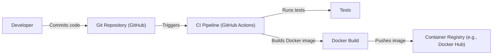

Okay, let's create a detailed design document for the `onboard` project, focusing on aspects relevant for threat modeling.

# BUSINESS POSTURE

The `onboard` project appears to be a simple, single-page web application designed to streamline the process of adding SSH keys to a server.  It's likely aimed at small teams or individual developers/system administrators who need a quick and easy way to manage access to their servers without the overhead of more complex configuration management tools.  The project's simplicity suggests a focus on ease of use and rapid deployment.

Business Priorities:

*   Ease of Use: The application should be intuitive and require minimal technical expertise to use.
*   Quick Deployment:  The setup process should be fast and straightforward.
*   Accessibility: The application should be accessible from anywhere with a web browser.
*   Security: Protect the server from unauthorized access.

Business Goals:

*   Simplify the process of adding SSH keys to a server.
*   Reduce the risk of manual errors when managing SSH keys.
*   Provide a centralized point for managing SSH access.

Most Important Business Risks:

*   Unauthorized access to the server due to vulnerabilities in the application or misconfiguration.
*   Exposure of sensitive information (e.g., SSH keys, server addresses) due to inadequate security controls.
*   Loss of service availability due to attacks targeting the application or the underlying server.
*   Compromise of the server due to vulnerabilities in dependencies.

# SECURITY POSTURE

Existing Security Controls:

*   security control: SSH Key Authentication: The core functionality relies on SSH key authentication, which is inherently more secure than password-based authentication. (Implemented in the application's core logic).
*   security control: Basic Input Sanitization: The application likely performs some basic input sanitization to prevent common injection attacks. (Assumed to be present in `app.py`, but needs verification).
*   security control: HTTPS: The README mentions the application should be served over HTTPS. (Deployment configuration).

Accepted Risks:

*   accepted risk: Limited Auditing: The application, in its current state, appears to lack comprehensive audit logging.
*   accepted risk: Single Point of Failure: The application itself represents a single point of failure for SSH key management.
*   accepted risk: Lack of Rate Limiting: There's no mention of rate limiting, making the application potentially vulnerable to brute-force attacks.
*   accepted risk: No CSRF protection: There is no mention of CSRF protection.

Recommended Security Controls:

*   security control: Implement robust input validation and sanitization to prevent all forms of injection attacks (XSS, command injection, etc.).
*   security control: Implement rate limiting to mitigate brute-force attacks against the form submission.
*   security control: Add comprehensive audit logging to track all actions performed within the application.
*   security control: Implement CSRF protection.
*   security control: Consider adding multi-factor authentication (MFA) for an extra layer of security.
*   security control: Regularly update dependencies to patch known vulnerabilities.
*   security control: Implement a Content Security Policy (CSP) to mitigate XSS attacks.
*   security control: Use a web application firewall (WAF) to protect against common web attacks.

Security Requirements:

*   Authentication:
    *   The application itself does not require user authentication, as it relies on the inherent security of SSH key management. However, access to the application should be restricted (e.g., via network controls or a reverse proxy with authentication).
*   Authorization:
    *   The application implicitly authorizes users who can submit the form to add their SSH keys to the server.  More granular authorization (e.g., restricting which users can add keys for specific servers) is not currently supported.
*   Input Validation:
    *   All user-supplied input (username, SSH key) must be strictly validated and sanitized to prevent injection attacks.  This includes checking the format of the username and the SSH key.
*   Cryptography:
    *   The application relies on the security of the SSH protocol for key management.  No additional cryptography is implemented within the application itself. HTTPS should be enforced for transport security.

# DESIGN

## C4 CONTEXT

Element Description:

*   Element:
    *   Name: User
    *   Type: Person
    *   Description: A person who wants to add their SSH key to the target server.
    *   Responsibilities: Provides their username and SSH public key.
    *   Security controls: Relies on the security of their own SSH key pair.

*   Element:
    *   Name: Onboard Application
    *   Type: Web Application
    *   Description: A simple web application that allows users to add their SSH keys to a server.
    *   Responsibilities: Receives user input, validates it, and adds the SSH key to the server's `authorized_keys` file.
    *   Security controls: Input validation, HTTPS (deployment), SSH key authentication.

*   Element:
    *   Name: Target Server
    *   Type: Server
    *   Description: The server to which the SSH key will be added.
    *   Responsibilities: Hosts the `authorized_keys` file and allows SSH access based on the keys it contains.
    *   Security controls: SSH key authentication, standard server hardening measures.

*   Element:
    *   Name: Flask Framework
    *   Type: Library
    *   Description: Python web framework.
    *   Responsibilities: Provides basic web application functionality.
    *   Security controls: Secure by default, but requires proper configuration and secure coding practices.

## C4 CONTAINER

Element Description:

*   Element:
    *   Name: User
    *   Type: Person
    *   Description: A person who wants to add their SSH key to the target server.
    *   Responsibilities: Provides their username and SSH public key.
    *   Security controls: Relies on the security of their own SSH key pair.

*   Element:
    *   Name: Web Server (e.g., Nginx, Apache)
    *   Type: Web Server
    *   Description: A web server that serves the Onboard application.
    *   Responsibilities: Handles incoming HTTP requests, terminates SSL/TLS, and forwards requests to the Onboard application.
    *   Security controls: HTTPS configuration, WAF (recommended).

*   Element:
    *   Name: Onboard Application (app.py)
    *   Type: Python Application
    *   Description: The core application logic, written in Python using the Flask framework.
    *   Responsibilities: Receives user input, validates it, and adds the SSH key to the `authorized_keys` file.
    *   Security controls: Input validation, secure coding practices.

*   Element:
    *   Name: authorized_keys File
    *   Type: File
    *   Description: The file on the target server that stores authorized SSH keys.
    *   Responsibilities: Stores the SSH public keys that are allowed to access the server.
    *   Security controls: File system permissions, SSH daemon configuration.

## DEPLOYMENT

Possible Deployment Solutions:

1.  **Docker Container:** Package the application and its dependencies into a Docker container for easy deployment and portability.
2.  **Virtual Machine:** Deploy the application on a virtual machine (e.g., AWS EC2, Google Compute Engine, Azure VM).
3.  **Bare Metal Server:** Deploy the application directly on a physical server.

Chosen Solution (Docker Container):

Element Description:

*   Element:
    *   Name: Internet
    *   Type: Network
    *   Description: The public internet.
    *   Responsibilities: Connects users to the application.
    *   Security controls: Standard internet security protocols.

*   Element:
    *   Name: Load Balancer (e.g., Nginx, HAProxy)
    *   Type: Load Balancer
    *   Description: Distributes traffic across multiple Docker hosts for high availability and scalability.
    *   Responsibilities: Terminates SSL/TLS, forwards requests to healthy Docker hosts.
    *   Security controls: HTTPS configuration, WAF (recommended).

*   Element:
    *   Name: Docker Host 1 & Docker Host 2
    *   Type: Server
    *   Description: Servers that run the Docker engine and host the Onboard container.
    *   Responsibilities: Runs Docker containers.
    *   Security controls: Standard server hardening measures, Docker security best practices.

*   Element:
    *   Name: Onboard Container 1 & Onboard Container 2
    *   Type: Docker Container
    *   Description: Instances of the Onboard application running in Docker containers.
    *   Responsibilities: Runs the Onboard application.
    *   Security controls: Container security best practices (e.g., minimal base image, non-root user).

*   Element:
    *   Name: Shared Volume (/home/user/.ssh)
    *   Type: File System
    *   Description: A shared volume that is mounted into the Onboard containers, allowing them to write to the `authorized_keys` file.
    *   Responsibilities: Provides persistent storage for the `authorized_keys` file.
    *   Security controls: File system permissions, access control lists (ACLs).

Deployment Steps (Docker):

1.  Build the Docker image using the provided `Dockerfile`.
2.  Push the Docker image to a container registry (e.g., Docker Hub, AWS ECR).
3.  Deploy the Docker container to one or more Docker hosts.
4.  Configure a reverse proxy (e.g., Nginx, Apache) to serve the application over HTTPS.
5.  Configure a shared volume to persist the `authorized_keys` file.
6.  Configure a load balancer to distribute traffic across multiple instances of the application.

## BUILD

Build Process:

1.  **Code Commit:** A developer commits code changes to the Git repository (GitHub).
2.  **CI Trigger:** The commit triggers a CI pipeline (e.g., GitHub Actions).
3.  **Tests:** The CI pipeline runs automated tests (if any).  It's highly recommended to add unit and integration tests.
4.  **SAST Scan:** Integrate a Static Application Security Testing (SAST) tool (e.g., SonarQube, Bandit) into the CI pipeline to scan the code for vulnerabilities.
5.  **Dependency Check:** Use a tool like `pip-audit` or Dependabot to check for known vulnerabilities in project dependencies.
6.  **Docker Build:** If the tests and security checks pass, the CI pipeline builds a Docker image using the `Dockerfile`.
7.  **Image Push:** The Docker image is pushed to a container registry.
8. **Supply Chain Security**: Use tools to generate and verify SBOM. Sign the build artifacts.

Security Controls in Build Process:

*   security control: Automated Tests: Ensure code quality and prevent regressions.
*   security control: SAST Scanning: Identify potential vulnerabilities in the code.
*   security control: Dependency Checking: Identify and mitigate vulnerabilities in project dependencies.
*   security control: Container Image Scanning: Scan the Docker image for vulnerabilities before pushing it to the registry.
*   security control: Least Privilege: The CI pipeline should run with the minimum necessary privileges.
*   security control: SBOM generation and verification.
*   security control: Signing build artifacts.

# RISK ASSESSMENT

Critical Business Process:

*   The critical business process is managing SSH access to the target server.  Compromise of this process could lead to unauthorized access to the server and its data.

Data Sensitivity:

*   **Username:** Low sensitivity. Usernames are generally not considered sensitive information.
*   **SSH Public Key:** Medium sensitivity. While public keys themselves are not secret, they can be used to identify users and potentially target them for attacks.  More importantly, they grant access to the server.
*   **Server Address (Implicit):** High sensitivity. The server address is not explicitly stored in the application, but it is implicitly known to the application.  Exposure of the server address could make it a target for attacks.
*   **authorized_keys file:** High sensitivity. This file controls who has access to the server.

# QUESTIONS & ASSUMPTIONS

Questions:

*   What is the expected scale of the application (number of users, number of servers)?
*   Are there any existing infrastructure components (e.g., load balancers, firewalls) that can be leveraged?
*   What is the specific target environment for deployment (e.g., cloud provider, on-premise)?
*   Are there any compliance requirements (e.g., PCI DSS, HIPAA) that need to be considered?
*   What level of logging and monitoring is required?
*   Is there a specific user/group on the target system that should own the `authorized_keys` file and have write permissions?
*   What are the specific commands being executed on the server? (Need to examine `app.py` for details).
*   Are there any existing security policies or guidelines that need to be followed?

Assumptions:

*   BUSINESS POSTURE: The project is intended for a small-scale deployment with a relatively low risk tolerance.
*   SECURITY POSTURE: Basic security measures (HTTPS, SSH key authentication) are in place, but there is room for improvement.
*   DESIGN: The application is simple and straightforward, with minimal dependencies. The target server is already configured for SSH access. The user running the application has the necessary permissions to modify the `authorized_keys` file.