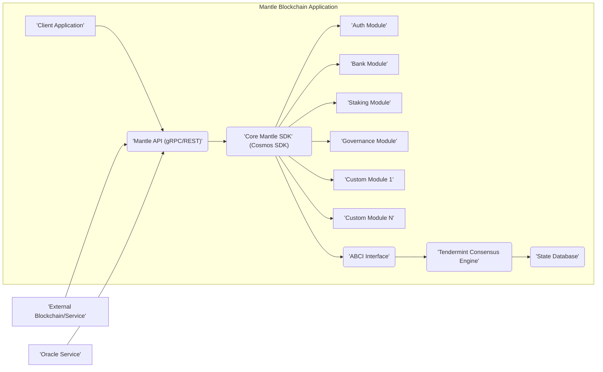
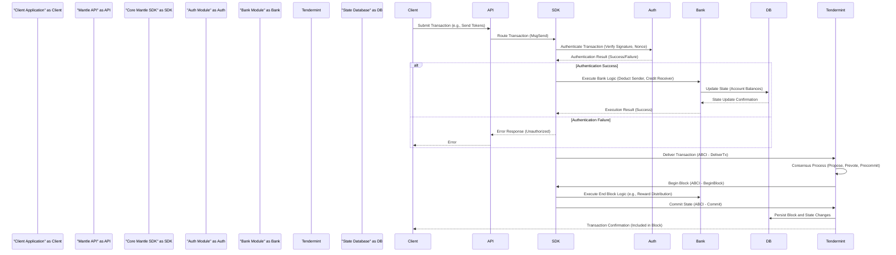

# Project Design Document: Mantle Blockchain SDK

**Version:** 1.1
**Date:** October 26, 2023
**Author:** AI Software Architect

## 1. Introduction

This document provides an enhanced and detailed design overview of the Mantle blockchain SDK project, as found on GitHub at [https://github.com/Mantle/Mantle](https://github.com/Mantle/Mantle). This iteration aims to provide even greater clarity and depth, specifically tailored for effective threat modeling. It meticulously articulates the system's architecture, components, and data flow, highlighting potential security considerations to facilitate a comprehensive threat analysis. This document is intended for developers, security engineers, and stakeholders involved in the project's security assessment.

## 2. Project Overview

Mantle is a modular blockchain SDK built upon the robust foundation of the Cosmos SDK. It empowers developers to construct bespoke blockchain applications with a strong emphasis on interoperability and a streamlined developer experience. The SDK's modular nature allows developers to assemble their blockchain by selecting and configuring a diverse range of modules, each providing distinct and specialized functionalities. This composable architecture promotes flexibility and customization.

## 3. System Architecture

The Mantle SDK's architecture is inherently modular, effectively leveraging the Cosmos SDK's inherent capabilities. The core components and their intricate interactions are visualized below:

### 3.1. Key Components

*   **Client Application:** Represents any external entity (e.g., a web browser, a mobile app, a command-line tool) that initiates interactions with the Mantle blockchain.
*   **Mantle API (gRPC/REST):** Serves as the primary entry point for external communication. It exposes gRPC and RESTful endpoints, enabling clients to submit transactions, query the blockchain's state, and engage with its functionalities.
*   **Core Mantle SDK (Cosmos SDK):**  The foundational layer of the blockchain application, built directly upon the Cosmos SDK. It manages the application's lifecycle, orchestrates transaction processing, and facilitates communication and coordination between the various modules.
*   **Modules:**  Independent, self-contained units of functionality that extend the blockchain's capabilities. Examples include:
    *   **Auth Module:**  Manages user accounts, authentication mechanisms, and authorization policies.
    *   **Bank Module:**  Handles the transfer of tokens, manages account balances, and enforces rules related to token economics.
    *   **Staking Module:**  Manages the staking of tokens by validators and delegators, contributing to network security and consensus participation.
    *   **Governance Module:**  Facilitates on-chain governance processes, allowing token holders to propose and vote on protocol changes.
    *   **Custom Module 1...N:** Represents the ability for developers to create and integrate their own modules to implement specific business logic and functionalities tailored to their application's needs.
*   **ABCI Interface (Application Blockchain Interface):**  The crucial communication bridge between the application logic (Mantle SDK and its modules) and the underlying consensus engine (Tendermint). It defines the standard methods for transaction delivery, state updates, and querying the application's state.
*   **Tendermint Consensus Engine:**  A robust, high-performance Byzantine Fault Tolerant (BFT) consensus engine responsible for ordering transactions into blocks and ensuring agreement on the blockchain's state across all participating nodes.
*   **State Database:**  The persistent storage mechanism for the current state of the blockchain, encompassing account balances, smart contract data (if applicable), and other persistent information crucial to the application's operation.
*   **External Blockchain/Service:** Represents interactions with other independent blockchains or external services, often facilitated through protocols like IBC (Inter-Blockchain Communication) or custom-built bridge solutions.
*   **Oracle Service:** Represents external data providers that supply real-world information to the blockchain, enabling smart contracts and applications to react to off-chain events and data.

## 4. Component Details

### 4.1. Mantle API (gRPC/REST)

*   **Functionality:**
    *   Accepts and processes incoming requests from client applications.
    *   Performs initial validation of incoming requests to ensure data integrity and format compliance.
    *   Translates external requests into internal commands that the Core Mantle SDK can understand and process.
    *   Constructs and returns appropriate responses to client applications, indicating the outcome of their requests.
*   **Technology:** Typically implemented using high-performance gRPC frameworks and standard RESTful API design principles.
*   **Security Considerations:**
    *   Rigorous input validation to prevent various injection attacks (e.g., SQL injection, command injection).
    *   Implementation of rate limiting mechanisms to mitigate denial-of-service (DoS) and distributed denial-of-service (DDoS) attacks.
    *   Robust authentication and authorization mechanisms to control access to sensitive endpoints and functionalities.
    *   Mandatory TLS encryption for all communication channels to ensure confidentiality and integrity of data in transit.

### 4.2. Core Mantle SDK (Cosmos SDK)

*   **Functionality:**
    *   Manages the overarching application logic and workflow.
    *   Acts as a central router, directing transactions to the appropriate modules based on their type and intended action.
    *   Orchestrates state transitions, ensuring that changes to the blockchain's state are applied correctly and consistently.
    *   Facilitates seamless communication and data exchange between different modules within the application.
*   **Technology:** Built upon the modular architecture of the Cosmos SDK, leveraging its well-defined interfaces and libraries.
*   **Security Considerations:**
    *   Strict module isolation to prevent vulnerabilities in one module from compromising the security or functionality of others.
    *   Secure generation, storage, and handling of cryptographic keys used for transaction signing and other security-sensitive operations.
    *   Comprehensive error handling and logging mechanisms to prevent unexpected behavior and aid in debugging and security analysis.

### 4.3. Modules (Example: Bank Module)

*   **Functionality (Bank Module):**
    *   Maintains and updates account balances for all participants in the network.
    *   Processes token transfer transactions, ensuring that funds are correctly debited from senders and credited to recipients.
    *   Implements the logic for token supply management, including minting and burning mechanisms, and distribution rules.
*   **Technology:** Developed using the Cosmos SDK's module interface, adhering to its defined structures and conventions.
*   **Security Considerations:**
    *   Robust mechanisms to prevent double-spending attacks, where the same tokens are spent multiple times.
    *   Fine-grained access control policies to restrict unauthorized token transfers and modifications to account balances.
    *   Implementation of safeguards against integer overflow and underflow vulnerabilities in balance calculations to prevent unintended inflation or deflation.

### 4.4. ABCI Interface

*   **Functionality:**
    *   Receives proposed transactions from the Tendermint consensus engine for validation and execution.
    *   Executes valid transactions against the current application state, triggering the appropriate module logic.
    *   Returns the results of transaction execution (success or failure, state changes) back to Tendermint.
    *   Provides methods for querying the application's state, allowing Tendermint and other components to retrieve information.
*   **Technology:** Defined by the well-established Tendermint ABCI specification, ensuring interoperability.
*   **Security Considerations:**
    *   Ensuring deterministic transaction execution to maintain consistency across all nodes in the network.
    *   Implementing safeguards to prevent malicious applications or modules from causing the consensus engine to crash or malfunction.

### 4.5. Tendermint Consensus Engine

*   **Functionality:**
    *   Orders incoming transactions into blocks, ensuring a canonical history of the blockchain.
    *   Facilitates agreement among the network's validator nodes on the order and validity of transactions.
    *   Provides robust fault tolerance, allowing the network to continue operating even in the presence of malicious or faulty nodes (Byzantine Fault Tolerance).
*   **Technology:** The battle-tested Tendermint Core consensus engine, known for its performance and security.
*   **Security Considerations:**
    *   Resistance to various Byzantine fault scenarios, ensuring the network's integrity even with malicious actors.
    *   Implementation of mechanisms to protect against Sybil attacks, where malicious actors attempt to gain undue influence by creating numerous fake identities (often through staking mechanisms).
    *   Secure key management practices for validator nodes to prevent unauthorized participation in the consensus process.

### 4.6. State Database

*   **Functionality:**
    *   Provides persistent storage for the blockchain's current state, ensuring data durability and availability.
    *   Offers efficient read and write access to state data, enabling quick retrieval and updates.
*   **Technology:** Commonly utilizes high-performance key-value stores like LevelDB or RocksDB, optimized for blockchain workloads.
*   **Security Considerations:**
    *   Ensuring data integrity and consistency to prevent corruption or manipulation of the blockchain's state.
    *   Implementing robust access control mechanisms to prevent unauthorized access and modification of the database.
    *   Regularly performing backups and establishing reliable recovery mechanisms to mitigate data loss in case of failures.

## 5. Data Flow

A typical transaction flow within the Mantle blockchain can be visualized as follows:

**Detailed Steps:**

1. A client application initiates a transaction, such as sending tokens, and submits it to the Mantle API.
2. The Mantle API receives the transaction and forwards it to the Core Mantle SDK, identifying the intended action (e.g., `MsgSend`).
3. The Core Mantle SDK routes the transaction to the appropriate module(s), starting with the Auth Module for authentication.
4. The Auth Module verifies the transaction's signature and nonce to ensure its authenticity and prevent replay attacks.
5. If authentication is successful, the Core Mantle SDK proceeds to the Bank Module to execute the token transfer logic.
6. The Bank Module interacts with the State Database to update the account balances of the sender and receiver.
7. The State Database confirms the state update to the Bank Module.
8. The Bank Module reports the successful execution back to the Core Mantle SDK.
9. If authentication fails, an error response is returned to the client.
10. The Core Mantle SDK then relays the transaction to the Tendermint consensus engine via the ABCI interface's `DeliverTx` method.
11. Tendermint initiates its consensus process, involving proposing, prevoting, and precommitting the block containing the transaction.
12. Once consensus is reached, Tendermint informs the Core Mantle SDK to begin the new block via the ABCI's `BeginBlock` method.
13. The Core Mantle SDK may trigger end-of-block logic in various modules, such as reward distribution in the Bank or Staking modules.
14. The Core Mantle SDK signals Tendermint to commit the block via the ABCI's `Commit` method.
15. Tendermint persists the new block and the associated state changes to the State Database.
16. Finally, the client application receives confirmation that the transaction has been successfully included in a block on the blockchain.

## 6. Security Considerations (Detailed for Threat Modeling)

This section provides a more granular breakdown of potential security considerations for each component, specifically designed to inform the threat modeling process.

*   **Client Application:**
    *   **Threat:** Private key compromise leading to unauthorized transaction signing.
    *   **Threat:** Phishing attacks tricking users into revealing credentials or signing malicious transactions.
    *   **Threat:** Insecure storage of API keys or other sensitive credentials within the application.
*   **Mantle API:**
    *   **Threat:** API abuse through excessive requests, potentially leading to denial of service.
    *   **Threat:** Authentication bypass vulnerabilities allowing unauthorized access to protected endpoints.
    *   **Threat:** Exposure of sensitive information (e.g., internal error messages, stack traces) in API responses.
    *   **Threat:** Injection vulnerabilities (e.g., Cross-Site Scripting (XSS) if rendering dynamic content, although less common in backend APIs).
*   **Core Mantle SDK:**
    *   **Threat:** Logic flaws in transaction routing or processing leading to unexpected state changes.
    *   **Threat:** Potential for state corruption due to mishandling of data or concurrency issues.
    *   **Threat:** Denial-of-service attacks targeting resource-intensive operations within the SDK.
*   **Modules:**
    *   **Threat (Auth Module):** Weak password policies or vulnerabilities in authentication logic.
    *   **Threat (Bank Module):** Reentrancy vulnerabilities (if supporting smart contracts), allowing attackers to drain funds.
    *   **Threat (Any Module):** Incorrect access control implementations allowing unauthorized actions.
    *   **Threat (Any Module):** Integer overflows or underflows in calculations, especially in financial modules.
*   **ABCI Interface:**
    *   **Threat:** Malicious application logic causing the consensus engine to halt or behave unpredictably.
    *   **Threat:** Vulnerabilities in the ABCI implementation itself potentially allowing for manipulation of consensus.
*   **Tendermint Consensus Engine:**
    *   **Threat:** Validator key compromise enabling malicious participation in consensus.
    *   **Threat:** Network partitioning or other network-level attacks disrupting consensus.
    *   **Threat:** Long-range attacks if the chain does not implement proper state pruning or snapshotting.
    *   **Threat:** Vulnerabilities in the Tendermint Core codebase itself.
*   **State Database:**
    *   **Threat:** Unauthorized access to the database leading to data breaches or manipulation.
    *   **Threat:** Data corruption due to software bugs or hardware failures.
    *   **Threat:** Lack of proper encryption for sensitive data at rest.
*   **External Blockchain/Service & Oracle Service:**
    *   **Threat:** Compromise of external data sources leading to the injection of false information.
    *   **Threat:** Manipulation of oracle data feeds to influence on-chain decisions.
    *   **Threat:** Vulnerabilities in bridge implementations allowing for the theft of assets.

## 7. Assumptions and Constraints

*   The Mantle SDK is built upon a standard and up-to-date version of the Cosmos SDK.
*   Tendermint Core is the designated consensus engine.
*   Standard secure coding practices and security audits are integral to the development lifecycle.
*   The specific set of modules included in a Mantle-based blockchain application can vary depending on its requirements.
*   Network infrastructure is assumed to be reasonably secure and resilient.

## 8. Future Considerations

*   Exploration and integration of advanced cryptographic techniques for enhanced privacy and security.
*   Implementation of comprehensive monitoring and logging solutions for real-time security auditing and incident detection.
*   Consideration of formal verification methods for critical modules to ensure their correctness and security.
*   Development and documentation of robust incident response procedures to effectively handle security breaches or vulnerabilities.
*   Adoption of secure multi-party computation (MPC) or other threshold cryptography schemes for enhanced key management.

This enhanced design document provides a more detailed and security-focused overview of the Mantle blockchain SDK architecture. It is intended to serve as a valuable resource for conducting thorough threat modeling and identifying potential security risks.
