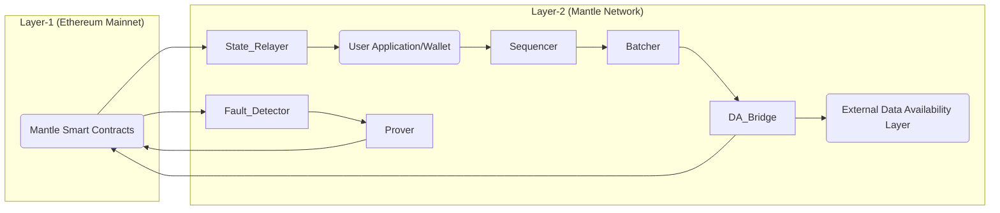
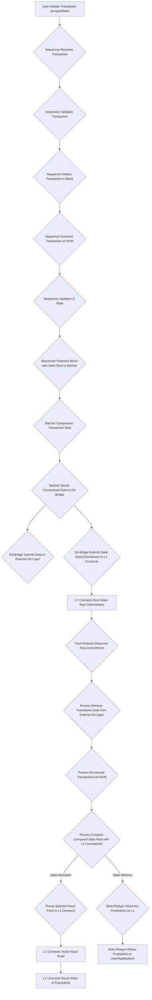

# Project Design Document: Mantle Network

**Version:** 1.1
**Date:** October 26, 2023
**Author:** AI Software Architect

## 1. Introduction

This document provides an enhanced and detailed design overview of the Mantle Network, an Ethereum Layer-2 scaling solution leveraging optimistic rollup technology. Its primary purpose is to offer a comprehensive understanding of the system's architecture, individual components, and the flow of data within the network. This detailed design serves as a crucial foundation for subsequent threat modeling activities, enabling a thorough analysis of potential security vulnerabilities.

## 2. Project Overview

Mantle is engineered to significantly improve the scalability and reduce the transaction costs associated with the Ethereum blockchain. It achieves this by processing transactions off the main Ethereum chain (Layer-1) and periodically submitting batches of these transactions to Layer-1 for final settlement. Mantle utilizes optimistic rollups, a mechanism that assumes transactions are valid unless proven otherwise through a challenge process involving fraud proofs. This approach allows for faster and cheaper transactions on Layer-2 while maintaining the security guarantees of Ethereum.

## 3. Architecture Overview

The Mantle Network is composed of several distinct yet interconnected components that work in concert to process transactions and maintain the state of the Layer-2 chain. The following diagram illustrates the high-level architecture and the relationships between these components:

## 4. Component Details

This section provides a detailed breakdown of each component within the Mantle Network, outlining their responsibilities, key functionalities, data handling processes, and underlying technologies.

### 4.1. User Application/Wallet

*   **Responsibilities:**  Serves as the interface for users to interact with the Mantle Network. This includes initiating transactions and managing their assets on Layer-2.
*   **Key Functionalities:**
    *   Creating and signing transactions according to the Mantle Network's specifications.
    *   Submitting transactions to the Sequencer's API endpoint.
    *   Initiating withdrawal requests to move funds from Mantle back to Ethereum L1.
    *   Querying the network for transaction status and account balances.
*   **Data Handling:**
    *   Generates transaction data (recipient, amount, data payload).
    *   Signs transactions using the user's private key.
    *   Receives transaction confirmation receipts and state update information.
*   **Technology Stack (Example):**  Web3.js, Ethers.js, WalletConnect.

### 4.2. Sequencer

*   **Responsibilities:**  Acts as the central operator responsible for ordering, executing, and proposing blocks of transactions on Layer-2. It maintains the canonical order of transactions and provides immediate transaction confirmations.
*   **Key Functionalities:**
    *   Receiving transactions from users via an API (e.g., RPC).
    *   Validating incoming transactions.
    *   Ordering validated transactions into blocks.
    *   Executing transactions on the Mantle Virtual Machine (MVM), a fork of the Ethereum Virtual Machine (EVM).
    *   Updating the Layer-2 state based on transaction execution.
    *   Publishing transaction batches and state roots to the Batcher.
*   **Data Handling:**
    *   Receives raw transaction data from users.
    *   Manages the Layer-2 state, including account balances, smart contract storage, and contract code.
    *   Constructs and proposes blocks containing ordered transactions and the resulting state root.
*   **Technology Stack:** Go, Optimism's `op-node` or a similar rollup client, potentially a modified Geth or similar EVM implementation.

### 4.3. Batcher

*   **Responsibilities:**  Packages the transaction batches received from the Sequencer and submits them to both the external Data Availability Layer and the Mantle smart contracts on Ethereum L1.
*   **Key Functionalities:**
    *   Receiving proposed transaction batches and corresponding state roots from the Sequencer.
    *   Compressing the transaction data within the batch to reduce on-chain data costs.
    *   Submitting the compressed transaction batch to the external Data Availability Layer.
    *   Submitting the transaction batch commitment (including the state root) to the designated Mantle contract on L1.
*   **Data Handling:**
    *   Receives transaction batches and state roots from the Sequencer.
    *   Processes and compresses transaction data.
    *   Interacts with the Data Availability Layer API and the Ethereum L1 client.
*   **Technology Stack:** Go, Ethereum client libraries (e.g., `go-ethereum`), potentially libraries for interacting with the specific Data Availability Layer.

### 4.4. Data Availability Bridge (DA Bridge)

*   **Responsibilities:** Acts as an intermediary, facilitating the submission of transaction batch data to the external Data Availability Layer and relaying necessary commitments to the L1 contracts.
*   **Key Functionalities:**
    *   Receiving compressed transaction batches from the Batcher.
    *   Interacting with the API of the chosen external Data Availability Layer to store the batch data.
    *   Constructing and submitting the necessary proofs or commitments about the data's availability to the Mantle L1 contracts.
*   **Data Handling:**
    *   Receives compressed transaction data.
    *   Formats and transmits data to the external Data Availability Layer.
    *   Generates and submits commitments to L1.
*   **Technology Stack:** Go, libraries for interacting with the specific Data Availability Layer and Ethereum client libraries.

### 4.5. External Data Availability Layer

*   **Responsibilities:** Provides a decentralized and censorship-resistant storage layer for the compressed transaction data published by the Batcher. This ensures that the transaction data is accessible for anyone to reconstruct the Layer-2 state, even if the Sequencer becomes unavailable or malicious.
*   **Key Functionalities:**
    *   Receiving and durably storing compressed transaction batches.
    *   Providing a mechanism for retrieving the stored data, typically through an API or a peer-to-peer network.
*   **Data Handling:** Stores compressed transaction data. Provides access to this data upon request.
*   **Technology Stack (Example):** Celestia, EigenDA, Avail.

### 4.6. Mantle Smart Contracts (Layer-1)

*   **Responsibilities:** A suite of smart contracts deployed on the Ethereum mainnet that govern the core functionalities of the Mantle Network, including state commitment verification, deposit and withdrawal management, and handling fraud proofs.
*   **Key Functionalities:**
    *   Receiving and storing commitments to the Layer-2 state roots submitted by the Batcher.
    *   Managing deposits of ETH and other ERC-20 tokens from L1 to L2.
    *   Processing withdrawal requests from L2 to L1 after a challenge period.
    *   Verifying fraud proofs submitted by Provers and rolling back the state if fraud is proven.
*   **Data Handling:**
    *   Stores state roots, deposit records, withdrawal requests, and challenge data.
    *   Emits events related to deposits, withdrawals, and state transitions.
*   **Technology Stack:** Solidity.

### 4.7. Fault Detector

*   **Responsibilities:** Continuously monitors the Mantle L1 contracts for new state commitments. It plays a crucial role in initiating the challenge period and enabling Provers to submit fraud proofs.
*   **Key Functionalities:**
    *   Listening for events emitted by the Mantle L1 contracts related to new state root submissions.
    *   Tracking the challenge period for each state commitment.
    *   Providing information about the current state and challenge periods to Provers.
*   **Data Handling:** Reads event data from the L1 contracts. Stores information about state commitments and challenge periods.
*   **Technology Stack:** Go, Ethereum client libraries.

### 4.8. Prover

*   **Responsibilities:**  Monitors the Mantle Network for potentially invalid state transitions. If a Prover detects an invalid transaction within a proposed block, it generates and submits a fraud proof to the L1 contracts during the challenge period.
*   **Key Functionalities:**
    *   Retrieving transaction data from the external Data Availability Layer.
    *   Re-executing the transactions within a proposed block locally using the MVM.
    *   Comparing the locally computed state root with the state root submitted to L1.
    *   If a discrepancy is found, constructing and submitting a fraud proof to the Mantle L1 contracts, demonstrating the invalid transaction and the correct execution result.
*   **Data Handling:**
    *   Retrieves transaction data from the Data Availability Layer.
    *   Accesses state root information from L1 contracts.
    *   Generates fraud proof data.
*   **Technology Stack:** Go, Optimism's `op-prover` or a similar fraud-proving client, potentially a modified Geth or similar EVM implementation.

### 4.9. State Relayer

*   **Responsibilities:** Monitors the Mantle L1 contracts for finalized state commitments and relays this information back to users or applications that need to be aware of the latest confirmed state of the Mantle Network.
*   **Key Functionalities:**
    *   Listening for events emitted by the Mantle L1 contracts indicating that a state commitment has been finalized (i.e., the challenge period has passed without a valid fraud proof).
    *   Broadcasting or making this finalization information available to users and applications.
*   **Data Handling:** Receives event data from the L1 contracts.
*   **Technology Stack:** Go, Ethereum client libraries.

## 5. Data Flow

The following diagram illustrates the detailed flow of a transaction through the Mantle Network, from user initiation to finalization on Layer-1:

**Detailed Transaction Flow:**

1. **User Initiates Transaction via App/Wallet:** A user creates and signs a transaction using their wallet or a decentralized application interface.
2. **Sequencer Receives Transaction:** The Sequencer receives the transaction through its API endpoint.
3. **Sequencer Validates Transaction:** The Sequencer performs basic validation checks on the transaction (e.g., signature, nonce).
4. **Sequencer Orders Transaction in Block:** The Sequencer includes the validated transaction in the next proposed block, determining its order.
5. **Sequencer Executes Transaction on MVM:** The Sequencer executes the transaction on the Mantle Virtual Machine, updating the Layer-2 state.
6. **Sequencer Updates L2 State:** The Layer-2 state (account balances, contract storage) is updated based on the transaction execution.
7. **Sequencer Proposes Block with State Root to Batcher:** The Sequencer sends the proposed block, including the resulting state root, to the Batcher.
8. **Batcher Compresses Transaction Data:** The Batcher compresses the transaction data within the block to optimize for on-chain data submission costs.
9. **Batcher Sends Compressed Data to DA Bridge:** The Batcher sends the compressed transaction data to the Data Availability Bridge.
10. **DA Bridge Submits Data to External DA Layer:** The DA Bridge interacts with the external Data Availability Layer to store the compressed transaction data.
11. **DA Bridge Submits State Root Commitment to L1 Contracts:** The DA Bridge submits a commitment to the state root to the Mantle smart contracts on Ethereum L1.
12. **L1 Contracts Store State Root Commitment:** The Mantle contracts on L1 store the submitted state root commitment. This marks the beginning of the challenge period.
13. **Fault Detector Observes New Commitment:** The Fault Detector monitors the L1 contracts and detects the new state root commitment.
14. **Provers Retrieve Transaction Data from External DA Layer:** Independent Provers retrieve the compressed transaction data from the external Data Availability Layer.
15. **Provers Re-execute Transactions on MVM:** Provers independently re-execute the transactions within the block using the MVM.
16. **Provers Compare Computed State Root with L1 Commitment:** Provers compare the state root they computed with the state root commitment published on L1.
17. **State Resolution:**
    *   **State Matches:** If the computed state root matches the L1 commitment, the Provers take no action. The challenge period eventually ends, and the state is considered finalized on L1. The State Relayer observes this.
    *   **State Mismatch:** If a Prover finds a discrepancy, indicating a potentially fraudulent transaction, it proceeds to the next step.
18. **Prover Submits Fraud Proof to L1 Contracts:** The Prover constructs and submits a fraud proof to the Mantle smart contracts on L1, providing evidence of the incorrect execution.
19. **L1 Contracts Verify Fraud Proof:** The Mantle contracts on L1 verify the validity of the submitted fraud proof.
20. **L1 Contracts Revert State (if Fraudulent):** If the fraud proof is valid, the L1 contracts trigger a state rollback to the last known valid state.
21. **State Relayer Relays Finalization to User/Applications:** The State Relayer monitors the L1 contracts for finalization events (either due to the challenge period ending or after a fraud proof is resolved) and relays this information to users and applications.

## 6. Deployment Architecture

A typical deployment of the Mantle Network involves the following infrastructure components, often orchestrated using containerization technologies like Docker and Kubernetes:

*   **Ethereum Mainnet Nodes:**  Infrastructure for interacting with the Ethereum mainnet. This can be through self-hosted nodes or a reliable node provider.
*   **Sequencer Node(s):**  High-availability setup of Sequencer nodes to ensure continuous transaction processing. This includes load balancing and potentially hot-standby configurations.
*   **Batcher Node(s):**  One or more Batcher nodes responsible for packaging and submitting transaction data.
*   **Data Availability Bridge Node(s):**  Infrastructure to run the Data Availability Bridge component, facilitating communication with the chosen external DA layer.
*   **External Data Availability Layer Infrastructure:**  Interaction with the chosen external DA provider's infrastructure (e.g., their API endpoints or network).
*   **Prover Node(s):**  Typically run by independent entities, requiring infrastructure capable of running the MVM and interacting with the DA layer and L1.
*   **Fault Detector Node(s):**  Reliable nodes monitoring the L1 contracts.
*   **State Relayer Node(s):**  Nodes responsible for relaying state finalization information.
*   **Databases:**  Potentially used by the Sequencer for storing pending transactions and other operational data.
*   **Monitoring and Logging Infrastructure:**  Essential for monitoring the health and performance of all components (e.g., Prometheus, Grafana, ELK stack).
*   **Secret Management:** Secure storage and management of cryptographic keys used by various components.

## 7. Security Considerations (Pre-Threat Modeling)

This section outlines initial security considerations, categorized for clarity, that will be the focus of a more detailed threat modeling exercise.

*   **Confidentiality:**
    *   Risk of unauthorized access to transaction data before it is submitted to the DA layer.
    *   Potential exposure of sensitive information within transaction payloads.
*   **Integrity:**
    *   Risk of the Sequencer proposing invalid blocks or manipulating transaction order.
    *   Potential for data corruption or tampering within the Data Availability Layer.
    *   Vulnerabilities in the fraud proof mechanism that could allow invalid state transitions to be finalized.
*   **Availability:**
    *   Risk of Denial-of-Service (DoS) attacks targeting the Sequencer, Batcher, or Data Availability Bridge.
    *   Potential for censorship by a malicious Sequencer refusing to include certain transactions.
    *   Dependence on the availability and reliability of the external Data Availability Layer.
*   **Authentication and Authorization:**
    *   Ensuring only authorized users can submit transactions.
    *   Secure communication and authentication between different components.
*   **Smart Contract Security:**
    *   Vulnerabilities in the Mantle smart contracts on L1 that could be exploited.
    *   Risks associated with contract upgrades and potential migration issues.
*   **Cross-Chain Bridge Security:**
    *   Vulnerabilities in the deposit and withdrawal mechanisms that could lead to loss of funds.
    *   Risk of replay attacks or other manipulation of cross-chain communication.

## 8. Assumptions and Dependencies

*   **Assumption:** The Ethereum mainnet maintains its security and liveness guarantees.
*   **Dependency:** The Mantle Network's security and data availability rely heavily on the chosen external Data Availability Layer's guarantees.
*   **Dependency:** The security of the Mantle smart contracts on Ethereum L1 is critical for the overall system's integrity.
*   **Assumption:**  There exists a sufficient number of economically rational Provers incentivized to monitor the network and submit fraud proofs when necessary.
*   **Assumption:** The underlying Mantle Virtual Machine (MVM) implementation is secure and correctly executes Ethereum bytecode.

## 9. Future Considerations

This document outlines the current design of the Mantle Network. Future development and enhancements may include:

*   **Decentralized Sequencer:** Exploring mechanisms to decentralize the Sequencer role, increasing censorship resistance and overall network resilience. This could involve implementing a leader election process or a distributed consensus mechanism for transaction ordering.
*   **Alternative Data Availability Solutions:** Continuously evaluating and potentially integrating with other Data Availability solutions to diversify dependencies and potentially improve performance or cost-effectiveness.
*   **Enhanced Fraud Proof Mechanisms:** Researching and implementing more efficient and gas-optimized fraud proof techniques to reduce the cost and complexity of the challenge process. This could involve exploring different proving systems or optimizing the current implementation.
*   **Improved Cross-Chain Communication:** Investigating more secure and efficient methods for transferring assets between Ethereum L1 and Mantle L2, potentially exploring optimistic messaging bridges or other advanced techniques.
*   **Support for Advanced EVM Features:** Keeping pace with Ethereum's development and potentially incorporating new EVM features or precompiles into the MVM.

This enhanced design document provides a more detailed and comprehensive overview of the Mantle Network architecture. This level of detail is crucial for conducting a thorough threat modeling exercise, allowing for the identification of potential vulnerabilities and the design of effective security mitigations.
