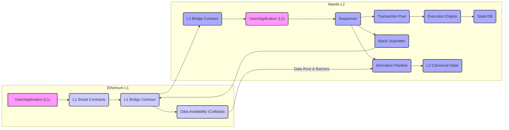

# Project Design Document: Mantle Network

**Version:** 1.1
**Date:** October 26, 2023
**Author:** AI Software Architect

## 1. Introduction

This document provides an enhanced and more detailed architectural design of the Mantle Network project, based on the information available in the provided GitHub repository (https://github.com/mantle/mantle). This revised document aims to provide a clearer and more comprehensive understanding of the system's components, their interactions, and the overall data flow, specifically tailored for subsequent threat modeling activities.

## 2. Project Overview

Mantle Network is identified as an Ethereum Layer-2 scaling solution, operating as an Optimistic Rollup. It inherits the security guarantees of the Ethereum mainnet while offering a more scalable and cost-efficient environment for executing transactions and hosting decentralized applications (dApps). The project leverages the OP Stack, a modular and open-source framework designed for building Optimistic Rollups, indicating a commitment to established standards and interoperability.

## 3. Goals

The primary goals of this enhanced design document are to:

*   Provide a more granular definition of the major components within the Mantle Network.
*   Illustrate the interactions and data flow between these components with greater detail.
*   Offer a comprehensive and precise understanding of the system's architecture, specifically for identifying potential threats during threat modeling.
*   Document key assumptions and dependencies with more specificity.

## 4. System Architecture

The Mantle Network architecture is distinctly separated into on-chain (Ethereum L1) and off-chain (Mantle L2) components, each with specific responsibilities.

### 4.1. High-Level Architecture Diagram

### 4.2. Component Descriptions

*   **Ethereum L1:** The foundational Ethereum blockchain, providing the bedrock of security and transaction finality for the Mantle Network.
    *   **User/Application (L1):** External entities interacting with the Mantle Network by directly engaging with Ethereum mainnet contracts.
    *   **L1 Smart Contracts:** A collection of smart contracts deployed on Ethereum that govern the core functionalities of the Mantle Network, including asset bridging and the mechanisms for dispute resolution (fault proofs).
    *   **L1 Bridge Contract:** A critical smart contract on Ethereum responsible for securely managing the transfer of assets between the Ethereum mainnet and the Mantle L2. It acts as an escrow for deposited assets.
    *   **Data Availability (Calldata):** Ethereum's transaction calldata is utilized as the primary mechanism for ensuring the availability of compressed transaction data originating from Mantle L2. This ensures that the transaction history is publicly accessible and verifiable.

*   **Mantle L2:** The Layer-2 network where the majority of transaction processing and execution occurs, offering improved scalability and reduced transaction costs.
    *   **User/Application (L2):** External entities interacting directly with the Mantle Network, benefiting from its enhanced scalability.
    *   **Sequencer:** A designated actor (initially centralized) responsible for crucial tasks such as ordering incoming transactions, executing these transactions against the current state, and proposing new state roots to the L1.
    *   **Transaction Pool:** A temporary holding area for transactions received by the Sequencer before they are ordered and processed.
    *   **Execution Engine:** The core component responsible for the actual execution of transactions on the Mantle L2, leading to updates in the network's state. This likely involves an EVM-compatible environment.
    *   **State DB:** The persistent storage mechanism holding the current state of the Mantle L2, reflecting the balances of accounts, contract states, and other relevant data.
    *   **Batch Submitter:** A component within the Sequencer's infrastructure that groups multiple L2 transactions and their corresponding state root into a batch, which is then submitted to the L1 Bridge Contract on Ethereum.
    *   **Derivation Pipeline:** A process that continuously monitors the Ethereum L1 for newly submitted transaction batches. It reconstructs the L2 state independently from the Sequencer's proposed state, ensuring verifiability and enabling the detection of fraudulent behavior.
    *   **L2 Canonical State:** The officially recognized and verified state of the Mantle L2, derived from the data available on L1 and validated through the derivation pipeline.
    *   **L2 Bridge Contract:** The counterpart to the L1 Bridge Contract, deployed on the Mantle L2. It manages asset transfers and interactions within the Layer-2 environment.

## 5. Data Flow

The following outlines the detailed flow of data within the Mantle Network during typical operations:

*   **Transaction Submission (L2):**
    *   A user or application on Mantle L2 initiates a transaction and submits it to the Sequencer.
*   **Transaction Reception and Pooling:**
    *   The Sequencer receives the transaction and places it in the Transaction Pool.
*   **Transaction Ordering and Execution:**
    *   The Sequencer selects and orders transactions from the Transaction Pool.
    *   The Execution Engine executes these ordered transactions, resulting in state changes within the State DB.
    *   Transaction fees are typically collected during this stage.
*   **State Root Proposal:**
    *   The Sequencer generates a new state root representing the updated state of the L2 after executing the batch of transactions.
*   **Batch Formation and Submission to L1:**
    *   The Batch Submitter groups the processed L2 transactions and the corresponding proposed state root into a batch.
    *   This batch is compressed and submitted as calldata to the L1 Bridge Contract on Ethereum.
*   **Data Availability on L1:**
    *   The transaction data, now part of the Ethereum blockchain's history through the calldata, becomes publicly available, ensuring data availability.
*   **State Derivation and Verification:**
    *   The Derivation Pipeline independently fetches the transaction data from the L1.
    *   It re-executes the transactions to reconstruct the L2 state.
    *   The reconstructed state is compared against the state root proposed by the Sequencer. Discrepancies can trigger a fault proof process.
*   **Bridging Assets (L1 to L2 Deposit):**
    *   A user initiates a deposit by sending assets to the L1 Bridge Contract on Ethereum.
    *   The L1 Bridge Contract locks the deposited assets and emits an event signaling the deposit.
    *   The Sequencer (or a relayer monitoring L1 events) observes this event.
    *   The Sequencer then credits the corresponding user's account on L2 via the L2 Bridge Contract.
*   **Bridging Assets (L2 to L1 Withdrawal):**
    *   A user initiates a withdrawal by sending a withdrawal request (along with assets) to the L2 Bridge Contract.
    *   This withdrawal request is included in a subsequent batch submitted to L1.
    *   After a predetermined challenge period on L1, where validators can dispute the withdrawal's validity, the user can claim their assets from the L1 Bridge Contract on Ethereum. This process relies on the validity of the L2 state root included in the batch.

## 6. Security Considerations

Based on the detailed architecture, the following key areas demand careful security consideration during threat modeling:

*   **Smart Contract Security (L1 & L2 Bridge Contracts, Governance Contracts):**
    *   **Vulnerabilities:** Reentrancy attacks, integer overflows/underflows, logic errors in state transitions, unauthorized access control, and gas limit issues within the bridge contracts could lead to significant financial losses or manipulation of asset movements.
    *   **Governance Risks:**  Security flaws or malicious actors controlling governance contracts could compromise the entire network.
*   **Sequencer Security:**
    *   **Centralization Risks:** As the Sequencer is initially centralized, its compromise (e.g., private key theft) could lead to censorship of transactions, arbitrary transaction ordering for profit extraction (MEV), or the submission of invalid state roots.
    *   **Denial of Service:** Attacks targeting the Sequencer's infrastructure could halt the processing of transactions on L2.
    *   **Malicious Proposals:** A compromised Sequencer could propose invalid state transitions, requiring effective fault proof mechanisms to mitigate.
*   **Bridge Security:**
    *   **Message Passing Vulnerabilities:** Issues in how messages are passed between L1 and L2 bridge contracts could be exploited for unauthorized asset transfers or state manipulation.
    *   **Replay Attacks:** Mechanisms must be in place to prevent the replay of deposit or withdrawal transactions.
    *   **Oracle Manipulation (if applicable):** If the bridge relies on external oracles, vulnerabilities in these oracles could be exploited.
*   **Data Availability:**
    *   **Data Withholding Attacks:** If the Sequencer withholds transaction data from being posted to L1, it could prevent the Derivation Pipeline from functioning, potentially leading to a halt in the network or the acceptance of invalid states.
    *   **Data Corruption:** While Ethereum's calldata provides integrity, vulnerabilities in the compression or decompression logic could lead to data corruption.
*   **Fault Proof Mechanism:**
    *   **Effectiveness:** The robustness and correctness of the fault proof mechanism are paramount. If it's flawed, invalid state transitions could be finalized on L1.
    *   **Griefing Attacks:** Attackers might try to trigger numerous costly fault proofs to exhaust resources.
    *   **Complexity:** The complexity of the fault proof system can introduce vulnerabilities.
*   **User Security:**
    *   **Private Key Management:** Standard risks associated with user private key management apply.
    *   **Phishing and Scam Attacks:** Users can be targeted through phishing attempts to steal their assets.
*   **Network Security:**
    *   **Communication Channel Security:** Securing the communication channels between the Sequencer, Batch Submitter, and L1 is important to prevent man-in-the-middle attacks.

## 7. Assumptions and Dependencies

The following assumptions and dependencies are inherent in this design:

*   Mantle Network operates as a standard Optimistic Rollup adhering to the principles of the OP Stack.
*   The Sequencer is initially a centralized entity, with potential plans for future decentralization. The security of the Sequencer is a critical dependency.
*   Ethereum's transaction calldata serves as the primary data availability layer. The security and reliability of the Ethereum network are therefore a fundamental dependency.
*   Standard Ethereum smart contract security best practices are rigorously followed in the development of all on-chain and L2 contracts.
*   A functional and secure fault proof mechanism is in place and actively monitors state transitions, providing the ultimate security guarantee of the rollup.
*   The Execution Engine is compatible with the Ethereum Virtual Machine (EVM) or a similar environment, allowing for the execution of standard Ethereum smart contracts.

## 8. Future Considerations

This design document represents the current understanding of the Mantle Network's architecture. Future developments and considerations may include:

*   Detailed specifications and security analysis of the implemented fault proof mechanism.
*   Detailed design of the communication protocols and security measures for interactions between components.
*   Specific security architecture details for each individual component, including key management strategies.
*   Roadmap and implementation details for the decentralization of the Sequencer.
*   Exploration and potential integration of alternative data availability solutions (e.g., Danksharding, Celestia).
*   Research and potential implementation of advanced cryptographic techniques like ZK-SNARKs or ZK-STARKs for enhanced security or privacy.
*   Integration with other Layer-1 or Layer-2 ecosystems.

This enhanced document provides a more granular and comprehensive foundation for conducting thorough threat modeling exercises on the Mantle Network, enabling a more effective identification and mitigation of potential security risks.