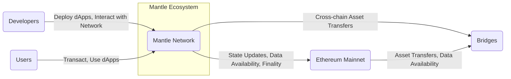
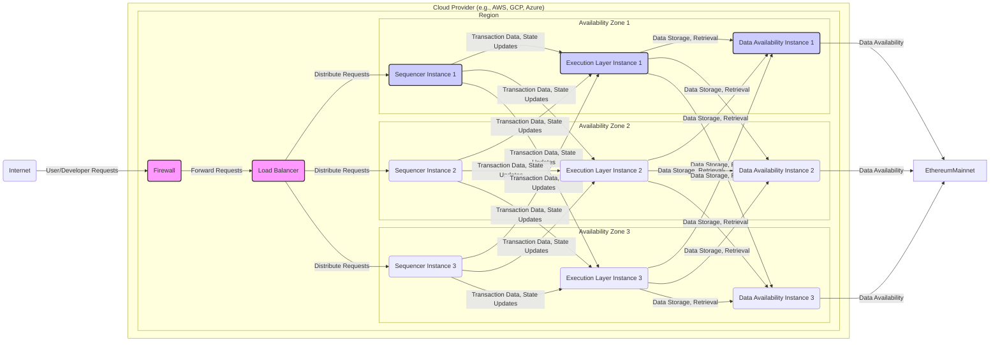

# BUSINESS POSTURE

This project, Mantle, aims to provide a high-performance, Ethereum-compatible Layer-2 (L2) scaling solution. The primary business priorities and goals are centered around:

- Scaling Ethereum: Addressing the limitations of Ethereum mainnet in terms of transaction throughput and cost.
- Developer Experience: Providing a developer-friendly environment for building and deploying decentralized applications (dApps) on L2.
- User Adoption: Attracting users and dApps to the Mantle network by offering faster and cheaper transactions compared to Ethereum mainnet.
- Ecosystem Growth: Fostering a thriving ecosystem of dApps and tools around the Mantle network.
- Interoperability: Ensuring seamless interaction between Mantle and Ethereum mainnet, as well as potentially other blockchains.

The most important business risks that need to be addressed are:

- Security Vulnerabilities: Exploits in the Mantle network or its underlying infrastructure could lead to loss of funds, data breaches, and reputational damage.
- Network Instability: Downtime or performance issues in the Mantle network could disrupt dApps and user experience, hindering adoption.
- Bridge Security: Security of the bridge connecting Mantle to Ethereum mainnet is critical, as it is a potential target for attacks.
- Regulatory Compliance: Navigating the evolving regulatory landscape for cryptocurrencies and blockchain technologies.
- Competition: Facing competition from other L2 scaling solutions and alternative blockchain platforms.

# SECURITY POSTURE

Existing security controls and accepted risks for the Mantle project, based on common practices for similar projects and information available in the repository:

- security control: Code Reviews -  Presumably, the project undergoes code reviews, although the extent and rigor are not explicitly stated in the repository. Implemented during development lifecycle.
- security control: Unit and Integration Testing - Standard testing practices are likely employed to ensure code quality and functionality. Implemented during development lifecycle.
- security control: Open Source - The project is open source, allowing for community scrutiny and contribution to security. Described by repository itself.
- security control: Standard cryptographic libraries - Usage of well-vetted cryptographic libraries for secure operations. Implemented in codebase.
- security control: Access Control - Access control mechanisms are likely in place for managing access to infrastructure and code repositories. Implemented in infrastructure and repository management systems.
- accepted risk: Dependence on Ethereum Security - Mantle's security is inherently tied to the security of the underlying Ethereum mainnet, especially for finality and data availability.
- accepted risk: Smart Contract Vulnerabilities - Smart contracts deployed on Mantle may contain vulnerabilities that could be exploited.

Recommended security controls to implement as high priority:

- security control: Formal Security Audits - Conduct regular, independent security audits of the Mantle core protocol, smart contracts, and critical infrastructure components.
- security control: Bug Bounty Program - Establish a bug bounty program to incentivize external security researchers to identify and report vulnerabilities.
- security control: Security Scanning - Integrate automated security scanning tools (SAST, DAST, dependency scanning) into the CI/CD pipeline.
- security control: Incident Response Plan - Develop and maintain a comprehensive incident response plan to handle security incidents effectively.
- security control: Penetration Testing - Conduct regular penetration testing to simulate real-world attacks and identify weaknesses in the system.
- security control: Secure Key Management - Implement robust key management practices for private keys used in the Mantle network, including sequencers, validators, and bridges.
- security control: Rate Limiting and DDoS Protection - Implement rate limiting and DDoS protection mechanisms to protect the Mantle network from denial-of-service attacks.
- security control: Monitoring and Alerting - Implement comprehensive monitoring and alerting systems to detect and respond to security events in real-time.

Security requirements for the Mantle project:

- Authentication:
    - Requirement: Users interacting with the Mantle network (e.g., sending transactions, deploying contracts) should be authenticated.
    - Requirement:  Authentication mechanisms should be secure and resistant to common attacks (e.g., replay attacks, man-in-the-middle attacks).
    - Requirement:  Consider using standard Ethereum authentication methods where applicable (e.g., signature verification).

- Authorization:
    - Requirement: Access to sensitive operations and resources within the Mantle network should be controlled based on authorization policies.
    - Requirement:  Authorization mechanisms should be fine-grained and allow for different roles and permissions.
    - Requirement:  Smart contracts should implement their own authorization logic to control access to their functions and data.

- Input Validation:
    - Requirement: All inputs to the Mantle network, including transactions and smart contract interactions, must be thoroughly validated to prevent injection attacks and other input-related vulnerabilities.
    - Requirement: Input validation should be performed at multiple layers, including the client-side, the sequencer, and smart contracts.
    - Requirement:  Use secure coding practices to avoid common input validation errors.

- Cryptography:
    - Requirement: Cryptography should be used to protect the confidentiality, integrity, and authenticity of data and communications within the Mantle network.
    - Requirement:  Use strong and well-vetted cryptographic algorithms and libraries.
    - Requirement:  Properly manage cryptographic keys and secrets to prevent unauthorized access.
    - Requirement:  Ensure secure implementation of cryptographic protocols, such as those used for transaction signing and encryption.

# DESIGN

## C4 CONTEXT

Context Diagram Elements:

- Element:
    - Name: Mantle Network
    - Type: System
    - Description: The Mantle Layer-2 scaling solution, providing a platform for decentralized applications with higher throughput and lower costs than Ethereum mainnet.
    - Responsibilities: Processing transactions, executing smart contracts, maintaining network state, providing data availability, interacting with Ethereum mainnet and bridges.
    - Security controls: Network security controls, consensus mechanism security, smart contract security, access control, cryptography.

- Element:
    - Name: Ethereum Mainnet
    - Type: System
    - Description: The primary Ethereum blockchain, providing security, data availability, and finality for the Mantle network.
    - Responsibilities: Providing data availability for Mantle transactions, anchoring Mantle state, facilitating cross-chain asset transfers.
    - Security controls: Ethereum mainnet consensus mechanism, network security, smart contract security.

- Element:
    - Name: Developers
    - Type: Person
    - Description: Software developers who build and deploy decentralized applications on the Mantle network.
    - Responsibilities: Developing and deploying dApps, interacting with Mantle network APIs and SDKs.
    - Security controls: Secure development practices, code reviews, vulnerability scanning.

- Element:
    - Name: Users
    - Type: Person
    - Description: End-users who interact with dApps deployed on the Mantle network to perform transactions and access services.
    - Responsibilities: Transacting on the Mantle network, using dApps, managing their accounts and assets.
    - Security controls: Secure key management, awareness of phishing and social engineering attacks.

- Element:
    - Name: Bridges
    - Type: System
    - Description: Systems that facilitate the transfer of assets between Mantle and Ethereum mainnet, and potentially other blockchains.
    - Responsibilities: Locking and unlocking assets on different chains, ensuring secure and reliable cross-chain transfers.
    - Security controls: Bridge security protocols, multi-signature schemes, monitoring and alerting, vulnerability audits.

## C4 CONTAINER

```mermaid
graph LR
    subgraph "Mantle Network"
        Sequencer("Sequencer")
        ExecutionLayer("Execution Layer")
        DataAvailabilityLayer("Data Availability Layer")
        BridgeContracts("Bridge Contracts")
        SDK("SDK")
        NodeSoftware("Node Software")
    end

    Developers -- "Interact via SDK" --> SDK
    Users -- "Interact via Node Software" --> NodeSoftware
    SDK -- "Submits Transactions" --> Sequencer
    NodeSoftware -- "Submits Transactions, Reads State" --> Sequencer
    Sequencer -- "Orders Transactions, Executes State Transitions" --> ExecutionLayer
    ExecutionLayer -- "Stores State, Executes EVM" --> DataAvailabilityLayer
    DataAvailabilityLayer -- "Provides Transaction Data" --> ExecutionLayer
    ExecutionLayer -- "Interacts with Bridge Contracts" --> BridgeContracts
    BridgeContracts -- "Interacts with Ethereum Mainnet" --> EthereumMainnet

    style Sequencer fill:#f9f,stroke:#333,stroke-width:2px
    style ExecutionLayer fill:#ccf,stroke:#333,stroke-width:2px
    style DataAvailabilityLayer fill:#ccf,stroke:#333,stroke-width:2px
    style BridgeContracts fill:#ccf,stroke:#333,stroke-width:2px
    style SDK fill:#f9f,stroke:#333,stroke-width:2px
    style NodeSoftware fill:#f9f,stroke:#333,stroke-width:2px
```

Container Diagram Elements:

- Element:
    - Name: Sequencer
    - Type: Container - Application
    - Description: The central component responsible for ordering transactions, batching them, and submitting them to the Execution Layer. It acts as the transaction processing engine of Mantle.
    - Responsibilities: Receiving transactions, ordering transactions, batching transactions, submitting transaction batches to the Execution Layer, providing transaction confirmation.
    - Security controls: Rate limiting, DDoS protection, access control, secure communication channels, consensus mechanism security.

- Element:
    - Name: Execution Layer
    - Type: Container - Application
    - Description: Executes transactions and manages the state of the Mantle network. It interacts with the Data Availability Layer to store and retrieve transaction data.
    - Responsibilities: Executing transactions, managing network state, interacting with the Data Availability Layer, interacting with Bridge Contracts.
    - Security controls: Smart contract security, state management security, access control, secure communication channels.

- Element:
    - Name: Data Availability Layer
    - Type: Container - Data Store / Service
    - Description: Stores the transaction data for the Mantle network, ensuring data availability and integrity. This could be Ethereum mainnet itself or a dedicated data availability solution.
    - Responsibilities: Storing transaction data, providing data availability to the Execution Layer, ensuring data integrity.
    - Security controls: Data encryption at rest and in transit, data integrity checks, access control, redundancy and backups.

- Element:
    - Name: Bridge Contracts
    - Type: Container - Application / Smart Contracts
    - Description: Smart contracts deployed on both Mantle and Ethereum mainnet that facilitate cross-chain asset transfers.
    - Responsibilities: Locking and unlocking assets on different chains, managing cross-chain communication, ensuring secure asset transfers.
    - Security controls: Smart contract security audits, formal verification, access control, monitoring and alerting.

- Element:
    - Name: SDK
    - Type: Container - Library / API
    - Description: Software Development Kit providing libraries and APIs for developers to interact with the Mantle network.
    - Responsibilities: Providing developer-friendly interfaces for transaction submission, contract deployment, and network interaction.
    - Security controls: Input validation, secure coding practices, vulnerability scanning, regular updates.

- Element:
    - Name: Node Software
    - Type: Container - Application
    - Description: Software that users can run to interact directly with the Mantle network, submit transactions, and read network state.
    - Responsibilities: Providing user interface for network interaction, transaction submission, state querying, potentially participating in network consensus (depending on Mantle's architecture).
    - Security controls: Secure communication channels, input validation, secure key management, regular updates.

## DEPLOYMENT

Deployment Architecture Option: Cloud-based Infrastructure

Deployment Diagram Elements (Cloud-based Deployment):

- Element:
    - Name: Cloud Provider (e.g., AWS, GCP, Azure)
    - Type: Infrastructure
    - Description: Cloud infrastructure provider hosting the Mantle network components.
    - Responsibilities: Providing compute, storage, networking, and security services for the Mantle infrastructure.
    - Security controls: Cloud provider security controls (physical security, network security, access control, compliance certifications).

- Element:
    - Name: Region
    - Type: Infrastructure - Geographic Region
    - Description: Geographic region within the cloud provider's infrastructure where the Mantle network is deployed for redundancy and fault tolerance.
    - Responsibilities: Providing geographic isolation and redundancy.
    - Security controls: Region-level security controls provided by the cloud provider.

- Element:
    - Name: Availability Zone
    - Type: Infrastructure - Availability Zone
    - Description: Isolated locations within each region, providing further fault tolerance and high availability. Mantle components are deployed across multiple Availability Zones.
    - Responsibilities: Providing fault tolerance within a region.
    - Security controls: Availability Zone-level security controls provided by the cloud provider.

- Element:
    - Name: Sequencer Instance (1, 2, 3)
    - Type: Infrastructure - Compute Instance (VM/Container)
    - Description: Virtual machine or container instances running the Sequencer application. Multiple instances are deployed for redundancy and load balancing.
    - Responsibilities: Running the Sequencer application, processing transactions.
    - Security controls: Instance-level security controls (OS hardening, security patching, access control, monitoring).

- Element:
    - Name: Execution Layer Instance (1, 2, 3)
    - Type: Infrastructure - Compute Instance (VM/Container)
    - Description: Virtual machine or container instances running the Execution Layer application. Multiple instances are deployed for redundancy and load balancing.
    - Responsibilities: Running the Execution Layer application, executing transactions, managing state.
    - Security controls: Instance-level security controls (OS hardening, security patching, access control, monitoring).

- Element:
    - Name: Data Availability Instance (1, 2, 3)
    - Type: Infrastructure - Compute Instance / Storage Service
    - Description: Instances or storage services providing the Data Availability Layer functionality. This could be VMs running data availability software or managed storage services.
    - Responsibilities: Storing and providing access to transaction data.
    - Security controls: Storage service security controls (encryption at rest, access control, backups), instance-level security controls if using VMs.

- Element:
    - Name: Load Balancer
    - Type: Infrastructure - Network Service
    - Description: Distributes incoming traffic across multiple Sequencer instances for load balancing and high availability.
    - Responsibilities: Distributing traffic, improving availability and performance.
    - Security controls: Load balancer security features (DDoS protection, TLS termination, access control).

- Element:
    - Name: Firewall
    - Type: Infrastructure - Network Security
    - Description: Network firewall protecting the Mantle infrastructure from unauthorized access from the Internet.
    - Responsibilities: Filtering network traffic, blocking malicious requests, enforcing network security policies.
    - Security controls: Firewall rules, intrusion detection/prevention systems.

## BUILD

```mermaid
graph LR
    Developer("Developer") --> SourceCodeRepository("Source Code Repository (GitHub)")
    SourceCodeRepository -- "Code Changes, Pull Requests" --> CI_CD_Pipeline("CI/CD Pipeline (GitHub Actions)")
    CI_CD_Pipeline -- "Build, Test, Scan, Package" --> BuildArtifacts("Build Artifacts (Container Registry, Package Repository)")
    BuildArtifacts -- "Deployment" --> DeploymentEnvironment("Deployment Environment (Cloud Infrastructure)")

    subgraph "CI/CD Pipeline (GitHub Actions)"
        CodeCheckout("Code Checkout")
        BuildStep("Build")
        UnitTests("Unit Tests")
        IntegrationTests("Integration Tests")
        SAST("SAST Scanning")
        DependencyScanning("Dependency Scanning")
        ContainerImageBuild("Container Image Build")
        ArtifactUpload("Artifact Upload")
    end

    style CI_CD_Pipeline fill:#f9f,stroke:#333,stroke-width:2px
    style CodeCheckout fill:#ccf,stroke:#333,stroke-width:2px
    style BuildStep fill:#ccf,stroke:#333,stroke-width:2px
    style UnitTests fill:#ccf,stroke:#333,stroke-width:2px
    style IntegrationTests fill:#ccf,stroke:#333,stroke-width:2px
    style SAST fill:#ccf,stroke:#333,stroke-width:2px
    style DependencyScanning fill:#ccf,stroke:#333,stroke-width:2px
    style ContainerImageBuild fill:#ccf,stroke:#333,stroke-width:2px
    style ArtifactUpload fill:#ccf,stroke:#333,stroke-width:2px
```

Build Process Description:

The build process for Mantle likely involves a CI/CD pipeline, such as GitHub Actions, to automate the build, test, and deployment process.

Build Process Steps and Security Controls:

- Developer:
    - Responsibilities: Writes code, commits changes to the source code repository, creates pull requests.
    - Security controls: Secure development environment, code signing (optional), code reviews before committing.

- Source Code Repository (GitHub):
    - Responsibilities: Stores source code, manages version control, facilitates collaboration.
    - Security controls: Access control (authentication and authorization), branch protection, audit logs.

- CI/CD Pipeline (GitHub Actions):
    - Responsibilities: Automates the build, test, security scanning, and packaging process.
    - Security controls: Secure pipeline configuration, secrets management, isolated build environments, audit logs.

    - Code Checkout:
        - Responsibilities: Retrieves the latest code from the source code repository.
        - Security controls: Secure connection to the repository, branch verification.

    - Build Step:
        - Responsibilities: Compiles code, builds binaries and executables.
        - Security controls: Use of trusted build tools and environments, build process isolation.

    - Unit Tests:
        - Responsibilities: Executes unit tests to verify code functionality.
        - Security controls: Comprehensive test coverage, secure testing frameworks.

    - Integration Tests:
        - Responsibilities: Executes integration tests to verify interactions between components.
        - Security controls: Realistic test environments, secure testing frameworks.

    - SAST Scanning (Static Application Security Testing):
        - Responsibilities: Analyzes source code for potential security vulnerabilities.
        - Security controls: Regularly updated SAST tools, vulnerability reporting and remediation process.

    - Dependency Scanning:
        - Responsibilities: Scans project dependencies for known vulnerabilities.
        - Security controls: Regularly updated dependency scanning tools, vulnerability reporting and remediation process, dependency pinning.

    - Container Image Build (if applicable):
        - Responsibilities: Builds container images for deployment.
        - Security controls: Base image security, minimal image size, vulnerability scanning of container images, image signing.

    - Artifact Upload:
        - Responsibilities: Uploads build artifacts (container images, packages) to a registry or repository.
        - Security controls: Secure artifact registry, access control to the registry, artifact signing and verification.

- Build Artifacts (Container Registry, Package Repository):
    - Responsibilities: Stores build artifacts for deployment.
    - Security controls: Access control, vulnerability scanning of stored artifacts, audit logs.

- Deployment Environment (Cloud Infrastructure):
    - Responsibilities: Hosts the deployed Mantle network components.
    - Security controls: Deployment environment security controls as described in the Deployment section.

# RISK ASSESSMENT

Critical business processes we are trying to protect:

- Transaction Processing: Ensuring the reliable and secure processing of transactions on the Mantle network.
- State Management: Maintaining the integrity and consistency of the Mantle network state.
- Cross-chain Asset Transfers: Securing the bridge between Mantle and Ethereum mainnet to prevent loss of funds during asset transfers.
- Data Availability: Ensuring that transaction data is available and accessible for verification and auditing.
- Network Operation: Maintaining the overall availability and performance of the Mantle network.

Data we are trying to protect and their sensitivity:

- Transaction Data: Publicly available but integrity is critical. Sensitivity: Medium (Integrity is High).
- Network State Data: Publicly available but integrity is critical. Sensitivity: Medium (Integrity is High).
- Private Keys: Used by sequencers, validators, and bridge operators. Sensitivity: High (Confidentiality and Integrity are High). Loss or compromise could lead to catastrophic failures and loss of funds.
- Smart Contract Code: Publicly available but integrity is critical. Sensitivity: Medium (Integrity is High). Vulnerabilities can lead to exploits.
- Infrastructure Credentials: Access keys, passwords, API tokens for cloud infrastructure and services. Sensitivity: High (Confidentiality and Integrity are High). Compromise can lead to unauthorized access and control.

# QUESTIONS & ASSUMPTIONS

Questions:

- What specific Data Availability solution is Mantle using? Is it Ethereum mainnet itself, or a dedicated DA layer?
- What consensus mechanism is used within the Mantle network?
- What are the details of the bridge implementation between Mantle and Ethereum mainnet?
- What specific security scanning tools are currently used in the CI/CD pipeline?
- Are formal security audits conducted regularly? If so, what is the cadence and scope?
- Is there a bug bounty program in place?

Assumptions:

- BUSINESS POSTURE: Assumed that scaling Ethereum and developer experience are primary business drivers.
- SECURITY POSTURE: Assumed standard secure development practices are in place, but recommended more robust security controls. Assumed project is aware of common blockchain security risks.
- DESIGN: Assumed a cloud-based deployment model for the Mantle network for simplicity and scalability. Assumed a standard CI/CD pipeline using GitHub Actions for build and deployment. Assumed separation of concerns into Sequencer, Execution Layer, and Data Availability Layer containers.