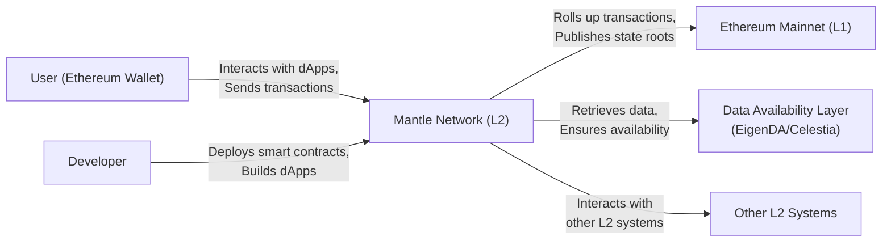
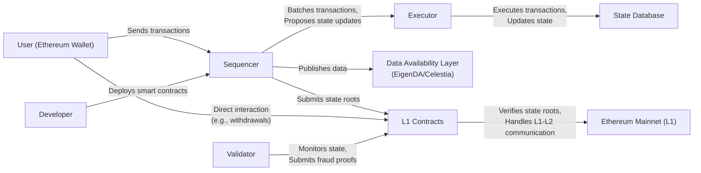
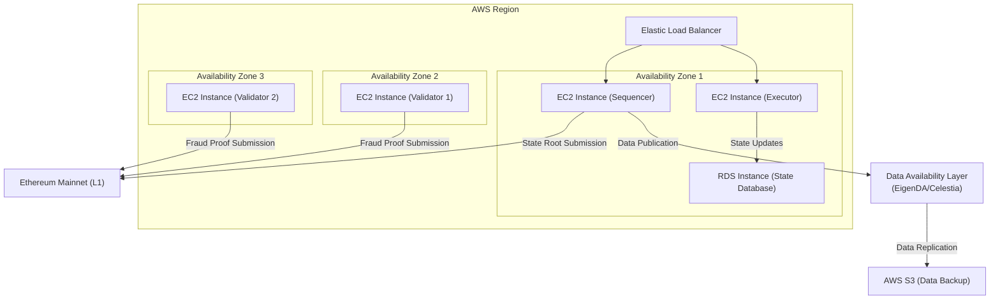
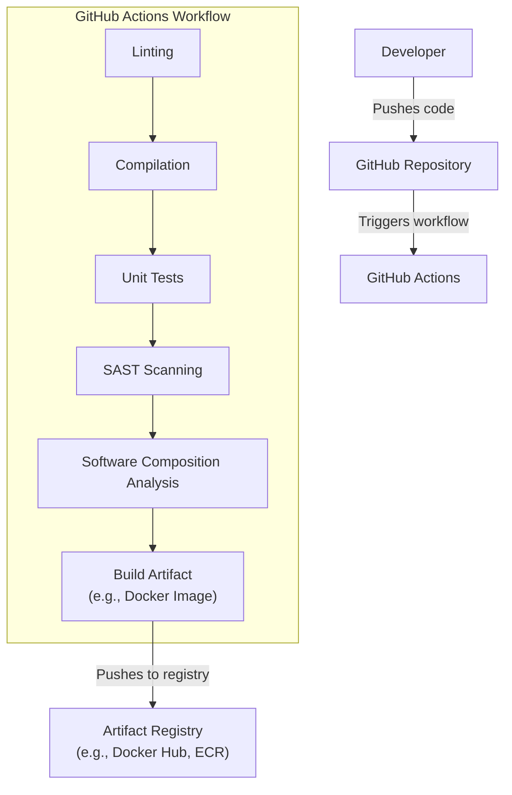

# BUSINESS POSTURE

Business Priorities and Goals:

*   Provide a modular, high-performance Ethereum Layer-2 (L2) scaling solution.
*   Offer developers a familiar and easy-to-use environment compatible with the Ethereum Virtual Machine (EVM).
*   Reduce transaction costs and increase throughput compared to the Ethereum mainnet.
*   Maintain a high level of security and decentralization.
*   Foster a vibrant ecosystem of applications and users.
*   Enable fast and efficient data availability.

Most Important Business Risks:

*   Smart contract vulnerabilities: Bugs in Mantle's core contracts or deployed applications could lead to loss of funds or disruption of service.
*   Centralization risks: Over-reliance on specific validators or sequencers could compromise the network's decentralization and censorship resistance.
*   Data availability issues: Failure of the data availability layer could lead to the inability to reconstruct the L2 state.
*   Competition: Other L2 scaling solutions could attract users and developers away from Mantle.
*   Regulatory uncertainty: Evolving regulations around cryptocurrencies and blockchain technology could impact Mantle's operations.
*   Network congestion: High demand could lead to increased transaction fees and slower confirmation times, diminishing the user experience.
*   Key management risks: Compromise of private keys used by validators, sequencers, or other critical components could lead to unauthorized access and control.

# SECURITY POSTURE

Existing Security Controls (based on the provided repository and general knowledge of L2 solutions):

*   security control: Smart contract audits: Core Mantle contracts are likely to have undergone security audits by reputable firms. (Implementation: Needs to be confirmed in documentation or repository).
*   security control: Formal verification: Some critical components may have undergone formal verification to mathematically prove their correctness. (Implementation: Needs to be confirmed in documentation or repository).
*   security control: Bug bounty program: Mantle likely has a bug bounty program to incentivize security researchers to find and report vulnerabilities. (Implementation: Needs to be confirmed in documentation or repository).
*   security control: Multi-signature wallets: Critical administrative functions and funds are likely managed using multi-signature wallets, requiring multiple approvals for sensitive operations. (Implementation: Needs to be confirmed in documentation or repository).
*   security control: Fraud proofs: Mantle, as an optimistic rollup, relies on fraud proofs to ensure the validity of state transitions. (Implementation: Core protocol design).
*   security control: Escape hatch mechanism: Users should have a way to withdraw their funds from L2 to L1 even if the L2 network becomes unavailable or malicious. (Implementation: Core protocol design).
*   security control: Regular security reviews and penetration testing. (Implementation: Needs to be confirmed in documentation or repository).

Accepted Risks:

*   accepted risk: Optimistic rollup assumptions: The security of optimistic rollups relies on the assumption that at least one honest validator will challenge any invalid state transition.
*   accepted risk: Data availability reliance: Mantle relies on a separate data availability layer (EigenDA or Celestia), which introduces its own set of assumptions and potential risks.
*   accepted risk: EVM compatibility limitations: While aiming for EVM equivalence, there might be subtle differences or limitations compared to the Ethereum mainnet.
*   accepted risk: Emerging technology risks: L2 scaling solutions are still relatively new and evolving, and unforeseen vulnerabilities or challenges may arise.

Recommended Security Controls:

*   security control: Implement a comprehensive monitoring and alerting system to detect and respond to suspicious activity on the network.
*   security control: Establish a clear incident response plan to handle security breaches or other critical events.
*   security control: Provide detailed documentation and security guidelines for developers building on Mantle.
*   security control: Conduct regular threat modeling exercises to identify and mitigate potential vulnerabilities.
*   security control: Implement rate limiting and other measures to protect against denial-of-service attacks.

Security Requirements:

*   Authentication:
    *   Users authenticate their transactions using Ethereum-compatible wallets and digital signatures.
    *   Validators and sequencers authenticate themselves using cryptographic keys.
*   Authorization:
    *   Smart contracts define their own authorization rules, controlling access to their functions and data.
    *   Mantle's core contracts enforce rules regarding state transitions, withdrawals, and other critical operations.
*   Input Validation:
    *   Smart contracts must thoroughly validate all inputs to prevent vulnerabilities such as integer overflows, reentrancy attacks, and unexpected state changes.
    *   Mantle's core contracts must validate all incoming transactions and proposed state updates.
*   Cryptography:
    *   Ethereum's standard cryptographic primitives (e.g., ECDSA for signatures, Keccak-256 for hashing) are used throughout the system.
    *   Merkle trees or other cryptographic accumulators are used to efficiently represent and verify the state of the L2 network.
    *   Data availability solutions may use their own cryptographic schemes (e.g., KZG commitments).

# DESIGN

## C4 CONTEXT

Element Descriptions:

*   Element:
    *   Name: User (Ethereum Wallet)
    *   Type: Person
    *   Description: Represents an end-user interacting with the Mantle network.
    *   Responsibilities: Initiates transactions, interacts with dApps, manages assets on L2.
    *   Security controls: Uses Ethereum-compatible wallets, signs transactions with private keys.

*   Element:
    *   Name: Mantle Network (L2)
    *   Type: Software System
    *   Description: The Mantle Layer-2 scaling solution.
    *   Responsibilities: Executes transactions, maintains L2 state, interacts with L1 and the data availability layer.
    *   Security controls: Smart contract audits, fraud proofs, escape hatch mechanism, multi-signature wallets (assumed).

*   Element:
    *   Name: Ethereum Mainnet (L1)
    *   Type: Software System
    *   Description: The Ethereum blockchain, serving as the settlement layer for Mantle.
    *   Responsibilities: Provides security and finality for L2 transactions, handles L1-L2 communication.
    *   Security controls: Ethereum's consensus mechanism (Proof-of-Stake), smart contract audits.

*   Element:
    *   Name: Data Availability Layer (EigenDA/Celestia)
    *   Type: Software System
    *   Description: An external system ensuring the availability of data needed to reconstruct the L2 state.
    *   Responsibilities: Stores and provides data related to L2 transactions and state updates.
    *   Security controls: Specific to the chosen data availability solution (e.g., EigenDA's or Celestia's security mechanisms).

*   Element:
    *   Name: Other L2 Systems
    *   Type: Software System
    *   Description: Represents other Layer-2 scaling solutions that Mantle might interact with.
    *   Responsibilities: Depends on the specific interaction (e.g., cross-chain messaging, asset transfers).
    *   Security controls: Depends on the specific L2 system and the interaction mechanism.

*   Element:
    *   Name: Developer
    *   Type: Person
    *   Description: Represents a developer building and deploying applications on Mantle.
    *   Responsibilities: Writes and deploys smart contracts, builds user interfaces, interacts with the Mantle network.
    *   Security controls: Follows secure coding practices, uses development tools with security features.

## C4 CONTAINER

Element Descriptions:

*   Element:
    *   Name: User (Ethereum Wallet)
    *   Type: Person
    *   Description: Represents an end-user interacting with the Mantle network.
    *   Responsibilities: Initiates transactions, interacts with dApps, manages assets on L2.
    *   Security controls: Uses Ethereum-compatible wallets, signs transactions with private keys.

*   Element:
    *   Name: Sequencer
    *   Type: Container (Server)
    *   Description: Responsible for ordering transactions and proposing state updates.
    *   Responsibilities: Receives transactions from users, batches them, sends them to the executor, publishes data to the data availability layer, and submits state roots to L1.
    *   Security controls: May use rate limiting, access controls, and potentially multi-signature schemes for critical operations.

*   Element:
    *   Name: Executor
    *   Type: Container (Server)
    *   Description: Executes transactions and updates the L2 state.
    *   Responsibilities: Receives transaction batches from the sequencer, executes them against the current state, and updates the state database.
    *   Security controls: Input validation, sandboxing (if applicable), and potentially formal verification of critical components.

*   Element:
    *   Name: State Database
    *   Type: Container (Database)
    *   Description: Stores the current state of the L2 network.
    *   Responsibilities: Persistently stores account balances, contract storage, and other relevant data.
    *   Security controls: Access controls, data encryption (if applicable), and regular backups.

*   Element:
    *   Name: Data Availability Layer (EigenDA/Celestia)
    *   Type: Container (External System)
    *   Description: An external system ensuring the availability of data needed to reconstruct the L2 state.
    *   Responsibilities: Stores and provides data related to L2 transactions and state updates.
    *   Security controls: Specific to the chosen data availability solution (e.g., EigenDA's or Celestia's security mechanisms).

*   Element:
    *   Name: L1 Contracts
    *   Type: Container (Smart Contracts)
    *   Description: Smart contracts on Ethereum mainnet that handle L1-L2 communication.
    *   Responsibilities: Verify state roots submitted by the sequencer, handle deposits and withdrawals, and process fraud proofs.
    *   Security controls: Smart contract audits, formal verification (if applicable), and multi-signature wallets for administrative functions.

*   Element:
    *   Name: Ethereum Mainnet (L1)
    *   Type: Software System
    *   Description: The Ethereum blockchain, serving as the settlement layer for Mantle.
    *   Responsibilities: Provides security and finality for L2 transactions, handles L1-L2 communication.
    *   Security controls: Ethereum's consensus mechanism (Proof-of-Stake), smart contract audits.

*   Element:
    *   Name: Validator
    *   Type: Container (Server)
    *   Description: Monitors the L2 state and submits fraud proofs if invalid state transitions are detected.
    *   Responsibilities: Downloads and verifies L2 blocks, challenges invalid state updates by submitting fraud proofs to L1.
    *   Security controls: Runs a full node, monitors the network for discrepancies, and uses secure communication channels.

*   Element:
    *   Name: Developer
    *   Type: Person
    *   Description: Represents a developer building and deploying applications on Mantle.
    *   Responsibilities: Writes and deploys smart contracts, builds user interfaces, interacts with the Mantle network.
    *   Security controls: Follows secure coding practices, uses development tools with security features.

## DEPLOYMENT

Possible Deployment Solutions:

1.  **Cloud-Based Deployment (e.g., AWS, Google Cloud, Azure):** Utilizes cloud infrastructure for hosting the various components of the Mantle network. This is a common approach for scalability and ease of management.
2.  **Hybrid Deployment:** Combines cloud-based infrastructure with on-premises servers, potentially for specific components like validators or for regulatory compliance.
3.  **Decentralized Infrastructure:** A more theoretical approach where nodes are run by independent operators across various infrastructure providers, maximizing decentralization.

Chosen Solution (for detailed description): Cloud-Based Deployment (AWS)

Element Descriptions:

*   Element:
    *   Name: EC2 Instance (Sequencer)
    *   Type: Infrastructure Node (Virtual Machine)
    *   Description: An Amazon EC2 instance running the Mantle sequencer software.
    *   Responsibilities: Hosts the sequencer container, processes transactions, and communicates with other components.
    *   Security controls: IAM roles, security groups, network ACLs, SSH key management, regular patching and updates.

*   Element:
    *   Name: EC2 Instance (Executor)
    *   Type: Infrastructure Node (Virtual Machine)
    *   Description: An Amazon EC2 instance running the Mantle executor software.
    *   Responsibilities: Hosts the executor container, executes transactions, and updates the state database.
    *   Security controls: IAM roles, security groups, network ACLs, SSH key management, regular patching and updates.

*   Element:
    *   Name: RDS Instance (State Database)
    *   Type: Infrastructure Node (Database)
    *   Description: An Amazon RDS instance hosting the Mantle state database.
    *   Responsibilities: Provides persistent storage for the L2 state.
    *   Security controls: IAM roles, security groups, network ACLs, database encryption, regular backups and snapshots.

*   Element:
    *   Name: EC2 Instance (Validator 1)
    *   Type: Infrastructure Node (Virtual Machine)
    *   Description: An Amazon EC2 instance running a Mantle validator node.
    *   Responsibilities: Monitors the L2 state and submits fraud proofs if necessary.
    *   Security controls: IAM roles, security groups, network ACLs, SSH key management, regular patching and updates.

*   Element:
    *   Name: EC2 Instance (Validator 2)
    *   Type: Infrastructure Node (Virtual Machine)
    *   Description: An Amazon EC2 instance running a Mantle validator node.
    *   Responsibilities: Monitors the L2 state and submits fraud proofs if necessary.
    *   Security controls: IAM roles, security groups, network ACLs, SSH key management, regular patching and updates.

*   Element:
    *   Name: Elastic Load Balancer
    *   Type: Infrastructure Node (Load Balancer)
    *   Description: Distributes traffic across multiple sequencer and executor instances.
    *   Responsibilities: Improves availability and scalability of the sequencer and executor components.
    *   Security controls: SSL/TLS termination, security groups, network ACLs.

*   Element:
    *   Name: AWS S3 (Data Backup)
    *   Type: Infrastructure Node (Storage)
    *   Description: Used for backing up data from the data availability layer.
    *   Responsibilities: Provides a durable and scalable storage solution for data backups.
    *   Security controls: IAM roles, bucket policies, encryption at rest and in transit.

*   Element:
    *   Name: Data Availability Layer (EigenDA/Celestia)
    *   Type: External System
    *   Description: The external data availability solution used by Mantle.
    *   Responsibilities: Stores and provides data related to L2 transactions and state updates.
    *   Security controls: Specific to the chosen data availability solution.

*   Element:
    *   Name: Ethereum Mainnet (L1)
    *   Type: External System
    *   Description: The Ethereum blockchain.
    *   Responsibilities: Provides security and finality for L2 transactions.
    *   Security controls: Ethereum's consensus mechanism and smart contract security.

## BUILD

The build process for Mantle likely involves multiple stages, from code compilation to artifact creation and deployment.  A CI/CD pipeline using GitHub Actions is a reasonable assumption, given the project's presence on GitHub.

Build Process Description:

1.  **Code Commit:** Developers write code and commit it to the Mantle GitHub repository.
2.  **Trigger CI/CD:** A push to specific branches (e.g., `main`, `develop`) triggers a GitHub Actions workflow.
3.  **Linting:** Code linters (e.g., ESLint for JavaScript/TypeScript, Solhint for Solidity) check for code style and potential errors.
4.  **Compilation:** The code is compiled into executable binaries or bytecode (e.g., Solidity contracts are compiled to EVM bytecode).
5.  **Unit Tests:** Automated unit tests are run to verify the correctness of individual components.
6.  **SAST Scanning:** Static Application Security Testing (SAST) tools (e.g., SonarQube, Semgrep) analyze the source code for security vulnerabilities.
7.  **Software Composition Analysis (SCA):** SCA tools (e.g., Snyk, Dependabot) identify and analyze dependencies for known vulnerabilities.
8.  **Build Artifact:** If all previous steps pass, a build artifact is created. This is likely a Docker image containing the compiled code and its dependencies.
9.  **Push to Registry:** The build artifact is pushed to a container registry (e.g., Docker Hub, Amazon ECR).

Security Controls in Build Process:

*   security control: Code reviews: All code changes should be reviewed by at least one other developer before being merged.
*   security control: Linting: Enforces code style and helps prevent common errors.
*   security control: Unit tests: Verify the correctness of individual components.
*   security control: SAST scanning: Identifies security vulnerabilities in the source code.
*   security control: SCA: Detects known vulnerabilities in dependencies.
*   security control: Signed commits: Developers should sign their commits to ensure authenticity.
*   security control: Least privilege: Build systems should operate with the least necessary privileges.
*   security control: Immutable build artifacts: Build artifacts should be immutable and versioned.

# RISK ASSESSMENT

Critical Business Processes to Protect:

*   **Transaction processing:** Ensuring the correct and efficient execution of transactions on the L2 network.
*   **State management:** Maintaining the integrity and consistency of the L2 state.
*   **L1-L2 communication:** Securely handling deposits, withdrawals, and state updates between L1 and L2.
*   **Data availability:** Guaranteeing the availability of data needed to reconstruct the L2 state.
*   **Network security:** Protecting the network from attacks and unauthorized access.

Data to Protect and Sensitivity:

*   **User account balances:** (High sensitivity) Loss or manipulation of balances would directly impact users' funds.
*   **Smart contract code:** (High sensitivity) Vulnerabilities in smart contracts could lead to exploits and financial losses.
*   **Smart contract storage:** (High sensitivity) Contains the state of dApps and user data.
*   **Transaction data:** (Medium sensitivity) Contains information about transactions, which could be used for deanonymization or other privacy violations.
*   **Private keys (validators, sequencers, etc.):** (Extremely high sensitivity) Compromise of private keys could lead to complete control over the network or funds.
*   **L2 state data:** (High sensitivity) Loss or corruption of state data could lead to network disruption.

# QUESTIONS & ASSUMPTIONS

Questions:

*   What specific security audits have been performed on the Mantle core contracts, and what were the findings?
*   Is formal verification used for any components, and if so, which ones?
*   What is the exact mechanism for the escape hatch, and how is it secured?
*   What is the specific data availability solution used (EigenDA, Celestia, or other), and what are its security guarantees?
*   What are the details of the multi-signature wallet setup for administrative functions?
*   What is the incident response plan for security breaches or other critical events?
*   What are the specific monitoring and alerting systems in place?
*   What are the performance benchmarks and scalability targets for the network?
*   What are the plans for decentralizing the sequencer role?
*   What are the specific mechanisms for handling network congestion and high gas fees?

Assumptions:

*   BUSINESS POSTURE: The primary goal is to provide a secure, scalable, and cost-effective L2 solution for Ethereum.
*   SECURITY POSTURE: Security is a high priority, and standard security practices are followed.  A bug bounty program exists. Multi-signature wallets are used for critical operations.
*   DESIGN: The architecture follows a typical optimistic rollup design with a sequencer, executor, validators, and a data availability layer. GitHub Actions is used for CI/CD. AWS is used for cloud deployment.