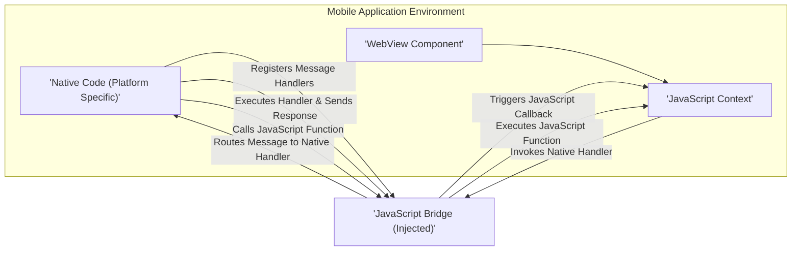

## Project Design Document: WebViewJavascriptBridge (Improved)

**1. Introduction**

This document provides an enhanced design overview of the `WebViewJavascriptBridge` project (as represented by the repository: https://github.com/marcuswestin/webviewjavascriptbridge). This detailed description of the system's architecture, components, and data flow is intended to serve as a robust foundation for subsequent threat modeling activities. The primary goal is to offer a clear and comprehensive understanding of the system to facilitate the identification and mitigation of potential security vulnerabilities.

**2. Goals**

*   To establish a reliable and efficient communication channel between JavaScript code executing within a WebView and the native code of a mobile application.
*   To enable JavaScript to invoke specific native functionalities by calling registered handlers.
*   To provide a mechanism for native code to trigger the execution of JavaScript functions within the WebView.
*   To support asynchronous communication patterns, including the handling of responses and callbacks.
*   To offer a developer-friendly and straightforward API for both JavaScript and native developers.

**3. Architecture Overview**

The `WebViewJavascriptBridge` operates by injecting a bridge object into the JavaScript context of a WebView. This bridge acts as an intermediary, facilitating the exchange of messages between the JavaScript environment and the native application code.

**4. Component Details**

*   **Native Code (Platform Specific - iOS/Android):**
    *   **Responsibility:**  Implements the native functionalities accessible to JavaScript. Manages the registration of handlers for JavaScript calls. Receives and processes messages from the JavaScript bridge, executing the corresponding native functions. Sends responses back to the JavaScript bridge. Can initiate calls to JavaScript functions within the WebView.
    *   **Functionality:**
        *   **Handler Registration:** Provides APIs to register named handlers (e.g., `registerHandler("getUserData", handlerFunction)`). These handlers are associated with specific native functionalities.
        *   **Message Reception:** Listens for messages originating from the JavaScript bridge, typically intercepted through WebView delegates or URL scheme interception.
        *   **Message Parsing:** Parses the received messages to extract the handler name, parameters, and callback information.
        *   **Handler Execution:** Invokes the registered handler corresponding to the received message, passing the provided parameters.
        *   **Response Handling:**  Constructs and sends response messages back to the JavaScript bridge, including any return values or error information, referencing the original callback ID.
        *   **JavaScript Function Calls:** Provides APIs to send messages to the JavaScript bridge instructing it to execute specific JavaScript functions within the WebView (e.g., `callJavaScriptFunction("updateUI", data)`).
    *   **Technology/Implementation:**  Objective-C/Swift (iOS), Java/Kotlin (Android).

*   **WebView Component (Platform Specific - iOS/Android):**
    *   **Responsibility:**  Renders web content and executes JavaScript code. Provides the environment where the JavaScript bridge operates and the mechanisms for native code to interact with the JavaScript context.
    *   **Functionality:**
        *   **Content Loading:** Loads and displays HTML, CSS, and JavaScript resources.
        *   **JavaScript Execution:** Executes JavaScript code embedded in web pages or injected by the native code.
        *   **JavaScript Injection:** Provides APIs for native code to inject JavaScript code into the WebView's context (e.g., using `evaluateJavaScript:` on iOS, `evaluateJavascript()` on Android). This is how the JavaScript bridge is initially made available.
        *   **Message Interception:** Offers mechanisms for native code to intercept messages sent by JavaScript, often by monitoring changes to the `iframe.src` or by handling custom URL schemes.
    *   **Technology/Implementation:** `WKWebView` (iOS), `WebView` (Android).

*   **JavaScript Context:**
    *   **Responsibility:** The runtime environment for JavaScript code within the WebView. Provides the global scope where the injected JavaScript bridge object resides and where web page JavaScript executes.
    *   **Functionality:**
        *   **JavaScript Execution:** Executes JavaScript code provided by the web content and the injected JavaScript bridge.
        *   **API Access:** Provides access to standard JavaScript APIs and any APIs exposed by the injected bridge.

*   **JavaScript Bridge (Injected):**
    *   **Responsibility:**  Acts as the central communication hub within the WebView's JavaScript environment. Provides JavaScript functions for calling native handlers and managing responses. Receives instructions from native code to execute JavaScript functions.
    *   **Functionality:**
        *   **Native Handler Invocation:** Provides JavaScript functions (e.g., `window.WebViewJavascriptBridge.callHandler('handlerName', data, responseCallback)`) that web developers use to trigger native functionality.
        *   **Message Serialization:** Serializes JavaScript calls (handler name, data, callback information) into a structured message format.
        *   **Message Transmission:** Sends messages to the native side. This often involves manipulating the `iframe.src` to trigger a `webView:shouldStartLoadWithRequest:` delegate call on iOS or a similar mechanism on Android, or by using a custom URL scheme.
        *   **Callback Management:** Stores and manages callbacks for asynchronous responses from native code, associating them with unique identifiers.
        *   **Response Handling:**  Receives response messages from the native side and executes the corresponding JavaScript callback function.
        *   **Native Function Invocation (from Native):** Provides a mechanism for native code to call JavaScript functions by receiving messages from the native side and using `eval()` or similar methods to execute the specified JavaScript code within the WebView's context.

**5. Data Flow (Detailed)**

The following outlines the detailed data flow for communication initiated by JavaScript and native code:

*   **JavaScript Initiated Call to Native:**
    1. JavaScript code within the WebView calls a function provided by the injected JavaScript bridge (e.g., `bridge.callHandler('getDeviceInfo', { model: 'current' }, function(response) { console.log(response); });`).
    2. The JavaScript bridge serializes the call information, including the handler name (`getDeviceInfo`), data (`{ model: 'current' }`), and a unique callback ID, into a JSON message.
    3. The JavaScript bridge transmits the message to the native side. A common technique is to set the `iframe.src` to a custom URL scheme (e.g., `wvjbscheme://__BRIDGE_LOADED__#${message}`).
    4. The native WebView component intercepts this URL loading attempt through its delegate methods (e.g., `webView:shouldStartLoadWithRequest:` on iOS).
    5. The native code extracts the message from the intercepted URL.
    6. The native code parses the JSON message to identify the target handler (`getDeviceInfo`), parameters, and callback ID.
    7. The native code locates and executes the registered handler associated with `getDeviceInfo`.
    8. The native handler performs the requested operation (e.g., retrieves device information).
    9. If a callback was provided, the native code constructs a response message, including the callback ID and the response data (e.g., `{ "os": "iOS", "version": "16.0" }`).
    10. The native code sends the response back to the JavaScript bridge. This is typically done by injecting JavaScript code into the WebView's context that calls a specific function on the bridge with the response message (e.g., `window.WebViewJavascriptBridge._handleMessageFromNative('${responseMessage}')`).
    11. The JavaScript bridge receives the response message, identifies the corresponding callback using the callback ID, and executes the callback function in the JavaScript context with the received data.

*   **Native Initiated Call to JavaScript:**
    1. Native code decides to call a JavaScript function (e.g., `updateUserInterface` with data).
    2. The native code constructs a message containing the function name (`updateUserInterface`) and parameters (e.g., `{ "username": "John Doe" }`).
    3. The native code injects JavaScript code into the WebView's context to execute the desired function. This is achieved using platform-specific APIs like `evaluateJavaScript:` on iOS or `evaluateJavascript()` on Android. The injected JavaScript code would look something like: `window.WebViewJavascriptBridge._handleMessageFromNative('{"handlerName": "updateUserInterface", "data": {"username": "John Doe"}}');` (or a similar internal message format).
    4. The injected JavaScript code is executed within the WebView's JavaScript context.
    5. The JavaScript bridge receives this message and identifies the target JavaScript function (if it's a registered handler on the JavaScript side or a globally available function).
    6. The JavaScript bridge executes the specified JavaScript function with the provided parameters.
    7. If the JavaScript function needs to return a value to the native side, it would typically use the JavaScript-to-native communication mechanism described above.

**6. Security Considerations (Pre-Threat Modeling)**

This section highlights potential security concerns that will be explored further during threat modeling:

*   **Cross-Site Scripting (XSS) via Native Code:**
    *   **Vulnerability:** If native code receives data from JavaScript and then uses this data to construct and load web content (e.g., dynamically building HTML strings), improper sanitization could lead to XSS vulnerabilities. Malicious JavaScript could inject scripts that execute when the native code loads this crafted content.
    *   **Mitigation:** Implement robust input validation and output encoding/escaping within the native code before using data received from JavaScript in web content.

*   **Injection Attacks in Native Handlers:**
    *   **Vulnerability:** If native handlers use data received from JavaScript to construct database queries (SQL injection), system commands (OS command injection), or other sensitive operations without proper sanitization, attackers could inject malicious code.
    *   **Mitigation:** Employ parameterized queries for database interactions and avoid constructing commands from user-supplied data. Implement strict input validation and sanitization.

*   **Man-in-the-Middle (MITM) Attacks on WebView Content:**
    *   **Vulnerability:** If the WebView loads content over HTTP instead of HTTPS, an attacker could intercept the traffic and inject malicious JavaScript. This injected JavaScript could then use the bridge to execute native functions.
    *   **Mitigation:** Ensure all web content is loaded over HTTPS. Implement certificate pinning for added security.

*   **Unauthorized Access to Native Functionality:**
    *   **Vulnerability:** If there are no proper authorization checks in the native handlers, any JavaScript code within the WebView (even from untrusted sources) could potentially call sensitive native functions.
    *   **Mitigation:** Implement authentication and authorization mechanisms within native handlers to verify the legitimacy of requests. Restrict access to sensitive functionalities based on user roles or permissions.

*   **Data Integrity Issues:**
    *   **Vulnerability:**  Data passed between JavaScript and native code could be tampered with if the communication channel is not secure.
    *   **Mitigation:** While the bridge itself might not implement encryption, consider encrypting sensitive data before passing it through the bridge. Ensure the underlying web communication (HTTPS) is secure.

*   **JavaScript Code Injection by Native Code:**
    *   **Vulnerability:** If native code allows the execution of arbitrary JavaScript code received from untrusted sources, it could be exploited to perform malicious actions within the WebView.
    *   **Mitigation:** Carefully control the JavaScript code injected by the native side. Avoid executing arbitrary JavaScript provided by external sources.

*   **Exposure of Sensitive Native Functionality:**
    *   **Vulnerability:** Exposing too many native functionalities through the bridge increases the attack surface.
    *   **Mitigation:** Only expose necessary native functionalities through the bridge. Implement the principle of least privilege.

*   **Callback Handling Vulnerabilities:**
    *   **Vulnerability:** Improper management of callbacks could lead to situations where callbacks are executed with unexpected data or out of order, potentially causing unexpected behavior or security issues.
    *   **Mitigation:** Implement robust callback management mechanisms, ensuring that callbacks are correctly associated with their originating requests and are executed exactly once.

**7. Deployment Model**

The `WebViewJavascriptBridge` is typically integrated into a native mobile application project as a set of source files or a library. The native components are included in the native codebase (e.g., through direct inclusion of `.m`/`.swift` or `.java`/`.kt` files, or via a dependency management system). The JavaScript component is injected into the WebView's JavaScript context when the initial web page is loaded, often by using the WebView's `evaluateJavaScript:` (iOS) or `evaluateJavascript()` (Android) methods.

**8. Assumptions and Constraints**

*   Mobile application developers are responsible for the secure implementation of native handlers and for validating input received from JavaScript.
*   The security of the web content loaded within the WebView is a separate concern, but its interaction with the bridge necessitates careful consideration.
*   The underlying WebView component's security features and limitations impact the overall security of the bridge.
*   The communication mechanism relies on the specific implementation details of the `WebViewJavascriptBridge` library and the WebView APIs.

**9. Glossary**

*   **WebView:** A native mobile component used to display web content.
*   **JavaScript Context:** The runtime environment for JavaScript code within the WebView.
*   **Native Code:** Platform-specific code (Objective-C/Swift for iOS, Java/Kotlin for Android).
*   **JavaScript Bridge:** The communication interface between JavaScript and native code.
*   **Handler:** A native function registered to be called by JavaScript.
*   **Callback:** A JavaScript function executed upon receiving a response from a native handler.
*   **Message:** A structured data packet exchanged between JavaScript and native code.
*   **Injection (JavaScript):** The process of inserting JavaScript code into a WebView's context.

This improved design document provides a more detailed and nuanced understanding of the `WebViewJavascriptBridge`, offering a stronger foundation for identifying and mitigating potential security threats.
