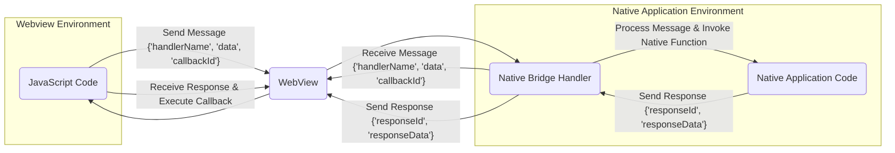
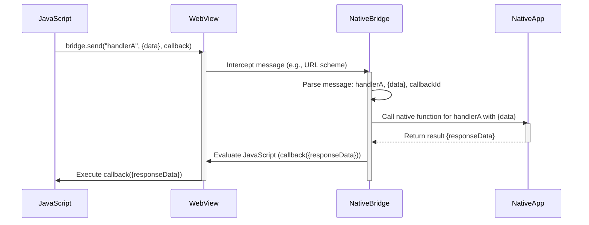

# Project Design Document: WebView JavaScript Bridge

**Version:** 1.1
**Date:** October 26, 2023
**Author:** Gemini (AI Language Model)

## 1. Introduction

This document provides an enhanced design overview of the `webviewjavascriptbridge` project (referenced from [https://github.com/marcuswestin/webviewjavascriptbridge](https://github.com/marcuswestin/webviewjavascriptbridge)). This revised document aims for greater clarity and detail regarding the bridge's architecture, components, and data flow, specifically to facilitate comprehensive threat modeling.

### 1.1. Project Overview

The `webviewjavascriptbridge` enables communication between JavaScript code executing within a webview and the native code of the application hosting that webview (primarily on mobile platforms like iOS and Android). This bridge empowers developers to integrate web-based UI and functionalities while retaining access to native device capabilities.

### 1.2. Goals of this Design Document

*   Clearly and concisely define the architecture and components of the `webviewjavascriptbridge`.
*   Provide a detailed description of the data flow and communication mechanisms.
*   Precisely identify key interfaces and interactions within the system.
*   Establish a robust and comprehensive understanding of the system's operation for effective threat modeling and security analysis.

### 1.3. Scope

This document focuses on the core mechanisms of the JavaScript bridge, detailing how messages are exchanged between JavaScript and native code, and vice-versa. The scope includes:

*   The JavaScript API exposed for use within the webview.
*   The native API exposed to the application for handling messages.
*   The message passing mechanism and its variations across platforms.
*   The structure and handling of responses and callbacks.

This document explicitly excludes:

*   Specific implementation details within the native or JavaScript codebase.
*   The intricacies of webview rendering and browser engine behavior.
*   Network communication unrelated to the bridge's message passing.
*   The specific business logic of applications utilizing the bridge.

## 2. Architectural Overview

The `webviewjavascriptbridge` employs a message-passing architecture, facilitating asynchronous communication between the isolated JavaScript environment within the webview and the native application environment.

### 2.1. High-Level Architecture Diagram

### 2.2. Key Components

*   **JavaScript Code (within WebView):**  JavaScript code running inside the webview utilizes the bridge's JavaScript API to initiate communication with the native application. This code constructs and sends messages.
*   **WebView:** The platform-provided component responsible for rendering web content and executing JavaScript. It acts as the central conduit for message exchange between the JavaScript and native environments.
*   **Native Bridge Handler:** A native code component (e.g., an Objective-C/Swift class on iOS, a Java/Kotlin class on Android) responsible for receiving messages from the webview, parsing them, and dispatching calls to the appropriate native application logic.
*   **Native Application Code:**  The core native application logic that is invoked by the Native Bridge Handler in response to messages from the JavaScript side. This code performs native operations and can send responses back to the webview.
*   **Message Passing Mechanism:** The underlying technology used to transport messages. Common mechanisms include:
    *   **URL Scheme Interception:** JavaScript triggers navigation to a custom URL scheme, intercepted by the native application. This is a common and relatively simple approach.
    *   **JavaScriptCore Bridge (iOS):**  Leverages the JavaScriptCore framework to directly expose native objects and methods to the JavaScript environment. This offers tighter integration.
    *   **`addJavascriptInterface` (Android):**  Allows native Java objects to be exposed to the JavaScript environment within the webview. Requires careful security considerations.
    *   **`postMessage` API:** A standardized web API for cross-document communication, adaptable for webview-native communication, offering a more modern and potentially safer approach.

## 3. Detailed Design

### 3.1. JavaScript to Native Communication Flow

1. **JavaScript API Call:** JavaScript code invokes a function provided by the bridge's JavaScript API (e.g., `window.WebViewJavascriptBridge.send(handlerName, data, responseCallback)`).
2. **Message Construction (JSON):** The JavaScript bridge API constructs a JSON message object. This object typically includes:
    *   `handlerName`: A string identifying the target native handler or method.
    *   `data`:  The payload data to be passed to the native code (can be any JSON-serializable object).
    *   `callbackId`: A unique identifier generated for this message if a response is expected. This allows the native side to correlate responses.
    *   *Example:* `{'handlerName': 'getUserProfile', 'data': {'userId': 123}, 'callbackId': 'abc-123'}`
3. **Message Transmission:** The bridge transmits the JSON message to the native side using the chosen message passing mechanism (URL scheme, JavaScriptCore, `addJavascriptInterface`, or `postMessage`).
4. **Native Message Interception:** The native application's WebView component intercepts the message.
5. **Native Bridge Handler Invocation:** The Native Bridge Handler receives the intercepted message.
6. **Message Parsing:** The Native Bridge Handler parses the JSON message to extract the `handlerName`, `data`, and `callbackId`.
7. **Native Function Dispatch:** Based on the `handlerName`, the Native Bridge Handler invokes the corresponding native function or method within the Native Application Code, passing the `data`.

### 3.2. Native to JavaScript Communication Flow

1. **Native Logic Execution:** Native code within the Native Application Code determines the need to send a message or response to the JavaScript environment.
2. **Message/Response Construction (JSON):** The native code constructs a JSON message or response object.
    *   For a new message to JavaScript:
        *   `handlerName`: A string identifying the target JavaScript handler or function.
        *   `data`: The payload data.
    *   For a response to a previous JavaScript call:
        *   `responseId`: The `callbackId` from the original JavaScript message.
        *   `responseData`: The response data.
    *   *Example (New Message):* `{'handlerName': 'updateUI', 'data': {'status': 'success'}}`
    *   *Example (Response):* `{'responseId': 'abc-123', 'responseData': {'name': 'John Doe'}}`
3. **Message Transmission:** The native code uses the WebView's API to execute JavaScript code within the webview. This typically involves:
    *   **`evaluateJavaScript:completionHandler:` (iOS):** Executes a JavaScript string.
    *   **`evaluateJavascript(String script, ValueCallback<String> result)` (Android):** Executes a JavaScript string.
    *   The JavaScript code executed will typically call a function within the bridge's JavaScript API to handle the incoming message or response.
4. **JavaScript Message Reception:** The JavaScript bridge API in the webview receives the message or response.
5. **Message Handling:**
    *   If it's a new message (with a `handlerName`), the JavaScript bridge API invokes the corresponding registered JavaScript handler function, passing the `data`.
    *   If it's a response (with a `responseId`), the JavaScript bridge API uses the `responseId` to locate and execute the associated callback function, passing the `responseData`.

### 3.3. Data Flow Diagram

### 3.4. Key Interfaces

*   **JavaScript API:** The set of JavaScript functions exposed by the bridge within the webview (e.g., `send(handlerName, data, responseCallback)`, `registerHandler(handlerName, handlerFunction)`).
*   **Native API (Handlers):** The set of native methods or handlers that can be invoked by the JavaScript code via the bridge. These are typically identified by unique string names.
*   **Message Format (JSON):** The standardized structure and format of the messages exchanged between JavaScript and native code, typically using JSON for serialization.

## 4. Security Considerations (For Threat Modeling)

This section outlines potential security vulnerabilities and threats associated with the `webviewjavascriptbridge`, providing a basis for threat modeling activities.

*   **Message Tampering and Integrity:**
    *   **Threat:** Malicious JavaScript could modify messages before they reach the native side, potentially leading to unintended actions or data manipulation.
    *   **Mitigation Considerations:** Implement checksums or digital signatures for message integrity verification.
*   **Input Validation Vulnerabilities:**
    *   **Threat:**  Lack of proper input validation on the native side for data received from JavaScript can lead to injection attacks (e.g., SQL injection if the data is used in database queries), buffer overflows, or other vulnerabilities.
    *   **Mitigation Considerations:** Implement robust input validation and sanitization on all data received from the webview. Use parameterized queries for database interactions.
*   **Authentication and Authorization Bypass:**
    *   **Threat:**  If the bridge doesn't properly authenticate the origin of messages or authorize actions, malicious JavaScript could invoke sensitive native functions without proper permissions.
    *   **Mitigation Considerations:** Implement mechanisms to verify the origin of messages and enforce authorization checks on the native side before executing sensitive operations.
*   **JavaScript Code Injection:**
    *   **Threat:** If the native side constructs JavaScript code to be executed in the webview using data from untrusted sources, it could lead to cross-site scripting (XSS) vulnerabilities.
    *   **Mitigation Considerations:** Avoid constructing JavaScript code dynamically using untrusted data. If necessary, properly sanitize and encode data before embedding it in JavaScript strings.
*   **Denial of Service (DoS):**
    *   **Threat:** Malicious JavaScript could flood the native side with a large number of messages, potentially overwhelming the application and causing a denial of service.
    *   **Mitigation Considerations:** Implement rate limiting or throttling mechanisms on the native side to prevent excessive message processing.
*   **Information Disclosure:**
    *   **Threat:** The bridge could be misused to expose sensitive information from the native application to the JavaScript environment if not carefully designed.
    *   **Mitigation Considerations:**  Restrict the data accessible through the bridge and ensure that only necessary information is exchanged.
*   **Man-in-the-Middle Attacks (Less Common but Possible):**
    *   **Threat:** In scenarios where the webview content is loaded over an insecure connection, a MITM attacker could intercept and modify messages exchanged through the bridge.
    *   **Mitigation Considerations:** Ensure that webview content is loaded over HTTPS to protect the communication channel.
*   **Callback Manipulation:**
    *   **Threat:** Malicious JavaScript could potentially manipulate or intercept callbacks intended for other parts of the application, leading to unexpected behavior or security breaches.
    *   **Mitigation Considerations:** Implement secure callback management and avoid exposing raw callback identifiers unnecessarily.

## 5. Deployment

The `webviewjavascriptbridge` is typically integrated into a native mobile application project.

*   **iOS:** Integrated as source files (Objective-C or Swift) or as a framework within the Xcode project. The JavaScript component is included within the web content loaded into the `WKWebView` or `UIWebView`.
*   **Android:** Integrated as Java or Kotlin source files or as an Android library (AAR) within the Android Studio project. The JavaScript component is included within the web content loaded into the `android.webkit.WebView`.

## 6. Dependencies

The `webviewjavascriptbridge` relies on the platform's webview component and standard language libraries.

*   **iOS:**
    *   `WebKit` framework (specifically `WKWebView` for modern applications).
    *   Foundation framework for basic data structures and utilities.
*   **Android:**
    *   `android.webkit.WebView` class.
    *   Standard Java/Kotlin libraries for JSON parsing and other utilities.
*   **JavaScript:**  Standard JavaScript environment provided by the webview.

## 7. Future Considerations

*   **Adoption of Standardized APIs:** Explore migrating to or supporting standardized web APIs for native-web communication, such as the `postMessage` API, for improved interoperability and security.
*   **Enhanced Security Features:** Implement more advanced security features like message signing, encryption, and nonce-based protection against replay attacks.
*   **Improved Error Handling and Debugging:** Enhance error reporting and debugging capabilities for easier development and troubleshooting.
*   **Performance Optimization:** Continuously evaluate and optimize the message passing mechanism for better performance and reduced overhead.
*   **Formal Security Audits:** Conduct regular security audits and penetration testing to identify and address potential vulnerabilities.

This improved design document provides a more detailed and structured understanding of the `webviewjavascriptbridge`, specifically tailored for effective threat modeling. By considering the outlined security considerations, developers and security professionals can proactively identify and mitigate potential risks associated with this crucial communication bridge.