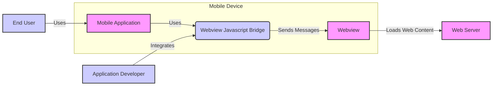
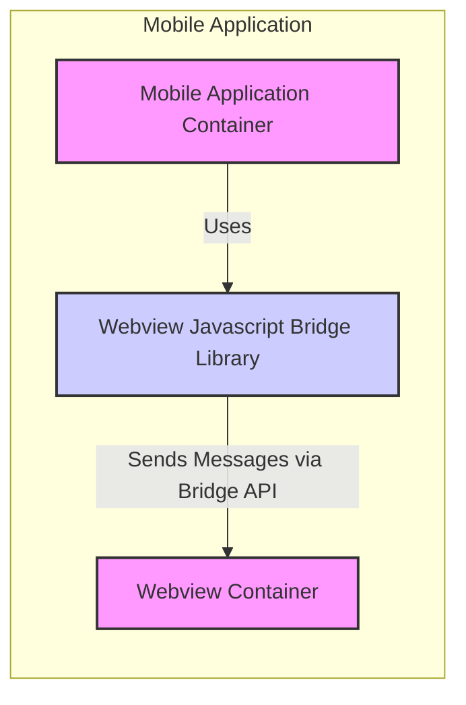

# BUSINESS POSTURE

- Business Priorities and Goals:
 - Priority: Efficient development of hybrid mobile applications.
 - Goal: Simplify communication between JavaScript code in webviews and native mobile application code.
 - Goal: Reduce development time and complexity for features requiring webview and native code interaction.
 - Goal: Enable code reuse across web and native layers in hybrid applications.

- Business Risks:
 - Business Risk: Security vulnerabilities in the bridge could be exploited to compromise the application and user data.
 - Business Risk:  Poor performance of the bridge could negatively impact the user experience of hybrid applications.
 - Business Risk:  Lack of maintainability or updates to the bridge could lead to compatibility issues and increased development costs in the long term.
 - Business Risk:  Adoption risk if the library is not well-documented or easy to use, hindering developer adoption and project success.

# SECURITY POSTURE

- Existing Security Controls:
 - security control: Code hosted on GitHub, providing version control and transparency. (Implemented: GitHub Repository)
 - security control: Open-source license (MIT License), allowing community review and contributions. (Implemented: LICENSE file in repository)
 - accepted risk: No formal security audit has been performed on the library.
 - accepted risk: Reliance on the security of the underlying webview and JavaScript execution environment.
 - accepted risk: Potential for misuse if not implemented correctly by developers using the library.

- Recommended Security Controls:
 - security control: Implement automated security scanning (SAST/DAST) in the build process to identify potential vulnerabilities.
 - security control: Establish a process for reporting and addressing security vulnerabilities.
 - security control: Provide clear security guidelines and best practices for developers using the library.
 - security control: Consider a formal security audit by a third-party security firm.

- Security Requirements:
 - Authentication:
  - requirement: The library itself does not handle user authentication. Authentication should be implemented at the application level, both in the native and webview contexts.
  - requirement: Secure communication channels should be used for transmitting any authentication tokens or credentials between webview and native code if necessary (though ideally, avoid passing sensitive credentials through the bridge).
 - Authorization:
  - requirement: The library should not bypass any authorization mechanisms implemented in the native application or webview.
  - requirement: Access control decisions should be made in the appropriate layer (native or webview) based on the application's security policy, not solely within the bridge.
 - Input Validation:
  - requirement: All data passed through the bridge from JavaScript to native code and vice versa must be thoroughly validated to prevent injection attacks (e.g., JavaScript injection, SQL injection if native code interacts with databases).
  - requirement: Implement input sanitization and encoding to mitigate cross-site scripting (XSS) risks if the bridge handles user-provided data.
 - Cryptography:
  - requirement: If sensitive data is transmitted through the bridge, it should be encrypted using appropriate cryptographic methods.
  - requirement: Utilize platform-provided secure storage mechanisms (e.g., Keychain on iOS) for storing any cryptographic keys or sensitive data used by the bridge or the application.
  - requirement: Ensure proper key management practices are followed if cryptography is implemented.

# DESIGN

## C4 CONTEXT

- Context Diagram Elements:
 - - Name: Mobile Application
   - Type: Software System
   - Description: The hybrid mobile application that integrates the Webview Javascript Bridge. This application is installed and runs on the end-user's mobile device.
   - Responsibilities: Provides the overall application functionality to the end-user, including features that rely on webview and native code interaction facilitated by the bridge. Manages application lifecycle, user interface, and interacts with device resources.
   - Security controls: Application-level security controls such as secure storage, secure communication with backend services, user authentication and authorization.
 - - Name: Webview Javascript Bridge
   - Type: Software System (Library)
   - Description: The library that enables communication between the native mobile application code and JavaScript code running within a webview. It acts as a message passing mechanism between these two environments.
   - Responsibilities: Facilitates sending messages and data between native code (Objective-C/Swift) and JavaScript in the webview. Handles message serialization and deserialization. Provides a consistent API for communication.
   - Security controls: Input validation and sanitization of messages passed through the bridge.  Minimal permissions required by the library itself. Adherence to secure coding practices in the library's implementation.
 - - Name: Webview
   - Type: Container (Runtime Environment)
   - Description: A component within the mobile application that displays web content (HTML, CSS, JavaScript). It executes JavaScript code and renders web pages.
   - Responsibilities: Rendering web content, executing JavaScript code, providing a web browser-like environment within the mobile application.
   - Security controls: Webview security policies enforced by the mobile operating system (e.g., Content Security Policy, origin restrictions).  Regular updates to the webview component to patch security vulnerabilities.
 - - Name: Application Developer
   - Type: Person
   - Description: Software developers who integrate the Webview Javascript Bridge into their hybrid mobile applications. They use the library to build features that require communication between webview and native code.
   - Responsibilities: Correctly integrate and utilize the Webview Javascript Bridge in their applications. Follow security best practices when using the library. Test and validate the functionality and security of the integrated bridge.
   - Security controls: Secure development practices, code reviews, security testing of the applications they build.
 - - Name: Web Server
   - Type: Software System
   - Description: A server that hosts the web content loaded into the webview. This could be a remote server or a local server packaged with the application.
   - Responsibilities: Serving web content (HTML, CSS, JavaScript) to the webview. Handling requests from the webview.
   - Security controls: Web server security configurations, secure communication protocols (HTTPS), input validation and output encoding on the server-side, authentication and authorization for accessing web content if required.
 - - Name: End User
   - Type: Person
   - Description: The user who uses the mobile application on their device. They interact with the application features, including those powered by the webview and the Javascript Bridge.
   - Responsibilities: Using the application as intended. Protecting their device and application from malware and unauthorized access.
   - Security controls: Device security settings, application permissions, user awareness of phishing and other social engineering attacks.

## C4 CONTAINER

- Container Diagram Elements:
 - - Name: Mobile Application Container
   - Type: Software Container (Native Application)
   - Description: Represents the native part of the hybrid mobile application. This is where the native application code (Objective-C/Swift) resides and executes.
   - Responsibilities: Native application logic, user interface elements implemented natively, interaction with device APIs, and integration with the Webview Javascript Bridge Library.
   - Security controls: Native OS security features, secure coding practices for native code, input validation for data received from the bridge.
 - - Name: Webview Javascript Bridge Library
   - Type: Software Container (Library/Framework)
   - Description: The compiled library (e.g., a framework or static library for iOS/macOS) that provides the API for communication between native code and webview JavaScript.
   - Responsibilities: Encapsulating the bridge logic, providing a well-defined API for sending and receiving messages, handling message serialization and deserialization, and managing communication channels.
   - Security controls: Secure coding practices in library development, minimal external dependencies, input validation within the library, and protection against tampering of the library itself.
 - - Name: Webview Container
   - Type: Software Container (Web Runtime Environment)
   - Description: The webview component within the mobile application that hosts and executes web content and JavaScript code.
   - Responsibilities: Rendering web pages, executing JavaScript, providing web APIs to JavaScript code, and managing the JavaScript context.
   - Security controls: Webview security sandbox, Content Security Policy (CSP) enforcement, JavaScript security restrictions, and regular webview updates.

## DEPLOYMENT

- Deployment Architecture Options:
 - Option 1: Library integrated directly into the mobile application binary. (Chosen for detailed description below)
 - Option 2: Library distributed as a dynamic framework or package and linked at runtime.

- Detailed Deployment Architecture (Option 1):

```mermaid
graph LR
    A["Developer Machine"] --> B["Build System"];
    B --> C["Mobile Application Binary (IPA/APK)"];
    C --> D["App Store/Play Store"];
    D --> E["End User Device"];

    subgraph "End User Device"
        E -- "Contains" --> F["Mobile OS"];
        F -- "Runs" --> G["Mobile Application"];
        G -- "Includes" --> H["Webview Javascript Bridge Library"];
    end

    style A fill:#f9f,stroke:#333,stroke-width:2px
    style B fill:#ccf,stroke:#333,stroke-width:2px
    style C fill:#f9f,stroke:#333,stroke-width:2px
    style D fill:#f9f,stroke:#333,stroke-width:2px
    style E fill:#ccf,stroke:#333,stroke-width:2px
    style F fill:#f9f,stroke:#333,stroke-width:2px
    style G fill:#f9f,stroke:#333,stroke-width:2px
    style H fill:#f9f,stroke:#333,stroke-width:2px
```

- Deployment Diagram Elements:
 - - Name: Developer Machine
   - Type: Infrastructure (Development Environment)
   - Description: The computer used by the application developer to write code, build, and test the mobile application and the integrated Webview Javascript Bridge Library.
   - Responsibilities: Development, code editing, local building and testing, version control.
   - Security controls: Developer machine security practices, access control, code repository access control, and malware protection.
 - - Name: Build System
   - Type: Infrastructure (Build Environment)
   - Description: An automated system (e.g., CI/CD pipeline) that compiles the mobile application code and the Webview Javascript Bridge Library into a deployable mobile application binary.
   - Responsibilities: Automated building, compilation, linking, testing, and packaging of the mobile application.
   - Security controls: Secure build environment, access control to build system, build process integrity, and security scanning during build.
 - - Name: Mobile Application Binary (IPA/APK)
   - Type: Software Artifact (Package)
   - Description: The packaged mobile application file (IPA for iOS, APK for Android) that contains the compiled application code, the integrated Webview Javascript Bridge Library, and other resources.
   - Responsibilities: Deployable application package ready for distribution.
   - Security controls: Code signing to ensure integrity and authenticity, and protection against tampering.
 - - Name: App Store/Play Store
   - Type: Infrastructure (Distribution Platform)
   - Description: Digital distribution platforms (Apple App Store, Google Play Store) where the mobile application binary is published and made available for end-users to download.
   - Responsibilities: Application distribution, hosting application binaries, and managing application updates.
   - Security controls: App store security reviews, malware scanning, and platform security measures.
 - - Name: End User Device
   - Type: Infrastructure (User Environment)
   - Description: The mobile device (smartphone, tablet) of the end-user where the mobile application is installed and run.
   - Responsibilities: Running the mobile application, providing the user interface, and executing application logic.
   - Security controls: Mobile OS security features, device security settings, and user-installed security applications.
 - - Name: Mobile OS
   - Type: Software (Operating System)
   - Description: The operating system running on the end-user's mobile device (e.g., iOS, Android).
   - Responsibilities: Managing device resources, providing system security features, and running applications.
   - Security controls: OS-level security features, sandboxing, permission management, and regular OS updates.
 - - Name: Mobile Application
   - Type: Software System (Application Instance)
   - Description: An instance of the mobile application running on the end-user's device, including the integrated Webview Javascript Bridge Library.
   - Responsibilities: Providing application functionality to the end-user.
   - Security controls: Application-level security controls and reliance on the security of the underlying OS and device.
 - - Name: Webview Javascript Bridge Library
   - Type: Software Component (Library Instance)
   - Description: An instance of the Webview Javascript Bridge Library running within the mobile application on the end-user's device.
   - Responsibilities: Facilitating communication between native code and webview JavaScript in the deployed application.
   - Security controls: Security controls implemented within the library and reliance on the security of the application and OS environment.

## BUILD

```mermaid
graph LR
    A["Developer"] --> B["Code Repository (GitHub)"];
    B --> C["CI/CD System (GitHub Actions)"];
    C --> D["Build Environment"];
    D --> E["Security Scanners (SAST/Linters)"];
    E --> F["Compiled Library & Application Code"];
    F --> G["Artifact Repository"];

    style A fill:#f9f,stroke:#333,stroke-width:2px
    style B fill:#ccf,stroke:#333,stroke-width:2px
    style C fill:#f9f,stroke:#333,stroke-width:2px
    style D fill:#ccf,stroke:#333,stroke-width:2px
    style E fill:#f9f,stroke:#333,stroke-width:2px
    style F fill:#f9f,stroke:#333,stroke-width:2px
    style G fill:#ccf,stroke:#333,stroke-width:2px
```

- Build Process Description:
 - 1. Developer commits code changes to the Code Repository (GitHub).
 - 2. CI/CD System (e.g., GitHub Actions, Jenkins) is triggered by code changes.
 - 3. CI/CD System sets up a Build Environment.
 - 4. Security Scanners (SAST, linters, dependency checkers) are executed in the Build Environment to identify potential vulnerabilities in the code and dependencies.
 - 5. Code is compiled and linked, resulting in Compiled Library & Application Code.
 - 6. Build artifacts (compiled library, application binary, etc.) are stored in an Artifact Repository.

- Build Process Security Controls:
 - security control: Secure Code Repository (GitHub) with access controls and audit logs. (Implemented: GitHub)
 - security control: CI/CD System (GitHub Actions) with secure configuration and access controls. (Implemented: GitHub Actions)
 - security control: Isolated and hardened Build Environment to prevent build poisoning. (Implemented: CI/CD System configuration)
 - security control: Automated Security Scanners (SAST, linters, dependency vulnerability scanning) integrated into the CI/CD pipeline. (Recommended: Integrate tools like SonarQube, Snyk, etc.)
 - security control: Dependency management and vulnerability scanning to ensure secure dependencies. (Recommended: Use dependency management tools and vulnerability databases)
 - security control: Code signing of build artifacts to ensure integrity and authenticity. (Implemented: Platform-specific code signing processes)
 - security control: Access control to the Artifact Repository to prevent unauthorized access to build artifacts. (Implemented: Artifact Repository access controls)

# RISK ASSESSMENT

- Critical Business Processes:
 - Critical Business Process: Reliable and secure communication between webview and native code in hybrid applications.
 - Critical Business Process: Correct functioning of hybrid application features that depend on the Javascript Bridge.
 - Critical Business Process: Protection of user data handled by hybrid applications using the bridge.

- Data Sensitivity:
 - Data Type: Messages passed between webview and native code.
 - Sensitivity: Sensitivity depends on the specific application. Messages could contain:
  - Low Sensitivity: UI commands, non-sensitive data synchronization.
  - Medium Sensitivity: User preferences, application state data.
  - High Sensitivity: User credentials, personal identifiable information (PII), financial data, health information.
 - Data at Rest: Data might be stored in webview local storage or native application storage. Sensitivity depends on the application and data type.
 - Data in Transit: Data transmitted between webview and native code within the application process.  Sensitivity depends on the application and data type.

# QUESTIONS & ASSUMPTIONS

- BUSINESS POSTURE Questions:
 - Question: What are the specific types of hybrid applications that are intended to use this library? (e.g., e-commerce, social media, enterprise apps)
 - Question: What is the expected scale of usage for applications using this library? (Number of users, transactions, etc.)
 - Assumption: The primary business goal is to enable efficient development of feature-rich hybrid applications.

- SECURITY POSTURE Questions:
 - Question: Are there any specific regulatory compliance requirements that applications using this library must adhere to? (e.g., GDPR, HIPAA, PCI DSS)
 - Question: What is the organization's risk tolerance for security vulnerabilities in third-party libraries?
 - Assumption: Security is a significant concern for applications using this library, especially if handling sensitive user data.

- DESIGN Questions:
 - Question: Are there any specific performance requirements for the message bridge? (Latency, throughput)
 - Question: Are there any specific platform compatibility requirements beyond iOS/macOS? (e.g., Android, Windows)
 - Assumption: The library is intended to be lightweight and efficient, minimizing performance overhead.
 - Assumption: The deployment model is primarily focused on direct integration into mobile application binaries.