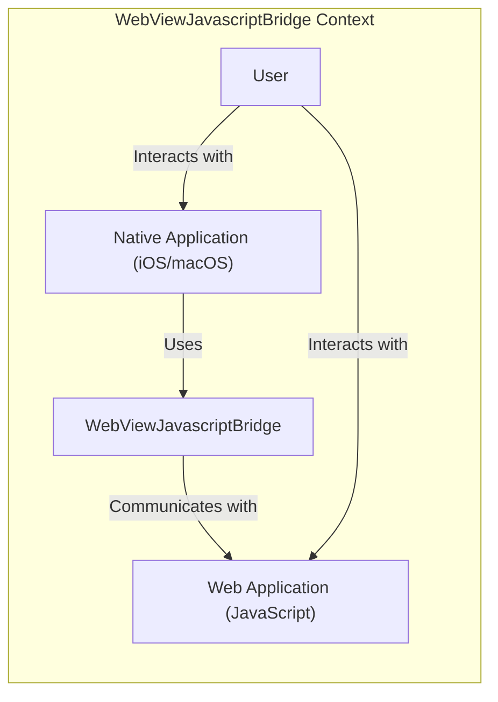
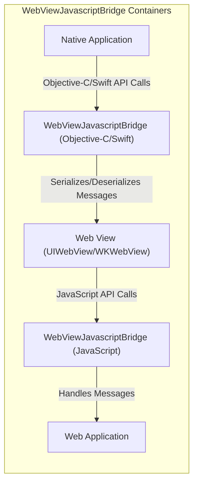
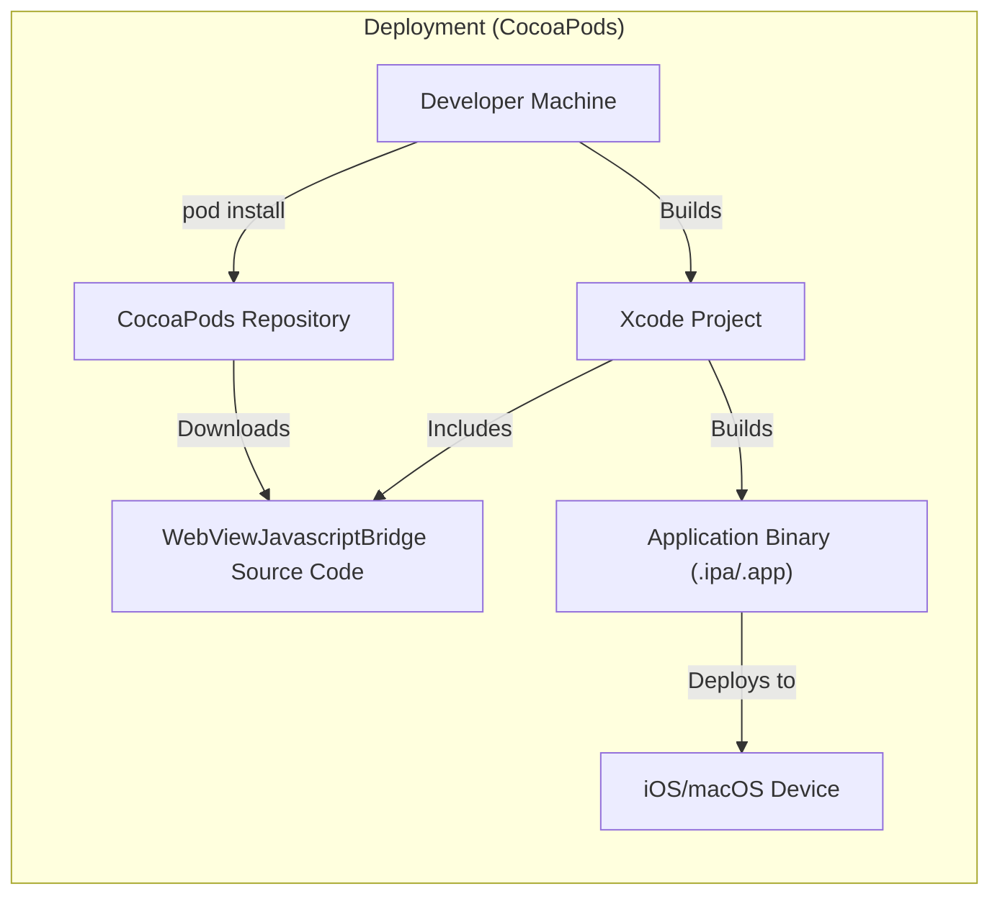
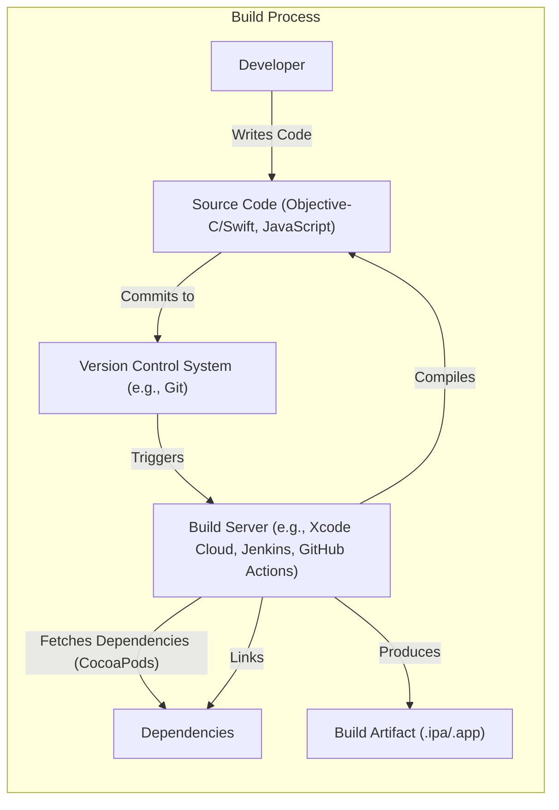

Okay, let's create a design document for the `WebViewJavascriptBridge` project.

# BUSINESS POSTURE

Business Priorities and Goals:

*   Enable seamless communication between native iOS/macOS code (Objective-C/Swift) and JavaScript code running within a `UIWebView` or `WKWebView`.
*   Provide a simple, easy-to-use API for developers to integrate this communication bridge into their applications.
*   Minimize the overhead and complexity of bridging the two execution environments.
*   Facilitate the development of hybrid applications that leverage both native and web technologies.
*   Reduce development time and effort for building features that require interaction between native and web components.

Most Important Business Risks:

*   Security vulnerabilities that could allow malicious JavaScript code to compromise the native application or access sensitive user data.
*   Compatibility issues with different iOS/macOS versions or web view implementations, leading to application instability or broken functionality.
*   Performance bottlenecks that could negatively impact the user experience, especially in complex hybrid applications.
*   Lack of maintainability and extensibility, making it difficult to adapt the bridge to future needs or platform changes.
*   Inadequate error handling, leading to unexpected application behavior or crashes.

# SECURITY POSTURE

Existing Security Controls:

*   security control: The project README mentions that the bridge should be used with caution when loading untrusted content. This suggests an awareness of the potential risks associated with web views.
*   security control: The bridge itself doesn't seem to implement any explicit security mechanisms like input validation or sandboxing. It relies on the inherent security features of the web view and the underlying operating system.

Accepted Risks:

*   accepted risk: The project accepts the risk that malicious JavaScript code could potentially exploit vulnerabilities in the web view or the bridge itself. This is acknowledged in the README.
*   accepted risk: The project accepts the risk that the bridge might not be fully compatible with all future iOS/macOS versions or web view implementations.

Recommended Security Controls:

*   security control: Implement strict input validation on both the native and JavaScript sides to prevent injection attacks.
*   security control: Consider using a Content Security Policy (CSP) within the web view to restrict the resources that can be loaded and executed.
*   security control: If possible, isolate the web view in a separate process to limit the impact of any potential exploits.
*   security control: Regularly review and update the bridge to address any security vulnerabilities that may be discovered.
*   security control: Provide clear documentation and guidelines on secure usage of the bridge, including best practices for handling untrusted content.

Security Requirements:

*   Authentication:
    *   The bridge itself does not handle authentication. Authentication should be managed by the native application or the web application independently. The bridge should only facilitate the transfer of authentication tokens or credentials if necessary, and this should be done securely.
*   Authorization:
    *   The bridge should not enforce any specific authorization policies. Authorization should be handled by the native application or the web application based on their respective roles and permissions. The bridge should only facilitate the transfer of authorization information if necessary, and this should be done securely.
*   Input Validation:
    *   All data passed between the native and JavaScript sides should be treated as untrusted and validated rigorously. This includes data types, lengths, formats, and allowed characters.
    *   Use a whitelist approach for validation, allowing only known good input and rejecting everything else.
    *   Implement input validation on both the native and JavaScript sides to provide defense in depth.
*   Cryptography:
    *   If sensitive data is transmitted through the bridge, it should be encrypted using appropriate cryptographic algorithms and protocols (e.g., TLS for network communication, AES for data at rest).
    *   Key management should be handled securely, following best practices for key generation, storage, and rotation.
*   Output Encoding:
    *   Data displayed in the webview should be properly encoded to prevent Cross-Site Scripting (XSS) vulnerabilities.

# DESIGN

## C4 CONTEXT

Element Descriptions:

*   Element:
    *   Name: User
    *   Type: Person
    *   Description: The end-user interacting with the application.
    *   Responsibilities: Interacts with the native application and the web application.
    *   Security Controls: N/A (External entity)

*   Element:
    *   Name: Native Application (iOS/macOS)
    *   Type: Software System
    *   Description: The native iOS or macOS application that embeds the web view.
    *   Responsibilities: Handles user interface, native functionality, and communication with the web view through the bridge.
    *   Security Controls: Input validation, authentication, authorization, secure storage of sensitive data.

*   Element:
    *   Name: WebViewJavascriptBridge
    *   Type: Software System
    *   Description: The library that facilitates communication between the native application and the web application.
    *   Responsibilities: Provides an API for sending and receiving messages between the native and JavaScript environments.
    *   Security Controls: Input validation (recommended), secure message handling.

*   Element:
    *   Name: Web Application (JavaScript)
    *   Type: Software System
    *   Description: The web application running within the web view.
    *   Responsibilities: Handles web-specific functionality and interacts with the native application through the bridge.
    *   Security Controls: Input validation, output encoding, Content Security Policy (recommended).

## C4 CONTAINER

Element Descriptions:

*   Element:
    *   Name: Native Application
    *   Type: Container
    *   Description: The native iOS or macOS application code.
    *   Responsibilities: Handles user interface, native functionality, and initiates communication with the web view.
    *   Security Controls: Input validation, authentication, authorization, secure storage of sensitive data.

*   Element:
    *   Name: WebViewJavascriptBridge (Objective-C/Swift)
    *   Type: Container
    *   Description: The Objective-C/Swift component of the bridge.
    *   Responsibilities: Provides an API for the native application to send and receive messages. Serializes and deserializes messages for transmission.
    *   Security Controls: Input validation (recommended), secure message handling.

*   Element:
    *   Name: Web View (UIWebView/WKWebView)
    *   Type: Container
    *   Description: The iOS/macOS web view component (either UIWebView or WKWebView).
    *   Responsibilities: Renders the web application and provides a JavaScript execution environment.
    *   Security Controls: Built-in web view security mechanisms, Content Security Policy (recommended).

*   Element:
    *   Name: WebViewJavascriptBridge (JavaScript)
    *   Type: Container
    *   Description: The JavaScript component of the bridge.
    *   Responsibilities: Provides an API for the web application to send and receive messages. Handles message routing and callbacks.
    *   Security Controls: Input validation (recommended).

*   Element:
    *   Name: Web Application
    *   Type: Container
    *   Description: The web application code running within the web view.
    *   Responsibilities: Handles web-specific functionality and interacts with the native application through the bridge.
    *   Security Controls: Input validation, output encoding, Content Security Policy (recommended).

## DEPLOYMENT

Possible Deployment Solutions:

1.  **CocoaPods:** The library can be integrated as a dependency using CocoaPods.
2.  **Carthage:** The library can be integrated as a dependency using Carthage.
3.  **Manual Integration:** The library source code can be directly added to the Xcode project.

Chosen Deployment Solution (CocoaPods):

Element Descriptions:

*   Element:
    *   Name: Developer Machine
    *   Type: Node
    *   Description: The developer's computer where the project is built.
    *   Responsibilities: Runs the build process, manages dependencies.
    *   Security Controls: Secure development environment, code signing.

*   Element:
    *   Name: CocoaPods Repository
    *   Type: Node
    *   Description: The central repository for CocoaPods dependencies.
    *   Responsibilities: Hosts the WebViewJavascriptBridge library.
    *   Security Controls: Repository security measures.

*   Element:
    *   Name: WebViewJavascriptBridge Source Code
    *   Type: Node
    *   Description: The source code of the WebViewJavascriptBridge library.
    *   Responsibilities: N/A (Artifact)
    *   Security Controls: N/A (Artifact)

*   Element:
    *   Name: Xcode Project
    *   Type: Node
    *   Description: The Xcode project for the native application.
    *   Responsibilities: Contains the application code and build settings.
    *   Security Controls: Code signing, build settings security.

*   Element:
    *   Name: Application Binary (.ipa/.app)
    *   Type: Node
    *   Description: The compiled application binary.
    *   Responsibilities: N/A (Artifact)
    *   Security Controls: Code signing.

*   Element:
    *   Name: iOS/macOS Device
    *   Type: Node
    *   Description: The target device where the application is deployed.
    *   Responsibilities: Runs the application.
    *   Security Controls: Operating system security features.

## BUILD

Build Process Description:

1.  **Code Development:** Developers write the Objective-C/Swift and JavaScript code for the native application and the web application, respectively.
2.  **Version Control:** The code is committed to a version control system (e.g., Git).
3.  **Build Server:** A build server (e.g., Xcode Cloud, Jenkins, GitHub Actions) is triggered by changes in the version control system.
4.  **Dependency Management:** The build server fetches the necessary dependencies, including the WebViewJavascriptBridge library (e.g., using CocoaPods).
5.  **Compilation:** The build server compiles the Objective-C/Swift and JavaScript code.
6.  **Linking:** The build server links the compiled code with the dependencies.
7.  **Artifact Creation:** The build server produces the build artifact, which is the application binary (.ipa or .app file).

Security Controls in Build Process:

*   security control: **Version Control:** Using a version control system (e.g., Git) allows tracking changes, identifying potential vulnerabilities introduced in specific commits, and reverting to previous versions if necessary.
*   security control: **Dependency Management:** Using a dependency manager (e.g., CocoaPods) ensures that the correct versions of libraries are used and helps manage potential vulnerabilities in third-party code.  Regularly auditing and updating dependencies is crucial.
*   security control: **Build Server Security:** The build server should be secured to prevent unauthorized access and tampering with the build process.
*   security control: **Code Signing:** The application binary should be code-signed to ensure its authenticity and integrity.
*   security control: **Static Analysis (Recommended):** Integrate static analysis tools (e.g., linters, SAST scanners) into the build process to identify potential security vulnerabilities in the code before deployment.
*   security control: **Supply Chain Security (Recommended):** Verify the integrity of dependencies and build tools to prevent supply chain attacks.

# RISK ASSESSMENT

Critical Business Processes:

*   **User Interaction:** The primary business process is enabling seamless user interaction between the native application and the web content. Any disruption to this communication would directly impact the user experience.
*   **Data Exchange:** The bridge facilitates data exchange between the native and web environments. Protecting the confidentiality, integrity, and availability of this data is crucial.
*   **Hybrid Feature Functionality:** Many hybrid applications rely on the bridge to enable specific features that require interaction between native and web components. The availability and reliability of these features are critical.

Data Sensitivity:

*   **Potentially Sensitive Data:** The data transmitted through the bridge could range from non-sensitive information (e.g., UI state) to highly sensitive data (e.g., user credentials, personal information, financial data). The sensitivity depends entirely on the specific application and the data it handles.
*   **Data Classification:** It's essential to classify the data handled by the bridge based on its sensitivity level (e.g., public, internal, confidential, restricted). This classification should inform the security controls applied to protect the data.

# QUESTIONS & ASSUMPTIONS

Questions:

*   What specific types of data will be transmitted through the bridge in typical use cases?
*   Are there any existing security policies or guidelines for hybrid application development within the organization?
*   What are the target iOS/macOS versions and web view implementations that need to be supported?
*   Are there any performance requirements or constraints for the bridge?
*   What level of error handling and logging is required?
*   Is there a mechanism for updating the WebViewJavascriptBridge library in deployed applications?

Assumptions:

*   BUSINESS POSTURE: The organization has a moderate risk appetite, balancing the need for rapid development with the importance of security.
*   SECURITY POSTURE: The existing security controls are minimal, relying primarily on the inherent security features of the platform.
*   DESIGN: The bridge is primarily used for relatively simple data exchange and function calls between the native and web environments. The web content loaded in the webview is at least partially trusted.