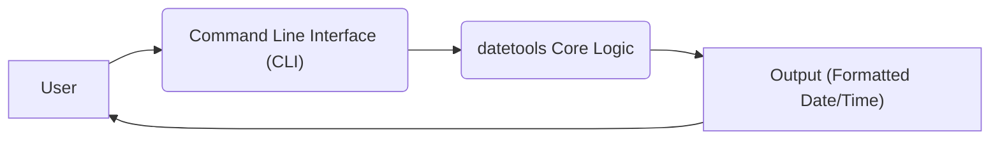
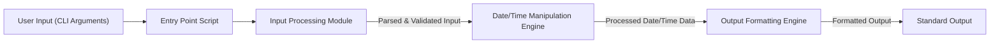
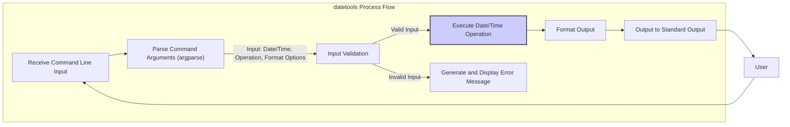

# Project Design Document: datetools

**Version:** 1.1
**Date:** October 26, 2023
**Author:** AI Software Architect

## 1. Introduction

This document details the design for the `datetools` project, a command-line utility designed for efficient manipulation and conversion of date and time information. This document serves as a foundational blueprint, outlining the system's architecture, core components, and data flow. It is specifically intended to be used as the basis for subsequent threat modeling activities. The project's foundation is the publicly accessible repository: [https://github.com/matthewyork/datetools](https://github.com/matthewyork/datetools).

## 2. Goals and Objectives

The primary goals guiding the development of `datetools` are:

* To offer a user-friendly and intuitive command-line interface for performing common date and time operations.
* To provide comprehensive support for a wide range of input and output formats for date and time data.
* To implement robust functionalities for date/time calculations, adjustments, and transformations.
* To ensure ease of installation and cross-platform usability across various operating systems.

## 3. High-Level Design

The `datetools` project is architected as a self-contained command-line application. The central processing logic is encapsulated within a Python script that receives user input from the command line and generates the processed date/time information as output.

* **User:** The individual interacting with the tool by entering commands in the terminal.
* **Command Line Interface (CLI):** The interface responsible for parsing the arguments and options provided by the user.
* **datetools Core Logic:** The central component containing the Python code that implements the date/time manipulation and conversion functionalities.
* **Output:** The resulting processed date and time information, presented to the user in the specified format.

## 4. Detailed Design

### 4.1. Components

* **Entry Point Script (`datetools.py` or similar):**
    * This is the primary executable script, most likely a Python file.
    * It manages the parsing of command-line arguments, typically using a library like `argparse`.
    * It orchestrates the execution flow by invoking the appropriate functions within the core logic based on the parsed user input.
    * It handles the formatting and presentation of the output to the user.

* **Core Logic Modules (Organization may vary; could be within the main script or in separate modules):**
    * **Input Processing Module:**
        * Responsible for the initial processing of user-provided date/time input.
        * Includes validation to ensure the input conforms to expected formats.
        * Supports parsing of various date/time representations (e.g., ISO 8601 strings, natural language inputs, Unix timestamps).
        * Implements error handling for invalid or malformed input.
    * **Date/Time Manipulation Engine:**
        * Contains the core functions for performing operations on date and time objects.
        * Offers functionalities such as: adding or subtracting time units (days, hours, etc.), calculating time differences between dates, and converting between different timezones.
        * Likely leverages Python's built-in `datetime` module and potentially external libraries like `dateutil` for advanced parsing.
    * **Output Formatting Engine:**
        * Handles the conversion of processed date/time data into the desired output format.
        * Provides flexibility in output formatting based on user-specified patterns or predefined formats.

### 4.2. Data Flow

The typical sequence of data flow within `datetools` is as follows:

1. The user initiates the `datetools` command in the terminal, providing arguments and options specifying the desired operation and date/time values.
2. The operating system executes the `datetools` script.
3. The **Entry Point Script** receives the command-line arguments passed by the user.
4. The **Entry Point Script** utilizes the **Input Processing Module** to interpret and validate the input date/time values and the requested operations.
5. Upon successful parsing, the **Entry Point Script** calls the relevant functions within the **Date/Time Manipulation Engine** based on the parsed user input.
6. The **Date/Time Manipulation Engine** performs the specified operations on the provided date/time data.
7. The resulting processed date/time information is then passed to the **Output Formatting Engine**.
8. The **Output Formatting Engine** formats the data according to the user's specified output format or a default format if none is provided.
9. Finally, the **Entry Point Script** displays the formatted output to the standard output (the user's terminal).

### 4.3. Core Functionalities

Based on common date/time utility features, `datetools` likely provides the following core functionalities:

* **Date/Time Format Conversion:**
    * Ability to convert date and time representations between various formats (e.g., converting `YYYY-MM-DD` to `MM/DD/YYYY` or `Unix timestamps` to human-readable dates).
* **Date/Time Arithmetic and Calculation:**
    * Functionality to add or subtract specific time units (days, weeks, months, years, hours, minutes, seconds) from a given date/time.
    * Calculation of the duration or difference between two specified dates or times.
* **Display Current Date/Time:**
    * A simple command or option to display the current date and time in a specified or default format.
* **Timezone Handling and Conversion:**
    * Support for converting date and times between different timezones.
    * Potentially allowing users to specify input and output timezones.
* **Customizable Output Formatting:**
    * Allowing users to define the output format using format strings or predefined format specifiers.

## 5. Deployment Architecture

`datetools` is intended for deployment as a standalone command-line utility. Common deployment strategies include:

* **Direct Execution:**
    * Users can clone the repository and execute the main script directly using a Python interpreter, provided that Python and any necessary dependencies are installed on their system.
* **Package Installation via `pip`:**
    * The project can be packaged and distributed as a Python package via `pip`. This enables users to install it easily using `pip install datetools`, requiring a `setup.py` file at the root of the project.
* **Containerization with Docker:**
    * A Dockerfile can be created to encapsulate the application and its dependencies within a Docker image. This facilitates consistent execution across different environments and simplifies deployment.

## 6. Data Flow Diagram (Detailed)

* **Receive Command Line Input:** The `datetools` script receives input from the user via command-line arguments.
* **Parse Command Arguments (argparse):** The `argparse` library is used to parse the command-line arguments into a structured and usable format.
* **Input Validation:** The parsed input is rigorously validated to ensure it conforms to expected data types, formats, and ranges.
* **Execute Date/Time Operation:** The core logic performs the requested date and time manipulation or conversion based on the validated input.
* **Generate and Display Error Message:** If the input is invalid, a clear and informative error message is generated and displayed to the user.
* **Format Output:** The processed date and time information is formatted according to the user's specifications or a default format.
* **Output to Standard Output:** The formatted output is presented to the user in the terminal.

## 7. Security Considerations

This section outlines potential security considerations for the `datetools` project, which will be further analyzed during the threat modeling process.

* **Robust Input Validation:**
    * Implement stringent validation for all user-supplied input to prevent injection vulnerabilities (e.g., command injection) and ensure the application handles unexpected input gracefully. This includes validating date/time formats, ranges, and ensuring no malicious characters are present.
* **Secure Dependency Management:**
    * Maintain an up-to-date list of project dependencies in a `requirements.txt` file. Regularly audit and update these dependencies to patch known security vulnerabilities. Utilize tools like `pip check` or vulnerability scanners to identify potential issues.
* **Careful Error Handling:**
    * Implement proper error handling to prevent the leakage of sensitive information through error messages. Avoid displaying internal details or stack traces to the user. Provide generic but informative error messages.
* **Prevention of Code Injection:**
    * Exercise extreme caution when constructing shell commands or executing external processes based on user input. Sanitize user input thoroughly to prevent code injection attacks. Avoid using functions like `eval()` or `exec()` with untrusted input.
* **Output Sanitization:**
    * Ensure that the application's output does not inadvertently expose sensitive information or data that could be misused.
* **Protection Against Denial-of-Service (DoS):**
    * Consider potential scenarios where a user could provide input that causes the application to consume excessive resources (e.g., extremely large date ranges for calculations). Implement safeguards to prevent DoS attacks.

## 8. Assumptions and Constraints

* **Primary Language:** The project is assumed to be primarily implemented using the Python programming language.
* **Command-Line Interface Focus:** The primary mode of user interaction is through a command-line interface.
* **Standalone Functionality:** The core functionality is assumed to be self-contained and does not depend on external network services or databases for its primary operations.
* **Standard Python Libraries:** The project likely leverages standard Python libraries such as `datetime` and `argparse`.

## 9. Future Considerations

* **Expanded Functionality:**
    * Incorporate support for more advanced date and time calculations, such as working day calculations, business hour considerations, and handling recurring events.
    * Explore the possibility of adding localization features to support different regional date and time formats and language settings.
    * Consider integrating with external calendar services or data sources.
* **Graphical User Interface (GUI):**
    * Investigate the feasibility of developing a graphical user interface (GUI) for users who prefer a visual interaction method. This could be implemented using libraries like Tkinter, PyQt, or Kivy.
* **Plugin Architecture:**
    * Design a plugin architecture to allow users or developers to extend the functionality of `datetools` with custom operations or format support.
* **Improved Error Reporting:**
    * Enhance error reporting with more specific and actionable messages, potentially including suggestions for correcting invalid input.

This revised design document provides a more detailed and comprehensive overview of the `datetools` project's architecture, functionality, and security considerations. It aims to serve as a robust foundation for understanding the system and effectively conducting subsequent threat modeling activities.
