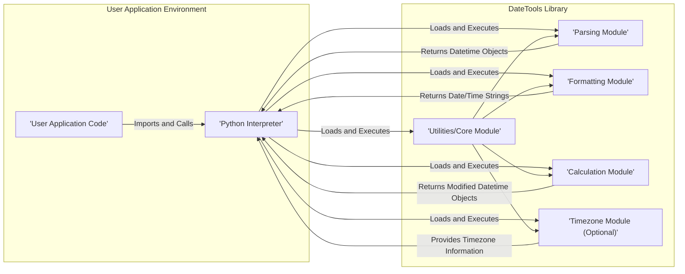
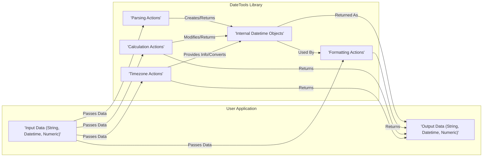

## Project Design Document: DateTools Library - Improved

**Document Version:** 1.1
**Date:** October 26, 2023
**Author:** AI Software Architect

### 1. Introduction

This document provides an enhanced and more detailed design overview of the `datetools` Python library project located at [https://github.com/matthewyork/datetools](https://github.com/matthewyork/datetools). This revised document aims to provide a stronger foundation for subsequent threat modeling activities by offering a clearer understanding of the system's architecture, components, data flow, and potential security considerations. The improvements focus on providing more granular detail and context for each aspect of the library.

### 2. Project Overview

The `datetools` project is a focused Python library designed to offer a curated set of utility functions specifically for manipulating dates and times. Based on the structure and likely purpose of such a library, it is expected to provide functionalities including, but not limited to:

*   **Flexible Date Parsing:**  Accepting date strings in various common formats and converting them into Python `datetime` objects. This might involve handling different separators, date component orders, and textual representations of months.
*   **Robust Date Formatting:**  Converting Python `datetime` objects into string representations according to specified formats. This includes control over the presentation of year, month, day, hour, minute, second, and potentially fractional seconds.
*   **Date and Time Arithmetic:** Performing calculations such as adding or subtracting days, weeks, months, years, hours, minutes, and seconds from a given date or time. This needs to handle edge cases like crossing month and year boundaries.
*   **Time Zone Awareness (Potential):**  Depending on the library's scope, it might include functionalities for working with time zones, such as converting between different time zones or obtaining the current time in a specific time zone. This aspect requires verification from the codebase.
*   **Comparison Operations:**  Facilitating the comparison of two dates or times to determine which is earlier or later.

The primary intended users of this library are Python developers who need a reliable and convenient way to handle date and time operations within their applications or scripts, avoiding the need to implement these functionalities from scratch.

### 3. System Architecture

The `datetools` library is fundamentally a collection of Python modules and functions designed to operate within the execution environment of a Python interpreter. Its architecture is primarily logical, focusing on the organization of its functionalities.

#### 3.1. Logical View

The core logical component is the `datetools` library itself, which is likely structured into several distinct modules, each encapsulating a specific set of related date and time operations. These modules could be organized as follows:

*   **`parsing` Module:** Responsible for handling the conversion of date and time strings into Python `datetime` objects. This module would contain functions to parse various date and time formats.
*   **`formatting` Module:**  Dedicated to converting Python `datetime` objects into string representations based on specified format patterns.
*   **`calculations` Module:**  Contains functions for performing arithmetic operations on dates and times, such as adding or subtracting time intervals.
*   **`timezone` Module (Conditional):**  If the library supports time zones, this module would provide functionalities for working with time zone information, conversions, and potentially obtaining current times in different zones.
*   **`utils` or `core` Module:**  May contain foundational or helper functions used by other modules within the library.

#### 3.2. Deployment View

The `datetools` library is designed for deployment as a dependency within other Python projects. The standard deployment process involves:

*   A developer utilizes a Python package installer, such as `pip`, to download and install the `datetools` library from a package repository like the Python Package Index (PyPI).
*   Within their Python codebase, the developer uses the `import` statement to make the functionalities of the `datetools` library available.
*   The developer then instantiates objects or calls functions from the imported `datetools` library to perform the desired date and time manipulations. The library operates within the memory space and execution context of the user's application.

#### 3.3. Component Diagram

### 4. Data Flow

The primary data flow within the `datetools` library revolves around the manipulation of date and time information.

1. **Input Phase:** The user application provides date and time data to the `datetools` library's functions. This input can take several forms:
    *   **String Input:**  Textual representations of dates and times in various formats (e.g., "YYYY-MM-DD", "MM/DD/YYYY HH:MM:SS").
    *   **`datetime` Objects:** Instances of Python's built-in `datetime` or `date` or `time` classes.
    *   **Numerical Input (Less Common):**  Potentially, timestamps (seconds since the epoch) or other numerical representations of dates or times.

2. **Processing Phase:** The `datetools` library processes the input data using its internal modules, depending on the function called. This processing may involve:
    *   **Parsing:** The `parsing` module attempts to interpret input strings and convert them into `datetime` objects. This involves pattern matching and validation.
    *   **Calculation:** The `calculations` module performs arithmetic operations on `datetime` objects, creating new `datetime` objects representing the result.
    *   **Formatting:** The `formatting` module takes `datetime` objects and converts them into string representations according to specified format codes.
    *   **Time Zone Handling:** The `timezone` module (if present) performs conversions between time zones or retrieves time zone information.

3. **Output Phase:** The `datetools` library returns the processed date and time information back to the calling user application. The output can be:
    *   **String Output:**  Formatted date and time strings.
    *   **`datetime` Objects:**  New or modified `datetime` objects.
    *   **Numerical Output:**  Potentially time differences (e.g., `timedelta` objects) or timestamps.

#### 4.1. Detailed Data Flow Diagram

### 5. Security Considerations (Pre-Threat Modeling)

While `datetools` is primarily a utility library and doesn't inherently handle sensitive user data or direct external interactions, several security considerations are crucial for threat modeling:

*   **Input Validation Vulnerabilities:**  Insufficient or incorrect validation of input date/time strings can lead to vulnerabilities. Maliciously crafted strings could cause parsing errors, exceptions, or potentially exploit underlying parsing mechanisms (e.g., ReDoS if regular expressions are used poorly).
*   **Dependency Chain Risks:**  The security of `datetools` is tied to its dependencies. Vulnerabilities in any of its dependencies could be exploited by attackers targeting applications using `datetools`. Regular dependency updates and security audits are essential.
*   **Error Handling and Information Disclosure:**  How the library handles errors and exceptions is important. Verbose error messages that reveal internal implementation details or system paths could provide valuable information to attackers. Error handling should be robust and avoid exposing sensitive information.
*   **Integer Overflow/Underflow in Calculations:**  Date and time calculations, especially when dealing with large time spans or specific edge cases, could be susceptible to integer overflow or underflow. This could lead to incorrect results or unexpected behavior in applications relying on the library.
*   **Time Zone Data Integrity:** If the library handles time zones, the accuracy and integrity of the underlying time zone data are critical. Outdated or manipulated time zone data could lead to incorrect time representations and potentially security vulnerabilities in time-sensitive applications.
*   **Regular Expression Denial of Service (ReDoS):** If the parsing module uses regular expressions, poorly constructed expressions can be vulnerable to ReDoS attacks. An attacker could provide a specially crafted input string that causes the regex engine to consume excessive CPU resources, leading to a denial of service.
*   **Locale Handling Issues:** If the library supports locale-specific date/time formats, incorrect or insecure handling of locale data could lead to vulnerabilities.

### 6. Assumptions and Constraints

*   The `datetools` library is primarily intended for use as a dependency within Python applications that are assumed to operate within a reasonably secure environment.
*   The library itself does not handle user authentication, authorization, or encryption of data.
*   The library's primary function is the manipulation of date and time data; it does not directly interact with external networks, databases, or file systems in a typical usage scenario.
*   The security focus is on ensuring the correctness, robustness, and secure implementation of the date and time manipulation logic to prevent unintended consequences in consuming applications.

### 7. Future Considerations

Potential future enhancements and expansions of the `datetools` library could include:

*   **Extended Date/Time Functionality:** Adding support for more specialized date and time operations, such as business day calculations, recurring events, or handling specific calendar systems.
*   **Performance Optimizations:**  Improving the efficiency of parsing, formatting, and calculation operations, especially for handling large volumes of date/time data.
*   **Wider Format Support:** Expanding the range of supported input and output date/time formats to accommodate more diverse data sources and requirements.
*   **Internationalization and Localization (I18n/L10n):**  Providing more comprehensive support for different locales and cultural conventions in date and time representation. This would require careful consideration of locale data sources and potential vulnerabilities.
*   **Integration with Other Libraries:**  Offering seamless integration with other popular Python libraries for data manipulation or scientific computing.

These potential future developments should be considered during future threat modeling exercises, as they might introduce new attack surfaces or security considerations. For example, integrating with external data sources for locale information could introduce new dependencies and potential vulnerabilities.

This improved design document provides a more detailed and nuanced understanding of the `datetools` library, offering a stronger foundation for identifying and mitigating potential security risks during the threat modeling process. The enhanced descriptions and diagrams aim to provide greater clarity and context for each aspect of the library's design and operation.