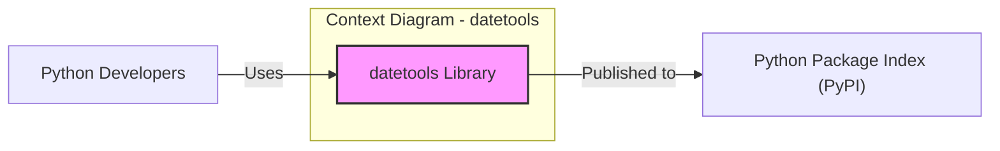
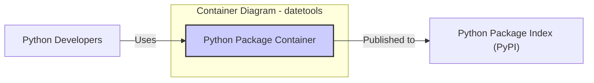
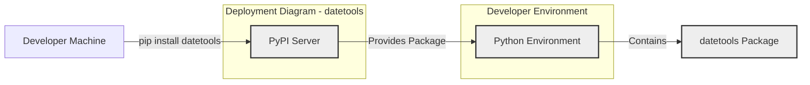
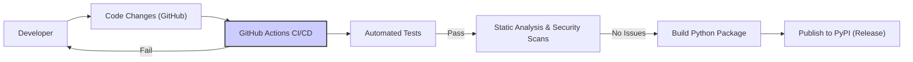

# BUSINESS POSTURE

- Business Priorities and Goals:
  - The primary goal of the datetools project is to provide a reliable and easy-to-use Python library for handling date and time manipulations.
  - It aims to simplify common date and time operations for Python developers, reducing development time and potential errors in date/time calculations within applications.
  - The project prioritizes code clarity, correctness, and maintainability to ensure long-term usability and stability for its users.
- Business Risks:
  - Incorrect date and time calculations due to bugs in the library could lead to errors in applications that depend on datetools, potentially impacting business logic and data integrity.
  - Security vulnerabilities, although less likely in a date/time library, could still be introduced and exploited if not properly addressed, potentially affecting applications using the library.
  - Lack of ongoing maintenance and updates could result in incompatibility with newer Python versions or unaddressed bugs, diminishing the library's value and potentially creating security risks over time.
  - Poor performance in date and time operations could negatively impact the performance of applications using datetools.

# SECURITY POSTURE

- Existing Security Controls:
  - security control: Repository hosted on GitHub, leveraging GitHub's access control for repository contributors. Implemented in: GitHub repository settings.
  - security control: Open-source project, allowing community review and contributions, which can indirectly contribute to identifying and addressing potential issues. Implemented in: Open-source nature of the project.
- Accepted Risks:
  - accepted risk: As an open-source project, there is a reliance on community contributions for security reviews and vulnerability identification, which may not be as comprehensive as dedicated security audits.
  - accepted risk: Potential for undiscovered vulnerabilities to exist in the code, as with any software project.
  - accepted risk: Risk of dependency vulnerabilities if the project starts to depend on other libraries in the future.
- Recommended Security Controls:
  - security control: Implement automated unit and integration tests to ensure the correctness of date and time calculations and prevent regressions.
  - security control: Integrate static analysis tools (e.g., linters, bandit for Python) into the development and CI/CD pipeline to automatically detect potential code quality and security issues.
  - security control: Establish a process for reviewing and addressing security vulnerabilities reported by the community or identified through automated tools.
  - security control: Consider using a dependency scanning tool if the project starts to include external dependencies to monitor for known vulnerabilities in those dependencies.
- Security Requirements:
  - Authentication: Not directly applicable to a library. Authentication is relevant for systems that use this library, but not for the library itself.
  - Authorization: Not directly applicable to a library. Authorization is relevant for systems that use this library, but not for the library itself.
  - Input Validation:
    - Requirement: Implement input validation for all functions that accept date and time inputs to ensure data is in the expected format and range. This will prevent unexpected behavior and potential errors.
    - Implementation: Within the Python code of the library, using input validation techniques like type checking, format validation, and range checks.
  - Cryptography: Not directly applicable to this library as it does not handle sensitive data or require encryption or decryption functionalities. If cryptography is introduced in the future, appropriate security requirements will need to be defined.

# DESIGN

## C4 CONTEXT

- Context Diagram Elements:
  - - Name: Python Developers
    - Type: Person
    - Description: Software developers who use the datetools library in their Python projects to perform date and time operations.
    - Responsibilities: Integrate the datetools library into their applications, utilize its functionalities for date and time manipulations.
    - Security controls: Responsible for securely integrating and using the library within their applications, following secure coding practices in their own projects.
  - - Name: datetools Library
    - Type: Software System
    - Description: A Python library providing functionalities for date and time manipulations. It is the subject of this design document.
    - Responsibilities: Provide accurate and reliable date and time manipulation functions, be easy to use and integrate, be well-documented and maintained.
    - Security controls: Input validation, automated testing, static analysis, secure development practices.
  - - Name: Python Package Index (PyPI)
    - Type: External System
    - Description: The public repository for Python packages. datetools library is published to PyPI to be distributed and made available to Python developers.
    - Responsibilities: Host and distribute Python packages, provide package installation mechanisms (pip).
    - Security controls: PyPI implements security controls for package uploads and distribution, including malware scanning and package integrity checks.

## C4 CONTAINER

- Container Diagram Elements:
  - - Name: Python Package Container
    - Type: Container
    - Description: Represents the datetools library packaged as a Python package. This is the deployable unit of the datetools library.
    - Responsibilities: Encapsulate the datetools library code, provide installation instructions and metadata, be distributable via PyPI.
    - Security controls: Package integrity checks during build and publishing, static analysis of the code within the package.
  - - Name: Python Developers
    - Type: Person
    - Description: Same as in Context Diagram.
    - Responsibilities: Same as in Context Diagram.
    - Security controls: Same as in Context Diagram.
  - - Name: Python Package Index (PyPI)
    - Type: External System
    - Description: Same as in Context Diagram.
    - Responsibilities: Same as in Context Diagram.
    - Security controls: Same as in Context Diagram.

## DEPLOYMENT

- Deployment Architecture:
  - The datetools library is deployed as a Python package to the Python Package Index (PyPI).
  - Developers install the library using pip, which downloads and installs the package from PyPI into their Python environments.
  - There is no server-side deployment for this library; it is a client-side library integrated into other Python applications.

- Deployment Diagram Elements:
  - - Name: PyPI Server
    - Type: Infrastructure
    - Description: Represents the servers hosting the Python Package Index (PyPI).
    - Responsibilities: Store and serve Python packages, handle package installation requests.
    - Security controls: PyPI server infrastructure security, package integrity verification, malware scanning.
  - - Name: Developer Machine
    - Type: Infrastructure
    - Description: The local computer of a Python developer where they develop and run Python applications.
    - Responsibilities: Host the developer's Python environment, execute pip commands to install packages.
    - Security controls: Security of the developer's machine, including operating system security, antivirus, and network security.
  - - Name: Python Environment
    - Type: Environment
    - Description: A Python runtime environment on the developer's machine where Python packages are installed and applications are executed.
    - Responsibilities: Provide the runtime environment for Python applications, manage installed packages.
    - Security controls: Package management security (pip), environment isolation (virtual environments).
  - - Name: datetools Package
    - Type: Software Artifact
    - Description: The datetools Python package installed in the developer's Python environment.
    - Responsibilities: Provide date and time functionalities to Python applications running in the environment.
    - Security controls: Security controls inherited from the build and development process, input validation within the library code.

## BUILD

- Build Process:
  - Developer writes Python code for the datetools library.
  - Developer runs unit and integration tests locally to ensure code correctness.
  - Developer builds the Python package (e.g., using setuptools).
  - Developer may use static analysis tools locally to check for code quality and potential issues.
  - Automated CI/CD pipeline (e.g., GitHub Actions) is recommended for:
    - Running unit and integration tests.
    - Performing static analysis and security scans.
    - Building the Python package.
    - Publishing the package to PyPI (upon release).

- Build Process Elements:
  - - Name: Developer
    - Type: Person
    - Description: Software developer contributing to the datetools project.
    - Responsibilities: Write code, run local tests, commit code changes, initiate releases.
    - Security controls: Secure coding practices, code review (if applicable), secure development environment.
  - - Name: Code Changes (GitHub)
    - Type: Software Artifact
    - Description: Code changes committed to the GitHub repository.
    - Responsibilities: Store code changes, track version history, trigger CI/CD pipelines.
    - Security controls: GitHub repository access controls, branch protection, commit signing (optional).
  - - Name: GitHub Actions CI/CD
    - Type: Automation System
    - Description: Automated CI/CD pipeline configured in GitHub Actions to build, test, and publish the library.
    - Responsibilities: Automate build, test, static analysis, security scans, and package publishing.
    - Security controls: Secure CI/CD pipeline configuration, secrets management for PyPI credentials, build environment security.
  - - Name: Automated Tests
    - Type: Automated Process
    - Description: Unit and integration tests executed by the CI/CD pipeline.
    - Responsibilities: Verify code correctness, prevent regressions, ensure functionality meets requirements.
    - Security controls: Test code quality, test coverage, secure test data management.
  - - Name: Static Analysis & Security Scans
    - Type: Automated Process
    - Description: Static analysis tools and security scanners run by the CI/CD pipeline.
    - Responsibilities: Identify potential code quality issues, security vulnerabilities, and adherence to coding standards.
    - Security controls: Tool configuration, vulnerability reporting, integration with CI/CD pipeline.
  - - Name: Build Python Package
    - Type: Automated Process
    - Description: Process of creating the Python package (e.g., using setuptools) in the CI/CD pipeline.
    - Responsibilities: Package the library code and metadata into a distributable format.
    - Security controls: Build process integrity, verification of build artifacts.
  - - Name: Publish to PyPI (Release)
    - Type: Automated Process
    - Description: Publishing the built Python package to PyPI during a release process.
    - Responsibilities: Make the library available to Python developers via PyPI.
    - Security controls: Secure PyPI credentials management, package signing (optional), PyPI security controls.

# RISK ASSESSMENT

- Critical Business Processes:
  - For the datetools library itself, there are no direct critical business processes. However, applications that rely on datetools for date and time calculations may have critical business processes that depend on the library's correctness and reliability. Examples include financial systems, scheduling applications, logging systems, and data processing pipelines where accurate time-based operations are essential.
- Data Sensitivity:
  - The datetools library primarily processes date and time data. In general, date and time data itself is not considered highly sensitive. However, the sensitivity of the data depends on the context of the applications using the library. If datetools is used in applications that handle sensitive personal information or critical operational data, then the correctness and reliability of date and time operations become crucial for maintaining data integrity and security within those applications. Incorrect date/time handling could indirectly lead to security or privacy breaches in those dependent systems.

# QUESTIONS & ASSUMPTIONS

- Questions:
  - What is the intended scope and complexity of the datetools library? Is it meant to be a simple utility library or a more comprehensive date/time manipulation tool?
  - Are there any specific performance requirements for the library?
  - Are there any plans to add external dependencies to the library in the future?
  - What is the expected frequency of updates and maintenance for the library?
  - Is there a dedicated security contact or process for reporting and addressing security vulnerabilities in the library?
- Assumptions:
  - Assumption: The datetools library is intended to be a general-purpose, open-source Python library for date and time manipulations.
  - Assumption: The primary focus is on providing correct, reliable, and easy-to-use date/time functionalities.
  - Assumption: Security is considered important, but the library is not expected to handle highly sensitive data directly. Security efforts will focus on preventing vulnerabilities and ensuring code quality.
  - Assumption: The project will be maintained by the author and potentially community contributors on a best-effort basis.
  - Assumption: The library will be distributed via PyPI as the primary distribution channel.