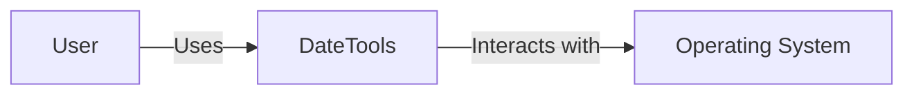
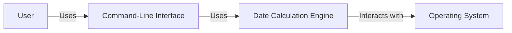
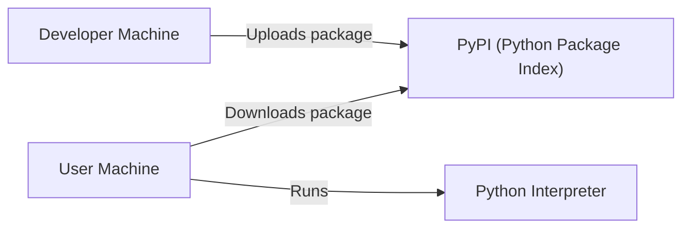
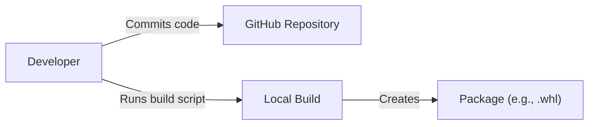

# BUSINESS POSTURE

Business Priorities and Goals:

*   Provide a simple, user-friendly command-line tool for date calculations.
*   Offer a lightweight alternative to more complex date manipulation libraries.
*   Ensure accuracy and reliability in date calculations.
*   Support common date-related operations.
*   Maintain a small, easily manageable codebase.

Business Risks:

*   Inaccurate calculations leading to incorrect results and potential user errors.
*   Lack of support for edge cases or specific date formats causing user frustration.
*   Security vulnerabilities, although likely minimal given the tool's scope, could still exist.
*   Poor usability or lack of features compared to alternatives, leading to low adoption.
*   Maintenance overhead if the codebase becomes difficult to manage.

# SECURITY POSTURE

Existing Security Controls:

*   security control: The project is open-source, allowing for community review and contributions, which can help identify and address security issues. (GitHub repository)
*   security control: Basic input validation is likely present to handle invalid date formats. (Needs to be verified in the code)
*   security control: The project is written in Python, which has built-in security features and a large community that actively addresses vulnerabilities.

Accepted Risks:

*   accepted risk: The tool is a command-line utility, and the attack surface is relatively small.
*   accepted risk: The tool primarily performs date calculations, and the risk of sensitive data exposure is low.
*   accepted risk: The project is maintained by a single developer, which may introduce delays in addressing security issues.

Recommended Security Controls:

*   security control: Implement comprehensive input validation to handle various date formats and prevent potential injection vulnerabilities.
*   security control: Conduct regular security audits and code reviews to identify and address potential vulnerabilities.
*   security control: Consider using a static analysis tool to automatically detect potential security issues.
*   security control: Add tests to verify that the tool handles edge cases and leap years correctly.

Security Requirements:

*   Authentication: Not applicable, as the tool is a command-line utility without user accounts.
*   Authorization: Not applicable, as the tool does not manage access to resources.
*   Input Validation: Crucial to prevent errors and potential vulnerabilities. The tool should handle various date formats and reject invalid inputs.
*   Cryptography: Not directly applicable, as the tool does not handle sensitive data requiring encryption. However, if the tool were to interact with external services or store data, cryptography might become relevant.

# DESIGN

## C4 CONTEXT

Element Description:

*   Element:
    *   Name: User
    *   Type: Person
    *   Description: A person who interacts with the DateTools utility.
    *   Responsibilities: Provides input to the DateTools utility and receives output.
    *   Security controls: None (external to the system).

*   Element:
    *   Name: DateTools
    *   Type: Software System
    *   Description: The command-line date calculation utility.
    *   Responsibilities: Performs date calculations based on user input.
    *   Security controls: Input validation, error handling.

*   Element:
    *   Name: Operating System
    *   Type: Software System
    *   Description: The operating system on which the DateTools utility runs.
    *   Responsibilities: Provides the environment for the DateTools utility to execute.
    *   Security controls: OS-level security controls (e.g., file permissions, user accounts).

## C4 CONTAINER

Element Description:

*   Element:
    *   Name: User
    *   Type: Person
    *   Description: A person who interacts with the DateTools utility.
    *   Responsibilities: Provides input to the DateTools utility and receives output.
    *   Security controls: None (external to the system).

*   Element:
    *   Name: Command-Line Interface
    *   Type: Container
    *   Description: The interface through which the user interacts with the tool.
    *   Responsibilities: Parses user input, validates commands, and displays output.
    *   Security controls: Input validation, command whitelisting (if applicable).

*   Element:
    *   Name: Date Calculation Engine
    *   Type: Container
    *   Description: The core logic of the DateTools utility.
    *   Responsibilities: Performs date calculations based on parsed input.
    *   Security controls: Input validation, error handling.

*   Element:
    *   Name: Operating System
    *   Type: Software System
    *   Description: The operating system on which the DateTools utility runs.
    *   Responsibilities: Provides the environment for the DateTools utility to execute.
    *   Security controls: OS-level security controls (e.g., file permissions, user accounts).

## DEPLOYMENT

Possible deployment solutions:

1.  Manual installation: User downloads the source code and runs it directly using Python.
2.  Package manager: The tool could be packaged and distributed through a package manager like `pip`.
3.  Containerization: The tool could be containerized using Docker for easier distribution and execution.

Chosen solution (Package Manager - `pip`):

Element Description:

*   Element:
    *   Name: Developer Machine
    *   Type: Infrastructure Node
    *   Description: The machine used by the developer to build and package the tool.
    *   Responsibilities: Building and packaging the software.
    *   Security controls: Developer machine security (e.g., access controls, malware protection).

*   Element:
    *   Name: PyPI (Python Package Index)
    *   Type: Infrastructure Node
    *   Description: The central repository for Python packages.
    *   Responsibilities: Storing and distributing the DateTools package.
    *   Security controls: PyPI security measures (e.g., package signing, vulnerability scanning).

*   Element:
    *   Name: User Machine
    *   Type: Infrastructure Node
    *   Description: The machine on which the user installs and runs the DateTools utility.
    *   Responsibilities: Downloading, installing, and running the software.
    *   Security controls: User machine security (e.g., access controls, malware protection).

*   Element:
    *   Name: Python Interpreter
    *   Type: Infrastructure Node
    *   Description: The Python interpreter that executes the DateTools code.
    *   Responsibilities: Executing the Python code.
    *   Security controls: Python interpreter security (e.g., sandboxing, security updates).

## BUILD

Build Process Description:

1.  The developer writes and commits code to the GitHub repository.
2.  The developer runs a build script locally (e.g., `setup.py`).
3.  The build script packages the code into a distributable format (e.g., a `.whl` file).
4.  The developer uploads the package to PyPI.

Security Controls:

*   security control: Code review: All code changes should be reviewed before being merged into the main branch.
*   security control: Dependency management: Dependencies should be carefully managed and checked for known vulnerabilities.
*   security control: Build script security: The build script should be secured to prevent unauthorized modifications.
*   security control: Local build environment: The developer's local build environment should be secured.

# RISK ASSESSMENT

Critical Business Processes:

*   Providing accurate date calculations.
*   Maintaining a user-friendly command-line interface.

Data Protection:

*   Data Sensitivity: Low. The tool primarily deals with dates, which are generally not considered sensitive data.
*   Data to Protect: No specific data needs to be protected, as the tool does not store or transmit sensitive information.

# QUESTIONS & ASSUMPTIONS

Questions:

*   Are there any specific date formats or locales that need to be supported?
*   Are there any performance requirements for the tool?
*   Are there any plans to extend the functionality of the tool in the future?
*   What is the expected user base and their technical expertise?
*   Is there a specific version of Python that should be targeted?

Assumptions:

*   BUSINESS POSTURE: The primary goal is to provide a simple and reliable date calculation tool.
*   BUSINESS POSTURE: The user base is expected to be technically comfortable with using command-line tools.
*   SECURITY POSTURE: The attack surface is relatively small, and the risk of sensitive data exposure is low.
*   SECURITY POSTURE: The tool will be used in environments where basic security measures are in place (e.g., up-to-date operating systems, user accounts with appropriate permissions).
*   DESIGN: The tool will be deployed via `pip` and run using the Python interpreter.
*   DESIGN: The tool will be built and packaged locally by the developer.
*   DESIGN: The tool will primarily interact with the operating system for date and time information.