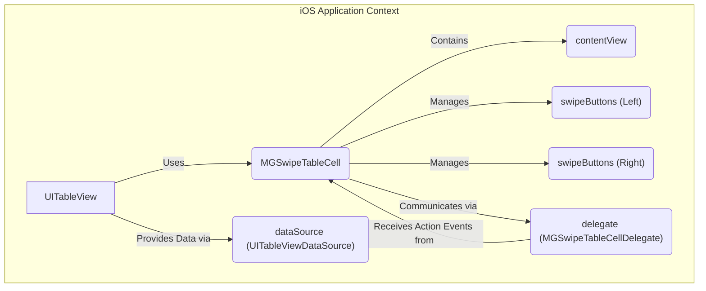
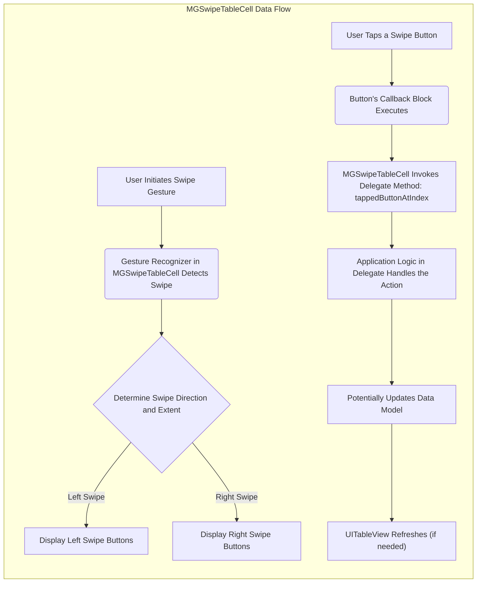

# Project Design Document: MGSwipeTableCell

**Version:** 1.1
**Date:** October 26, 2023
**Author:** AI Software Architect

## 1. Introduction

This document provides a detailed design overview of the `MGSwipeTableCell` project, a custom `UITableViewCell` subclass for iOS that enables swipeable actions. This document aims to clearly articulate the component's architecture, functionality, and key considerations for future threat modeling activities.

The project, available at [https://github.com/MortimerGoro/MGSwipeTableCell](https://github.com/MortimerGoro/MGSwipeTableCell), offers a user-friendly way to implement common mobile UI patterns like deleting, sharing, or performing other actions on table view cells through intuitive swipe gestures. This document serves as a blueprint for understanding the component's inner workings and potential security implications.

## 2. Goals and Objectives

The primary goals of the `MGSwipeTableCell` component are:

* **Provide a reusable and customizable component:** Developers should be able to easily integrate swipeable actions into their `UITableView` implementations without significant overhead.
* **Offer a flexible API:** Allow developers to define a variety of custom swipe actions with different behaviors, visual appearances, and associated logic.
* **Maintain a smooth and responsive user experience:** Ensure that swipe gestures are handled efficiently and fluidly, providing a polished interaction without causing UI lag or jank.
* **Be compatible with standard iOS development practices:** Integrate seamlessly with existing `UITableView` delegate and data source patterns, minimizing the learning curve for developers.
* **Offer a visually appealing and intuitive user interface:** The swipe actions should be presented in a clear and understandable manner to the end-user.

## 3. Target Audience

This document is intended for the following audiences:

* **Security Engineers:** To understand the component's architecture, identify potential security vulnerabilities, and plan effective threat modeling exercises.
* **Software Developers:** To gain a deeper understanding of the component's design, implementation details, and how to effectively integrate and customize it within their applications.
* **Project Managers:** To have a clear overview of the component's functionality, scope, and potential risks associated with its use.
* **Quality Assurance Engineers:** To understand the component's behavior and design test cases to ensure its functionality and security.

## 4. System Architecture

The `MGSwipeTableCell` component extends the standard `UITableViewCell` and introduces new elements to handle swipe gestures and display action buttons. It interacts closely with the `UITableView` and the application's delegate and data source.

**Key Components:**

* **`UITableView`:** The standard iOS table view that utilizes `MGSwipeTableCell` for displaying its individual cells. It manages the layout and presentation of the cells.
* **`MGSwipeTableCell`:** The core component, a subclass of `UITableViewCell`, responsible for intercepting and interpreting swipe gestures initiated by the user on the cell. It also manages the display and interaction with the swipe action buttons.
* **`contentView`:** The standard content view inherited from `UITableViewCell`. This is where the primary content of the cell, as defined by the application developer, is displayed. `MGSwipeTableCell` overlays its swipe functionality on top of this.
* **`swipeButtons (Left)`:** An ordered collection of `UIView` objects, typically instances of `UIButton` or custom views, that are revealed when the user swipes the cell from left to right. These represent actions the user can take.
* **`swipeButtons (Right)`:** An ordered collection of `UIView` objects, similar to the left buttons, that are revealed when the user swipes the cell from right to left.
* **`delegate (MGSwipeTableCellDelegate)`:** A protocol that defines methods for communication between the `MGSwipeTableCell` and its containing view controller or other responsible object. This allows the application to respond to swipe actions and customize the behavior of the swipeable cells.
* **`dataSource (UITableViewDataSource)`:** The standard data source for the `UITableView`. While `MGSwipeTableCell` doesn't directly interact with the data source for its core functionality, the actions triggered by the swipe buttons often result in data modifications managed by the data source.

## 5. Component Details

### 5.1. `MGSwipeTableCell`

* **Responsibilities:**
    * **Gesture Recognition:** Detecting and interpreting horizontal swipe gestures initiated by the user on the cell.
    * **Button Management:** Dynamically displaying and managing the `leftButtons` or `rightButtons` collections based on the direction and extent of the swipe gesture.
    * **Visual Transition:** Handling the animated transition of the cell's `contentView` and the swipe buttons during the swipe interaction, providing a smooth visual experience.
    * **Delegate Communication:** Invoking appropriate methods on the `delegate` (conforming to `MGSwipeTableCellDelegate`) when a swipe action button is triggered or when the swipe state changes.
    * **State Management:** Maintaining the internal state of the swipe interaction, such as whether the buttons are currently visible, the swipe direction, and the expansion state.

* **Key Properties:**
    * `leftButtons`: An `NSArray` of `UIView` objects representing the buttons to be displayed on the left swipe.
    * `rightButtons`: An `NSArray` of `UIView` objects representing the buttons to be displayed on the right swipe.
    * `delegate`: An object conforming to the `MGSwipeTableCellDelegate` protocol, responsible for handling swipe actions.
    * `swipeBackgroundColor`: The background color of the area revealed behind the `contentView` during a swipe.
    * `swipeOffset`: A `CGFloat` value indicating the current horizontal offset of the cell's `contentView` due to the swipe.
    * Configuration options (e.g., `swipeThreshold`, `animationDuration`, `allowsMultipleSwipe`).

* **Key Methods:**
    * `setLeftButtons:animated:`: Sets the array of left swipe buttons and animates the change if requested.
    * `setRightButtons:animated:`: Sets the array of right swipe buttons and animates the change if requested.
    * `showSwipe:(MGSwipeDirection)direction animated:(BOOL)animated completion:(void (^)(BOOL finished))completion;`: Programmatically shows the swipe buttons for a given direction.
    * `hideSwipeAnimated:(BOOL)animated completion:(void (^)(BOOL finished))completion;`: Programmatically hides the currently visible swipe buttons.

### 5.2. Swipe Buttons (Left & Right)

* **Responsibilities:**
    * **Action Representation:** Visually representing the specific actions that can be performed on the corresponding table view cell.
    * **Visual Presentation:** Displaying a clear and understandable visual representation of the action, typically through an icon, text label, or a combination of both.
    * **User Interaction:** Responding to user taps and triggering the associated action logic.

* **Key Properties (Typical `UIButton` properties):**
    * `title`: The text label displayed on the button.
    * `image`: The icon displayed on the button.
    * `backgroundColor`: The background color of the button, allowing for visual distinction between actions.
    * `titleColor`: The color of the text label.
    * `font`: The font used for the text label.

* **Key Properties (Specific to `MGSwipeButton` or similar implementations):**
    * `callback`: A block or closure that is executed when the button is tapped. This block typically contains the application-specific logic for the action.
    * Styling properties for customizing appearance (e.g., padding, border radius).

### 5.3. `MGSwipeTableCellDelegate`

* **Responsibilities:**
    * **Action Handling:** Providing a standardized interface for the application to receive notifications when a swipe action button is tapped.
    * **Customization:** Allowing the application to customize the swipe buttons and behavior on a per-cell basis, enabling dynamic and context-aware swipe actions.
    * **Swipe State Management:**  Providing hooks for the application to react to changes in the swipe state of the cell.

* **Key Methods:**
    * `- (NSArray<UIView *> *)swipeTableCell:(MGSwipeTableCell *)cell swipeButtonsForState:(MGSwipeState)state swipeDirection:(MGSwipeDirection)direction fromExpansion:(BOOL)fromExpansion;`:  Allows the delegate to dynamically provide the array of swipe buttons based on the current swipe state and direction.
    * `- (BOOL)swipeTableCell:(MGSwipeTableCell *)cell tappedButtonAtIndex:(NSInteger)index direction:(MGSwipeDirection)direction fromExpansion:(BOOL)fromExpansion;`: Notifies the delegate that a swipe button has been tapped, providing the index of the button and the swipe direction. The delegate method returns a `BOOL` indicating whether the swipe view should be animated back to the closed position.
    * Optional methods for customizing swipe thresholds, animations, and expansion behavior.

## 6. Data Flow

The primary data flow within `MGSwipeTableCell` involves the user's interaction with the cell and the subsequent communication of the triggered action back to the application logic for processing.

**Detailed Flow:**

1. **User Initiates Swipe Gesture:** The user begins a horizontal swipe gesture on an instance of `MGSwipeTableCell`.
2. **Gesture Recognizer in MGSwipeTableCell Detects Swipe:** The built-in gesture recognizers within `MGSwipeTableCell` detect and interpret the user's touch and movement.
3. **Determine Swipe Direction and Extent:** The component analyzes the swipe gesture to determine the direction (left or right) and the distance the user has swiped.
4. **Display Left/Right Swipe Buttons:** Based on the swipe direction, the corresponding array of `swipeButtons` is visually revealed, typically with an animation to provide a smooth user experience.
5. **User Taps a Swipe Button:** The user taps on one of the displayed swipe action buttons.
6. **Button's Callback Block Executes:** The `callback` block or closure associated with the tapped button is executed. This block contains the immediate, button-specific logic.
7. **MGSwipeTableCell Invokes Delegate Method: tappedButtonAtIndex:** The `MGSwipeTableCell` calls the `swipeTableCell:tappedButtonAtIndex:direction:fromExpansion:` method on its delegate, providing information about the tapped button (its index) and the direction of the swipe.
8. **Application Logic in Delegate Handles the Action:** The containing view controller or other delegate object receives the notification and executes the appropriate application-specific logic based on the triggered action (e.g., deleting a row, marking an item as read, sharing content).
9. **Potentially Updates Data Model:** The application logic often involves updating the underlying data model based on the user's action.
10. **UITableView Refreshes (if needed):** If the data model has been modified, the `UITableView` is typically refreshed to reflect the changes in the UI.

## 7. Security Considerations (Pre-Threat Modeling)

While `MGSwipeTableCell` primarily handles UI interactions, potential security vulnerabilities can arise from how the integrating application utilizes its features:

* **Exposure of Sensitive Data in Swipe Actions:** If swipe actions inadvertently display sensitive information in button titles or icons without proper authorization checks, it could lead to data breaches. For example, displaying a user's email address in a "Share" button without verifying the user's intent.
* **Accidental or Malicious Actions:** The ease of triggering swipe actions could lead to accidental execution of destructive operations (e.g., deletion) or malicious actions if the application doesn't implement sufficient confirmation steps or authorization checks.
* **Insecure Custom Button Implementations:** If developers create highly customized swipe buttons with complex logic or external dependencies, vulnerabilities could be introduced within that custom code, such as insecure data handling or network requests.
* **Injection Vulnerabilities in Data Binding:** If the data displayed in the cell content or swipe button titles is derived from untrusted sources and not properly sanitized, it could be susceptible to injection attacks (e.g., cross-site scripting if web views are involved).
* **Lack of Proper Authorization for Actions:** The application must ensure that the actions triggered by the swipe buttons are appropriately authorized based on the user's roles and permissions. Failing to do so could allow unauthorized users to perform sensitive operations.
* **Denial of Service through Excessive Swiping:** While less likely, a malicious user might attempt to repeatedly swipe and trigger actions to overload the application or backend systems if proper rate limiting or resource management is not in place.
* **State Management Issues Leading to Inconsistent UI:** If the application's state management is flawed, inconsistencies between the UI and the underlying data could arise from swipe actions, potentially leading to unexpected behavior or security vulnerabilities.

**Note:** This section highlights potential security considerations. A dedicated threat modeling exercise is crucial to systematically identify and analyze specific vulnerabilities and devise appropriate mitigation strategies.

## 8. Assumptions and Constraints

* **Target iOS Platform:** The component is specifically designed and intended for use within iOS applications.
* **Dependency on UIKit Framework:** It relies heavily on the UIKit framework for UI elements, gesture recognition, and animation functionalities.
* **Developer Responsibility for Security:** The security of the overall application is ultimately the responsibility of the developers integrating and utilizing `MGSwipeTableCell`. The component itself does not enforce security policies.
* **No Built-in Authentication or Authorization:** `MGSwipeTableCell` does not provide any built-in mechanisms for user authentication or action authorization. These must be implemented at the application level.
* **Assumes Correct Usage of Delegate Methods:** The component assumes that developers will correctly implement the delegate methods to handle actions and customize behavior securely.

## 9. Deployment Considerations

* **Integration via CocoaPods, Swift Package Manager, or Manual Integration:** The component can be integrated into iOS projects using standard dependency management tools like CocoaPods or Swift Package Manager, or by manually adding the source files to the project.
* **Minimum iOS Version Compatibility:** Developers should be aware of the minimum iOS version supported by the `MGSwipeTableCell` library to ensure compatibility with their target audience's devices.
* **Potential Conflicts with Other UI Libraries:** While generally designed to be compatible, potential conflicts might arise with other custom UI libraries or gesture recognizers if not carefully managed.

## 10. Future Considerations

* **Enhanced Accessibility Features:** Further improvements could be made to enhance accessibility for users with disabilities, such as better support for VoiceOver and keyboard navigation of swipe actions.
* **Support for More Complex Swipe Gestures:** Exploring the possibility of supporting more intricate swipe gestures or multi-finger interactions to trigger different sets of actions.
* **Greater Customization of Animations:** Providing more granular control and options for customizing the animations associated with swiping and button display.
* **Native Integration with SwiftUI:** Investigating ways to provide a more native and seamless integration with SwiftUI, Apple's declarative UI framework.
* **Improved Documentation and Examples:** Continuously improving the documentation and providing more comprehensive examples to guide developers in effectively and securely using the component.

This revised design document provides a more detailed and comprehensive overview of the `MGSwipeTableCell` project, offering a solid foundation for threat modeling and future development efforts. By thoroughly understanding the component's architecture, data flow, and potential security implications, developers and security engineers can collaborate to build robust and secure iOS applications.