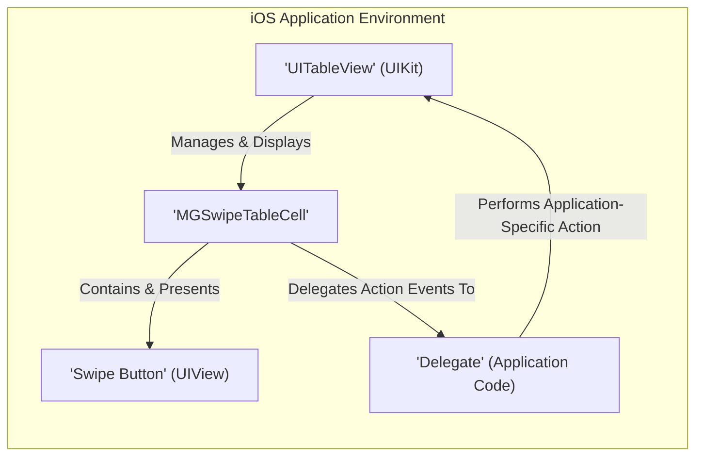
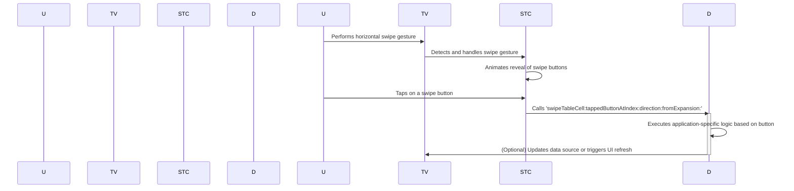

# Project Design Document: MGSwipeTableCell

**Version:** 1.1
**Date:** October 26, 2023
**Author:** Gemini (AI Language Model)

## 1. Introduction

This document provides an enhanced design description of the `MGSwipeTableCell` project, a custom `UITableViewCell` subclass for iOS enabling swipeable actions. This revised document aims for greater clarity and detail, specifically to support effective threat modeling. It offers a comprehensive understanding of the component's architecture, functionality, and data flow.

The project repository is located at: [https://github.com/mortimergoro/mgswipetablecell](https://github.com/mortimergoro/mgswipetablecell).

## 2. Goals

The primary goals of this design document are to:

*   Provide a clear and concise description of the `MGSwipeTableCell` component's architecture and functionality.
*   Clearly identify the key components and their interactions.
*   Detail the flow of data within the component during user interaction.
*   Provide specific and actionable information to facilitate thorough threat modeling.
*   Serve as a reliable reference for developers, security analysts, and other stakeholders.

## 3. Scope

This design document covers the following aspects of the `MGSwipeTableCell` project:

*   The core `MGSwipeTableCell` class, its properties, and methods relevant to swipe functionality.
*   The mechanisms for adding and configuring both left and right swipe buttons.
*   The delegate pattern and its role in handling user interactions with swipe buttons.
*   The visual presentation of swipe actions and associated animations.
*   The interaction and integration of `MGSwipeTableCell` within a standard `UITableView`.

This document explicitly excludes:

*   Implementation details of the example application bundled within the repository.
*   Specific application-level usage patterns or business logic implemented by consumers of this library.
*   Internal workings and implementation details of Apple's `UIKit` framework components like `UITableView`.
*   Detailed performance analysis or optimization techniques.

## 4. High-Level Architecture

The `MGSwipeTableCell` component extends the standard `UITableViewCell` to introduce swipeable actions. When a user swipes a cell horizontally, interactive buttons are revealed. The following diagram illustrates the high-level interaction between key components:

**Component Descriptions:**

*   **'UITableView' (UIKit):** The standard iOS component responsible for displaying scrollable lists of data using cells.
*   **'MGSwipeTableCell':** The custom table view cell subclass. Its primary responsibility is to manage and display interactive buttons when the cell is swiped.
*   **'Swipe Button' (UIView):** Interactive UI elements (typically `UIButton` instances or custom `UIView` subclasses) that are revealed upon swiping. Tapping these buttons triggers actions.
*   **'Delegate' (Application Code):** An object, typically residing within the application's view controller or data source, that conforms to the `MGSwipeTableCellDelegate` protocol. This object handles the logic associated with taps on the swipe buttons.

**Interaction Sequence:**

1. The `'UITableView'` renders and displays instances of `'MGSwipeTableCell'`.
2. A user initiates a horizontal swipe gesture on a `'MGSwipeTableCell'`.
3. The `'MGSwipeTableCell'` detects this swipe gesture.
4. Based on the swipe direction (left or right), the `'MGSwipeTableCell'` reveals the corresponding configured `'Swipe Button'`(s).
5. The user taps on a visible `'Swipe Button'`.
6. The `'MGSwipeTableCell'` invokes a method on its `'Delegate'`, as defined by the `MGSwipeTableCellDelegate` protocol. This notification includes information about the cell and the specific button tapped.
7. The `'Delegate'` (application code) executes the application-specific logic associated with the tapped button. This might involve data manipulation, navigation, or other actions.
8. The `'Delegate'` may then interact with the `'UITableView'` (e.g., by reloading data) to reflect the outcome of the action.

## 5. Detailed Design

### 5.1. MGSwipeTableCell Class Details

*   **Inheritance:** `MGSwipeTableCell` inherits directly from `UITableViewCell`, leveraging its fundamental cell presentation capabilities.
*   **Core Responsibility:** To orchestrate the display and user interaction with swipe-activated buttons. This includes gesture recognition, button layout, and communication with the delegate.
*   **Key Properties:**
    *   `leftButtons`: An `NSArray` holding `UIView` instances representing the buttons displayed when the cell is swiped from left to right.
    *   `rightButtons`: An `NSArray` holding `UIView` instances representing the buttons displayed when the cell is swiped from right to left.
    *   `leftSwipeSettings`: An instance of `MGSwipeSettings` that configures the behavior of left swipes (e.g., animation style, expansion mode).
    *   `rightSwipeSettings`: An instance of `MGSwipeSettings` that configures the behavior of right swipes.
    *   `delegate`: A property that holds a reference to the object conforming to the `MGSwipeTableCellDelegate` protocol. This is the primary mechanism for communicating button tap events.
    *   Properties controlling visual aspects such as `swipeBackgroundColor`, animation durations, and button spacing.

### 5.2. Swipe Button Configuration

*   **Representation:** Swipe buttons are represented as standard `UIView` objects. In practice, these are often instances of `UIButton` but can be any custom `UIView` subclass.
*   **Customization:** Buttons are typically customized with:
    *   A textual label or an image to convey their purpose.
    *   A background color to visually distinguish them.
    *   While direct target-action mechanisms or blocks might be used for simpler scenarios, the primary interaction is through the delegate pattern.
*   **Layout Management:** `MGSwipeTableCell` is responsible for the layout and positioning of these buttons when a swipe occurs, respecting the configured `MGSwipeSettings`.

### 5.3. MGSwipeSettings Configuration

*   **Purpose:** This class encapsulates the configurable behaviors associated with cell swiping.
*   **Key Configuration Options:**
    *   `transition`: Defines the animation style used when revealing the swipe buttons. Options include static, border fade, and drag.
    *   `expansionMode`: Determines how buttons behave when the swipe continues beyond the initial reveal. Options include no expansion, filling with the first button, or filling with the last button.
    *   `keepButtonsRevealed`: A boolean flag indicating whether the swipe buttons should remain visible after the user releases the swipe gesture.
    *   `animationDuration`: Controls the speed of the swipe animation effects.

### 5.4. MGSwipeTableCellDelegate Protocol Details

*   **Role:** This protocol defines the contract between the `MGSwipeTableCell` and its delegate (typically application-level code). It's the central point for handling swipe button interactions.
*   **Key Methods:**
    *   `- (BOOL)swipeTableCell:(MGSwipeTableCell *)cell canSwipeOnState:(MGSwipeState)state;`:  Allows the delegate to dynamically enable or disable swiping (left or right) for a specific cell based on its state or data.
    *   `- (NSArray<UIView *> *)swipeTableCell:(MGSwipeTableCell *)cell swipeButtonsForLeftSwipe:(MGSwipeSettings *)swipeSettings expansionMode:(MGSwipeExpansionMode *)expansionMode;`: The delegate implements this method to provide the array of `UIView` objects that represent the left swipe buttons for a given cell.
    *   `- (NSArray<UIView *> *)swipeTableCell:(MGSwipeTableCell *)cell swipeButtonsForRightSwipe:(MGSwipeSettings *)swipeSettings expansionMode:(MGSwipeExpansionMode *)expansionMode;`:  Similar to the left swipe method, this provides the right swipe buttons.
    *   `- (BOOL)swipeTableCell:(MGSwipeTableCell *)cell tappedButtonAtIndex:(NSInteger)index direction:(MGSwipeDirection)direction fromExpansion:(BOOL)isExpansion;`:  This crucial method is invoked when a swipe button is tapped. The delegate's implementation of this method contains the application-specific logic to be executed. It receives the cell, the index of the tapped button, the swipe direction, and whether the tap occurred during an expansion.

### 5.5. Integration with UITableView

*   **Standard Usage:** `MGSwipeTableCell` is integrated into a `UITableView` by using it as the cell class within the `tableView:cellForRowAtIndexPath:` data source method.
*   **Data Binding:** The application's data source is responsible for providing the data to be displayed within the `MGSwipeTableCell` and for configuring the swipe buttons and their associated actions via the delegate.
*   **Delegate Management:**  The object acting as the `UITableView`'s delegate often also serves as the `MGSwipeTableCell`'s delegate, centralizing the handling of cell interactions.

## 6. Data Flow During Swipe Action

The following sequence diagram illustrates the flow of data and control when a user interacts with a swipeable cell:

**Step-by-Step Breakdown:**

1. **User Interaction:** The user initiates a horizontal swipe gesture on an instance of `MGSwipeTableCell` within a `UITableView`.
2. **Gesture Handling:** The `UITableView` recognizes the touch events and forwards them to the appropriate `MGSwipeTableCell`. The `MGSwipeTableCell` then interprets these events as a swipe gesture.
3. **Button Animation:** Based on the swipe direction and configured settings, `MGSwipeTableCell` animates the appearance of the relevant swipe buttons (left or right).
4. **Button Tap:** The user taps on one of the now-visible swipe buttons.
5. **Delegate Invocation:** The `MGSwipeTableCell` calls the `swipeTableCell:tappedButtonAtIndex:direction:fromExpansion:` method on its assigned delegate. Crucially, the following data is passed to the delegate:
    *   A reference to the specific `MGSwipeTableCell` instance involved.
    *   The `index` of the tapped button within the `leftButtons` or `rightButtons` array.
    *   The `direction` of the swipe that revealed the buttons (`MGSwipeDirectionLeftToRight` or `MGSwipeDirectionRightToLeft`).
    *   A boolean (`isExpansion`) indicating if the tap occurred during a swipe expansion.
6. **Delegate Logic Execution:** The delegate's implementation of this method contains the application's specific response to the button tap. This might involve:
    *   Modifying the underlying data model.
    *   Initiating network requests.
    *   Updating the user interface.
    *   Navigating to a different screen.
7. **Optional UI Update:** If the action performed by the delegate necessitates a change in the displayed data, the delegate will typically interact with the `UITableView` (e.g., by calling `reloadData` or `reloadRowsAtIndexPaths:withRowAnimation:`) to update the table view.

## 7. Security Considerations

This section expands on the initial security considerations, providing more specific examples of potential threats and vulnerabilities related to the `MGSwipeTableCell` component.

*   **Insecure Delegate Implementation:** The most significant security risk lies in the implementation of the `MGSwipeTableCellDelegate` methods. If the delegate's logic is flawed, it could lead to various vulnerabilities:
    *   **Unauthorized Actions:** A poorly implemented delegate might perform actions the user is not authorized to perform, based on the tapped button. For example, a "Delete" button action might delete data without proper authorization checks.
    *   **Data Corruption:** Incorrect handling of the `index` parameter in `tappedButtonAtIndex:` could lead to actions being performed on the wrong data item, resulting in data corruption.
    *   **Information Disclosure:**  The delegate might inadvertently expose sensitive information based on the tapped action, especially if logging or analytics are not carefully implemented.
    *   **Cross-Site Scripting (XSS) or Similar Attacks (Indirect):** While `MGSwipeTableCell` itself doesn't directly handle web content, if the actions triggered by the delegate involve displaying data from external sources, vulnerabilities in the delegate's handling of that data could lead to XSS or similar issues elsewhere in the application.
*   **Injection Vulnerabilities (Indirect):** If the actions triggered by swipe buttons involve constructing database queries or API requests based on user input or the tapped button, vulnerabilities like SQL injection or command injection could arise in the delegate's implementation.
*   **Denial of Service (DoS):** While less likely, a poorly implemented delegate action triggered by a swipe button could potentially consume excessive resources, leading to a denial of service. For instance, a button tap might initiate a computationally expensive operation or a large number of network requests.
*   **Visual Spoofing and UI Redressing:** Although not a direct vulnerability in `MGSwipeTableCell` itself, the visual presentation of swipe buttons is important. Misleading labels or icons could trick users into performing unintended actions.
*   **Lack of Input Validation:** The delegate should validate any input or data associated with the swipe action. For example, if a swipe action modifies a text field, the delegate should validate the input before persisting changes.
*   **State Management Issues:**  If the application's state is not correctly managed in conjunction with swipe actions, it could lead to inconsistent data or unexpected behavior. For example, if a user swipes to reveal a "Mark as Read" button but the item is already marked as read, the delegate should handle this state appropriately.

## 8. Deployment Considerations

*   **Integration Methods:** `MGSwipeTableCell` is typically integrated into iOS projects using dependency management tools like CocoaPods, Carthage, or Swift Package Manager.
*   **Implementation Steps:** Developers need to:
    *   Add the `MGSwipeTableCell` dependency to their project.
    *   In their `UITableView` data source, cast the dequeued cells to `MGSwipeTableCell` or a subclass thereof.
    *   Set the `delegate` property of the `MGSwipeTableCell` instance.
    *   Implement the required methods of the `MGSwipeTableCellDelegate` protocol to provide the swipe buttons and handle button tap actions.
    *   Configure the `leftButtons`, `rightButtons`, `leftSwipeSettings`, and `rightSwipeSettings` properties as needed.
*   **Testing:** Thoroughly test the swipe functionality and the actions triggered by the swipe buttons on different devices and iOS versions.

## 9. Future Considerations

*   **SwiftUI Compatibility:**  Exploring the creation of a SwiftUI-native version of the swipeable cell functionality would cater to modern iOS development practices.
*   **Enhanced Customization:** Providing more granular control over the appearance and animation of swipe actions could be beneficial.
*   **Improved Accessibility:**  Further enhancements to accessibility features, ensuring compatibility with VoiceOver and other assistive technologies, are important.
*   **More Gesture Options:** Investigating support for more complex swipe gestures or long-press interactions could expand the component's capabilities.

This improved design document provides a more detailed and nuanced understanding of the `MGSwipeTableCell` component, specifically tailored to support comprehensive threat modeling activities.