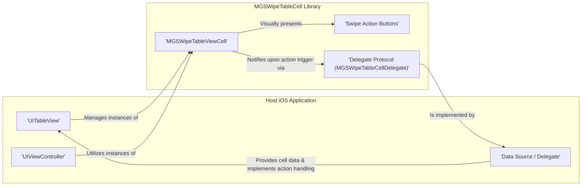
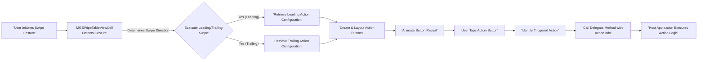

# Project Design Document: MGSWipeTableCell

**Version:** 1.1
**Date:** October 26, 2023
**Authors:** Gemini (AI Language Model)

## 1. Introduction

This document provides an enhanced design overview of the `MGSWipeTableCell` project, a Swift library hosted on GitHub at [https://github.com/mortimergoro/mgswipetablecell](https://github.com/mortimergoro/mgswipetablecell). This revised document aims to provide a more detailed and precise articulation of the library's architecture, components, and data flow, specifically tailored for effective threat modeling. It focuses on elucidating the internal mechanisms and potential interaction surfaces of the library within a containing iOS application.

## 2. Goals and Objectives

The primary goal of the `MGSWipeTableCell` library is to offer a modular and customizable solution for implementing swipe-based actions on table view cells within iOS applications. Key objectives include:

*   Providing a straightforward and developer-friendly API for integrating swipe actions into `UITableViewCells`.
*   Enabling the definition and configuration of multiple distinct swipe actions for both the leading and trailing edges of a cell.
*   Facilitating the customization of the visual presentation and interactive behavior of the swipe action buttons.
*   Establishing a clear communication pathway for the host application to manage and execute the logic associated with triggered swipe actions.

## 3. System Architecture

The `MGSWipeTableCell` library is architected as a self-contained user interface component, extending the standard `UITableViewCell` provided by UIKit. It leverages UIKit's gesture recognition and view management capabilities and interacts with the embedding application through a well-defined delegate protocol.

### 3.1. High-Level Architecture Diagram

### 3.2. Component Description

*   **`MGSWipeTableViewCell`:** This is the central class of the library, inheriting from `UITableViewCell`. It is responsible for managing the recognition of swipe gestures and the dynamic presentation of action buttons.
    *   Internally manages `UIPanGestureRecognizer` instances to detect horizontal swipe gestures.
    *   Dynamically instantiates and arranges `UIButton` instances (or similar UI elements) representing the swipe actions based on configuration.
    *   Orchestrates animations for revealing and hiding swipe action buttons during user interaction.
    *   Stores configurations for both leading and trailing swipe actions associated with the cell.
    *   Utilizes the `MGSWipeTableCellDelegate` protocol to inform the host application when a swipe action is activated.

*   **Swipe Action Buttons:** These are the interactive visual elements that become visible when a user swipes the cell.
    *   Typically implemented using `UIButton` or custom `UIView` subclasses that provide interactive behavior.
    *   Each button is associated with properties such as a title (`String`), an optional image (`UIImage`), a background color (`UIColor`), and a handler (closure or target-action) to be executed upon tapping.
    *   The library handles the creation, layout, and visual styling of these buttons.

*   **Delegate Protocol (`MGSWipeTableCellDelegate`):** This protocol defines the contract through which `MGSWipeTableViewCell` communicates significant events back to the containing application.
    *   Includes methods that are invoked when a user taps on a specific swipe action button, providing information about the triggered action.
    *   The adopting object (typically a `UIViewController` or a data source management object) is responsible for implementing these methods to perform the application-specific logic associated with each swipe action.

## 4. Data Flow

The primary data flow within the `MGSWipeTableCell` library revolves around the user's swipe interaction and the subsequent communication of triggered actions to the host application for processing.

### 4.1. Swipe Gesture Processing

1. A user initiates a horizontal swipe gesture on a `UITableViewCell` instance that is an `MGSWipeTableViewCell`.
2. The `UIPanGestureRecognizer` attached to the `MGSWipeTableViewCell` detects and interprets the swipe gesture.
3. Based on the direction and velocity of the swipe, `MGSWipeTableViewCell` determines whether to reveal leading or trailing swipe actions.

### 4.2. Displaying and Animating Swipe Actions

1. `MGSWipeTableViewCell` retrieves the configuration details for the relevant set of swipe actions (leading or trailing).
2. It dynamically creates instances of the button views representing these actions.
3. The library manages the layout and positioning of these buttons within the cell's view hierarchy.
4. `UIView` animations are employed to smoothly transition the cell's content and the action buttons into their visible states.

### 4.3. Triggering and Handling Actions

1. The user taps on one of the visible swipe action buttons.
2. `MGSWipeTableViewCell` detects the tap event on the specific button.
3. It identifies the action associated with the tapped button based on its configuration.
4. The library then invokes the appropriate method on its delegate (an object conforming to `MGSWipeTableCellDelegate`).
5. The delegate method implementation within the host application receives information about the triggered action, allowing it to execute the corresponding application logic (e.g., deleting a data item, marking an item as favorite, etc.).

### 4.4. Data Flow Diagram

## 5. Security Considerations (Pre-Threat Modeling)

While `MGSWipeTableCell` primarily focuses on UI presentation, several security considerations are relevant for threat modeling:

*   **Delegate Method Implementation Vulnerabilities:** The security of actions triggered by swipe buttons heavily depends on the secure implementation of the delegate methods in the host application. Improper input validation or authorization checks within these methods could be exploited.
    *   Example: A delete action delegate method that doesn't verify user permissions could allow unauthorized data deletion.
*   **Exposure of Sensitive Data in Action Titles/Images:** If action button titles or images contain sensitive information, this data could be inadvertently exposed to users.
    *   Example: Displaying a user's email address in a swipe action title.
*   **State Management Issues:** Incorrect management of the cell's swipe state could lead to unexpected behavior or potential security vulnerabilities.
    *   Example: A race condition where multiple swipe actions are triggered simultaneously due to improper state handling.
*   **Resource Exhaustion through Excessive Actions:** While less likely, a large number of complex swipe actions or animations could potentially lead to performance degradation or even denial of service on the client side.
*   **Insecure Data Handling in Custom Action Handlers:** If custom action handlers (closures) are used, vulnerabilities within these handlers could be introduced if they don't follow secure coding practices.
*   **Potential for UI Redressing/Clickjacking (Limited Scope):** While less direct, if the visual presentation of swipe actions is misleading, it could potentially be used in UI redressing attacks within the context of the application.

## 6. Deployment

The `MGSWipeTableCell` library is intended for integration into iOS applications primarily through Swift Package Manager. Alternative dependency management tools like CocoaPods or Carthage could also be used. The typical integration process involves:

*   **Adding the Package Dependency:**  In Xcode, adding the `MGSWipeTableCell` repository URL as a Swift Package dependency.
*   **Importing the Library:**  Using `import MGSWipeTableCell` in the Swift files where the library's components are used.
*   **Configuring Table View Cells:**  Casting or instantiating `UITableViewCell` instances as `MGSWipeTableViewCell` in the `tableView(_:cellForRowAt:)` delegate method.
*   **Implementing the Delegate:**  Making the relevant view controller or data source object conform to the `MGSWipeTableCellDelegate` protocol and implementing its methods to handle swipe action triggers.
*   **Defining Swipe Actions:**  Configuring the leading and trailing swipe actions for each cell instance, specifying titles, images, and action handlers.

## 7. Assumptions and Constraints

*   **Target Operating System:** iOS.
*   **Primary Programming Language:** Swift.
*   **Core UI Framework:** UIKit.
*   **Dependency on `UITableView`:** The library is designed specifically for use with `UITableView` and its associated delegate and data source patterns.
*   **Responsibility for Action Logic:** The `MGSWipeTableCell` library handles the UI presentation and interaction of swipe actions, but the actual execution logic for these actions is the responsibility of the integrating application through the delegate protocol.

## 8. Future Considerations

Potential future enhancements to the `MGSWipeTableCell` library that could have security implications include:

*   **More Complex Action Types:** Introducing action types beyond simple buttons (e.g., sliders, toggles) could introduce new interaction patterns and potential vulnerabilities.
*   **Customizable Swipe Gestures:** Allowing developers to customize the triggering gestures could lead to unexpected behavior or conflicts with other gesture recognizers.
*   **Direct Network Calls within the Library:** If the library were to directly initiate network requests (which is not the current design), this would introduce significant security considerations regarding data transmission and authentication.
*   **Advanced Animation Techniques:** More complex animations, if not implemented carefully, could potentially be exploited for denial-of-service or UI manipulation attacks.

## 9. Terminology

*   **Swipe Gesture:** A horizontal touch gesture performed by the user on a table view cell.
*   **Leading Swipe Actions:** Actions revealed by swiping from the left edge of the cell.
*   **Trailing Swipe Actions:** Actions revealed by swiping from the right edge of the cell.
*   **Action Handler:** The code (closure or method) that is executed when a swipe action button is tapped.
*   **Delegate Protocol:** A design pattern in Swift (and Objective-C) that allows one object to communicate with another when specific events occur.
*   **Gesture Recognizer:** UIKit components that detect and interpret touch-based gestures.