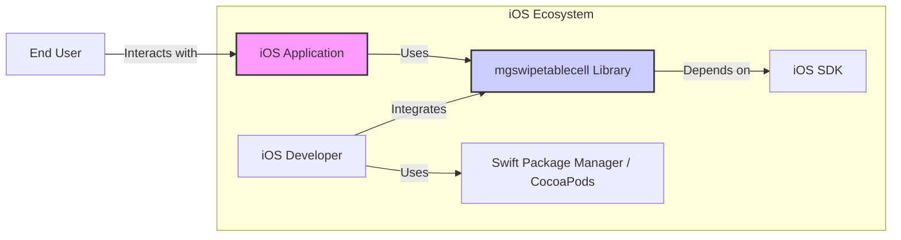
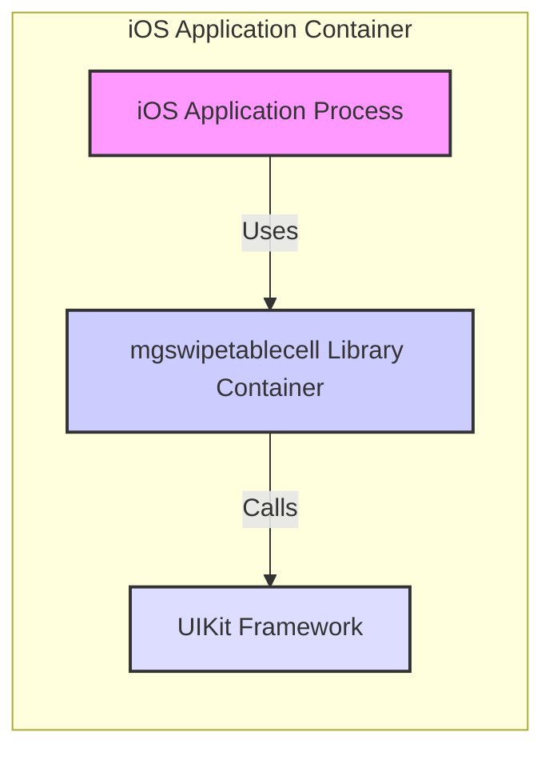
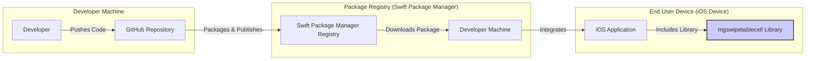
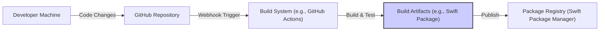

# BUSINESS POSTURE

This project is an open-source Swift library named `mgswipetablecell`. It provides a custom `UITableViewCell` subclass that enables swipeable actions, enhancing user interaction in iOS applications.

- Business Priorities and Goals:
  - Provide a reusable and easy-to-integrate component for iOS developers to add swipe actions to table view cells.
  - Improve user experience in iOS applications by enabling intuitive swipe-based interactions.
  - Offer a well-documented and maintained open-source library for the iOS development community.

- Most Important Business Risks:
  - Code quality and stability: Bugs or crashes in the library could negatively impact applications using it, leading to poor user experience and potential application instability.
  - Security vulnerabilities: Security flaws in the library could be exploited by malicious actors if the library is used in applications handling sensitive data (although the library itself is UI focused and unlikely to directly handle sensitive data).
  - Maintainability and updates: Lack of maintenance or timely updates could lead to the library becoming outdated or incompatible with newer iOS versions, reducing its usefulness and potentially introducing security issues due to outdated dependencies.
  - Adoption and community support: Low adoption rates or lack of community support could hinder the library's growth and long-term viability.

# SECURITY POSTURE

- Security Controls:
  - security control: Code hosted on GitHub, leveraging GitHub's infrastructure security. (Implemented: GitHub platform)
  - security control: Open-source nature allows for community code review and potential security audits. (Implemented: Open-source model)

- Accepted Risks:
  - accepted risk: Limited formal security testing or dedicated security resources for this open-source project.
  - accepted risk: Reliance on community contributions for identifying and addressing security vulnerabilities.
  - accepted risk: Potential for dependencies to introduce vulnerabilities (though this project appears to have minimal external dependencies).

- Recommended Security Controls:
  - security control: Implement basic static code analysis (SAST) using freely available tools to identify potential code quality and security issues.
  - security control: Regularly check for dependency updates and known vulnerabilities in any external libraries used (though currently minimal).
  - security control: Encourage community contributions and code reviews, specifically focusing on security aspects.
  - security control: Provide clear documentation on how to use the library securely, highlighting any potential security considerations for developers integrating it into their applications.

- Security Requirements:
  - Authentication: Not applicable. This library is a UI component and does not handle user authentication.
  - Authorization: Not applicable. This library does not handle user authorization.
  - Input Validation: While the library primarily receives programmatic inputs (API calls), ensure proper validation of any input parameters to prevent unexpected behavior or crashes. Focus on validating data passed to public methods and properties.
  - Cryptography: Not applicable. This library does not require cryptographic operations as it is a UI component and does not handle sensitive data directly. However, applications using this library might handle sensitive data and should implement appropriate cryptography measures at the application level, outside the scope of this library.

# DESIGN

## C4 CONTEXT

- Elements of Context Diagram:
  - - Name: iOS Application
    - Type: Software System
    - Description: An iOS application developed by an iOS developer that utilizes the `mgswipetablecell` library to provide swipeable table view cells.
    - Responsibilities: Provides functionality to end users, integrates and utilizes the `mgswipetablecell` library.
    - Security controls: Application-level security controls, including authentication, authorization, input validation, data protection, and secure communication, are the responsibility of the iOS application itself.

  - - Name: mgswipetablecell Library
    - Type: Software System / Library
    - Description: A Swift library providing a custom `UITableViewCell` subclass with swipe action capabilities.
    - Responsibilities: Provides reusable UI component for swipeable table view cells, handles UI rendering and user interaction related to swipe actions.
    - Security controls: Input validation within the library for API calls, proper error handling to prevent information leaks, and adherence to secure coding practices.

  - - Name: iOS Developer
    - Type: Person
    - Description: A software developer who integrates the `mgswipetablecell` library into their iOS applications.
    - Responsibilities: Develops and maintains iOS applications, integrates third-party libraries, ensures secure and proper usage of libraries.
    - Security controls: Secure development practices, code review, dependency management, and application-level security implementation.

  - - Name: Swift Package Manager / CocoaPods
    - Type: Software System / Package Manager
    - Description: Dependency management tools used by iOS developers to integrate libraries like `mgswipetablecell` into their projects.
    - Responsibilities: Package and distribute iOS libraries, manage dependencies, facilitate library integration into iOS projects.
    - Security controls: Package integrity verification, dependency vulnerability scanning (provided by some package managers or external tools).

  - - Name: iOS SDK
    - Type: Software System / SDK
    - Description: Apple's Software Development Kit for iOS, providing APIs and tools for iOS application development, which `mgswipetablecell` depends on.
    - Responsibilities: Provides core iOS functionalities, UI components, and APIs used by iOS applications and libraries.
    - Security controls: Security controls are managed by Apple within the iOS SDK and operating system.

  - - Name: End User
    - Type: Person
    - Description: The user who interacts with the iOS application that incorporates the `mgswipetablecell` library.
    - Responsibilities: Uses the iOS application for its intended purpose, interacts with the UI including swipeable table view cells.
    - Security controls: User-level security practices, such as strong passwords and awareness of phishing attacks, are relevant to the overall security of the application they are using, but not directly related to the library itself.

## C4 CONTAINER

- Elements of Container Diagram:
  - - Name: iOS Application Process
    - Type: Process
    - Description: The running process of an iOS application that has integrated the `mgswipetablecell` library.
    - Responsibilities: Executes the application code, manages application state, interacts with the operating system and other containers.
    - Security controls: Operating system level security controls, application sandbox, and application-level security measures.

  - - Name: mgswipetablecell Library Container
    - Type: Library / Module
    - Description: The compiled and integrated `mgswipetablecell` library within the iOS application process. It's a logical container representing the library's code.
    - Responsibilities: Provides swipeable table view cell functionality within the application, handles UI rendering and user interactions for swipe actions.
    - Security controls: Input validation within the library code, memory safety practices in Swift, and adherence to secure coding guidelines.

  - - Name: UIKit Framework
    - Type: Framework
    - Description: Apple's UIKit framework, which `mgswipetablecell` relies on for UI components and functionalities.
    - Responsibilities: Provides fundamental UI building blocks and functionalities for iOS applications.
    - Security controls: Security controls are managed by Apple within the UIKit framework and iOS SDK.

## DEPLOYMENT

Deployment for a library like `mgswipetablecell` is about how it's made available to developers, not about deploying a running instance of the library itself. Developers integrate it into their applications, which are then deployed to end-user devices.

Deployment Options for Library Distribution:
1. Swift Package Manager (SPM): Distribute the library as a Swift package.
2. CocoaPods: Distribute the library as a CocoaPod.
3. Carthage (less common now): Distribute the library via Carthage.
4. Manual Integration: Developers download source code and manually integrate.

We will focus on Swift Package Manager as a modern and recommended approach.

- Elements of Deployment Diagram:
  - - Name: Developer
    - Type: Person
    - Description: The developer who creates and maintains the `mgswipetablecell` library.
    - Responsibilities: Writes code, tests, publishes updates, and maintains the library.
    - Security controls: Secure coding practices, secure development environment, and secure credentials for publishing.

  - - Name: GitHub Repository
    - Type: Code Repository
    - Description: The GitHub repository hosting the source code of the `mgswipetablecell` library.
    - Responsibilities: Version control, code storage, collaboration platform, and release management.
    - Security controls: GitHub's security features, access control, branch protection, and vulnerability scanning.

  - - Name: Swift Package Manager Registry
    - Type: Package Registry
    - Description: Apple's Swift Package Manager registry (or potentially other registries if using CocoaPods or similar).
    - Responsibilities: Hosts and distributes Swift packages, manages package versions, and facilitates package download and integration.
    - Security controls: Package integrity verification, secure distribution channels, and registry security measures managed by Apple (or respective registry provider).

  - - Name: Developer Machine
    - Type: Development Environment
    - Description: The development machine used by an iOS developer to build and integrate the `mgswipetablecell` library into their iOS application.
    - Responsibilities: Development, building, testing, and integration of the library.
    - Security controls: Developer machine security, secure development tools, and dependency management practices.

  - - Name: iOS Application
    - Type: Application Instance
    - Description: An instance of an iOS application running on an end-user's iOS device, which includes the `mgswipetablecell` library.
    - Responsibilities: Provides application functionality to the end user, utilizes the integrated library.
    - Security controls: Application sandbox, operating system security, and application-level security controls.

  - - Name: mgswipetablecell Library
    - Type: Library Instance
    - Description: An instance of the `mgswipetablecell` library integrated within the iOS application on the end-user's device.
    - Responsibilities: Provides swipeable table view cell functionality within the running application.
    - Security controls: Library-level security controls integrated into the application instance.

## BUILD

- Elements of Build Diagram:
  - - Name: Developer Machine
    - Type: Development Environment
    - Description: Developer's local machine where code changes are made and potentially locally built.
    - Responsibilities: Code development, local testing, and pushing code changes to the repository.
    - Security controls: Developer machine security, secure development tools, and code signing (if applicable for local builds).

  - - Name: GitHub Repository
    - Type: Code Repository
    - Description: GitHub repository hosting the source code, triggering the build process upon code changes.
    - Responsibilities: Version control, code storage, and triggering automated build pipelines.
    - Security controls: GitHub's security features, access control, and branch protection.

  - - Name: Build System (e.g., GitHub Actions)
    - Type: CI/CD System
    - Description: An automated build system, such as GitHub Actions, that builds, tests, and potentially performs security checks on the code.
    - Responsibilities: Automated building, testing, static analysis, and potentially vulnerability scanning.
    - Security controls: Secure build environment, access control to build system, and security checks integrated into the build pipeline (e.g., SAST).

  - - Name: Build Artifacts (e.g., Swift Package)
    - Type: Software Artifact
    - Description: The output of the build process, such as a compiled Swift package or CocoaPod.
    - Responsibilities: Package containing the compiled library, ready for distribution.
    - Security controls: Code signing (if applicable), integrity checks during packaging, and secure storage of build artifacts before publishing.

  - - Name: Package Registry (Swift Package Manager)
    - Type: Package Registry
    - Description: Swift Package Manager registry where the built library package is published for developers to use.
    - Responsibilities: Distribution of the library package to developers.
    - Security controls: Package integrity verification, secure distribution channels, and registry security measures.

# RISK ASSESSMENT

- Critical Business Processes We Are Trying to Protect:
  - For the `mgswipetablecell` library itself, there isn't a direct critical business process. Its value lies in providing a useful component to other applications.
  - For applications using this library, the critical business processes are application-specific. The library should not negatively impact these processes by introducing bugs or security vulnerabilities.

- Data We Are Trying to Protect and Their Sensitivity:
  - The `mgswipetablecell` library itself does not directly handle or store sensitive data.
  - Applications using this library may handle sensitive data. The library should be designed and implemented to avoid unintentionally exposing or compromising data handled by the applications using it. The sensitivity of data depends entirely on the applications integrating this library.

# QUESTIONS & ASSUMPTIONS

- Questions:
  - Are there any specific performance requirements for the swipeable table view cell functionality?
  - Are there any known compatibility issues with specific iOS versions or device types?
  - Is there a roadmap for future features or enhancements for the library?
  - Are there any specific security concerns that have been raised or considered during the development of this library?

- Assumptions:
  - BUSINESS POSTURE: The primary goal is to provide a useful and well-maintained open-source UI library for the iOS community. Adoption and positive community feedback are key success metrics.
  - SECURITY POSTURE: Security is important but balanced with the nature of an open-source UI library. Focus is on preventing common vulnerabilities and ensuring the library doesn't introduce security risks into applications using it. Formal security audits are not assumed for this project at this stage.
  - DESIGN: The library is designed as a modular UI component with minimal external dependencies, focusing on ease of integration and usability within iOS applications. Deployment is primarily through Swift Package Manager for ease of distribution and integration.