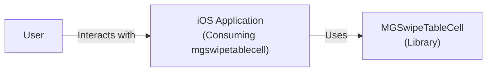
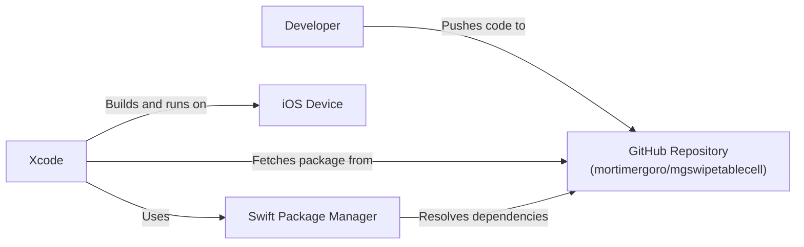
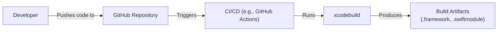

Okay, let's create a design document for the `mgswipetablecell` project.

# BUSINESS POSTURE

Business Priorities and Goals:

*   Provide a reusable, easy-to-integrate swipeable table cell component for iOS applications.
*   Improve developer productivity by offering a pre-built solution for a common UI pattern.
*   Offer a customizable component that can be adapted to various application designs.
*   Maintain a lightweight and performant component to avoid negatively impacting application performance.
*   Provide clear documentation and examples to facilitate adoption.

Most Important Business Risks:

*   Component Instability: Bugs or performance issues in the component could negatively impact applications that use it, leading to user dissatisfaction or developer frustration.
*   Lack of Adoption: If the component is difficult to use, poorly documented, or doesn't meet developer needs, it may not be widely adopted, diminishing its value.
*   Security Vulnerabilities: Although unlikely for a UI component, any vulnerabilities could be exploited, potentially leading to data breaches or application compromise.
*   Maintenance Overhead: If the component is not well-designed, maintaining it and updating it for new iOS versions could become a significant burden.
*   Compatibility Issues: The component must remain compatible with a reasonable range of iOS versions and device types to maximize its usefulness.

# SECURITY POSTURE

Existing Security Controls:

*   security control: Code Reviews: The GitHub repository shows evidence of pull requests, suggesting that code reviews are part of the development process. (Inferred from GitHub repository structure).
*   security control: Static Analysis: While not explicitly mentioned, it's common practice to use static analysis tools (like those built into Xcode) to identify potential code quality and security issues. (Assumed standard practice).
*   security control: Limited External Dependencies: The project appears to have minimal external dependencies, reducing the risk of supply chain attacks. (Inferred from project structure).

Accepted Risks:

*   accepted risk: UI Component Vulnerabilities: The component primarily handles UI interactions, and the risk of significant security vulnerabilities is relatively low, though not zero.
*   accepted risk: Limited Input Validation: As a UI component, it likely relies on the consuming application to perform thorough input validation.

Recommended Security Controls:

*   security control: Fuzz Testing: Implement fuzz testing to ensure the component handles unexpected or malformed input gracefully. This is particularly important for any public-facing APIs or delegate methods.
*   security control: Security-Focused Code Reviews: Explicitly include security considerations in code reviews, even for UI components.
*   security control: Dependency Management: If any external dependencies are added, use a dependency management tool (like Swift Package Manager) and regularly check for known vulnerabilities in those dependencies.

Security Requirements:

*   Authentication: Not directly applicable to this UI component. Authentication should be handled by the consuming application.
*   Authorization: Not directly applicable. Authorization should be handled by the consuming application.
*   Input Validation: The component should handle invalid input gracefully, preventing crashes or unexpected behavior. However, the primary responsibility for input validation lies with the application using the component. The component should not make assumptions about the validity of data passed to it.
*   Cryptography: Not directly applicable, unless the component is used to display or handle sensitive data, in which case the application should handle encryption/decryption.

# DESIGN

## C4 CONTEXT

Element Description:

*   Element:
    *   Name: User
    *   Type: Person
    *   Description: The end-user of the iOS application.
    *   Responsibilities: Interacts with the iOS application, including table views containing swipeable cells.
    *   Security controls: N/A (External to the component)

*   Element:
    *   Name: iOS Application (Consuming mgswipetablecell)
    *   Type: Software System
    *   Description: An iOS application that integrates the `mgswipetablecell` library.
    *   Responsibilities: Handles application logic, data management, and overall UI presentation. Integrates and configures `mgswipetablecell` instances within its table views.
    *   Security controls: Implements application-level security controls (authentication, authorization, data protection, etc.). Performs input validation before passing data to `mgswipetablecell`.

*   Element:
    *   Name: MGSwipeTableCell (Library)
    *   Type: Software System
    *   Description: The `mgswipetablecell` library, providing the swipeable table cell functionality.
    *   Responsibilities: Provides the `MGSwipeTableCell` class and related functionality. Handles swipe gesture recognition and animation. Exposes delegate methods for customization and action handling.
    *   Security controls: Handles input from the application gracefully. Avoids making assumptions about data validity.

## C4 CONTAINER

Since this is a library, the container diagram is essentially the same as the context diagram. The library itself is the single "container."

Element Description:

*   Element:
    *   Name: User
    *   Type: Person
    *   Description: The end-user of the iOS application.
    *   Responsibilities: Interacts with the iOS application, including table views containing swipeable cells.
    *   Security controls: N/A (External to the component)

*   Element:
    *   Name: iOS Application (Consuming mgswipetablecell)
    *   Type: Software System
    *   Description: An iOS application that integrates the `mgswipetablecell` library.
    *   Responsibilities: Handles application logic, data management, and overall UI presentation. Integrates and configures `mgswipetablecell` instances within its table views.
    *   Security controls: Implements application-level security controls (authentication, authorization, data protection, etc.). Performs input validation before passing data to `mgswipetablecell`.

*   Element:
    *   Name: MGSwipeTableCell (Library)
    *   Type: Software System
    *   Description: The `mgswipetablecell` library, providing the swipeable table cell functionality.
    *   Responsibilities: Provides the `MGSwipeTableCell` class and related functionality. Handles swipe gesture recognition and animation. Exposes delegate methods for customization and action handling.
    *   Security controls: Handles input from the application gracefully. Avoids making assumptions about data validity.

## DEPLOYMENT

Deployment Solutions:

1.  Manual Integration: Developers can manually copy the source files into their Xcode project.
2.  CocoaPods: The library can be distributed as a CocoaPod.
3.  Swift Package Manager (SPM): The library can be distributed as a Swift Package.
4.  Carthage: The library can be distributed via Carthage.

Chosen Solution (Swift Package Manager):

Swift Package Manager is the preferred solution due to its integration with Xcode and its ease of use.

Element Description:

*   Element:
    *   Name: Developer
    *   Type: Person
    *   Description: The developer integrating `mgswipetablecell` into their application.
    *   Responsibilities: Adds the `mgswipetablecell` package to their Xcode project using SPM.
    *   Security controls: N/A

*   Element:
    *   Name: GitHub Repository (mortimergoro/mgswipetablecell)
    *   Type: Code Repository
    *   Description: The source code repository for `mgswipetablecell`.
    *   Responsibilities: Hosts the source code and package manifest (Package.swift).
    *   Security controls: GitHub provides basic security features like access control and vulnerability scanning.

*   Element:
    *   Name: Xcode
    *   Type: IDE
    *   Description: Apple's integrated development environment.
    *   Responsibilities: Manages the project, builds the application, and integrates with SPM.
    *   Security controls: Xcode incorporates static analysis and other security features.

*   Element:
    *   Name: iOS Device
    *   Type: Device
    *   Description: The physical or simulated iOS device running the application.
    *   Responsibilities: Executes the application code.
    *   Security controls: iOS provides built-in security features like sandboxing and code signing.

*   Element:
    *   Name: Swift Package Manager
    *   Type: Dependency Manager
    *   Description: Apple's package manager for Swift.
    *   Responsibilities: Resolves and fetches package dependencies.
    *   Security controls: SPM verifies package integrity.

## BUILD

Build Process Description:

1.  Developer pushes code changes to the GitHub repository.
2.  A CI/CD system (e.g., GitHub Actions, Travis CI, CircleCI) is triggered by the push.
3.  The CI/CD system checks out the code.
4.  The CI/CD system uses `xcodebuild` (or a similar build tool) to build the `mgswipetablecell` library.
5.  Static analysis tools (e.g., SwiftLint) are run as part of the build process to enforce code style and identify potential issues.  This is a *security control*.
6.  Unit tests are executed to verify the functionality of the component. This is a *security control*.
7.  If the build and tests are successful, build artifacts (e.g., a `.framework` or `.swiftmodule` file) are generated.
8.  The build artifacts can be optionally uploaded to a release on GitHub or distributed through a package manager.

# RISK ASSESSMENT

Critical Business Processes:

*   Providing a stable and reliable UI component for iOS developers.
*   Maintaining a positive reputation within the iOS development community.

Data Protection:

*   This component does not directly handle sensitive data.  The primary data security concern is ensuring that the component does not introduce vulnerabilities that could be exploited to access or modify data handled by the consuming application.  Data sensitivity is determined by the application using the component.

# QUESTIONS & ASSUMPTIONS

Questions:

*   Are there any specific performance requirements or limitations for this component?
*   What is the minimum supported iOS version?
*   Are there any plans to add support for other UI frameworks (e.g., SwiftUI)?
*   Are there any specific accessibility requirements?
*   Is there a testing strategy in place, and what types of tests are included (unit, UI, integration)?

Assumptions:

*   BUSINESS POSTURE: The primary goal is to provide a useful and well-maintained open-source component. There is no direct monetization strategy.
*   SECURITY POSTURE: The component itself does not handle sensitive data directly. The consuming application is responsible for implementing appropriate security measures. Standard iOS development practices are followed.
*   DESIGN: The component is designed to be lightweight and easy to integrate. The design prioritizes simplicity and ease of use over extensive features. The Swift Package Manager is the primary distribution method.