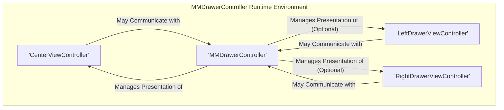
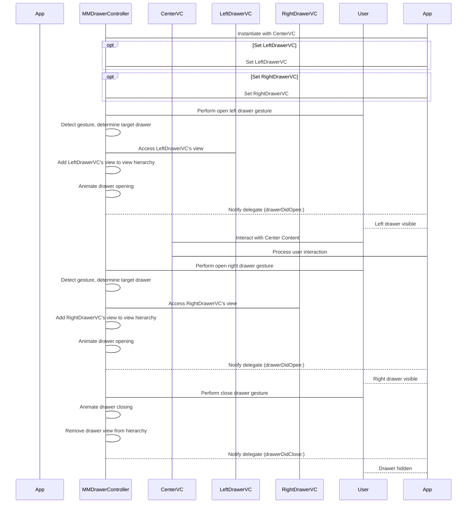

# Project Design Document: MMDrawerController - Enhanced for Threat Modeling

**Version:** 1.1
**Date:** October 26, 2023
**Author:** AI Software Architect

## 1. Project Overview

This document provides an enhanced architectural design overview of the `MMDrawerController` iOS library, specifically tailored to facilitate threat modeling. `MMDrawerController` enables developers to implement interactive drawer-based navigation in their iOS applications. It manages the presentation and transitions between a central content view controller and one or two side drawer view controllers (left and right). This document details the library's structure, component interactions, and data flow to identify potential areas of security concern.

## 2. Goals and Non-Goals

### 2.1. Goals

*   Present a refined architectural description of the `MMDrawerController` library, emphasizing security-relevant aspects.
*   Clearly define the responsibilities of each key component and their potential security implications.
*   Illustrate the flow of control and data, highlighting potential points of vulnerability or data exposure.
*   Provide a solid foundation for conducting a comprehensive threat modeling exercise on applications utilizing this library.
*   Document typical deployment scenarios and their potential impact on the security posture.

### 2.2. Non-Goals

*   Provide a line-by-line code audit or detailed implementation analysis.
*   Execute a formal threat modeling process within this document.
*   Propose specific security fixes or code modifications.
*   Document every single class, method, or property of the library.
*   Evaluate the performance or usability aspects of the library.

## 3. Architecture Overview

The `MMDrawerController` library operates as a container view controller, orchestrating the display of child view controllers. The core `MMDrawerController` instance manages the state and transitions between the central content and the optional side drawers. User interactions, such as gestures, trigger state changes and view manipulations managed by this central component.

## 4. Component Details

*   **`MMDrawerController`:**
    *   **Responsibility:** The central orchestrator responsible for managing the presentation of the center and drawer view controllers. It handles user input (gestures), programmatic requests to open/close drawers, and manages the view hierarchy accordingly.
    *   **Security Relevance:**  As the central component, vulnerabilities here could have a broad impact. Improper state management could lead to unexpected UI states. Flaws in gesture handling might be exploitable. The logic for adding and removing child view controllers needs to be secure to prevent injection or unexpected view display.
    *   **Key Functions:** `openDrawerSide:animated:completion:`, `closeDrawerAnimated:completion:`, gesture recognizer handling, view hierarchy manipulation.
*   **Center View Controller (`centerViewController`):**
    *   **Responsibility:** Displays the primary content of the application. Its content and functionality are determined by the application developer.
    *   **Security Relevance:**  The content displayed here is the primary target for information disclosure attacks. Input validation and secure data handling within this view controller are crucial. It might interact with the `MMDrawerController` to trigger drawer changes.
    *   **Key Characteristics:** Can be any `UIViewController` subclass, holds the main application content.
*   **Left Drawer View Controller (`leftDrawerViewController`):**
    *   **Responsibility:** Presents content when the left drawer is open. Typically used for navigation or secondary options.
    *   **Security Relevance:** Similar to the center view controller, the content here needs to be secured. If it displays sensitive navigation options, unauthorized access could be a concern. Communication with the `MMDrawerController` to indicate selection or actions needs to be handled securely.
    *   **Key Characteristics:** Can be any `UIViewController` subclass, often contains lists or menus.
*   **Right Drawer View Controller (`rightDrawerViewController`):**
    *   **Responsibility:** Presents content when the right drawer is open. Often used for settings or contextual actions.
    *   **Security Relevance:**  Content displayed here, especially settings, might control sensitive application behavior. Unauthorized modification through compromised drawer content is a potential risk. Secure communication with the `MMDrawerController` is also important.
    *   **Key Characteristics:** Can be any `UIViewController` subclass, often contains configuration options or action buttons.

## 5. Data Flow

The data flow within `MMDrawerController` primarily involves the management and presentation of `UIViewController` instances and their associated views.

*   **Initialization and View Setup:**
    *   The application developer provides instances of the center and optional drawer view controllers to the `MMDrawerController`.
    *   `MMDrawerController` adds the `centerViewController`'s view as its primary content view.
    *   The drawer view controllers' views are initially off-screen.
*   **Opening a Drawer (User Initiated):**
    *   A user performs a designated gesture (e.g., swiping from the edge).
    *   The gesture recognizers within `MMDrawerController` detect the gesture and determine the intended drawer (left or right).
    *   The corresponding drawer view controller's view is added to the view hierarchy, positioned appropriately.
    *   Animations, controlled by `MMDrawerController`, are applied to reveal the drawer. The `drawerVisualStateBlock` allows for custom visual transformations during the transition.
*   **Opening a Drawer (Programmatic):**
    *   The application calls methods like `openDrawerSide:animated:completion:` on the `MMDrawerController` instance.
    *   The process of adding the drawer view and animating it is similar to the gesture-initiated flow.
*   **Closing a Drawer:**
    *   User interaction (e.g., tapping outside the drawer, swiping) or programmatic calls trigger the closing process.
    *   `MMDrawerController` animates the drawer view off-screen.
    *   The drawer view is removed from the view hierarchy.
*   **Communication between View Controllers:**
    *   Direct communication between the center and drawer view controllers is typically managed by the application developer, not directly by `MMDrawerController`. This might involve delegation, notifications, shared data models, or reactive programming patterns.
    *   The `MMDrawerController` provides delegate methods that can be used to observe drawer state changes (e.g., `drawerWillOpen:`, `drawerDidClose:`).
*   **Customization Data Flow:**
    *   Developers can customize the appearance and behavior of the drawer transitions through properties on `MMDrawerController` (e.g., `maximumLeftDrawerWidth`, `animationVelocity`). These settings influence how the view hierarchy is manipulated and animated.

## 6. Security Considerations (Initial)

This section outlines initial security considerations based on the design of `MMDrawerController`. A more thorough threat modeling exercise would delve deeper into these areas.

*   **Information Disclosure via Drawer Content:**
    *   **Threat:** Sensitive data displayed in the left or right drawer could be exposed to unauthorized users if the device is compromised or left unattended.
    *   **Relevance:** Depends on the content managed by the application developer within these view controllers.
*   **UI Redressing/Clickjacking Potential:**
    *   **Threat:** Malicious overlays could be placed on top of the drawer or center view, tricking users into performing unintended actions when interacting with the drawer.
    *   **Relevance:**  Requires careful consideration of how the application handles touch events and view layering.
*   **State Manipulation Vulnerabilities:**
    *   **Threat:**  If the internal state of `MMDrawerController` can be manipulated unexpectedly, it could lead to inconsistent UI behavior or denial-of-service.
    *   **Relevance:** Depends on the robustness of the state management logic within `MMDrawerController`.
*   **Gesture Recognition Exploits:**
    *   **Threat:**  Flaws in the gesture recognition logic could potentially be exploited to trigger unintended drawer actions or bypass security measures.
    *   **Relevance:** Requires analysis of the library's gesture handling implementation.
*   **Insecure Handling of Custom Transitions:**
    *   **Threat:**  If developers use custom `drawerVisualStateBlock` implementations that manipulate views in insecure ways (e.g., exposing sensitive data during transitions), it could introduce vulnerabilities.
    *   **Relevance:** Depends on how developers utilize the customization options provided by the library.
*   **Injection through View Controller Management:**
    *   **Threat:**  Although unlikely with proper usage, vulnerabilities in how `MMDrawerController` adds or removes child view controllers could theoretically be exploited to inject malicious view controllers.
    *   **Relevance:** Requires scrutiny of the view hierarchy management logic.
*   **Deep Linking and Drawer State Inconsistencies:**
    *   **Threat:**  If the application uses deep linking to navigate to specific states involving drawers, improper handling of these links could lead to unexpected drawer states or expose content prematurely.
    *   **Relevance:** Depends on how the application integrates deep linking with the drawer functionality.
*   **Accessibility Issues Leading to Information Disclosure:**
    *   **Threat:**  Improperly configured accessibility features in conjunction with the drawer mechanism could inadvertently expose information to unauthorized assistive technologies.
    *   **Relevance:** Requires consideration of accessibility best practices when implementing drawer content.

## 7. Deployment Considerations

*   `MMDrawerController` is typically integrated into iOS projects using dependency management tools like CocoaPods, Carthage, or Swift Package Manager.
*   The library's security posture is heavily influenced by how the integrating application utilizes and configures it.
*   Developers are responsible for securing the content within the center and drawer view controllers. `MMDrawerController` primarily handles the presentation layer.
*   Customizations, such as disabling specific gestures or implementing custom transitions, can impact the attack surface.
*   The overall security of the application depends on a holistic approach, including secure coding practices within the view controllers managed by `MMDrawerController`.

## 8. Future Considerations for Security Analysis

*   Detailed code review of the state management logic within `MMDrawerController`.
*   Analysis of the implementation of gesture recognizers and their potential for manipulation.
*   Examination of the view hierarchy manipulation code for potential injection points.
*   Investigation of the security implications of the `drawerVisualStateBlock` and custom transition implementations.
*   Assessment of the library's resilience to unexpected input or error conditions.
*   Consideration of potential race conditions or concurrency issues within the library's implementation.
*   Analysis of the library's interaction with the underlying iOS security framework.

This enhanced design document provides a more detailed and security-focused overview of the `MMDrawerController` library. It serves as a valuable resource for conducting thorough threat modeling and identifying potential vulnerabilities in applications that utilize this component.
