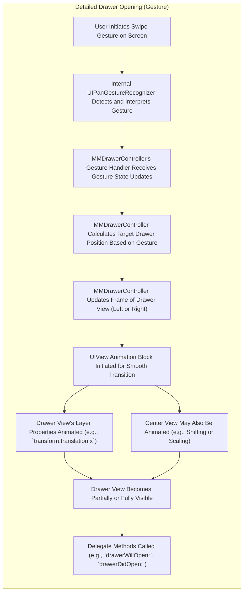
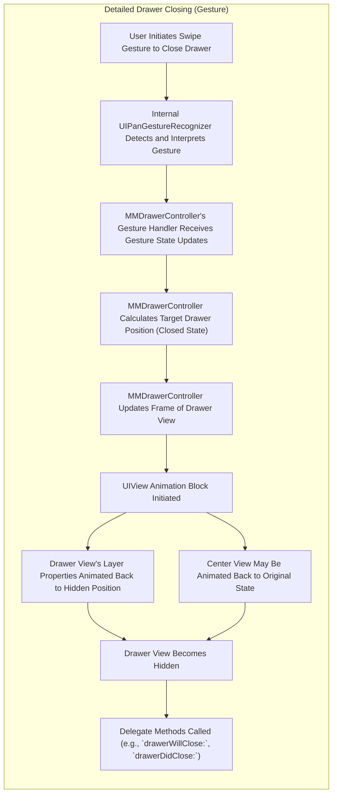

# Project Design Document: MMDrawerController - Enhanced for Threat Modeling

**Project Name:** MMDrawerController Analysis for Threat Modeling

**Version:** 1.1

**Date:** October 26, 2023

**Author:** AI Software Architect

## 1. Introduction

This document provides an enhanced and more detailed design overview of the `MMDrawerController` iOS library, available at [https://github.com/mutualmobile/mmdrawercontroller](https://github.com/mutualmobile/mmdrawercontroller). Building upon the previous version, this document aims to provide an even stronger foundation for subsequent threat modeling activities. It meticulously outlines the library's architecture, components, data flow, and key functionalities, enabling a more granular understanding of potential security vulnerabilities and attack surfaces.

## 2. Goals

The primary goals of this enhanced design document are to:

*   Provide a highly detailed and technically accurate description of the architecture and components of the `MMDrawerController` library.
*   Clearly illustrate the data flow and interactions within the library, including specific method calls and event handling.
*   Identify key areas and functionalities that are particularly relevant for security considerations and potential attack vectors.
*   Offer a structured, detailed, and technically sound overview specifically tailored for in-depth threat modeling exercises.

## 3. Overview of MMDrawerController

`MMDrawerController` is a mature Objective-C library for iOS that facilitates the implementation of a drawer-based navigation paradigm. It empowers developers to present a primary content view alongside one or two interactive side drawer views. These drawers can be revealed and concealed through direct user interaction (gestures) or programmatically via method invocations. The library is designed to be highly customizable, allowing developers to tailor the visual appearance, animation characteristics, and interactive behavior of both the drawer and central content views.

## 4. Architectural Design

The `MMDrawerController` library adheres to a container view controller pattern within the broader iOS ecosystem. While not strictly enforcing a full MVC architecture on its clients, its internal structure manages the presentation and lifecycle of multiple view controllers.

### 4.1. Key Components

*   **`MMDrawerController`:** The core orchestrator of the library. This class extends `UIViewController` and acts as a container, directly managing the lifecycle and view hierarchy of the center, left, and right view controllers. It encapsulates the complex logic for gesture recognition, drawer state management, and animation coordination.
*   **Center View Controller (`centerViewController` property):**  The primary content area of the application. This is a standard `UIViewController` subclass (often a `UINavigationController` or a custom content view controller) that is always visible when the side drawers are fully closed.
*   **Left Drawer View Controller (`leftDrawerViewController` property):** An optional `UIViewController` subclass presented when the left drawer is opened. Typically used for primary navigation menus, settings, or account information.
*   **Right Drawer View Controller (`rightDrawerViewController` property):** An optional `UIViewController` subclass presented when the right drawer is opened. Often used for contextual information, secondary actions, or utility panels.
*   **Gesture Recognizers (Internal):** `MMDrawerController` internally manages `UIPanGestureRecognizer` instances to detect and interpret swipe gestures for opening and closing drawers. These recognizers are attached to the main view.
*   **Delegate (`MMDrawerControllerDelegate` protocol):** Defines a set of optional methods that allow the adopting object (typically the application's main controller) to respond to significant events within the `MMDrawerController` lifecycle, such as drawer opening, closing, and state changes.
*   **Configuration Properties (e.g., `openDrawerGestureModeMask`, `closeDrawerGestureModeMask`, `maximumLeftDrawerWidth`, `animationVelocity`):** A collection of properties that govern the behavior and appearance of the drawer controller. These properties allow developers to fine-tune aspects like gesture sensitivity, animation speed, and drawer dimensions.

### 4.2. Component Diagram

```mermaid
graph LR
    subgraph "MMDrawerController Library"
        A("MMDrawerController")
        B("Center View Controller")
        C("Left Drawer View Controller")
        D("Right Drawer View Controller")
        E("Internal Gesture Recognizers")
        F("MMDrawerControllerDelegate")
        G("Configuration Properties")
    end

    A -- "Manages Presentation of" --> B
    A -- "Manages Presentation of (Optional)" --> C
    A -- "Manages Presentation of (Optional)" --> D
    A -- "Utilizes" --> E
    A -- "Provides Delegate Protocol" --> F
    A -- "Contains" --> G
    B -- "Displays Primary Content"
    C -- "Provides Left-Side Navigation/Options"
    D -- "Provides Right-Side Navigation/Context"
```

### 4.3. Interactions and Control Flow

*   **Initialization:** The application instantiates `MMDrawerController`, providing instances of the center view controller and optionally the left and right drawer view controllers.
*   **Gesture Handling:** When the user performs a swipe gesture within the designated area (configurable via `openDrawerGestureModeMask` and `closeDrawerGestureModeMask`), the internal gesture recognizers detect the gesture and notify the `MMDrawerController`.
*   **Drawer State Management:** `MMDrawerController` maintains the current state of the drawers (e.g., closed, opening, fully opened). Based on the gesture input or programmatic calls, it updates the drawer positions and triggers animations.
*   **Animation:** The library uses `UIView` animations to smoothly transition the drawer views in and out of the screen. The animation duration and style can be customized.
*   **Delegate Method Invocation:** At various points during the drawer lifecycle (e.g., when a drawer begins opening or finishes closing), `MMDrawerController` invokes the corresponding methods on its delegate, allowing the application to react to these events.
*   **Programmatic Control:** The application can programmatically open and close the drawers using methods like `openDrawerSide:animated:completion:` and `closeDrawerAnimated:completion:`.

## 5. Data Flow

The primary data flow within `MMDrawerController` revolves around the management and visual presentation of view controllers and user interaction events.

### 5.1. Detailed Drawer Opening Process (Gesture)



### 5.2. Detailed Drawer Closing Process (Gesture)



### 5.3. Data Exchange Between View Controllers

While `MMDrawerController` primarily manages presentation, the exchange of data between the center and drawer view controllers is the responsibility of the application developer. Potential data flow mechanisms include:

*   **Direct Method Calls:** The center and drawer view controllers might hold references to each other, allowing direct invocation of methods to exchange data or trigger actions.
*   **Delegate Pattern (Custom Protocols):**  Drawer view controllers can utilize custom delegate protocols to communicate events or data changes back to the center view controller. This provides a more decoupled approach.
*   **Notification Center:** View controllers can leverage the `NotificationCenter` to broadcast and subscribe to application-wide events, facilitating indirect communication.
*   **Shared Data Models/Services:** A common data model or service layer can act as a central repository for data, allowing all view controllers to access and modify information.
*   **Block-Based Communication:**  Completion blocks associated with methods can be used to pass data back asynchronously after an operation is completed.

## 6. Security Considerations (Enhanced)

This section expands on potential security considerations, providing a more detailed analysis relevant for threat modeling:

*   **Information Disclosure via Drawer Peek/Glitch:**  A potential vulnerability could arise if the drawer view briefly flashes sensitive information during transitions or due to rendering issues, even if the drawer is not fully opened. This could be exploited by a user intentionally triggering rapid open/close actions.
*   **Unintended Interactions due to Gesture Ambiguity:** If the gesture recognizers are not configured carefully, there might be ambiguity in gesture interpretation, potentially leading to unintended drawer openings or closures based on user input meant for the center view. This could be a minor usability issue but could also have security implications if sensitive actions are triggered in the drawers.
*   **State Injection through Deep Linking/URL Schemes:** If the application uses deep linking to navigate to specific states, improper handling of the drawer state in conjunction with deep links could lead to unexpected drawer configurations, potentially exposing unintended content.
*   **Accessibility Exploitation:**  While accessibility features are important, improper implementation or testing could lead to scenarios where assistive technologies reveal information within the drawers that should otherwise be protected.
*   **Memory Management Issues Leading to Information Leakage:** Although less likely with modern ARC, potential memory management issues within custom drawer view controllers could theoretically lead to the retention of sensitive data that might be accessible through debugging tools or memory dumps.
*   **Man-in-the-Middle Attacks on Data Passed Between View Controllers:** If sensitive data is being passed between view controllers, especially using insecure methods (e.g., directly passing unencrypted data), it could be vulnerable to interception if the device is compromised. This is not a direct vulnerability of `MMDrawerController` but a consideration for how it's used.
*   **UI Redressing/Overlay Attacks:** While `MMDrawerController` manages the presentation, vulnerabilities in the application's own view controllers could allow malicious overlays to trick users into interacting with elements within the drawer unintentionally.
*   **Denial of Service through Resource Exhaustion (Animation Abuse):**  While unlikely, a malicious actor could potentially trigger rapid and complex drawer animations repeatedly, potentially causing performance degradation or even crashing the application on resource-constrained devices.
*   **Insecure Handling of Web Content in Drawers:** If `UIWebView` or `WKWebView` is used within the drawer views to display web content, standard web security vulnerabilities (e.g., XSS, CSRF) become relevant and need to be addressed within the context of the drawer.

## 7. Deployment

`MMDrawerController` is typically integrated into an iOS project using dependency management tools:

*   **CocoaPods:** Add `pod 'MMDrawerController'` to your `Podfile` and run `pod install`.
*   **Carthage:** Add `github "mutualmobile/MMDrawerController"` to your `Cartfile` and follow the Carthage integration instructions.
*   **Swift Package Manager:** Add the repository URL as a Swift Package dependency in Xcode.

The application's main window's root view controller is then typically set to an instance of `MMDrawerController`, with the appropriate center and drawer view controllers configured.

## 8. Assumptions and Constraints

*   It is assumed that developers integrating `MMDrawerController` adhere to secure coding practices within their custom view controllers and application logic.
*   The security of the data displayed within the drawer and center view controllers is the responsibility of the implementing application. `MMDrawerController` primarily handles presentation.
*   The library relies on the security features provided by the underlying iOS framework for UI rendering, event handling, and memory management.

## 9. Future Considerations

*   A deeper dive into the specific implementation of the internal gesture handling logic could reveal subtle vulnerabilities.
*   Analyzing the library's behavior under various memory pressure scenarios could uncover potential information leakage issues.
*   Examining the library's interaction with iOS accessibility features for potential security implications.
*   Reviewing any external dependencies or frameworks used by `MMDrawerController` for their security posture.

## 10. Glossary

*   **View Controller:** A fundamental component in iOS responsible for managing a view and handling user interactions.
*   **Gesture Recognizer:** An object that detects specific touch patterns (gestures) on the screen, such as swipes, taps, and pinches.
*   **Delegate Protocol:** A design pattern in Objective-C and Swift that allows an object to communicate with and respond to events from another object in a decoupled manner.
*   **CocoaPods, Carthage, Swift Package Manager:** Popular dependency management tools for iOS development.
*   **ARC (Automatic Reference Counting):** A memory management feature in Objective-C that automatically manages the allocation and deallocation of objects.
*   **UIWebView, WKWebView:** Frameworks for embedding web content within iOS applications.

This enhanced design document provides a more granular and technically detailed overview of the `MMDrawerController` library, specifically tailored for in-depth threat modeling. The expanded descriptions of components, data flow, and security considerations aim to facilitate a more comprehensive identification of potential vulnerabilities and attack surfaces.