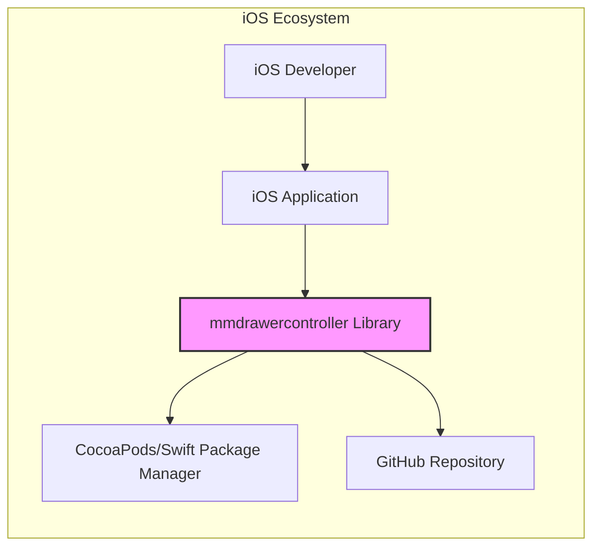
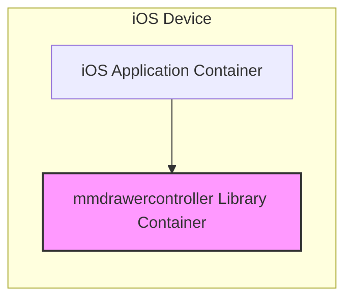
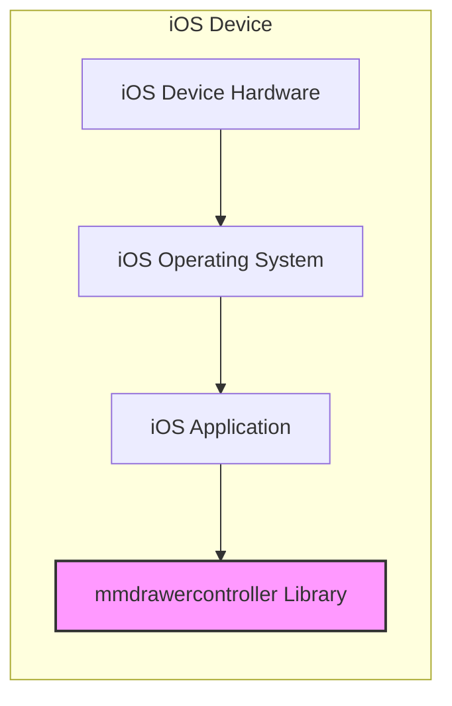

# BUSINESS POSTURE

This project is an open-source iOS library, specifically a `mmdrawercontroller`, designed to implement drawer-based navigation in iOS applications. The primary business goal for the maintainers of this open-source project is likely to provide a reusable, well-engineered, and easily integrable component that simplifies the development of user interfaces with drawer navigation patterns for iOS developers. Success is measured by developer adoption, community contributions, and positive feedback.

Business Priorities:
- Ease of integration and use for iOS developers.
- Stability and reliability of the library.
- Performance and responsiveness of the drawer navigation.
- Compatibility with different iOS versions and devices.
- Active community support and maintenance.

Business Risks:
- Low developer adoption if the library is not well-documented, has bugs, or is difficult to use.
- Lack of community contributions and maintenance leading to stagnation and obsolescence.
- Security vulnerabilities in the library that could be exploited in applications using it, damaging reputation and trust.
- Compatibility issues with new iOS versions or devices, requiring ongoing maintenance and updates.
- Competition from alternative drawer navigation libraries or native iOS features.

# SECURITY POSTURE

Existing Security Controls:
- security control: Source code is publicly available on GitHub, allowing for community review and scrutiny. Implemented: GitHub repository.
- security control: Reliance on GitHub's infrastructure security for repository hosting and access control. Implemented: GitHub platform.
- accepted risk: As an open-source project, formal security audits or penetration testing are unlikely to be performed regularly unless driven by community or specific users.
- accepted risk: Security vulnerabilities might be discovered and reported by the community, but there is no guaranteed SLA for vulnerability response and patching.
- accepted risk: Dependency on the security of the build and distribution processes, which are likely basic for an open-source library.

Recommended Security Controls:
- security control: Implement automated static analysis security testing (SAST) as part of the CI/CD pipeline to identify potential code-level vulnerabilities.
- security control: Integrate dependency scanning to identify and manage known vulnerabilities in third-party dependencies (if any, though unlikely for a UI library like this).
- security control: Establish a clear process for reporting and handling security vulnerabilities, including a security policy and contact information.
- security control: Encourage and facilitate community security reviews and contributions.

Security Requirements:
- Authentication: Not directly applicable to a UI library itself. Authentication is the responsibility of the application using the library.
- Authorization: Not directly applicable to a UI library itself. Authorization is the responsibility of the application using the library.
- Input Validation: The library should handle input parameters safely to prevent unexpected behavior or crashes. While it's a UI component, it might receive configuration data. Input validation should be implemented where applicable to ensure data integrity and prevent injection vulnerabilities (though unlikely in this type of library).
- Cryptography: Not expected to be a core requirement for a UI library like `mmdrawercontroller`. If the library were to handle or store any sensitive data (which is not its intended purpose), then appropriate cryptography would be necessary. For this library, cryptography is not a primary security requirement.
- Secure Software Development Lifecycle (SSDLC): Follow secure coding practices during development, including code reviews, unit testing, and integration testing to minimize vulnerabilities.
- Dependency Management: If the library depends on external libraries (unlikely for a UI component like this), ensure these dependencies are securely managed and regularly updated to address known vulnerabilities.

# DESIGN

## C4 CONTEXT



Context Diagram Elements:

- Name: iOS Developer
  - Type: Person
  - Description: Developers who build iOS applications and want to implement drawer-based navigation in their apps.
  - Responsibilities: Integrate the `mmdrawercontroller` library into their iOS projects, configure and customize the drawer behavior, and ensure proper usage within their applications.
  - Security controls: Responsible for securely using the library within their applications, including handling user data and application logic securely.

- Name: iOS Application
  - Type: Software System
  - Description: An iOS application developed by iOS developers that utilizes the `mmdrawercontroller` library to provide drawer navigation functionality to its users.
  - Responsibilities: Provide application functionality to end-users, manage user data, implement application-specific security controls, and utilize the `mmdrawercontroller` library for UI enhancement.
  - Security controls: Implement application-level security controls such as authentication, authorization, input validation, and data protection. Responsible for the overall security of the application, including the secure usage of third-party libraries like `mmdrawercontroller`.

- Name: mmdrawercontroller Library
  - Type: Software System
  - Description: An open-source iOS library providing reusable components and functionalities to implement drawer-based navigation in iOS applications.
  - Responsibilities: Provide a stable, performant, and easy-to-use drawer navigation component for iOS developers. Maintain code quality, address bug fixes, and potentially add new features.
  - Security controls: Implement secure coding practices, address reported vulnerabilities, and ensure the library itself does not introduce security weaknesses into applications using it. Focus on preventing common library vulnerabilities like unexpected crashes or UI rendering issues that could be indirectly exploited.

- Name: CocoaPods/Swift Package Manager
  - Type: Software System
  - Description: Dependency managers for iOS projects used by developers to integrate and manage external libraries like `mmdrawercontroller`.
  - Responsibilities: Provide a platform for distributing and managing iOS libraries, ensuring proper installation and version management for developers.
  - Security controls: Ensure the integrity and security of the package repository and distribution mechanism to prevent supply chain attacks.

- Name: GitHub Repository
  - Type: Software System
  - Description: The online repository hosting the source code of the `mmdrawercontroller` library, used for version control, collaboration, and distribution of the library.
  - Responsibilities: Host the source code, manage contributions, track issues, and provide a platform for developers to access and contribute to the library.
  - Security controls: GitHub's security controls for repository access, code integrity, and user authentication.

## C4 CONTAINER



Container Diagram Elements:

- Name: iOS Application Container
  - Type: Application Runtime Environment
  - Description: The runtime environment of an iOS application on an iOS device. This container hosts the application code and all integrated libraries.
  - Responsibilities: Execute the iOS application code, manage application resources, provide access to device functionalities, and interact with the operating system.
  - Security controls: iOS operating system security controls, application sandboxing, code signing, and runtime permissions.

- Name: mmdrawercontroller Library Container
  - Type: Library/Framework
  - Description: The `mmdrawercontroller` library as a component within the iOS application container. It's not a separate process or service but a part of the application's runtime.
  - Responsibilities: Provide drawer navigation UI functionality within the iOS application. Respond to application events and user interactions to control the drawer behavior and appearance.
  - Security controls: Inherits security controls from the iOS Application Container and the iOS operating system. Library code should be written securely to avoid introducing vulnerabilities into the application.

## DEPLOYMENT

Deployment Architecture: iOS Application Deployment



Deployment Diagram Elements:

- Name: iOS Device Hardware
  - Type: Infrastructure
  - Description: Physical iOS device (iPhone, iPad) on which the iOS application is deployed and executed.
  - Responsibilities: Provide the physical platform for running the iOS operating system and applications.
  - Security controls: Device-level security features like secure boot, hardware encryption, and physical security.

- Name: iOS Operating System
  - Type: Operating System
  - Description: Apple's iOS operating system running on the iOS device, providing the runtime environment for applications.
  - Responsibilities: Manage system resources, enforce security policies, provide APIs for applications, and manage application lifecycle.
  - Security controls: Kernel-level security, application sandboxing, permission management, code signing enforcement, and regular security updates.

- Name: iOS Application
  - Type: Application Instance
  - Description: An instance of an iOS application that incorporates the `mmdrawercontroller` library, deployed and running on an iOS device.
  - Responsibilities: Provide application functionality to the end-user, utilize the `mmdrawercontroller` library for UI, and interact with the iOS operating system.
  - Security controls: Application-level security controls implemented by the developer, leveraging iOS security features.

- Name: mmdrawercontroller Library
  - Type: Library Component
  - Description: The `mmdrawercontroller` library as a component deployed within the iOS application package on the iOS device.
  - Responsibilities: Provide drawer navigation functionality within the deployed iOS application.
  - Security controls: Inherits security controls from the iOS Application and the iOS Operating System.

## BUILD

Build Process: Open Source Library Build

```mermaid
flowchart LR
    A["Developer"] --> B("Code Changes");
    B --> C["GitHub Repository"];
    C --> D["CI/CD System (e.g., GitHub Actions)"];
    D --> E{Static Analysis Security Testing (SAST)};
    E -- No Issues --> F{Unit Tests};
    E -- Issues Found --> G["Security Report"];
    F -- Tests Passed --> H["Build Artifact (Library Source Code)"];
    F -- Tests Failed --> I["Build Failure Report"];
    H --> J["Distribution (CocoaPods, SPM, GitHub)"];
    style H fill:#f9f,stroke:#333,stroke-width:2px
```

Build Diagram Elements:

- Name: Developer
  - Type: Person
  - Description: A software developer contributing to the `mmdrawercontroller` project.
  - Responsibilities: Write code, fix bugs, implement new features, and submit code changes via pull requests.
  - Security controls: Secure development practices, code reviews, and adherence to project coding standards.

- Name: Code Changes
  - Type: Data
  - Description: Modifications to the source code of the `mmdrawercontroller` library.
  - Responsibilities: Represent new features, bug fixes, or improvements to the library.
  - Security controls: Version control using Git, code review process to ensure code quality and security.

- Name: GitHub Repository
  - Type: Code Repository
  - Description: The central repository hosting the source code and project history.
  - Responsibilities: Store and manage the source code, track changes, facilitate collaboration, and trigger CI/CD pipelines.
  - Security controls: GitHub's security features for access control, branch protection, and audit logging.

- Name: CI/CD System (e.g., GitHub Actions)
  - Type: Automation System
  - Description: An automated system that builds, tests, and potentially deploys the library upon code changes.
  - Responsibilities: Automate the build process, run tests, perform security checks, and generate build artifacts.
  - Security controls: Secure configuration of CI/CD pipelines, access control to CI/CD system, and secure storage of build secrets.

- Name: Static Analysis Security Testing (SAST)
  - Type: Security Tool
  - Description: Automated tools that analyze the source code to identify potential security vulnerabilities.
  - Responsibilities: Detect code-level vulnerabilities such as code injection, buffer overflows, and other common software weaknesses.
  - Security controls: Regularly updated vulnerability rules, proper configuration to scan relevant code paths.

- Name: Unit Tests
  - Type: Testing Framework
  - Description: Automated tests that verify the functionality of individual units of code.
  - Responsibilities: Ensure code correctness, identify functional bugs, and provide a level of confidence in code quality.
  - Security controls: Tests should cover security-relevant functionalities and edge cases.

- Name: Security Report
  - Type: Document
  - Description: Report generated by SAST tools detailing identified security vulnerabilities.
  - Responsibilities: Provide information for developers to remediate identified vulnerabilities.
  - Security controls: Secure storage and access control to security reports.

- Name: Build Artifact (Library Source Code)
  - Type: Software Package
  - Description: The compiled or packaged version of the `mmdrawercontroller` library, ready for distribution. For a library like this, it's likely the source code packaged for distribution via dependency managers.
  - Responsibilities: Provide a usable and distributable form of the library.
  - Security controls: Code signing (if applicable), integrity checks during packaging and distribution.

- Name: Distribution (CocoaPods, SPM, GitHub)
  - Type: Distribution Platform
  - Description: Platforms used to distribute the `mmdrawercontroller` library to iOS developers.
  - Responsibilities: Make the library easily accessible to developers for integration into their projects.
  - Security controls: Platform security controls, package integrity verification, and secure distribution channels.

- Name: Build Failure Report
  - Type: Document
  - Description: Report indicating that the build process failed, including details about the failure (e.g., test failures, compilation errors).
  - Responsibilities: Inform developers about build failures and provide information for debugging and fixing issues.
  - Security controls: Secure logging and access control to build failure reports.

# RISK ASSESSMENT

Critical Business Processes to Protect:
- For the `mmdrawercontroller` library itself, the critical process is maintaining the integrity and availability of the library for iOS developers. This includes the source code, build process, and distribution channels.
- For applications using the library, the critical business processes are application functionality and user experience, which could be impacted by vulnerabilities in the library.

Data to Protect and Sensitivity:
- Source code of the `mmdrawercontroller` library: High sensitivity. It represents the intellectual property and the core asset of the project. Unauthorized access or modification could lead to malicious versions or compromise the project's integrity.
- Build artifacts (library package): Medium sensitivity. Integrity is important to ensure developers are using a safe and unmodified version of the library.
- Security vulnerability reports: Medium sensitivity. Should be accessed by authorized developers to remediate vulnerabilities but should not be publicly disclosed prematurely.

# QUESTIONS & ASSUMPTIONS

Questions:
- What is the intended scope of security considerations for this document? Is it primarily focused on the security of the library itself, or also on the security implications for applications that use this library? (Assumption: Primarily focused on the library itself and its secure development and distribution, with consideration for implications for users).
- Are there any specific security incidents or concerns related to `mmdrawercontroller` or similar libraries that should be considered? (Assumption: No specific known incidents are provided, general open-source library security best practices apply).
- What is the expected level of effort for implementing security controls? Are there resource constraints or specific priorities? (Assumption: Focus on practical and high-impact security controls that are feasible for an open-source project, prioritizing automated checks and community engagement).

Assumptions:
- BUSINESS POSTURE: The primary goal is to provide a useful and reliable open-source UI library for iOS developers. Success is measured by adoption and community engagement.
- SECURITY POSTURE: Security is important to maintain trust and prevent vulnerabilities in applications using the library. Security efforts will be driven by community contributions and best practices for open-source projects. Formal security audits are unlikely without specific sponsorship.
- DESIGN: The library is a UI component and does not handle sensitive data directly. Security concerns are primarily related to code quality, preventing unexpected behavior, and ensuring supply chain security for distribution.