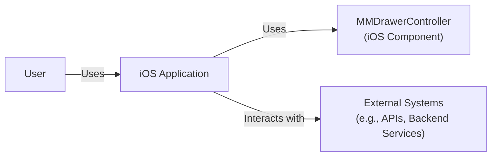
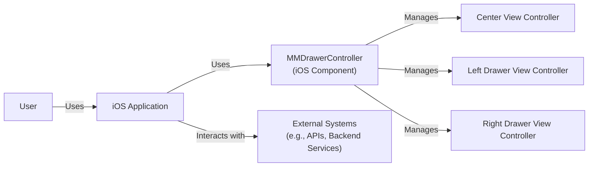
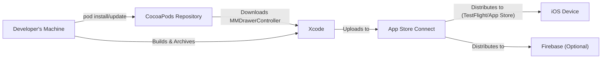
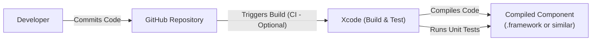

# Project Design Document: MMDrawerController

## BUSINESS POSTURE

*   Priorities and Goals:
    *   Provide a simple, easy-to-use, and customizable side drawer navigation component for iOS applications.
    *   Offer a lightweight alternative to more complex side drawer libraries.
    *   Maintain high performance and responsiveness.
    *   Ensure compatibility with a wide range of iOS versions and devices.
    *   Provide clear documentation and examples for easy adoption.
    *   Minimize external dependencies.

*   Business Risks:
    *   Usability issues: If the component is difficult to use or customize, developers may choose alternative solutions.
    *   Performance bottlenecks: Slow or unresponsive drawer animations could negatively impact the user experience of applications using the component.
    *   Compatibility problems: Incompatibility with certain iOS versions or devices could limit the component's adoption.
    *   Security vulnerabilities: Although primarily a UI component, potential vulnerabilities could be exploited if user input or sensitive data is mishandled.
    *   Lack of maintenance: If the project is not actively maintained, bugs and compatibility issues may arise over time, leading to developer frustration.
    *   Lack of features: If project is not supporting features that are supported by alternatives, developers may choose alternative solutions.

## SECURITY POSTURE

*   Existing Security Controls:
    *   security control: Code Reviews: The project's GitHub repository shows evidence of collaboration and code review, which helps identify potential security issues.
    *   security control: Static Analysis: While not explicitly mentioned, it's common practice to use static analysis tools (like those built into Xcode) during iOS development to identify potential vulnerabilities.
    *   security control: Community Scrutiny: As an open-source project, MMDrawerController benefits from community scrutiny, where users can report bugs and potential security issues.

*   Accepted Risks:
    *   accepted risk: Limited Input Validation: As a UI component, MMDrawerController likely has limited direct user input. The primary responsibility for input validation rests with the application using the component.
    *   accepted risk: Dependency Vulnerabilities: While the project aims to minimize dependencies, any included dependencies could introduce vulnerabilities.

*   Recommended Security Controls:
    *   security control: Integrate a Software Composition Analysis (SCA) tool to regularly scan for vulnerabilities in dependencies.
    *   security control: Implement fuzz testing to identify potential vulnerabilities related to unexpected input or edge cases.
    *   security control: Establish a clear security vulnerability reporting process.

*   Security Requirements:

    *   Authentication: Not directly applicable to this UI component. Authentication should be handled by the application using the component.
    *   Authorization: Not directly applicable. Authorization should be handled by the application.
    *   Input Validation: The component should handle any internal data manipulation safely, but the primary responsibility for input validation lies with the application using it.
    *   Cryptography: Not directly applicable, unless the component is used to display or manage sensitive data, in which case the application should handle encryption/decryption.

## DESIGN

### C4 CONTEXT

*   Elements Description:

    *   User:
        1.  Name - User
        2.  Type - Person
        3.  Description - The end-user interacting with the iOS application.
        4.  Responsibilities - Interacts with the iOS application's UI, including the side drawer.
        5.  Security controls - None (handled by the iOS application).

    *   MMDrawerController:
        1.  Name - MMDrawerController
        2.  Type - iOS Component
        3.  Description - The side drawer navigation component.
        4.  Responsibilities - Provides the side drawer functionality and UI elements.
        5.  Security controls - Limited input validation, safe handling of internal data.

    *   iOS Application:
        1.  Name - iOS Application
        2.  Type - Software System
        3.  Description - The iOS application that integrates the MMDrawerController component.
        4.  Responsibilities - Handles user authentication, authorization, data management, and interaction with external systems.
        5.  Security controls - Authentication, authorization, input validation, secure communication with external systems, data encryption (if applicable).

    *   External Systems:
        1.  Name - External Systems
        2.  Type - Software System
        3.  Description - External systems (APIs, backend services) that the iOS application interacts with.
        4.  Responsibilities - Provide data and services to the iOS application.
        5.  Security controls - Authentication, authorization, input validation, secure communication, data encryption.

### C4 CONTAINER

Since MMDrawerController is a single component, the Container diagram is essentially the same as the Context diagram, with a slight expansion to show internal modules if we consider them "containers."  For simplicity, we'll keep it very close to the Context diagram.

*   Elements Description:

    *   User:
        1.  Name - User
        2.  Type - Person
        3.  Description - The end-user interacting with the iOS application.
        4.  Responsibilities - Interacts with the iOS application's UI, including the side drawer.
        5.  Security controls - None (handled by the iOS application).

    *   MMDrawerController:
        1.  Name - MMDrawerController
        2.  Type - iOS Component
        3.  Description - The side drawer navigation component.
        4.  Responsibilities - Provides the side drawer functionality and UI elements, manages the center, left, and right view controllers.
        5.  Security controls - Limited input validation, safe handling of internal data.

    * CenterViewController:
        1. Name - Center View Controller
        2. Type - UIViewController
        3. Description - The main content view controller.
        4. Responsibilities - Displaying the primary content of the application.
        5. Security controls - Inherits security controls from the iOS Application.

    * LeftDrawerViewController:
        1. Name - Left Drawer View Controller
        2. Type - UIViewController
        3. Description - The view controller for the left side drawer.
        4. Responsibilities - Displaying the content of the left drawer.
        5. Security controls - Inherits security controls from the iOS Application.

    * RightDrawerViewController:
        1. Name - Right Drawer View Controller
        2. Type - UIViewController
        3. Description - The view controller for the right side drawer.
        4. Responsibilities - Displaying the content of the right drawer.
        5. Security controls - Inherits security controls from the iOS Application.

    *   iOS Application:
        1.  Name - iOS Application
        2.  Type - Software System
        3.  Description - The iOS application that integrates the MMDrawerController component.
        4.  Responsibilities - Handles user authentication, authorization, data management, and interaction with external systems.  Hosts the MMDrawerController and associated view controllers.
        5.  Security controls - Authentication, authorization, input validation, secure communication with external systems, data encryption (if applicable).

    *   External Systems:
        1.  Name - External Systems
        2.  Type - Software System
        3.  Description - External systems (APIs, backend services) that the iOS application interacts with.
        4.  Responsibilities - Provide data and services to the iOS application.
        5.  Security controls - Authentication, authorization, input validation, secure communication, data encryption.

### DEPLOYMENT

MMDrawerController is a library/component, not a standalone application. Therefore, it doesn't have its own deployment process in the traditional sense.  It is *integrated* into an iOS application, and the deployment process is that of the *hosting application*.  Here are the possible deployment scenarios:

1.  **Direct Integration (Source Code):**  The developer copies the MMDrawerController source code directly into their iOS project.
2.  **CocoaPods:** The developer uses CocoaPods, a dependency manager, to include MMDrawerController in their project.
3.  **Carthage:**  The developer uses Carthage, another dependency manager, to include MMDrawerController.
4.  **Swift Package Manager:** The developer uses Swift Package Manager (SPM) to include MMDrawerController.

We'll describe the deployment process assuming CocoaPods, as it's a common method.

*   Elements Description:

    *   Developer's Machine:
        1.  Name - Developer's Machine
        2.  Type - Workstation
        3.  Description - The developer's computer where the iOS application code resides.
        4.  Responsibilities - Writing code, managing dependencies, building the application.
        5.  Security controls - Local user authentication, disk encryption (recommended).

    *   CocoaPods Repository:
        1.  Name - CocoaPods Repository
        2.  Type - Package Repository
        3.  Description - The central repository for CocoaPods packages.
        4.  Responsibilities - Storing and providing access to MMDrawerController and other libraries.
        5.  Security controls - Access controls, integrity checks.

    *   Xcode:
        1.  Name - Xcode
        2.  Type - IDE
        3.  Description - Apple's Integrated Development Environment for iOS development.
        4.  Responsibilities - Building, compiling, and packaging the iOS application, including MMDrawerController.
        5.  Security controls - Code signing, static analysis.

    *   App Store Connect:
        1.  Name - App Store Connect
        2.  Type - Web Service
        3.  Description - Apple's platform for managing and distributing iOS applications.
        4.  Responsibilities - Managing app metadata, builds, testing, and releases.
        5.  Security controls - Authentication, authorization, code signing verification.

    *   iOS Device:
        1.  Name - iOS Device
        2.  Type - Mobile Device
        3.  Description - The end-user's iPhone or iPad.
        4.  Responsibilities - Running the iOS application.
        5.  Security controls - Device passcode, biometric authentication, sandboxing.

    * Firebase (Optional):
        1.  Name - Firebase
        2.  Type - BaaS
        3.  Description - Firebase platform that can be used for beta distribution.
        4.  Responsibilities - Distribute application to testers.
        5.  Security controls - Authentication, authorization.

### BUILD

The build process for MMDrawerController itself is typically handled by Xcode when it's integrated into a project. However, the library *itself* likely has a build process for development and testing.  This would involve compiling the Swift code, running unit tests, and potentially generating documentation.  Since it's a library, the "build artifact" is the compiled component ready to be linked into an iOS application.

*   Elements Description:

    *   Developer:
        1.  Name - Developer
        2.  Type - Person
        3.  Description - A developer contributing to the MMDrawerController project.
        4.  Responsibilities - Writing code, running tests, committing changes.
        5.  Security controls - Local user authentication, SSH keys for GitHub access.

    *   GitHub Repository:
        1.  Name - GitHub Repository
        2.  Type - Code Repository
        3.  Description - The repository hosting the MMDrawerController source code.
        4.  Responsibilities - Version control, collaboration, potentially triggering CI builds.
        5.  Security controls - Access controls, branch protection rules.

    *   Xcode (Build & Test):
        1.  Name - Xcode (Build & Test)
        2.  Type - IDE/Build System
        3.  Description - Xcode used to build and test the MMDrawerController component.
        4.  Responsibilities - Compiling the code, running unit tests.
        5.  Security controls - Static analysis (built-in to Xcode).

    *   Compiled Component:
        1.  Name - Compiled Component
        2.  Type - Build Artifact
        3.  Description - The compiled MMDrawerController component, ready for integration.
        4.  Responsibilities - N/A
        5.  Security controls - N/A

* Security Controls in Build Process:

    *   Code Review:  All changes should be reviewed before merging into the main branch.
    *   Static Analysis: Xcode's built-in static analyzer should be used to identify potential code issues.
    *   Unit Tests:  A comprehensive suite of unit tests should be run as part of the build process to ensure code quality and prevent regressions.
    *   Dependency Management (if applicable): If the project uses CocoaPods, Carthage, or SPM, regular updates and vulnerability scans of dependencies are crucial.

## RISK ASSESSMENT

*   Critical Business Processes:
    *   Providing a functional and user-friendly side drawer navigation component.
    *   Maintaining the component's compatibility with iOS updates.
    *   Ensuring the component's performance and responsiveness.

*   Data Protection:
    *   MMDrawerController itself does not handle sensitive user data directly.  It's a UI component.  The *application* using MMDrawerController is responsible for protecting any sensitive data it handles.
    *   Data Sensitivity:  Not applicable to the component itself.  The sensitivity of data handled by the *application* using the component would depend on the application's purpose.

## QUESTIONS & ASSUMPTIONS

*   Questions:
    *   Are there any specific performance benchmarks or targets for the component?
    *   Are there plans to support specific accessibility features?
    *   What is the long-term maintenance plan for the project?
    *   Are there any plans to add support for other dependency managers (e.g., Swift Package Manager)?
    *   What is the minimum supported iOS version?
    *   Are there any plans for supporting SwiftUI?

*   Assumptions:
    *   The primary use case is for standard side drawer navigation in iOS applications.
    *   The component is not intended to handle sensitive user data directly.
    *   Developers integrating the component are responsible for the security of their own applications.
    *   The project is maintained by the open-source community, with contributions and issue reports welcome.
    *   The project aims to remain lightweight and minimize external dependencies.
    *   The project is written in Swift (or a mix of Swift and Objective-C).