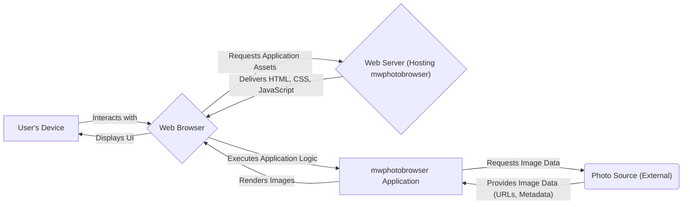

## Project Design Document: mwphotobrowser - Improved

**Version:** 1.1
**Date:** October 26, 2023
**Author:** AI Software Architect

### 1. Project Overview

The `mwphotobrowser` project is a client-side web application designed to provide a user-friendly and efficient way to browse and view collections of photos. It focuses on delivering a smooth and interactive experience for users viewing image galleries, likely sourced from an external data provider. The application handles fetching image data, rendering thumbnails for easy browsing, and offering a full-screen viewing mode with intuitive navigation. This document details the application's architecture, components, and data flow, serving as a foundation for understanding its structure and facilitating comprehensive threat modeling.

### 2. Goals

* Provide a clear, detailed, and unambiguous description of the `mwphotobrowser` application's architecture.
* Identify all key components, their responsibilities, and their interactions with each other.
* Clearly describe the flow of data within the application, from initial request to final rendering.
* Serve as a robust and informative basis for conducting a thorough and effective threat model of the application.

### 3. Architecture Overview

The `mwphotobrowser` application operates primarily within the user's web browser, functioning as a client-side application. It relies on an external "Photo Source" to provide the image data.

* **User's Device:** The physical device (desktop, laptop, tablet, mobile) used by the user to access the application.
* **Web Browser:** The software application on the user's device responsible for interpreting and executing the `mwphotobrowser`'s code (HTML, CSS, JavaScript). This is the runtime environment for the application.
* **Web Server (Hosting mwphotobrowser):** The server responsible for serving the static files (HTML, CSS, JavaScript, potentially some configuration) of the `mwphotobrowser` application to the user's browser.
* **mwphotobrowser Application:** The collection of client-side code (HTML, CSS, JavaScript) that implements the photo browsing functionality. This includes UI rendering, data fetching, and user interaction handling.
* **Photo Source (External):**  The external system or service that stores and provides access to the actual photo files and associated metadata. This could be a variety of services such as:
    * A standard web server with a directory of images.
    * A cloud storage service like AWS S3, Google Cloud Storage, or Azure Blob Storage.
    * A dedicated image hosting platform or API.
    * A Content Delivery Network (CDN).

### 4. Detailed Component Descriptions

* **User Interface (UI) Components:**
    * **`index.html`:** The main HTML file that provides the structure and entry point for the application. It includes links to CSS and JavaScript files and defines the basic layout.
    * **CSS Files (e.g., `style.css`):**  Style sheets that define the visual presentation of the application, including layout, colors, fonts, and responsiveness across different devices.
    * **Image Grid/List Container:**  The HTML element (likely a `
` or `<ul>`) that holds the dynamically generated thumbnails of the photos.
    * **Thumbnail Elements (``):**  Individual image elements displaying reduced versions of the photos for browsing.
    * **Full-Screen Viewer Overlay:** A modal or overlay that appears when a user selects a thumbnail, displaying the full-size image.
    * **Navigation Controls (Buttons, Arrows):**  Interactive elements within the full-screen viewer that allow users to move between images (previous, next).
    * **Close Button/Icon:** An element to close the full-screen viewer and return to the thumbnail view.
    * **Loading Indicator (Spinner, Progress Bar):**  Visual feedback displayed while images or data are being loaded.

* **Core Logic (JavaScript Modules/Functions):**
    * **`dataFetcher.js` (or similar):**  Responsible for making asynchronous requests to the "Photo Source" to retrieve image data. This likely uses `fetch` API or `XMLHttpRequest`.
        * Handles constructing the request URL based on configuration.
        * Manages request headers (if any).
        * Processes the response (likely JSON or XML).
        * Implements error handling for network issues or invalid responses.
    * **`dataParser.js` (or similar):**  Parses the data received from the "Photo Source" to extract relevant information, such as image URLs, titles, descriptions, and other metadata.
        * Validates the structure and content of the received data.
        * Transforms the data into a usable format for the application.
    * **`thumbnailRenderer.js` (or similar):**  Takes the parsed image data and dynamically creates and populates the thumbnail elements in the image grid.
        * Sets the `src` attribute of `` tags to the thumbnail image URLs.
        * May handle lazy loading of thumbnails for performance.
    * **`fullScreenViewer.js` (or similar):**  Manages the display and behavior of the full-screen image viewer.
        * Loads and displays the full-size image when a thumbnail is clicked.
        * Handles navigation between images in the full-screen view.
        * Manages the opening and closing of the overlay.
    * **`navigationManager.js` (or similar):**  Handles user interactions with navigation controls (e.g., next, previous buttons, keyboard shortcuts).
        * Keeps track of the currently viewed image index.
        * Updates the displayed image in the full-screen viewer.
    * **`config.js` (or similar):**  Contains configuration settings for the application, such as:
        * The base URL of the "Photo Source" API endpoint.
        * Image size preferences (thumbnail size, full-size availability).
        * Any API keys or authentication tokens (if required, though less likely in a purely client-side app).
    * **`errorHandler.js` (or similar):**  Centralized module for handling errors that occur within the application, providing user feedback or logging errors.

### 5. Data Flow (Detailed)

The interaction between the user and the `mwphotobrowser` involves the following data flow:

1. **Initial Load:** The user accesses the application via a URL. The web browser requests the `index.html` file and associated assets (CSS, JavaScript) from the web server.
2. **Application Bootstrapping:** The browser loads and executes the JavaScript code. The `config.js` module is likely loaded first to retrieve application settings.
3. **Image Data Request:** The `dataFetcher.js` module, using configuration from `config.js`, makes an asynchronous request (e.g., HTTP GET) to the "Photo Source" to retrieve image data. This request might include parameters for pagination, filtering, or sorting.
4. **Photo Source Response:** The "Photo Source" processes the request and sends back a response, typically in JSON or XML format. This response contains an array or list of image metadata, including URLs for thumbnails and full-size images (if available), and potentially other information like titles or descriptions.
5. **Data Parsing and Validation:** The `dataParser.js` module receives the response from the "Photo Source." It parses the data, extracts relevant fields, and validates the data structure and content to ensure it's in the expected format.
6. **Thumbnail Rendering:** The `thumbnailRenderer.js` module takes the parsed image data and dynamically generates the thumbnail elements in the image grid container. The `src` attribute of each thumbnail `` tag is set to the corresponding thumbnail image URL.
7. **User Interaction (Thumbnail Click):** The user clicks on a thumbnail image.
8. **Full-Screen View Activation:** The `fullScreenViewer.js` module intercepts the click event. It retrieves the URL of the full-size image (either from the already loaded data or by making a separate request if needed).
9. **Full-Screen Image Display:** The full-screen viewer overlay is displayed. The full-size image is loaded and displayed within the overlay. Navigation controls are also activated.
10. **Navigation (Next/Previous):** When the user interacts with the navigation controls, the `navigationManager.js` module updates the index of the currently viewed image. The `fullScreenViewer.js` then updates the displayed image accordingly.
11. **Closing Full-Screen:** When the user clicks the close button, the full-screen viewer overlay is hidden, returning the user to the thumbnail grid.

### 6. Key Technologies

* **HTML5:**  Provides the structural foundation of the user interface.
* **CSS3:**  Used for styling and visual presentation, including layout and responsiveness.
* **JavaScript (ES6+):**  The core programming language for implementing the application's logic and interactivity.
* **Fetch API or XMLHttpRequest:** Used for making asynchronous HTTP requests to the "Photo Source."
* **JSON (JavaScript Object Notation) or XML:** Likely data formats for transferring image information from the "Photo Source."
* **Potentially JavaScript Libraries/Frameworks:** While the description doesn't explicitly mention them, libraries like React, Vue.js, or Angular *could* be used for more complex implementations, but based on the description, a simpler vanilla JavaScript approach is also possible.

### 7. Deployment Model

As a client-side application, `mwphotobrowser` is typically deployed as static files. Common deployment strategies include:

* **Static Web Hosting on a Traditional Web Server (e.g., Apache, Nginx):** Serving the HTML, CSS, and JavaScript files directly from a web server.
* **Cloud Storage Services with Static Website Hosting Enabled (e.g., AWS S3, Google Cloud Storage, Azure Blob Storage):** Hosting the files in cloud storage buckets configured for public access.
* **Content Delivery Networks (CDNs):** Distributing the application files through a CDN for improved performance and availability.
* **Platforms Optimized for Static Sites (e.g., GitHub Pages, Netlify, Vercel):**  Simplified deployment and hosting solutions for static websites directly from Git repositories.
* **Embedding within a Larger Web Application:** The `mwphotobrowser` could be integrated as a component within a more complex web application.

### 8. Security Considerations (Detailed for Threat Modeling)

This section outlines potential security considerations, categorized for clarity during threat modeling.

* **Client-Side Vulnerabilities:**
    * **Cross-Site Scripting (XSS):** If the application dynamically renders content based on data received from the "Photo Source" without proper sanitization, malicious scripts could be injected and executed in the user's browser. This is a significant risk if image metadata (like titles or descriptions) is displayed directly.
    * **DOM-based XSS:** Vulnerabilities arising from manipulating the Document Object Model (DOM) based on user input or data from the "Photo Source."
    * **Insecure Third-Party Libraries:** If external JavaScript libraries are used, vulnerabilities in those libraries could be exploited.
    * **Sensitive Data Exposure in Client-Side Code:**  Accidental inclusion of API keys or other sensitive information directly in the JavaScript code.
    * **Client-Side Logic Tampering:**  While harder to exploit directly, malicious users could potentially modify the client-side JavaScript code if they have access to the deployed files (less likely in typical hosting scenarios).

* **Communication with Photo Source:**
    * **Insecure HTTP:** If the communication with the "Photo Source" uses HTTP instead of HTTPS, data transmitted (including image URLs and potentially metadata) is vulnerable to eavesdropping and manipulation (Man-in-the-Middle attacks).
    * **Cross-Origin Resource Sharing (CORS) Misconfiguration:** If the "Photo Source" has improperly configured CORS policies, it could allow unauthorized websites to access the image data.
    * **Server-Side Request Forgery (SSRF) - Indirect:** While the `mwphotobrowser` is client-side, if the "Photo Source" itself is vulnerable to SSRF, an attacker could potentially leverage the `mwphotobrowser` to trigger requests to internal systems.

* **Photo Source Security:**
    * **Unauthorized Access to Images:** If the "Photo Source" lacks proper access controls, unauthorized users could potentially access or download images they shouldn't have access to.
    * **Data Integrity Issues:**  Compromised "Photo Source" could serve malicious or altered images.
    * **Denial of Service (DoS) against Photo Source:**  While the `mwphotobrowser` itself might not be directly vulnerable, a large number of requests from users could potentially overwhelm the "Photo Source."

* **Information Disclosure:**
    * **Exposure of Sensitive Metadata:** If the "Photo Source" provides more metadata than necessary (e.g., location data, user information), this could be inadvertently exposed by the `mwphotobrowser`.
    * **Leaking Internal Paths or Configurations:** Errors or poorly configured responses from the "Photo Source" could reveal internal server paths or configurations.

* **Input Validation and Error Handling:**
    * **Lack of Input Validation:**  If the application doesn't validate data received from the "Photo Source," it could be vulnerable to unexpected data formats or malicious payloads.
    * **Verbose Error Messages:**  Detailed error messages displayed to the user could reveal information about the application's internal workings.

This improved design document provides a more detailed and structured understanding of the `mwphotobrowser` application, making it a more effective tool for subsequent threat modeling activities.