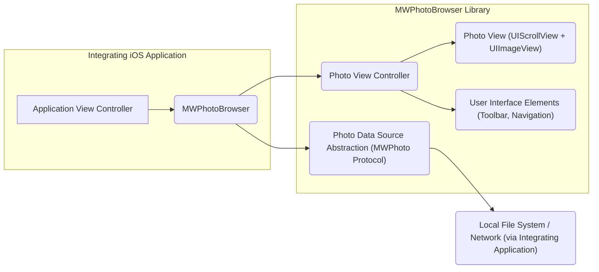

# Project Design Document: MWPhotoBrowser

**Version:** 1.1
**Date:** October 26, 2023
**Author:** Gemini (AI Language Model)
**Project Repository:** https://github.com/mwaterfall/mwphotobrowser

## 1. Introduction

This document provides a detailed design overview of the MWPhotoBrowser project, an iOS library for displaying one or more photos with zooming and panning capabilities, similar to the native iOS Photos app. This document is specifically crafted to serve as a foundation for subsequent threat modeling activities, providing a clear understanding of the library's architecture, components, and data flow from a security perspective.

## 2. Goals and Non-Goals

**Goals:**

* Provide a clear and comprehensive description of the MWPhotoBrowser library's architecture and components.
* Detail the data flow within the library, highlighting potential security-relevant interactions.
* Identify key interaction points, dependencies, and trust boundaries.
* Serve as a robust foundation for conducting a thorough threat model of the library, enabling the identification of potential vulnerabilities and attack vectors.

**Non-Goals:**

* Provide a detailed, line-by-line code-level explanation of every function and method.
* Include performance analysis, optimization strategies, or benchmarking data.
* Cover the implementation details of specific UI elements beyond their functional role and security implications.
* Discuss the historical context of the project, its evolution, or alternative implementation approaches.

## 3. Architectural Overview

MWPhotoBrowser is a client-side library designed for seamless integration into iOS applications. It operates entirely within the integrating application's process space and leverages standard iOS frameworks for its functionality. The library's primary responsibility is the efficient and user-friendly display and management of a collection of images.

The high-level architecture can be visualized as follows:

**Key Components:**

* **Integrating iOS Application:** The host application that embeds and utilizes the MWPhotoBrowser library. It is responsible for providing the photo data and initiating the presentation of the browser. This represents a significant trust boundary.
* **MWPhotoBrowser:** The central class of the library, responsible for orchestrating the photo browsing experience. It acts as a container view controller, managing the lifecycle and interactions of other components.
* **Photo Data Source Abstraction (MWPhoto Protocol):** Defines an interface for providing photo data to the browser. This abstraction allows for flexibility in how photos are sourced (local files, network URLs, etc.). The security of the underlying data source implementation is critical.
* **Photo View Controller:** Manages the display of a single photo within the browsing context. It handles the loading of images (potentially asynchronously), and manages the `Photo View`.
* **Photo View (UIScrollView + UIImageView):** The core UI element for displaying an individual photo. It leverages `UIScrollView` for zoom and pan functionality and `UIImageView` for rendering the image.
* **User Interface Elements (Toolbar, Navigation):** Provides standard iOS UI components for navigation between photos, displaying captions, and potentially triggering actions (e.g., sharing).
* **Local File System / Network (via Integrating Application):** Represents the potential sources of photo data. The MWPhotoBrowser library itself does not typically handle network requests directly; this is delegated to the integrating application.

## 4. Component Details

This section provides a more granular description of each component within the MWPhotoBrowser library, with a focus on security considerations.

### 4.1. MWPhotoBrowser

* **Functionality:**
    * Manages the overall photo browsing workflow, including presentation and dismissal.
    * Instantiates and manages `Photo View Controller` instances for each photo.
    * Handles user navigation between photos using a `UIPageViewController`.
    * Presents and manages the visibility of the toolbar and navigation elements.
    * Acts as the primary interface for the integrating application to interact with the library.
* **Inputs:**
    * An array of objects conforming to the `MWPhoto` protocol, representing the photos to be displayed. This is a critical input point for potential malicious data.
    * Configuration options, such as the starting photo index and display preferences.
    * User interaction events (swipes, taps on UI elements).
* **Outputs:**
    * Presents the photo browsing user interface to the user.
    * Provides delegate methods for the integrating application to respond to events like photo changes or user actions.
* **Dependencies:**
    * `UIKit` framework (essential for UI components and view controller management).
    * `UIPageViewController` (for managing the horizontal swiping between photos).
    * `UIScrollView` and `UIImageView` (indirectly, through `Photo View Controller`).
* **Security Considerations:**
    * **Input Validation:** Thoroughly validate the `MWPhoto` array to prevent unexpected data types, invalid URLs, or excessively large image sizes that could lead to crashes or denial-of-service.
    * **Delegate Method Security:** Ensure that the integrating application's delegate methods are designed to handle potentially untrusted data or actions initiated from the photo browser. Avoid exposing sensitive functionality directly through these delegates without proper authorization checks.
    * **State Management:** Securely manage the internal state of the browser to prevent race conditions or unexpected behavior that could be exploited.

### 4.2. Photo Data Source Abstraction (MWPhoto Protocol)

* **Functionality:**
    * Defines a contract for providing photo data to the `MWPhotoBrowser`.
    * Allows the integrating application to supply photos from various sources (local files, network, in-memory).
    * The `MWPhoto` protocol typically includes methods for retrieving the `UIImage`, a placeholder image, and potentially a caption.
* **Inputs:**
    * Requests for photo data (e.g., `UIImage`, placeholder image) for a specific photo.
* **Outputs:**
    * `UIImage` objects representing the photo.
    * Placeholder `UIImage` objects for loading states.
    * Captions or other metadata associated with the photo.
* **Dependencies:**
    * Defined and implemented by the integrating application. The security of this component is largely the responsibility of the integrator.
* **Security Considerations:**
    * **Data Integrity:** Ensure the integrity of the photo data being provided. If fetching from a network, verify the source and use secure protocols (HTTPS).
    * **Authorization and Access Control:** Implement appropriate authorization checks to ensure that the user has permission to access the requested photo data.
    * **Error Handling:** Implement robust error handling for cases where photo data cannot be loaded, preventing crashes or exposing sensitive information through error messages.
    * **Resource Management:** Be mindful of resource usage when loading images, especially from network sources. Implement appropriate caching and throttling mechanisms to prevent denial-of-service.

### 4.3. Photo View Controller

* **Functionality:**
    * Manages the display of a single photo within the `Photo View`.
    * Responsible for asynchronously loading the image data if it's not already available.
    * May display captions or other relevant information associated with the photo.
    * Handles user interaction within the single photo view (e.g., double-tap to zoom).
* **Inputs:**
    * An `MWPhoto` object representing the photo to be displayed.
* **Outputs:**
    * A view (`Photo View`) displaying the photo and allowing user interaction.
* **Dependencies:**
    * `UIKit` framework.
    * `UIScrollView` and `UIImageView` (for the `Photo View`).
    * Potentially image loading libraries or mechanisms provided by the integrating application.
* **Security Considerations:**
    * **Image Decoding Vulnerabilities:** Be aware of potential vulnerabilities in the underlying image decoding libraries used by iOS. Maliciously crafted images could potentially exploit these vulnerabilities. While the library itself might not directly handle decoding, it's important to be aware of this risk.
    * **Memory Management:** Ensure proper memory management, especially when dealing with large, high-resolution images, to prevent crashes or excessive memory consumption.
    * **Content Security Policy (if applicable):** If captions or other dynamic content are displayed, ensure proper sanitization to prevent cross-site scripting (XSS) attacks if the content source is untrusted.

### 4.4. Photo View (UIScrollView + UIImageView)

* **Functionality:**
    * Provides the interactive surface for displaying the photo.
    * Uses `UIImageView` to render the image.
    * Leverages `UIScrollView` to enable zooming and panning of the image.
    * Handles user touch events for interaction.
* **Inputs:**
    * A `UIImage` object to display.
* **Outputs:**
    * An interactive view of the photo, allowing zooming and panning.
* **Dependencies:**
    * `UIKit` framework.
    * `UIScrollView`.
    * `UIImageView`.
* **Security Considerations:**
    * **Resource Exhaustion:** Be mindful of the potential for resource exhaustion if extremely large images are displayed, potentially leading to performance issues or crashes.
    * **Gesture Recognition:** Ensure that gesture recognition is handled securely and cannot be manipulated to cause unexpected behavior or bypass security measures.

### 4.5. User Interface Elements (Toolbar, Navigation)

* **Functionality:**
    * Provides standard iOS UI elements for navigating between photos (e.g., "Done" button, page indicators).
    * May display photo captions or other metadata.
    * Can include action buttons for features like sharing or deleting photos (typically implemented by the integrating application).
* **Inputs:**
    * Current photo index, total number of photos.
    * Photo captions or metadata to display.
    * User interactions (button presses).
* **Outputs:**
    * User-initiated actions (e.g., dismissal of the browser, triggering a share action).
* **Dependencies:**
    * `UIKit` framework.
    * `UIToolbar`, `UINavigationBar`, `UIBarButtonItem`, `UILabel`.
* **Security Considerations:**
    * **Action Handling Security:** Ensure that any actions triggered by toolbar buttons are handled securely by the integrating application. Validate user input and implement appropriate authorization checks before performing sensitive actions.
    * **Caption Sanitization:** If photo captions are sourced from untrusted sources, ensure proper sanitization to prevent potential injection attacks (e.g., displaying malicious links).
    * **Information Disclosure:** Be cautious about displaying sensitive metadata in the toolbar or navigation elements that the user should not have access to.

## 5. Data Flow (Detailed for Threat Modeling)

The primary data flow within MWPhotoBrowser revolves around retrieving, processing, and displaying photo data in response to user interaction. Understanding this flow is crucial for identifying potential points of vulnerability.

```mermaid
graph LR
    subgraph "User Interaction"
        A["User Navigates (Swipe/Tap)"]
    end
    A --> B("MWPhotoBrowser");
    B -- "Request MWPhoto Object (index)" --> C("Integrating Application (Photo Data Source)");
    C -- "Provide MWPhoto Object" --> D("MWPhotoBrowser");
    D -- "Request UIImage (from MWPhoto)" --> E("Integrating Application (MWPhoto Implementation)");
    E -- "Provide UIImage (or URL)" --> F("MWPhoto");
    F -- "Pass UIImage to Photo View Controller" --> G("Photo View Controller");
    G -- "Display UIImage in Photo View" --> H("Photo View (UIImageView)");
    H -- "Rendered Image" --> I("User");
    style C fill:#ccf,stroke:#333,stroke-width:2px
    style E fill:#ccf,stroke:#333,stroke-width:2px
```

**Detailed Data Flow with Security Focus:**

1. **User Navigates (Swipe/Tap):** The user interacts with the photo browser, typically by swiping to move to the next or previous photo, or tapping to interact with UI elements.
2. **MWPhotoBrowser:** The `MWPhotoBrowser` detects the navigation event and determines the index of the photo to be displayed.
3. **Request MWPhoto Object (index):** The `MWPhotoBrowser` requests the `MWPhoto` object for the corresponding index from the integrating application's data source. **This is a key interaction point where the integrating application provides the core data for the library.**
4. **Provide MWPhoto Object:** The integrating application provides the `MWPhoto` object. This object encapsulates information about the photo, such as a `UIImage` or a URL pointing to the image. **The integrity and validity of this object are crucial for security.**
5. **Request UIImage (from MWPhoto):** The `MWPhotoBrowser` (or more specifically, the `Photo View Controller`) requests the actual `UIImage` from the `MWPhoto` object.
6. **Provide UIImage (or URL):** The integrating application's implementation of the `MWPhoto` protocol provides the `UIImage` directly or provides a URL from which the image can be loaded. **If a URL is provided, the security of the network request becomes a concern.**
7. **Pass UIImage to Photo View Controller:** The `UIImage` is passed to the appropriate `Photo View Controller`.
8. **Display UIImage in Photo View:** The `Photo View Controller` sets the `UIImage` on the `UIImageView` within the `Photo View`.
9. **Rendered Image:** The `UIImageView` renders the image on the screen for the user.

**Security Touchpoints:**

* **Integrating Application (Photo Data Source):** The integrating application is responsible for the security of the underlying photo data. This includes authorization, data integrity, and secure network communication if fetching images remotely.
* **MWPhoto Object:** The `MWPhoto` object acts as a carrier for photo data. Ensuring its integrity and preventing manipulation is important.
* **Network Requests (if URLs are used):** If the `MWPhoto` object provides a URL, the security of the network request (HTTPS, certificate validation) is critical.

## 6. Security Considerations (Detailed for Threat Modeling)

This section expands on the initial security considerations, providing more specific examples of potential threats and vulnerabilities.

* **Malicious Image Injection:** An attacker could potentially provide a maliciously crafted image through the `MWPhoto` data source that exploits vulnerabilities in the underlying image decoding libraries, leading to crashes, arbitrary code execution, or information disclosure.
* **Insecure Network Communication:** If photo URLs are used, failing to enforce HTTPS could allow man-in-the-middle attacks, where an attacker intercepts and potentially modifies the image data.
* **Denial of Service (DoS):**
    * Providing an extremely large number of images could exhaust memory resources and cause the application to crash.
    * Providing excessively large image files could lead to performance degradation and potentially crash the application.
    * Repeatedly requesting non-existent or slow-to-load images could also lead to DoS.
* **Information Disclosure:**
    * Displaying sensitive metadata in photo captions or other UI elements without proper authorization could lead to information disclosure.
    * Improper error handling could inadvertently reveal sensitive information about the application's internal state or file system.
* **Cross-Site Scripting (XSS) in Captions:** If photo captions are sourced from untrusted sources and not properly sanitized, an attacker could inject malicious scripts that execute in the context of the application's UI.
* **Unauthorized Access to Local Files:** If the photo data source allows access to local files, vulnerabilities in the integrating application could be exploited to access files the user should not have permission to view.
* **Memory Leaks:** Improper memory management within the library or the integrating application when handling images could lead to memory leaks and eventually application crashes.
* **Input Validation Failures:** Failing to validate the input provided to the `MWPhotoBrowser` (e.g., the array of `MWPhoto` objects) could lead to unexpected behavior or crashes.
* **Data Integrity Issues:** If the photo data is modified in transit or at rest, the displayed images may be corrupted or contain malicious content.

## 7. Future Considerations (Impact on Security)

Future enhancements to the MWPhotoBrowser could introduce new attack surfaces and security considerations.

* **Direct Network Image Loading within the Library:** If the library were to handle network requests directly, it would need to implement robust security measures, including:
    * **Certificate Pinning:** To prevent man-in-the-middle attacks by verifying the server's SSL certificate.
    * **Secure Session Management:** To protect against session hijacking.
    * **Input Sanitization for URLs:** To prevent injection attacks.
    * **Rate Limiting:** To mitigate denial-of-service attacks.
* **Caching Mechanisms:** Implementing a caching mechanism would require careful consideration of:
    * **Cache Location:** Securely storing cached images (e.g., using the iOS Keychain for sensitive metadata).
    * **Cache Invalidation:** Implementing mechanisms to invalidate cached images when necessary.
    * **Access Control:** Ensuring that only authorized components can access the cache.
* **Image Editing Features:** Adding image editing capabilities would introduce new attack vectors related to:
    * **Data Tampering:** Attackers could potentially manipulate image data.
    * **Exif Data Manipulation:** Modifying or removing sensitive metadata.
    * **Introducing Malicious Content:** Embedding malicious data within edited images.
* **Integration with Cloud Services:** Direct integration with cloud storage services would require secure authentication and authorization mechanisms, potentially involving:
    * **OAuth 2.0 or similar protocols.**
    * **Secure storage of access tokens.**
    * **Proper handling of API keys and secrets.**

This improved design document provides a more detailed and security-focused overview of the MWPhotoBrowser library, making it a more effective foundation for conducting thorough threat modeling activities. The added details about potential threats and vulnerabilities, along with the refined data flow diagram, should facilitate a more comprehensive security analysis.