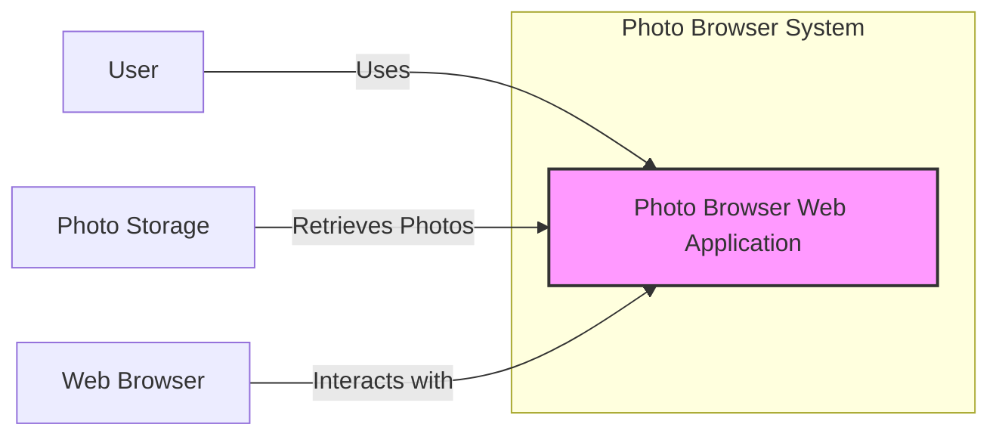
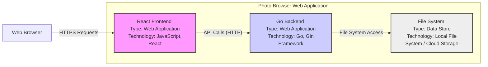
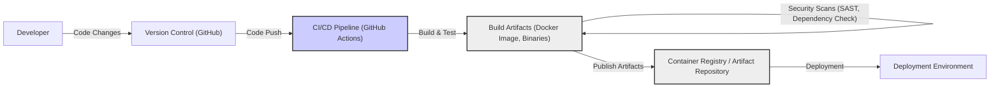

# BUSINESS POSTURE

This project, mwphotobrowser, aims to provide a simple and efficient way to browse photos using a web interface. The primary business goal is to offer users a user-friendly tool for viewing and managing their photo collections. For a startup or individual, this could be a side project to learn new technologies and potentially offer as a free or open-source tool. For a larger company, this could be a component of a broader photo management or media platform.

Business Priorities:
- User Experience: The application should be easy to use and provide a smooth photo browsing experience.
- Functionality: Core features like photo display, navigation, and basic management (e.g., viewing metadata) should be reliable and performant.
- Maintainability: The codebase should be well-structured and easy to maintain for future updates and feature additions.
- Time to Market (for a startup/company): If intended for wider use, rapid development and deployment are important.

Business Risks:
- Data Loss: If the application handles photo storage or management, data loss due to bugs or security vulnerabilities is a significant risk.
- Availability: If the application is intended for continuous use, downtime can negatively impact user experience.
- Security Breaches: Unauthorized access to user photos or the application itself can lead to privacy violations and reputational damage.
- Performance Issues: Slow loading times or application crashes can lead to user dissatisfaction and abandonment.

# SECURITY POSTURE

Existing Security Controls:
- security control: HTTPS is assumed for web traffic, providing encryption in transit. (Implicit in web application deployment)
- security control: Basic web application security best practices are likely followed in the codebase (e.g., framework security features). (Assumed based on common development practices)

Accepted Risks:
- accepted risk: Lack of formal security audits or penetration testing. (Common for early-stage projects or individual developers)
- accepted risk: Reliance on framework/library security. (Accepting the security posture of used frameworks and libraries)
- accepted risk: Basic input validation might be present, but comprehensive validation and sanitization might be lacking. (Depending on development effort)

Recommended Security Controls:
- security control: Implement robust input validation and sanitization to prevent injection attacks.
- security control: Implement proper authorization mechanisms to control access to photos and application features.
- security control: Regularly update dependencies to patch known security vulnerabilities.
- security control: Implement logging and monitoring to detect and respond to security incidents.
- security control: Consider using a Content Security Policy (CSP) to mitigate cross-site scripting (XSS) attacks.

Security Requirements:
- Authentication:
    - requirement: For user-specific photo collections, implement a secure authentication mechanism to verify user identity. (If applicable based on use case)
    - requirement: If no user accounts, ensure no sensitive administrative functions are exposed without authentication.
- Authorization:
    - requirement: Implement authorization to control access to photos and functionalities based on user roles or permissions (if user accounts are implemented).
    - requirement: Ensure that users can only access photos they are authorized to view.
- Input Validation:
    - requirement: Validate all user inputs to prevent injection attacks (e.g., SQL injection, command injection, XSS).
    - requirement: Sanitize user inputs before displaying them to prevent XSS attacks.
    - requirement: Validate file uploads to prevent malicious file uploads.
- Cryptography:
    - requirement: Use HTTPS for all communication to encrypt data in transit.
    - requirement: If storing sensitive data (e.g., user credentials), use strong encryption at rest. (If applicable based on use case)
    - requirement: Securely manage cryptographic keys if used.

# DESIGN

## C4 CONTEXT



Context Diagram Elements:

- Element:
    - Name: User
    - Type: Person
    - Description: End-user who wants to browse photos.
    - Responsibilities: Browse photos, interact with the web application.
    - Security controls: Uses a web browser with standard security features.

- Element:
    - Name: Photo Browser Web Application
    - Type: Software System
    - Description: The mwphotobrowser application, providing a web interface for browsing photos.
    - Responsibilities: Display photos, handle user requests, retrieve photos from storage.
    - Security controls: Input validation, authorization (if implemented), HTTPS.

- Element:
    - Name: Photo Storage
    - Type: External System
    - Description: System where photos are stored. Could be local file system, cloud storage, or database.
    - Responsibilities: Store and provide access to photo files.
    - Security controls: Access control lists, encryption at rest (depending on storage solution).

- Element:
    - Name: Web Browser
    - Type: Software System
    - Description: User's web browser (e.g., Chrome, Firefox, Safari) used to access the Photo Browser Web Application.
    - Responsibilities: Render web pages, execute JavaScript, communicate with the web application.
    - Security controls: Browser security features (e.g., sandboxing, Content Security Policy enforcement).

## C4 CONTAINER



Container Diagram Elements:

- Element:
    - Name: React Frontend
    - Type: Web Application
    - Description: Client-side application built with React, responsible for user interface and user interaction.
    - Responsibilities: Rendering UI, handling user input, making API calls to the backend, displaying photos.
    - Security controls: Input validation on the client-side, Content Security Policy, protection against XSS.

- Element:
    - Name: Go Backend
    - Type: Web Application
    - Description: Server-side application built with Go and Gin framework, responsible for business logic and data access.
    - Responsibilities: Handling API requests from the frontend, retrieving photos from storage, processing requests, authorization, input validation.
    - Security controls: Input validation, authorization logic, secure API design, logging, protection against injection attacks.

- Element:
    - Name: File System
    - Type: Data Store
    - Description: Storage system where photos are stored. Could be local file system or cloud storage service (e.g., AWS S3, Google Cloud Storage).
    - Responsibilities: Storing photo files, providing access to photo files.
    - Security controls: Access control lists, file system permissions, encryption at rest (depending on storage solution), backup and recovery.

## DEPLOYMENT

Deployment Architecture: Cloud Deployment (Example using AWS)

```mermaid
flowchart LR
    subgraph "AWS Cloud"
        subgraph "VPC"
            subgraph "Public Subnet"
                A["Load Balancer" <br> Type: AWS ELB]
                B["EC2 Instance(s)" <br> Type: Compute <br> Contains: Go Backend"]
            end
            subgraph "Private Subnet"
                C["EC2 Instance(s)" <br> Type: Compute <br> Contains: React Frontend (served via Nginx)]
                D["S3 Bucket" <br> Type: Storage <br> Contains: Photo Files]
            end
            A -- "Forwards Requests" --> B & C
            C -- "Retrieves Photos" --> D
        end
        E["Internet"] -- "HTTPS Requests" --> A
    end
    style A fill:#f9f,stroke:#333,stroke-width:2px
    style B fill:#ccf,stroke:#333,stroke-width:2px
    style C fill:#ccf,stroke:#333,stroke-width:2px
    style D fill:#eee,stroke:#333,stroke-width:2px
```

Deployment Diagram Elements:

- Element:
    - Name: Internet
    - Type: Network
    - Description: Public internet network.
    - Responsibilities: Provides connectivity for users to access the application.
    - Security controls: General internet security measures.

- Element:
    - Name: Load Balancer (AWS ELB)
    - Type: Infrastructure
    - Description: AWS Elastic Load Balancer, distributes incoming traffic across backend and frontend instances.
    - Responsibilities: Load balancing, SSL termination, traffic routing.
    - Security controls: SSL/TLS encryption, DDoS protection, access logs.

- Element:
    - Name: EC2 Instance(s) (Go Backend)
    - Type: Compute
    - Description: AWS EC2 instances running the Go backend application.
    - Responsibilities: Running backend application, processing API requests, interacting with storage.
    - Security controls: Instance security groups, OS hardening, application-level security controls.

- Element:
    - Name: EC2 Instance(s) (React Frontend)
    - Type: Compute
    - Description: AWS EC2 instances running Nginx to serve the React frontend application.
    - Responsibilities: Serving static frontend files, handling frontend requests.
    - Security controls: Instance security groups, OS hardening, Nginx security configurations.

- Element:
    - Name: S3 Bucket
    - Type: Storage
    - Description: AWS S3 bucket used for storing photo files.
    - Responsibilities: Storing photo files, providing scalable and durable storage.
    - Security controls: S3 bucket policies, access control lists, encryption at rest, versioning.

## BUILD

Build Process Diagram:



Build Process Description:

1. Developer: Developers write code and commit changes to the version control system.
2. Version Control (GitHub): GitHub repository hosts the source code and tracks changes.
3. CI/CD Pipeline (GitHub Actions): GitHub Actions is used for automated build, test, and deployment.
    - security control: Automated build process ensures consistent and repeatable builds.
    - security control: Pipeline can be configured to run security scans.
4. Build & Test: The CI/CD pipeline compiles the code, runs unit tests, and builds artifacts (e.g., Docker image for backend, static files for frontend).
    - security control: Unit tests help ensure code quality and reduce bugs.
5. Security Scans (SAST, Dependency Check): Static Application Security Testing (SAST) tools and dependency vulnerability scanners are integrated into the pipeline to identify potential security issues in the code and dependencies.
    - security control: SAST tools help identify code-level vulnerabilities.
    - security control: Dependency checks identify vulnerable libraries and dependencies.
6. Publish Artifacts: Build artifacts are published to a container registry (e.g., Docker Hub, AWS ECR) or artifact repository.
    - security control: Secure artifact repository ensures integrity and availability of build artifacts.
7. Deployment Environment: Artifacts from the repository are deployed to the target environment (e.g., AWS, on-premises servers).
    - security control: Deployment process should be automated and secure.

# RISK ASSESSMENT

Critical Business Processes:
- Photo Browsing: Core functionality of displaying and navigating photos.
- Photo Access: Secure and authorized access to photo storage.
- Application Availability: Ensuring the application is accessible to users when needed.

Data Sensitivity:
- Photos: User photos are considered personal data and can be sensitive depending on their content. Sensitivity level can be medium to high depending on the user and the nature of the photos.
- Application Logs: Logs may contain user activity and potentially IP addresses, considered low to medium sensitivity.
- Application Code: Source code is confidential and its compromise can lead to security vulnerabilities and intellectual property theft, considered medium sensitivity.

# QUESTIONS & ASSUMPTIONS

Questions:
- What is the intended user base for this application (personal use, small group, public)?
- What is the expected scale of photo storage and user traffic?
- Are there any specific compliance requirements (e.g., GDPR, HIPAA)?
- Is user authentication and authorization required?
- What type of photo storage is being used (local file system, cloud storage, database)?

Assumptions:
- The application is intended for general photo browsing and management.
- Security is a concern, but not necessarily at the highest enterprise level for the initial version.
- HTTPS is used for all web traffic.
- Basic security best practices are followed in development.
- Photo storage is assumed to be a file system or cloud storage service.
- Deployment is assumed to be in a cloud environment for scalability and availability.