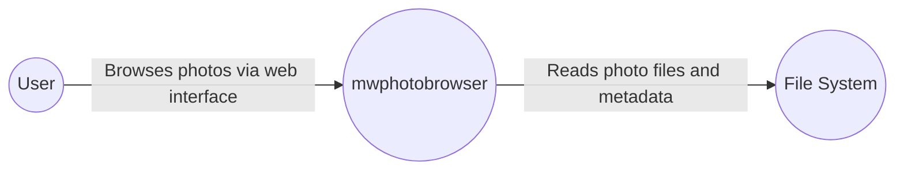
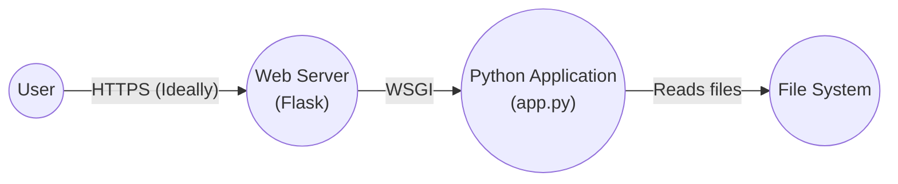
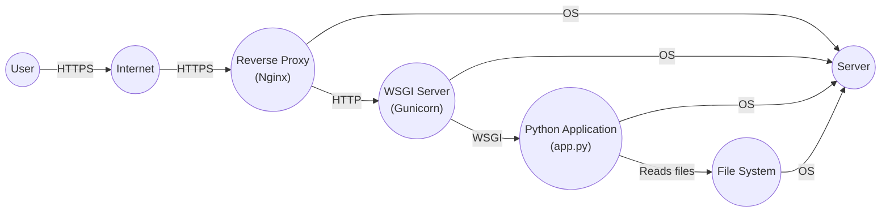
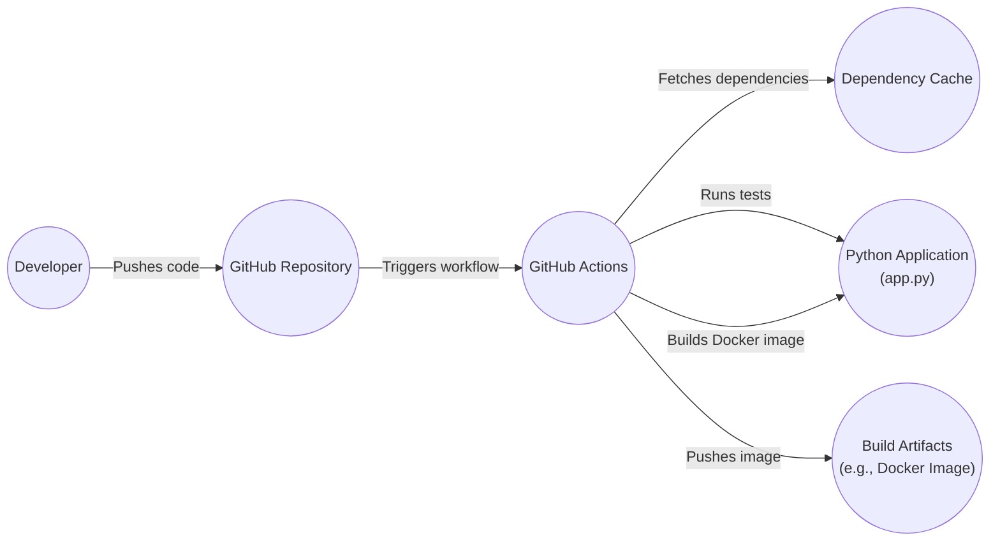

Okay, let's create a design document for the `mwphotobrowser` project. I'll follow the instructions precisely, focusing on clarity, detail, and security considerations.

```markdown
# Project Design Document: mwphotobrowser

## BUSINESS POSTURE

The primary business goal of `mwphotobrowser` appears to be providing a simple, self-hostable web application for browsing photos stored on a local filesystem.  The project prioritizes ease of use and deployment, targeting users who want a straightforward solution without complex dependencies or cloud services.  It's likely aimed at individuals or small groups, rather than large enterprises.  The project seems to be in early stages, possibly a personal project or a proof-of-concept.

Given this, the most important business risks are:

*   Data Loss: Accidental or malicious deletion of photos from the filesystem.
*   Unauthorized Access:  Exposure of photos to individuals who should not have access.
*   System Availability:  Ensuring the application remains accessible to authorized users.
*   Reputational Damage:  Security vulnerabilities could damage the project's reputation and the author's credibility.
*   Maintainability: Ensuring the project can be easily maintained and updated over time.

## SECURITY POSTURE

Based on the provided GitHub repository, the following security controls and accepted risks are identified:

*   security control: Basic Authentication: The application uses HTTP Basic Authentication (as seen in the `app.py` file) to restrict access. Implemented in `app.py`.
*   security control: File System Permissions: The application relies on the underlying operating system's file system permissions to control access to the photo directories. Implemented by the operating system and server configuration.
*   security control: Read-Only Access: The application appears to be designed for read-only access to photos, preventing direct modification or deletion through the web interface. Implemented in `app.py`.
*   accepted risk: Limited Authentication Features: Basic Authentication is vulnerable to replay attacks and credential sniffing if not used over HTTPS.
*   accepted risk: No Input Validation: There is no visible input validation on user-provided data, such as directory paths, which could lead to vulnerabilities like path traversal.
*   accepted risk: No Authorization: All authenticated users have the same level of access. There's no concept of roles or granular permissions.
*   accepted risk: Lack of HTTPS: The provided code does not include any HTTPS configuration, meaning all communication (including credentials) is transmitted in plain text.
*   accepted risk: No CSRF Protection: There is no protection against Cross-Site Request Forgery attacks.
*   accepted risk: No Session Management: Basic Authentication does not use sessions, so every request requires authentication.
*   accepted risk: No Rate Limiting: There are no mechanisms to prevent brute-force attacks against the authentication.
*   accepted risk: Dependency Vulnerabilities: The project depends on external libraries (Flask, etc.) which may have their own vulnerabilities.
*   accepted risk: No Security Hardening: The application and server configuration may not be hardened against common attacks.
*   accepted risk: No Auditing or Logging: There is no mechanism for logging access attempts or other security-relevant events.

Recommended Security Controls (High Priority):

*   Implement HTTPS:  This is crucial for protecting credentials and data in transit.
*   Add Input Validation:  Validate all user-provided input, especially directory paths, to prevent path traversal and other injection vulnerabilities.
*   Implement Rate Limiting:  Limit the number of authentication attempts to mitigate brute-force attacks.
*   Consider Dependency Management: Regularly update dependencies and use tools to scan for known vulnerabilities.

Security Requirements:

*   Authentication:
    *   The system MUST authenticate users before granting access to photos.
    *   The system SHOULD use a secure authentication mechanism (e.g., HTTPS with a more robust authentication protocol than Basic Auth).
    *   The system SHOULD provide a mechanism for password management (e.g., password reset).  (This might be out of scope for a simple project, but should be considered).

*   Authorization:
    *   The system SHOULD implement role-based access control (RBAC) if different levels of access are required. (Currently, all authenticated users have the same access).
    *   The system MUST ensure that users can only access photos they are authorized to view.

*   Input Validation:
    *   The system MUST validate all user-provided input to prevent injection attacks (e.g., path traversal).
    *   The system SHOULD sanitize user input to prevent cross-site scripting (XSS) vulnerabilities, although this is less critical for a read-only photo browser.

*   Cryptography:
    *   The system MUST use HTTPS to encrypt all communication between the client and server.
    *   The system SHOULD store passwords securely using a strong hashing algorithm (if password management is implemented).

## DESIGN

### C4 CONTEXT



Element Descriptions:

*   Element:
    *   Name: User
    *   Type: Person
    *   Description: A person who wants to view photos.
    *   Responsibilities: Browsing photos, authenticating to the application.
    *   Security controls: Uses a web browser with security features (e.g., HTTPS support).

*   Element:
    *   Name: mwphotobrowser
    *   Type: Software System
    *   Description: The web application that serves the photos.
    *   Responsibilities: Serving the web interface, handling authentication, reading photo data from the filesystem.
    *   Security controls: Basic Authentication, read-only access to the filesystem.

*   Element:
    *   Name: File System
    *   Type: External System
    *   Description: The underlying operating system's file system where the photos are stored.
    *   Responsibilities: Storing photo files and metadata, enforcing file system permissions.
    *   Security controls: Operating system file permissions.

### C4 CONTAINER



Element Descriptions:

*   Element:
    *   Name: User
    *   Type: Person
    *   Description: A person who wants to view photos.
    *   Responsibilities: Browsing photos, authenticating to the application.
    *   Security controls: Uses a web browser with security features (e.g., HTTPS support).

*   Element:
    *   Name: Web Server (Flask)
    *   Type: Web Server
    *   Description: The Flask development web server.
    *   Responsibilities: Handling HTTP requests, serving static files, routing requests to the Python application.
    *   Security controls: Basic Authentication (delegated to the application). Should be configured for HTTPS.

*   Element:
    *   Name: Python Application (app.py)
    *   Type: Web Application
    *   Description: The main application code.
    *   Responsibilities: Handling application logic, reading photo data, rendering HTML templates.
    *   Security controls: Basic Authentication, read-only file access.

*   Element:
    *   Name: File System
    *   Type: External System
    *   Description: The underlying operating system's file system.
    *   Responsibilities: Storing photo files and metadata.
    *   Security controls: Operating system file permissions.

### DEPLOYMENT

Possible deployment solutions:

1.  Development Server (Flask): Simplest for development, but not suitable for production.
2.  Production WSGI Server (Gunicorn, uWSGI) + Reverse Proxy (Nginx, Apache): Recommended for production, provides better performance, security, and manageability.
3.  Containerization (Docker): Packages the application and its dependencies into a container, ensuring consistent deployment across different environments.
4.  Cloud Deployment (AWS, Google Cloud, Azure): Deploying to a cloud platform can provide scalability and managed services.

Chosen solution for detailed description: Option 2 (Production WSGI Server + Reverse Proxy)



Element Descriptions:

*   Element:
    *   Name: User
    *   Type: Person
    *   Description: A person who wants to view photos.
    *   Responsibilities: Browsing photos, authenticating to the application.
    *   Security controls: Uses a web browser with security features (e.g., HTTPS support).

*   Element:
    *   Name: Internet
    *   Type: Network
    *   Description: The public internet.
    *   Responsibilities: Routing traffic between the user and the server.
    *   Security controls: Network-level security controls (firewalls, etc.).

*   Element:
    *   Name: Reverse Proxy (Nginx)
    *   Type: Web Server
    *   Description: Nginx web server acting as a reverse proxy.
    *   Responsibilities: Handling HTTPS termination, serving static files, forwarding requests to the WSGI server, load balancing (if applicable).
    *   Security controls: HTTPS configuration, rate limiting, web application firewall (WAF) (optional).

*   Element:
    *   Name: WSGI Server (Gunicorn)
    *   Type: Application Server
    *   Description: Gunicorn WSGI server.
    *   Responsibilities: Running multiple instances of the Python application, managing worker processes.
    *   Security controls: Limited user privileges, process isolation.

*   Element:
    *   Name: Python Application (app.py)
    *   Type: Web Application
    *   Description: The main application code.
    *   Responsibilities: Handling application logic, reading photo data, rendering HTML templates.
    *   Security controls: Basic Authentication, read-only file access.

*   Element:
    *   Name: File System
    *   Type: External System
    *   Description: The underlying operating system's file system.
    *   Responsibilities: Storing photo files and metadata.
    *   Security controls: Operating system file permissions.

*   Element:
    *   Name: Server
    *   Type: Infrastructure
    *   Description: Physical or virtual server.
    *   Responsibilities: Providing compute resources.
    *   Security controls: Operating system hardening, firewalls, intrusion detection systems.

### BUILD

The project currently lacks an automated build system.  A simple build process could be implemented using a shell script or a Makefile.  A more robust solution would involve a CI/CD pipeline (e.g., GitHub Actions).

Example Build Process (using GitHub Actions):



1.  Developer pushes code changes to the GitHub repository.
2.  GitHub Actions workflow is triggered.
3.  The workflow checks out the code.
4.  Dependencies are installed (and potentially cached).
5.  Static analysis tools (e.g., linters, security scanners) are run. Example: `pip install flake8; flake8 .`
6.  Unit tests are executed (if any).
7.  A Docker image is built, packaging the application and its dependencies.
8.  The Docker image is pushed to a container registry (e.g., Docker Hub, GitHub Container Registry).

Security Controls in Build Process:

*   Dependency Management: Use a `requirements.txt` file to specify dependencies and pin versions. Regularly update dependencies and scan for vulnerabilities using tools like `pip-audit` or Dependabot.
*   Static Analysis: Integrate linters (e.g., `flake8`, `pylint`) and security scanners (e.g., `bandit`, `semgrep`) into the build process to identify potential code quality and security issues.
*   Automated Build: Use a CI/CD system (GitHub Actions) to ensure consistent and reproducible builds.
*   Least Privilege: Run the build process with minimal necessary privileges.
*   Artifact Signing: Consider signing the build artifacts (e.g., Docker image) to ensure their integrity.

## RISK ASSESSMENT

*   Critical Business Process: Providing access to photos to authorized users.
*   Data to Protect:
    *   Photo files: Sensitivity depends on the content of the photos. Could range from low (publicly shareable) to high (private, confidential).
    *   User credentials (username/password): High sensitivity.
    *   Access logs (if implemented): Medium sensitivity.

## QUESTIONS & ASSUMPTIONS

*   Questions:
    *   What is the expected number of users?
    *   What is the total size of the photo collection?
    *   What is the anticipated growth rate of the photo collection?
    *   Are there any specific performance requirements?
    *   What is the target deployment environment (operating system, hardware)?
    *   Are there any existing infrastructure or security policies that need to be considered?
    *   Is there a budget for security tools or services?
    *   What level of technical expertise is expected from the users who will be deploying and managing the application?

*   Assumptions:
    *   BUSINESS POSTURE: The project is intended for personal or small-group use, with a low budget and a focus on simplicity.
    *   SECURITY POSTURE: The current security posture is minimal, with significant reliance on basic authentication and file system permissions. The user deploying the application has some technical knowledge.
    *   DESIGN: The application is designed to be simple and self-contained, with minimal external dependencies. The deployment environment is likely a Linux-based system.