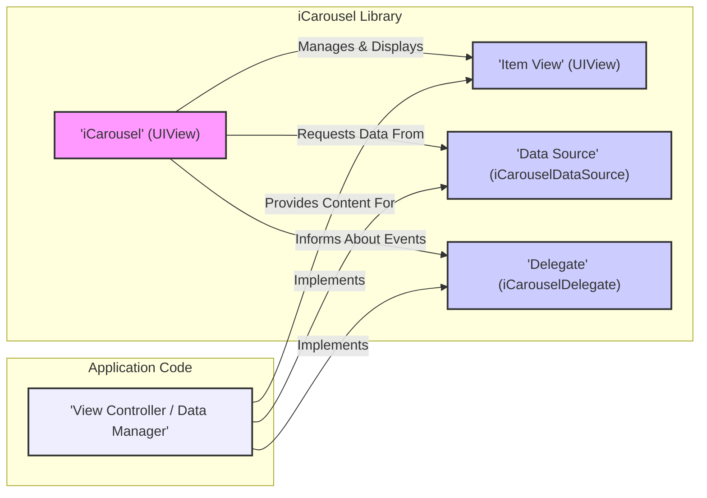
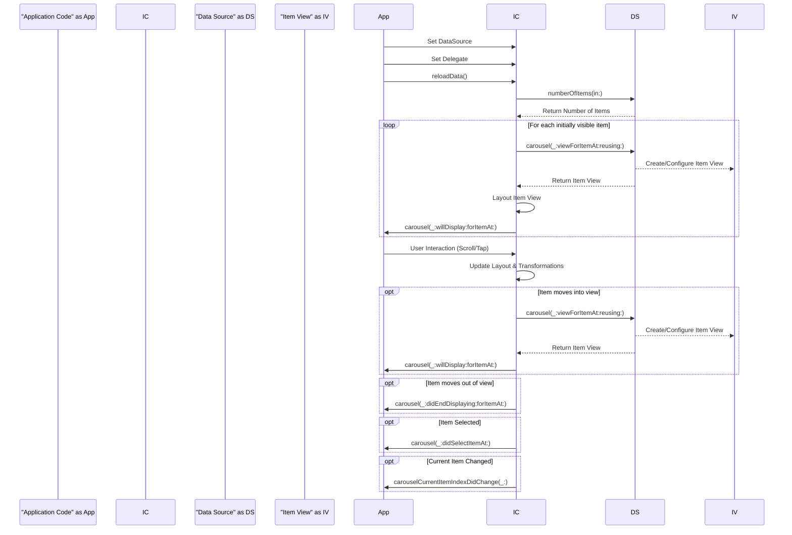

## Project Design Document: iCarousel (Improved)

**1. Introduction**

This document provides a detailed design overview of the `iCarousel` project, an open-source library for iOS, tvOS, and macOS that provides a highly customizable and performant carousel view. This document serves as a foundation for subsequent threat modeling activities, outlining the architecture, components, and data flow within the library, with a specific focus on identifying potential security considerations.

**2. Project Goals**

The primary goal of `iCarousel` is to provide developers with a reusable and flexible component for displaying a series of views in a visually appealing carousel format. Key objectives include:

* **Customization:** Allow developers to easily customize the appearance and behavior of the carousel through a rich set of properties and delegate methods.
* **Performance:** Ensure smooth and efficient rendering of the carousel, even when displaying a large number of items, through techniques like view recycling.
* **Ease of Use:** Provide a straightforward and intuitive API for integrating the carousel into existing applications with minimal code.
* **Platform Support:** Function seamlessly across Apple's major operating systems: iOS, tvOS, and macOS.

**3. Architectural Overview**

`iCarousel` employs a design pattern that closely resembles Model-View-Controller (MVC), primarily focusing on the "View" aspect and delegating data management and interaction handling. The core of the library is the `iCarousel` class, which orchestrates the layout and display of individual item views.

* **Core Component:** `iCarousel` (subclass of `UIView`)
    * Manages an ordered collection of item views.
    * Handles user input for navigation (scrolling, tapping, dragging).
    * Implements various pre-defined carousel visual styles (e.g., linear, cylindrical, rotary) and allows for custom implementations.
    * Dynamically transforms and positions item views based on the current scroll state and selected carousel type.
    * Communicates with the containing application through the `iCarouselDataSource` and `iCarouselDelegate` protocols.
* **Item Views:** Standard `UIView` instances
    * Represent the individual pieces of content within the carousel.
    * Their content and internal behavior are entirely managed by the application developer using `iCarousel` through its data source. `iCarousel` treats these as black boxes in terms of their internal implementation.
* **Data Source:** Protocol (`iCarouselDataSource`)
    * Defines the interface for providing `iCarousel` with the data it needs to display.
    * The application developer implements this protocol to supply the number of items and the specific `UIView` to display for each item.
* **Delegate:** Protocol (`iCarouselDelegate`)
    * Defines the interface for `iCarousel` to notify the application about significant events and to allow the application to customize certain aspects of the carousel's behavior.
    * The application developer implements this protocol to respond to events like item selection, scrolling updates, and view visibility changes.

**4. Component Details**

* **`iCarousel` Class:**
    * **Key Properties:**
        * `dataSource`:  An object conforming to the `iCarouselDataSource` protocol, responsible for providing the data.
        * `delegate`: An object conforming to the `iCarouselDelegate` protocol, responsible for handling events and customization.
        * `type`: An enumeration (`iCarouselType`) specifying the visual style of the carousel (e.g., `.linear`, `.rotary`, `.cylinder`, `.invertedCylinder`, `.timeMachine`, `.invertedTimeMachine`, `.coverFlow`, `.coverFlow2`, `.leftTilted`, `.rightTilted`, `.wheel`, `.invertedWheel`).
        * `numberOfItems`: A read-only integer reflecting the number of items currently in the carousel, as provided by the data source.
        * `currentItemIndex`: An integer representing the index of the currently selected or focused item in the carousel.
        * Various visual customization properties:  These control aspects like `isPagingEnabled`, `scrollSpeed`, `perspective`, `bounceValue`, `decelerationRate`, and properties related to item spacing and transformation.
    * **Key Methods:**
        * `reloadData()`:  Forces the carousel to reload its data from the data source, re-querying the number of items and the views for each item.
        * `itemView(at:)`: Returns the `UIView` representing the item at the specified index, if it is currently loaded.
        * `scrollToItem(at:animated:)`: Programmatically scrolls the carousel to the item at the given index, optionally animating the transition.
        * Methods for managing view loading and unloading, optimizing performance by only keeping visible items in memory.
    * **Internal Logic:**
        * Maintains an internal representation of the items and their current visual state.
        * Implements the logic for calculating the position, size, and transformation of each item view based on the selected carousel type and the current scroll offset.
        * Manages user interaction through gesture recognizers, translating touch events into scrolling and item selection actions.
        * Employs view recycling to efficiently reuse `UIView` instances for items that are moving off-screen, reducing memory usage and improving performance.

* **`iCarouselDataSource` Protocol:**
    * `numberOfItems(in:) -> Int`:  A required method that the data source must implement to return the total number of items to be displayed in the carousel.
    * `carousel(_:viewForItemAt:reusing:) -> UIView`: A required method where the data source provides the `UIView` to be displayed for the item at the given index. The `reusing` parameter allows the data source to recycle previously used views for performance optimization.

* **`iCarouselDelegate` Protocol:**
    * `carousel(_:willDisplay:forItemAt:)`:  An optional method called just before an item view is displayed, allowing the delegate to perform any last-minute configuration or animation.
    * `carousel(_:didEndDisplaying:forItemAt:)`: An optional method called after an item view has been removed from the visible area, allowing the delegate to perform cleanup or release resources.
    * `carousel(_:didSelectItemAt:)`: An optional method called when an item in the carousel is tapped or selected by the user.
    * `carouselCurrentItemIndexDidChange(_:)`: An optional method called whenever the currently focused item in the carousel changes.
    * Various other optional methods for customizing the appearance, responding to scrolling events, and providing custom view transformations.

**5. Data Flow**

The data flow within `iCarousel` involves the following key steps:

1. **Initialization and Setup:**
    * The application developer instantiates an `iCarousel` object.
    * The developer sets the `dataSource` and `delegate` properties of the `iCarousel` instance, typically to a view controller or a dedicated data management object.

2. **Initial Data Load or Refresh:**
    * The application calls `reloadData()` on the `iCarousel` instance, or it is called internally during the initial setup.
    * `iCarousel` queries the `dataSource` by calling the `numberOfItems(in:)` method to determine the total number of items.
    * For the initially visible items (and potentially some off-screen items for smoother scrolling), `iCarousel` calls the `carousel(_:viewForItemAt:reusing:)` method of the `dataSource`.
    * The `dataSource` creates or reuses a `UIView` for the requested item, configures its content, and returns it to `iCarousel`.

3. **Layout and Display:**
    * `iCarousel` calculates the initial positions and transformations of the item views based on the selected `type` and other configuration properties.
    * The `carousel(_:willDisplay:forItemAt:)` delegate method is called for each item view before it becomes visible.
    * The item views are added as subviews of the `iCarousel` instance.

4. **User Interaction and Scrolling:**
    * The user interacts with the carousel through touch gestures (swiping, dragging).
    * `iCarousel` intercepts these gestures and updates its internal scroll offset.
    * Based on the new scroll offset, `iCarousel` recalculates the positions and transformations of the visible item views, creating the carousel effect.
    * As new items become visible, `iCarousel` requests their views from the `dataSource` using `carousel(_:viewForItemAt:reusing:)`.
    * As items move off-screen, the `carousel(_:didEndDisplaying:forItemAt:)` delegate method is called.

5. **Item Selection:**
    * When the user taps on an item, `iCarousel` detects the tap and calls the `carousel(_:didSelectItemAt:)` delegate method, providing the index of the selected item.

6. **Current Item Tracking:**
    * As the user scrolls, `iCarousel` updates its `currentItemIndex` property to reflect the currently focused or prominent item.
    * The `carouselCurrentItemIndexDidChange(_:)` delegate method is called whenever this index changes.

**6. Configuration**

`iCarousel` offers extensive configuration options through its properties and delegate methods:

* **Carousel Visual Style:** The `type` property allows selection from a variety of built-in carousel styles.
* **Scrolling Behavior:** Properties like `isPagingEnabled`, `scrollSpeed`, `decelerationRate`, and `bounceValue` control how the carousel scrolls and responds to user input.
* **Item Appearance:** Delegate methods can be used to customize the size, spacing, and transformations of individual items.
* **Animation:** Scrolling and item selection can be animated using built-in or custom animations.
* **Data Population:** The content of the individual item views is entirely determined by the application developer's implementation of the `iCarouselDataSource`.

**7. Potential Interaction Points and Security Considerations (for Threat Modeling)**

This section outlines potential areas where vulnerabilities could be introduced, focusing on the interaction points between `iCarousel` and the application using it:

* **Data Source (`iCarouselDataSource` Implementation):**
    * **Malicious Content Injection:** If the data source fetches item content from untrusted sources (e.g., remote APIs without proper sanitization), it could inject malicious code (e.g., JavaScript if using `UIWebView` or `WKWebView` within item views) or display misleading information. This is a primary area of concern.
    * **Resource Exhaustion/Denial of Service:** A maliciously crafted data source could return an extremely large number of items, potentially leading to excessive memory consumption and performance degradation, effectively causing a denial of service.
    * **Unintended Data Exposure:** If the data source inadvertently exposes sensitive information within the item views, this could be a security vulnerability.
    * **Performance Issues:** Inefficient data source implementations (e.g., performing heavy computations on the main thread) can lead to a poor user experience and potential for denial of service.

* **Item Views (Content Managed by the Application):**
    * **Vulnerabilities within Custom Views:** If the `UIView` instances provided by the data source contain interactive elements (e.g., buttons, text fields, web views), these elements are subject to the same security vulnerabilities as any other part of the application (e.g., XSS, insecure data handling). `iCarousel` acts as a container and does not inherently introduce these vulnerabilities, but it exposes them.
    * **Insecure Data Handling within Item Views:** If the item views themselves handle user input or data in an insecure manner, this could be a vulnerability.

* **Delegate (`iCarouselDelegate` Implementation):**
    * **Logic Manipulation (Lower Risk):** While less direct, a compromised or poorly implemented delegate could potentially manipulate the behavior of the carousel in unexpected ways, leading to functional issues or a confusing user experience. The direct security impact is generally lower compared to data source vulnerabilities.
    * **Sensitive Data Handling:** If the delegate methods receive sensitive information (though this is less common), improper handling could lead to exposure.

* **Configuration Properties:**
    * **Unexpected Behavior (Not a Direct Security Risk):** Setting certain configuration properties to extreme or unexpected values might lead to unusual visual effects or performance issues, but this is generally not a direct security vulnerability.

**8. Security Considerations for Developers Using iCarousel**

Developers integrating `iCarousel` into their applications should consider the following security best practices:

* **Sanitize Data from Untrusted Sources:** When implementing the `iCarouselDataSource`, ensure that any data fetched from external or untrusted sources is properly sanitized before being displayed in the item views to prevent injection attacks.
* **Implement Data Source Efficiently:** Avoid performing heavy computations or network requests on the main thread within the data source methods to prevent UI freezes and potential denial of service.
* **Secure Item View Content:** If item views contain interactive elements or display sensitive information, follow secure development practices for those components.
* **Be Mindful of Resource Usage:** Avoid creating an excessively large number of items in the data source if not necessary, as this can lead to memory issues.
* **Review Delegate Implementations:** Ensure that the `iCarouselDelegate` methods are implemented correctly and do not introduce any unintended side effects or security vulnerabilities.
* **Keep iCarousel Updated:** Regularly update to the latest version of `iCarousel` to benefit from bug fixes and potential security patches.

**9. Diagrams**

**10. Conclusion**

This improved design document provides a more detailed and security-focused overview of the `iCarousel` library. By explicitly outlining potential interaction points and security considerations, this document serves as a strong foundation for conducting a thorough threat model. The emphasis on the responsibilities of the application developer in securely implementing the data source and handling item view content is crucial for mitigating potential risks.