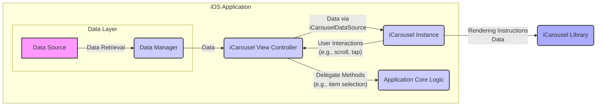

## Project Design Document: iCarousel Integration (Improved)

**1. Introduction**

This document outlines the design of a system integrating the open-source iOS library, iCarousel (available at [https://github.com/nicklockwood/icarousel](https://github.com/nicklockwood/icarousel)), into a hypothetical iOS application. This document serves as a foundation for subsequent threat modeling activities. It details the component's functionality, data flow, and key interactions within the application context, providing more granular detail and expanding on potential security considerations.

**2. System Overview**

The iCarousel library provides a highly customizable view for displaying a series of items in a visually appealing carousel format. Our hypothetical iOS application will utilize iCarousel to display a collection of images or custom views. The core functionality revolves around presenting data provided by the application in a scrolling, interactive manner, allowing users to navigate through a set of content.

**3. Goals**

*   Clearly define the architecture of the iCarousel integration within the iOS application, with a focus on data flow and component interaction.
*   Identify key components and their specific responsibilities and interactions.
*   Describe the data flow within the system in detail, highlighting data transformation points.
*   Highlight potential areas of security concern for future threat modeling, providing more specific examples and potential impacts.

**4. Target Audience**

This document is intended for:

*   Security engineers responsible for threat modeling the application and identifying potential vulnerabilities.
*   Developers involved in integrating, maintaining, and extending the iCarousel component within the application.
*   Architects reviewing the system design for adherence to architectural principles and security best practices.

**5. System Architecture**

The integration of iCarousel can be conceptually divided into the following components, each with distinct responsibilities:

*   **iOS Application Core:** The main application logic encompassing data management and overall application flow. This component is responsible for:
    *   Initializing and managing the application lifecycle.
    *   Orchestrating data retrieval and preparation.
    *   Handling navigation and user interface interactions beyond the carousel itself.
*   **Data Layer:**  Responsible for abstracting data access and management. This component:
    *   Fetches data from the underlying Data Source.
    *   May perform caching, filtering, or transformation of the data.
    *   Provides a consistent interface for the View Layer to access data.
*   **iCarousel View Controller:**  The specific view controller within the iOS application responsible for managing the `iCarousel` instance. This component:
    *   Creates and configures the `iCarousel` view instance.
    *   Acts as the intermediary between the Data Layer and the `iCarousel` library.
    *   Implements the `iCarouselDataSource` protocol to provide data to the iCarousel library.
    *   Implements the `iCarouselDelegate` protocol to respond to events from the iCarousel library (e.g., item selection, scrolling events).
    *   Handles any application-specific logic triggered by carousel interactions.
*   **iCarousel Library:** The external open-source library responsible for the visual presentation and interaction logic of the carousel UI. This component:
    *   Receives data from the application through the `iCarouselDataSource` methods.
    *   Renders the carousel items based on the provided data, managing the visual layout and appearance.
    *   Manages the animation and transitions between carousel items.
    *   Detects and handles user interactions such as scrolling, tapping, and potentially gestures.
    *   Provides delegate methods to notify the application of user interactions and state changes.
*   **Data Source:** The ultimate source of the data displayed in the carousel. This could be:
    *   **Local Data:** Data stored directly within the application (e.g., arrays, dictionaries, data fetched from local storage like Core Data or files).
    *   **Remote Data:** Data fetched from a backend service over a network (e.g., REST APIs, GraphQL endpoints).
    *   **Dynamically Generated Data:** Data created programmatically within the application based on user input or other application state.

**6. Data Flow Diagram**

**7. Key Components Description**

*   **Data Source:**
    *   The origin of the data displayed in the carousel. Examples include:
        *   A local JSON file bundled with the application.
        *   A remote REST API endpoint providing a list of image URLs.
        *   A Core Data entity storing product information.
    *   The format and structure of the data will directly impact how it needs to be processed by the Data Manager and consumed by the iCarousel View Controller.
*   **Data Manager:**
    *   Responsible for mediating access to the Data Source. Key functions include:
        *   Fetching raw data from the Data Source.
        *   Implementing caching mechanisms to improve performance and reduce network requests.
        *   Transforming the raw data into a format suitable for the iCarousel View Controller (e.g., creating an array of view models).
        *   Handling potential errors during data retrieval.
*   **iCarousel View Controller:**
    *   The central point of interaction with the iCarousel library. Its responsibilities include:
        *   Instantiating and configuring the `iCarousel` view, setting properties like `type`, `dataSource`, and `delegate`.
        *   Implementing the `numberOfItems(in:)` method of the `iCarouselDataSource` to inform the library about the number of items to display.
        *   Implementing the `carousel(_:viewForItemAt:reusing:)` method of the `iCarouselDataSource` to provide the actual views to be displayed in the carousel. This is a critical point where data is bound to the UI.
        *   Implementing methods from the `iCarouselDelegate` protocol to respond to user interactions, such as `carousel(_:didSelectItemAt:)`.
*   **iCarousel Instance:**
    *   A concrete instance of the `iCarousel` class. Its primary functions are:
        *   Managing the layout and positioning of the carousel items on the screen.
        *   Handling touch events and gestures to enable scrolling and item selection.
        *   Animating the transitions between carousel items as the user interacts.
        *   Providing visual feedback to the user.
*   **iCarousel Library:**
    *   Provides the core carousel functionality. Key aspects include:
        *   A variety of built-in carousel types (e.g., linear, cylinder, time machine).
        *   Customizable appearance settings (e.g., item spacing, perspective).
        *   Efficient rendering and recycling of views to handle large datasets.
        *   A well-defined API through the `iCarouselDataSource` and `iCarouselDelegate` protocols.
*   **Application Core Logic:**
    *   The broader application logic that responds to events originating from the iCarousel. Examples include:
        *   Navigating to a detail view when a carousel item is selected.
        *   Updating the application state based on the currently displayed item.
        *   Triggering analytics events based on user interaction with the carousel.

**8. Security Considerations**

The following potential security considerations should be addressed during threat modeling, with a focus on potential impacts and mitigation strategies:

*   **Malicious Data Injection:** If the Data Source is external or influenced by untrusted sources, there's a risk of injecting malicious data that could compromise the application or user experience.
    *   **Impact:** Displaying inappropriate content, triggering unexpected behavior in the iCarousel library (potentially leading to crashes), or exploiting vulnerabilities within the rendering process.
    *   **Mitigation:** Implement robust input validation and sanitization on data received from external sources. Use secure communication protocols (HTTPS) for fetching remote data. Employ content security policies where applicable.
*   **Unexpected Data Format Handling:** The iCarousel library expects data in a specific format. Providing data in an unexpected format could lead to errors or crashes.
    *   **Impact:** Application crashes, unexpected UI behavior, potential denial of service.
    *   **Mitigation:** Implement thorough data validation and type checking before providing data to the iCarousel library. Handle potential parsing errors gracefully.
*   **Denial of Service (DoS) through Large Datasets:** Providing an excessively large dataset to the iCarousel could strain device resources, leading to performance degradation or crashes.
    *   **Impact:** Application unresponsiveness, crashes, poor user experience.
    *   **Mitigation:** Implement pagination or lazy loading techniques to load data in chunks. Set reasonable limits on the number of items displayed in the carousel. Optimize the rendering of carousel items.
*   **Information Disclosure through Sensitive Data:** If the carousel displays sensitive information, improper handling could lead to unintended disclosure.
    *   **Impact:** Exposure of personal data, confidential information, or other sensitive content.
    *   **Mitigation:** Avoid displaying sensitive data directly in the carousel if possible. If necessary, implement appropriate access controls and data masking techniques. Consider the security implications of caching carousel data.
*   **Dependency Vulnerabilities in iCarousel Library:**  Like any third-party library, iCarousel might contain undiscovered vulnerabilities.
    *   **Impact:** Potential for remote code execution, data breaches, or other security compromises if a vulnerability is exploited.
    *   **Mitigation:** Regularly update the iCarousel library to the latest stable version. Monitor security advisories and vulnerability databases for reported issues. Consider using static analysis tools to identify potential vulnerabilities.
*   **Man-in-the-Middle (MitM) Attacks on Remote Data:** If the Data Source is a remote API, communication over an insecure channel (HTTP) could allow attackers to intercept and modify the data being displayed.
    *   **Impact:** Displaying manipulated or malicious content, potentially tricking users into taking harmful actions.
    *   **Mitigation:** Enforce the use of HTTPS for all communication with remote data sources. Implement certificate pinning for enhanced security.
*   **Client-Side Data Validation Weaknesses:** If client-side validation is the only mechanism in place, it can be bypassed by attackers.
    *   **Impact:** Allowing malicious or invalid data to be processed by the application and potentially the iCarousel library.
    *   **Mitigation:** Implement both client-side and server-side validation for data integrity. Never rely solely on client-side validation for security.
*   **Clickjacking (Context Dependent):** While less likely for a standalone carousel, if embedded in a web view or other context, an attacker might try to overlay UI elements to trick users into unintended interactions.
    *   **Impact:** Users unknowingly performing actions they didn't intend.
    *   **Mitigation:** Implement appropriate frame busting or X-Frame-Options headers if the carousel is embedded in a web view.

**9. Assumptions and Dependencies**

*   The iOS application is being developed using Swift or Objective-C and the latest recommended SDKs.
*   The iCarousel library is integrated into the project using a reliable dependency management system (e.g., CocoaPods, Swift Package Manager).
*   The application has implemented appropriate error handling, logging, and monitoring mechanisms.
*   If the Data Source is remote, secure authentication and authorization mechanisms are in place to protect access to the data.
*   Developers integrating iCarousel have a basic understanding of iOS development principles and the iCarousel library's API.

**10. Deployment Considerations**

*   The iCarousel library will be bundled with the application during the build process.
*   Consider the impact of the library's size on the overall application size.
*   Ensure compatibility of the iCarousel library with the target iOS versions supported by the application.
*   If using a dependency manager, ensure proper configuration for different build environments (e.g., development, staging, production).

**11. Future Considerations**

*   Specific implementation details within the Data Layer and Application Core Logic will significantly influence the overall security posture and should be considered during threat modeling.
*   Customizations made to the iCarousel's appearance, behavior, or interaction handling might introduce new security considerations that need to be evaluated.
*   Integration with other third-party libraries or SDKs might introduce additional dependencies and potential vulnerabilities that need to be assessed.
*   Regularly review and update the iCarousel library and other dependencies to address any newly discovered security vulnerabilities.
