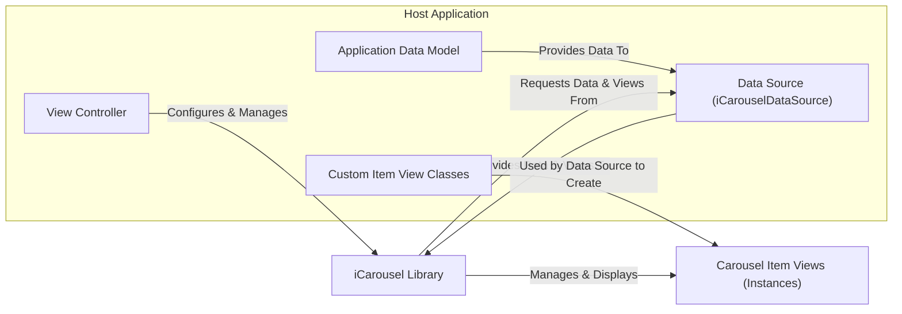
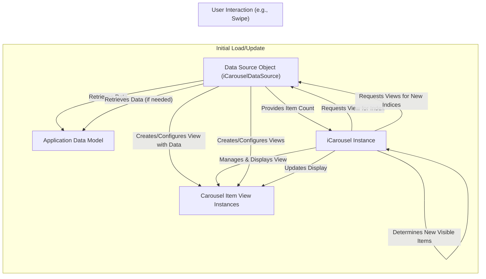

# Project Design Document: iCarousel

**Version:** 1.1
**Date:** October 26, 2023
**Author:** Gemini (AI Language Model)
**Project:** iCarousel - An iOS/macOS Carousel View Library
**GitHub Repository:** https://github.com/nicklockwood/icarousel

## 1. Introduction

This document provides an enhanced design overview of the `iCarousel` library, an open-source project implementing various carousel-style view layouts for iOS and macOS applications. This detailed design serves as a crucial foundation for subsequent threat modeling activities, enabling a comprehensive assessment of potential security risks. It elaborates on the library's architecture, components, data flow, and key security considerations.

## 2. Goals and Objectives

The primary goal remains to provide a comprehensive understanding of the `iCarousel` library's design to facilitate effective threat modeling. Specific objectives include:

*   Clearly outlining the library's architecture and its integration within a host application, with greater detail on component interactions.
*   Identifying the key functional components within the `iCarousel` library and their specific responsibilities.
*   Mapping the flow of data within the library with more granularity, highlighting data transformations and access points.
*   Highlighting potential areas of security concern based on the design, providing more specific examples of potential vulnerabilities.
*   Providing a robust basis for identifying potential threats, vulnerabilities, and attack vectors, emphasizing developer responsibilities in secure implementation.

## 3. System Architecture

`iCarousel` is a client-side UI library integrated into iOS and macOS applications. It operates within the application's process and does not function as a standalone service. Understanding its architecture requires examining its interaction with the host application's components.

**Components:**

*   **Host Application:** The encompassing iOS or macOS application utilizing the `iCarousel` library.
    *   **View Controller:** Manages the view hierarchy, instantiates and configures the `iCarousel` object, and acts as the delegate (optionally).
    *   **Data Source (`iCarouselDataSource`):**  A crucial component implemented by the developer, responsible for providing the data to be displayed in the carousel and creating/configuring the item views. This bridges the `iCarousel` with the application's data.
    *   **Application Data Model:** The underlying data structures and sources that hold the information displayed in the carousel.
    *   **Custom Item View Classes:** Developer-defined classes (subclasses of `UIView` or `NSView`) that define the structure and appearance of individual carousel items.
*   **iCarousel Library:** The core library providing the carousel functionality.
    *   **`iCarousel` Class:** The central class managing the carousel's behavior and presentation.
    *   **Carousel Item Views (Instances):** Concrete instances of `UIView` or `NSView` displaying individual items within the carousel, created and configured by the data source.

**Interaction Flow:**

1. The **View Controller** creates and configures an instance of the `iCarousel` class.
2. The **View Controller** sets an object conforming to the `iCarouselDataSource` protocol as the `iCarousel`'s data source.
3. When the `iCarousel` needs to display items, it queries the **Data Source** for the number of items.
4. For each visible item, the `iCarousel` requests a corresponding view from the **Data Source**.
5. The **Data Source** retrieves data from the **Application Data Model**.
6. The **Data Source** uses this data and potentially **Custom Item View Classes** to create or configure a **Carousel Item View** instance.
7. The `iCarousel` manages the layout, animation, and display of these **Carousel Item Views**.
8. User interactions trigger events handled by the `iCarousel`, potentially leading to requests for new views or updates to existing ones from the **Data Source**.

## 4. Component Breakdown

This section provides a more detailed breakdown of the key functional components within the `iCarousel` library itself.

*   **`iCarousel` Class - Core Functionality:**
    *   **View Management:**
        *   Maintains an internal collection of currently displayed and reusable item views.
        *   Handles the creation (indirectly through the data source), addition, and removal of item views.
        *   Implements view recycling mechanisms for performance optimization.
    *   **Layout Engine:**
        *   Calculates the position and transformation of each item view based on the selected carousel type (e.g., linear, circular, time machine).
        *   Applies transformations (scaling, rotation, translation) to achieve the desired visual effect.
    *   **Animation Handling:**
        *   Manages animations for transitioning between items, including scrolling and snapping.
        *   Provides customizable animation parameters.
    *   **Input Handling:**
        *   Responds to touch events and gestures (swipes, taps) to control the carousel's navigation.
        *   Translates user input into changes in the carousel's state.
    *   **Configuration Management:**
        *   Stores and manages configurable properties such as carousel type, scroll direction, and item spacing.
        *   Provides an API for the host application to customize the carousel's appearance and behavior.
    *   **Delegate Communication:**
        *   Invokes methods on the `iCarouselDelegate` to notify the host application about significant events (e.g., item selection, scroll progress).
*   **`iCarouselDataSource` Protocol - Data Provisioning:**
    *   **`numberOfItems(in:)`:**  Returns the total number of items to be displayed in the carousel. This is a crucial input for the `iCarousel`'s layout calculations.
    *   **`carousel(_:viewForItemAt:reusing:)`:** The primary method for providing item views. The data source is responsible for:
        *   Checking if a reusable view is available.
        *   Creating a new view if necessary (often instantiating a **Custom Item View Class**).
        *   Configuring the view's content based on the data for the given index. This is a critical point for potential vulnerabilities if data is not handled securely.
*   **`iCarouselDelegate` Protocol - Event Handling:**
    *   Provides optional methods for the host application to respond to carousel events, such as:
        *   `carousel(_:didSelectItemAt:)`: Notifies the delegate when an item is selected.
        *   `carouselCurrentItemIndexDidChange(_:)`: Informs the delegate when the currently focused item changes.
        *   Methods related to view visibility and scrolling.
*   **Carousel Item Views (Instances):**
    *   Instances of `UIView` (iOS) or `NSView` (macOS).
    *   Their internal structure and content are entirely determined by the developer's implementation of the **Custom Item View Classes** and the logic within the `iCarouselDataSource`.

## 5. Data Flow

The data flow within `iCarousel` centers around fetching and displaying data for the carousel items. This process involves interactions between the `iCarousel` and the data source.

**Detailed Data Flow:**

1. The process begins with the **Application Data Model**, which holds the raw data.
2. When the `iCarousel` is initialized or needs to update its display, it first queries the **Data Source Object** for the total number of items.
3. Based on the current scroll position and the carousel's configuration, the `iCarousel` determines which item views need to be displayed.
4. For each required item, the `iCarousel` calls the `carousel(_:viewForItemAt:reusing:)` method on the **Data Source Object**.
5. The **Data Source Object** retrieves the relevant data from the **Application Data Model** based on the requested index.
6. The **Data Source Object** then creates or reuses a **Carousel Item View Instance** and configures its content using the retrieved data. This configuration step is crucial and a potential area for vulnerabilities.
7. The **Data Source Object** returns the configured **Carousel Item View Instance** to the `iCarousel`.
8. The `iCarousel` manages the layout and display of the received **Carousel Item View Instance**.
9. User interactions trigger a similar flow, where the `iCarousel` determines the new set of visible items and requests the corresponding views from the **Data Source Object**.

## 6. Security Considerations

While `iCarousel` primarily handles UI presentation, several security considerations arise from its interaction with the data source and the way item views are configured. The developer plays a critical role in mitigating these risks.

*   **Data Injection Vulnerabilities via Data Source:** If the **Data Source Object** receives data from untrusted sources (e.g., network requests without proper validation) and directly uses this data to configure **Carousel Item Views**, it can lead to various injection vulnerabilities:
    *   **Cross-Site Scripting (XSS) in Web Views:** If carousel items contain `WKWebView` or `UIWebView` instances, unsanitized data injected into the web view's content can execute malicious JavaScript.
    *   **Code Injection:** In less common scenarios, if the data source dynamically constructs code based on untrusted input, it could lead to code injection.
    *   **UI Spoofing/Redressing:** Malicious data could be used to create deceptive UI elements within the carousel items, potentially tricking users into performing unintended actions.
*   **Insecure Handling of Sensitive Data:** If the **Application Data Model** contains sensitive information, it's crucial that the **Data Source Object** handles this data securely when configuring the **Carousel Item Views**. This includes:
    *   **Avoiding Display of Sensitive Data:** Ensure sensitive data is not unnecessarily displayed in the carousel.
    *   **Proper Data Masking/Obfuscation:** If sensitive data needs to be shown, implement appropriate masking or obfuscation techniques.
*   **Resource Exhaustion through Data Source Manipulation:** A malicious or compromised data source could provide an extremely large number of items or provide data that leads to resource-intensive view creation, potentially causing a denial-of-service.
*   **Vulnerabilities in Custom Item View Classes:** Security vulnerabilities within the implementation of the **Custom Item View Classes** themselves can be exploited if the data source provides malicious data that triggers these vulnerabilities.
*   **Lack of Input Validation in Data Source:** The **Data Source Object** should validate all data received from the **Application Data Model** before using it to configure views. This helps prevent unexpected behavior and potential vulnerabilities.
*   **Information Disclosure through Improper Error Handling:** If errors occur during data retrieval or view configuration, improper error handling could inadvertently expose sensitive information.
*   **Dependency Vulnerabilities in Host Application:** While `iCarousel` has no direct dependencies, the host application and the **Data Source Object** might rely on other libraries with known vulnerabilities.

## 7. Dependencies

`iCarousel` has no direct runtime dependencies on external third-party libraries, relying solely on standard iOS and macOS frameworks. This reduces the attack surface associated with third-party code.

## 8. Deployment

`iCarousel` is typically integrated into iOS and macOS applications using dependency managers or manual integration:

*   **CocoaPods:** A widely used dependency manager for Objective-C and Swift projects.
*   **Carthage:** A decentralized dependency manager.
*   **Swift Package Manager (SPM):** Apple's native dependency management tool.
*   **Manual Integration:** Directly including the source files in the project.

The deployment process involves adding the library to the project's dependencies and linking it during the build process.

## 9. Future Considerations

Potential future changes to `iCarousel` that could introduce new security considerations include:

*   **Direct Network Capabilities:** If `iCarousel` were to gain the ability to directly fetch data from network sources, it would introduce complexities related to secure network communication, authentication, and data integrity.
*   **Advanced Rendering Techniques:** Integration with more advanced rendering technologies could introduce new attack vectors if not handled carefully.
*   **Increased Customization Options:** While flexibility is beneficial, overly complex customization options could potentially introduce unforeseen security implications.

This enhanced design document provides a more detailed understanding of the `iCarousel` library's architecture and data flow, highlighting key areas relevant to security. This information is essential for conducting thorough threat modeling and implementing secure development practices when using this library. The responsibility for securing the data source and the content of the item views lies primarily with the developer integrating the `iCarousel` library.