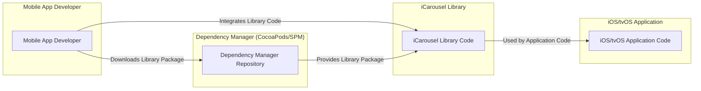
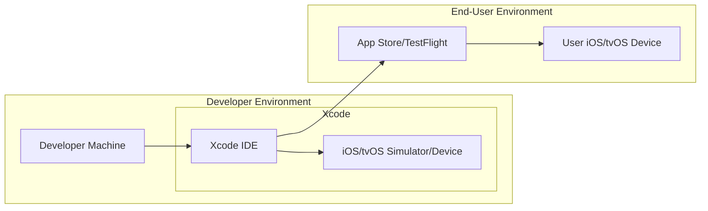

# BUSINESS POSTURE

- Business Priorities and Goals:
 - Goal: Provide iOS and tvOS developers with a reusable, customizable, and visually appealing carousel component.
 - Priority: Ease of integration and use for developers.
 - Priority: Performance and stability to ensure smooth user experience in applications using the library.
 - Priority: Compatibility with a wide range of iOS and tvOS versions.
 - Priority: Open-source and community-driven development to encourage adoption and contributions.

- Business Risks:
 - Risk: Bugs or instability in the library could negatively impact applications using it, leading to poor user experience and developer dissatisfaction.
 - Risk: Lack of adoption by developers if the library is not well-documented, easy to use, or performant.
 - Risk: Security vulnerabilities in the library, although less likely for a UI component, could be exploited if the library processes untrusted data or interacts with other components insecurely.
 - Risk: Compatibility issues with new iOS/tvOS versions could require ongoing maintenance and updates.
 - Risk: Dependency on a single maintainer or small group of contributors could lead to project stagnation if maintainers become unavailable.

# SECURITY POSTURE

- Existing Security Controls:
 - security control: Open-source code, allowing for community review and scrutiny. Implemented in: GitHub repository.
 - security control: Use of Objective-C and standard iOS/tvOS SDKs, which have established security practices. Implemented in: Source code.
 - accepted risk: Reliance on developers to use the library correctly and securely within their applications.
 - accepted risk: Limited formal security testing or audits of the library itself.

- Recommended Security Controls:
 - security control: Implement static code analysis tools to scan for potential vulnerabilities in the library code.
 - security control: Encourage community security reviews and contributions to identify and fix potential issues.
 - security control: Establish a process for reporting and addressing security vulnerabilities, even if they are considered low risk for a UI library.
 - security control: Consider adding basic input validation if the library accepts any external data or configuration that could be manipulated by developers.

- Security Requirements:
 - Authentication: Not applicable for a UI library. Authentication is handled by the applications using the library.
 - Authorization: Not applicable for a UI library. Authorization is handled by the applications using the library.
 - Input Validation:
  - Requirement: If the library accepts any configuration parameters or data from developers (e.g., data sources, styling options), validate these inputs to prevent unexpected behavior or potential vulnerabilities in applications using the library.
  - Implementation: Input validation should be implemented within the library's code to ensure robustness.
 - Cryptography: Not expected to be required for a UI library focused on UI components. If any data needs to be stored or transmitted securely by applications using the library, it is the responsibility of those applications, not the library itself.

# DESIGN

## C4 CONTEXT

```mermaid
flowchart LR
    subgraph "Mobile App Developer"
        A[Mobile App Developer]
    end
    subgraph "iOS/tvOS Application"
        B[iOS/tvOS Application]
    end
    subgraph "iCarousel Library"
        C[iCarousel Library]
    end
    subgraph "Dependency Manager (CocoaPods/SPM)"
        D[Dependency Manager (CocoaPods/SPM)]
    end
    A -->|Integrates| C
    C -->|Used by| B
    A -->|Downloads/Manages| D
    D -->|Provides| C
```

- Context Diagram Elements:
 - Element:
  - Name: Mobile App Developer
  - Type: Person
  - Description: Developers who build iOS and tvOS applications and want to use a carousel component in their user interfaces.
  - Responsibilities: Integrate the iCarousel library into their projects, configure and customize it, and ensure its proper use within their applications.
  - Security controls: Responsible for the overall security of their applications, including how they use and configure third-party libraries like iCarousel.
 - Element:
  - Name: iOS/tvOS Application
  - Type: Software System
  - Description: The mobile application being developed by the mobile app developer, which utilizes the iCarousel library to display content in a carousel format.
  - Responsibilities: Provide the context and data for the carousel to display, handle user interactions with the carousel, and ensure the overall security and functionality of the application.
  - Security controls: Implement application-level security controls, such as authentication, authorization, input validation for application data, and secure data handling.
 - Element:
  - Name: iCarousel Library
  - Type: Software System
  - Description: The open-source iCarousel library, providing carousel-like layout effects for iOS and tvOS applications.
  - Responsibilities: Provide a reusable and customizable carousel component, handle UI rendering and animations, and offer an API for developers to configure and interact with the carousel.
  - Security controls: Implement secure coding practices within the library to avoid common vulnerabilities, and potentially include basic input validation for configuration parameters.
 - Element:
  - Name: Dependency Manager (CocoaPods/SPM)
  - Type: Software System
  - Description: Package managers like CocoaPods or Swift Package Manager used by developers to download, manage, and integrate the iCarousel library into their projects.
  - Responsibilities: Host and distribute the iCarousel library package, manage dependencies, and facilitate the integration process for developers.
  - Security controls: Dependency managers should have security controls to ensure the integrity and authenticity of packages, preventing supply chain attacks. Developers should use trusted dependency managers and verify package integrity.

## C4 CONTAINER



- Container Diagram Elements:
 - Element:
  - Name: Mobile App Developer
  - Type: Person
  - Description: Developers who build iOS and tvOS applications.
  - Responsibilities: Write application code, integrate the iCarousel library code, and manage dependencies.
  - Security controls: Secure development practices on their local machines, code reviews, and using trusted development tools.
 - Element:
  - Name: iOS/tvOS Application Code
  - Type: Container - Application
  - Description: The source code of the iOS/tvOS application that utilizes the iCarousel library.
  - Responsibilities: Implement application logic, UI, and integrate with the iCarousel library to display carousel views.
  - Security controls: Application-level security controls, input validation, secure data handling, authentication, and authorization.
 - Element:
  - Name: iCarousel Library Code
  - Type: Container - Library
  - Description: The source code of the iCarousel library, written in Objective-C and potentially Swift.
  - Responsibilities: Provide the carousel functionality, handle UI rendering, and offer an API for developers.
  - Security controls: Secure coding practices within the library code, static code analysis, and community security reviews.
 - Element:
  - Name: Dependency Manager Repository
  - Type: Container - Repository
  - Description: The repository (e.g., CocoaPods Specs repo, Swift Package Registry) that hosts the iCarousel library package.
  - Responsibilities: Store and distribute the iCarousel library package, manage versions, and provide access to developers.
  - Security controls: Repository security controls to ensure package integrity and prevent tampering, such as signing and checksums.

## DEPLOYMENT

- Deployment Architecture:
 - The iCarousel library itself is not deployed as a standalone application. It is deployed as part of iOS/tvOS applications that integrate it. The deployment context is primarily the developer's development environment and then the end-user's iOS/tvOS device.



- Deployment Diagram Elements:
 - Element:
  - Name: Developer Machine
  - Type: Infrastructure - Workstation
  - Description: The computer used by the mobile app developer to write code, build, and test the iOS/tvOS application.
  - Responsibilities: Provide the environment for development, including IDE, SDKs, and build tools.
  - Security controls: Developer machine security practices, such as OS security, antivirus, and secure access controls.
 - Element:
  - Name: Xcode IDE
  - Type: Software - IDE
  - Description: Apple's Integrated Development Environment (IDE) used for iOS and tvOS development.
  - Responsibilities: Provide tools for code editing, building, debugging, and running applications.
  - Security controls: Xcode itself is a trusted tool from Apple. Developers should keep Xcode updated to the latest secure version.
 - Element:
  - Name: iOS/tvOS Simulator/Device
  - Type: Infrastructure - Device
  - Description: Simulators or physical iOS/tvOS devices used by developers for testing applications during development.
  - Responsibilities: Run and test the application code, including the iCarousel library integration.
  - Security controls: Device security controls, such as OS security, and ensuring simulators/devices are used in a secure manner.
 - Element:
  - Name: App Store/TestFlight
  - Type: Infrastructure - Distribution Platform
  - Description: Apple's App Store or TestFlight platform used to distribute applications to end-users.
  - Responsibilities: Host and distribute application packages, manage app updates, and provide a platform for users to download applications.
  - Security controls: App Store security controls, including app review process, code signing, and platform security features.
 - Element:
  - Name: User iOS/tvOS Device
  - Type: Infrastructure - Device
  - Description: The iOS/tvOS devices used by end-users to run the applications that include the iCarousel library.
  - Responsibilities: Run the application and provide the user interface for interacting with the carousel.
  - Security controls: End-user device security controls, such as OS security, device passcode, and app permissions.

## BUILD

```mermaid
flowchart LR
    subgraph "Developer"
        A[Developer Machine]
        B[Source Code (GitHub)]
    end
    subgraph "Build System (Developer/CI)"
        C[Xcode Build Tools]
    end
    subgraph "Artifacts"
        D[Library Package (CocoaPods/SPM)]
    end
    A --> B
    B --> C
    C --> D
```

- Build Process Elements:
 - Element:
  - Name: Developer Machine
  - Type: Infrastructure - Workstation
  - Description: Developer's local machine where code is written and potentially built for local testing.
  - Responsibilities: Code development, local builds, and testing.
  - Security controls: Developer machine security, secure coding practices.
 - Element:
  - Name: Source Code (GitHub)
  - Type: Software - Version Control
  - Description: The GitHub repository hosting the iCarousel library source code.
  - Responsibilities: Version control, code collaboration, and source code storage.
  - Security controls: GitHub security features, access controls, branch protection, and potentially code scanning tools.
 - Element:
  - Name: Xcode Build Tools
  - Type: Software - Build Tool
  - Description: Apple's Xcode build tools used to compile, link, and package the iCarousel library.
  - Responsibilities: Compile source code, run tests, and create library packages.
  - Security controls: Rely on Xcode's built-in security features and ensure Xcode and build tools are from trusted sources.
 - Element:
  - Name: Library Package (CocoaPods/SPM)
  - Type: Software - Artifact
  - Description: The packaged iCarousel library, ready for distribution via dependency managers like CocoaPods or Swift Package Manager.
  - Responsibilities: Distributable artifact for developers to integrate into their projects.
  - Security controls: Package integrity checks (e.g., checksums), and distribution through trusted channels (CocoaPods, Swift Package Manager).

# RISK ASSESSMENT

- Critical Business Processes:
 - Enabling developers to create visually appealing and functional iOS/tvOS applications efficiently.
 - Maintaining the reputation and trust in the open-source iCarousel library within the developer community.
 - Ensuring the stability and performance of applications that use the iCarousel library.

- Data to Protect and Sensitivity:
 - Source code of the iCarousel library: High sensitivity - Intellectual property, integrity is crucial to prevent malicious modifications.
 - Library packages distributed via dependency managers: High sensitivity - Integrity is crucial to prevent supply chain attacks and ensure developers are using the genuine library.
 - Developer and community contributions: Medium sensitivity - Maintaining contributor trust and ensuring proper attribution.
 - User data within applications using iCarousel: Sensitivity depends on the application itself, but iCarousel itself is not expected to handle sensitive user data directly. The focus is on the integrity and availability of the library code and packages.

# QUESTIONS & ASSUMPTIONS

- BUSINESS POSTURE:
 - Assumption: The primary business goal is to provide a valuable and widely adopted open-source UI component for iOS/tvOS developers.
 - Question: Are there specific business metrics for success, such as download numbers, community contributions, or user feedback?
 - Question: What is the long-term vision and roadmap for the iCarousel library?

- SECURITY POSTURE:
 - Assumption: Security risks for a UI library are considered lower compared to backend services or data processing applications.
 - Question: Are there any specific security concerns or past vulnerabilities reported for similar UI libraries that should be considered?
 - Question: Is there a formal process for handling security vulnerability reports, even if they are expected to be rare?

- DESIGN:
 - Assumption: The iCarousel library is designed as a modular and reusable component with a clear API for developers.
 - Question: Are there any plans to introduce features that might require handling user data or interacting with external services in the future?
 - Question: Is there a documented API and developer guide for the iCarousel library to ensure ease of use and secure integration?
 - Assumption: The build process is currently developer-driven, and might not have extensive automated security checks.
 - Question: Is there a plan to introduce automated CI/CD pipelines with security checks like static code analysis in the future?