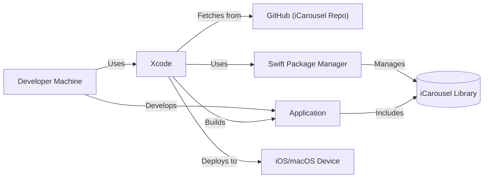
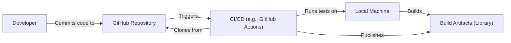

# Project Design Document: iCarousel

## BUSINESS POSTURE

iCarousel is a popular open-source library for iOS and macOS, providing a simple and highly customizable way to implement carousel-style UI components. It's widely used in mobile applications to display collections of items in a visually appealing and interactive manner.

Priorities and Goals:

*   Provide a flexible and easy-to-use carousel component for iOS and macOS developers.
*   Offer a wide range of customization options to fit various UI designs and user experiences.
*   Maintain high performance and smooth animations, even with large datasets.
*   Ensure compatibility with different iOS and macOS versions and device types.
*   Foster a strong community around the project, encouraging contributions and providing support.

Business Risks:

*   Security vulnerabilities in the library could be exploited by malicious actors to compromise applications using iCarousel. This could lead to data breaches, unauthorized access, or other security incidents.
*   Performance issues or bugs in the library could negatively impact the user experience of applications, leading to user frustration and potentially harming the reputation of the application and its developers.
*   Lack of maintenance or updates could lead to compatibility issues with newer iOS/macOS versions or device types, rendering the library unusable or causing application crashes.
*   The library's permissive license (zlib license) allows for its use in both open-source and closed-source projects without requiring attribution. While this promotes adoption, it also means that the original author has limited control over how the library is used and may not be aware of potential security issues or misuse.

## SECURITY POSTURE

Existing Security Controls:

*   security control: Code Reviews: The project is open-source, allowing for community code reviews and scrutiny. (Described in GitHub repository)
*   security control: Issue Tracking: The project uses GitHub Issues for tracking bugs and feature requests, which can include security vulnerabilities. (Described in GitHub repository)

Accepted Risks:

*   accepted risk: The library primarily deals with UI presentation and does not handle sensitive data directly. Therefore, the risk of data breaches is relatively low.
*   accepted risk: The library is widely used, and any major security vulnerabilities are likely to be discovered and reported by the community.

Recommended Security Controls:

*   security control: Static Analysis: Integrate static analysis tools (e.g., SonarCloud, Coverity) into the development workflow to automatically detect potential security vulnerabilities and code quality issues.
*   security control: Fuzz Testing: Implement fuzz testing to identify potential crashes or unexpected behavior caused by malformed input.
*   security control: Security Audits: Conduct periodic security audits by independent security experts to identify potential vulnerabilities that may be missed by internal reviews.

Security Requirements:

*   Authentication: Not applicable, as iCarousel is a UI component and does not handle user authentication.
*   Authorization: Not applicable, as iCarousel does not manage access control to resources.
*   Input Validation:
    *   The library should validate input parameters to prevent unexpected behavior or crashes. This includes checking for valid data types, ranges, and sizes.
    *   The library should handle potentially malicious input gracefully, without crashing or exposing sensitive information.
*   Cryptography: Not applicable, as iCarousel does not handle encryption or decryption of data.

## DESIGN

### C4 CONTEXT

Element Descriptions:

*   Element:
    *   Name: User
    *   Type: Person
    *   Description: A person who interacts with an iOS or macOS application that utilizes the iCarousel library.
    *   Responsibilities: Interacts with the carousel UI component, viewing and potentially selecting items.
    *   Security controls: None (external to the system).

*   Element:
    *   Name: iCarousel
    *   Type: Software System
    *   Description: The iCarousel library itself, providing the carousel functionality.
    *   Responsibilities: Rendering the carousel view, handling user interactions, managing data display, and providing customization options.
    *   Security controls: Input validation, potential future security controls (static analysis, fuzz testing).

*   Element:
    *   Name: iOS/macOS Application
    *   Type: Software System
    *   Description: An application built for iOS or macOS that integrates the iCarousel library.
    *   Responsibilities: Hosting and utilizing the iCarousel component within its user interface.
    *   Security controls: Dependent on the specific application's security measures.

### C4 CONTAINER

Element Descriptions:

*   Element:
    *   Name: User
    *   Type: Person
    *   Description: A person who interacts with an iOS or macOS application that utilizes the iCarousel library.
    *   Responsibilities: Interacts with the carousel UI component, viewing and potentially selecting items.
    *   Security controls: None (external to the system).

*   Element:
    *   Name: Application using iCarousel
    *   Type: Container (Mobile App)
    *   Description: The iOS or macOS application that integrates and uses the iCarousel library.
    *   Responsibilities: Provides the overall application functionality, including the UI that incorporates the iCarousel component.
    *   Security controls: Application-specific security controls (e.g., authentication, authorization, data encryption).

*   Element:
    *   Name: iCarousel Library
    *   Type: Container (Library/Framework)
    *   Description: The iCarousel library code, providing the carousel functionality.
    *   Responsibilities: Rendering the carousel, handling user input, managing data, and providing customization options.
    *   Security controls: Input validation, potential future security controls (static analysis, fuzz testing).

### DEPLOYMENT

Possible Deployment Solutions:

1.  Direct Integration: Developers directly include the iCarousel source code into their application project.
2.  CocoaPods: iCarousel is available as a CocoaPod, allowing developers to manage it as a dependency.
3.  Carthage: iCarousel can be integrated using Carthage, another dependency manager for Cocoa projects.
4.  Swift Package Manager: iCarousel supports Swift Package Manager.

Chosen Deployment Solution (Swift Package Manager):

Element Descriptions:

*   Element:
    *   Name: Developer Machine
    *   Type: Person/Machine
    *   Description: The developer's computer used for coding and building the application.
    *   Responsibilities: Writing code, managing dependencies, building the application.
    *   Security controls: Developer machine security (e.g., OS security, antivirus).

*   Element:
    *   Name: GitHub (iCarousel Repo)
    *   Type: System
    *   Description: The Git repository hosting the iCarousel source code.
    *   Responsibilities: Source code version control, distribution.
    *   Security controls: GitHub's security features (e.g., access controls, vulnerability scanning).

*   Element:
    *   Name: Swift Package Manager
    *   Type: System
    *   Description: The dependency manager used to integrate iCarousel into the application.
    *   Responsibilities: Fetching, building, and linking the iCarousel library.
    *   Security controls: SPM security features (e.g. signed packages).

*   Element:
    *   Name: Xcode
    *   Type: System
    *   Description: The integrated development environment (IDE) used to build iOS and macOS applications.
    *   Responsibilities: Building, compiling, and linking the application and its dependencies.
    *   Security controls: Xcode security features.

*   Element:
    *   Name: Application
    *   Type: Software
    *   Description: The application that includes the iCarousel library.
    *   Responsibilities: Providing the application's functionality.
    *   Security controls: Application-specific security controls.

*   Element:
    *   Name: iCarousel Library
    *   Type: Software
    *   Description: iCarousel library.
    *   Responsibilities: Carousel functionality.
    *   Security controls: Input validation.

*   Element:
    *   Name: iOS/macOS Device
    *   Type: Device
    *   Description: The device where the application is deployed and run.
    *   Responsibilities: Running the application.
    *   Security controls: Device operating system security.

### BUILD

Build Process Description:

1.  Developer: The developer writes code and commits it to the GitHub repository.
2.  GitHub Repository: The repository hosts the source code and triggers the CI/CD pipeline upon code changes.
3.  CI/CD (GitHub Actions): A continuous integration and continuous delivery system (e.g., GitHub Actions) is used to automate the build process.
4.  Clone: The CI/CD pipeline clones the latest code from the GitHub repository.
5.  Build: The CI/CD pipeline executes build scripts (using Xcode build tools) to compile the iCarousel library.
6.  Tests: Unit tests and UI tests are executed to ensure code quality and functionality.
7.  Static Analysis: (Recommended) Static analysis tools are run to identify potential security vulnerabilities and code quality issues.
8.  Artifacts: If the build and tests are successful, the compiled iCarousel library is packaged as build artifacts.
9.  Publish: The build artifacts are published (e.g., to a package registry, or made available for download).

Security Controls in Build Process:

*   security control: Code Review: Pull requests on GitHub facilitate code review before merging changes.
*   security control: Automated Testing: Unit and UI tests are run automatically as part of the CI/CD pipeline.
*   security control: (Recommended) Static Analysis: Integrating static analysis tools into the CI/CD pipeline helps identify potential vulnerabilities early in the development process.
*   security control: (Recommended) Dependency Scanning: Tools like Dependabot (for GitHub) can scan dependencies for known vulnerabilities.

## RISK ASSESSMENT

Critical Business Processes:

*   Displaying collections of items in a visually appealing and interactive manner within iOS and macOS applications.
*   Providing a smooth and responsive user experience for interacting with carousel components.

Data Protection:

*   iCarousel itself does not directly handle sensitive data. It primarily deals with the presentation of UI elements. The data displayed within the carousel is managed by the application using iCarousel.
*   Data Sensitivity: The sensitivity of the data displayed within the carousel depends entirely on the application using iCarousel. It could range from non-sensitive (e.g., images in a photo gallery) to highly sensitive (e.g., financial data, personal information), depending on the application's purpose. The application integrating iCarousel is responsible for protecting any sensitive data it handles.

## QUESTIONS & ASSUMPTIONS

Questions:

*   Are there any specific performance requirements or limitations for iCarousel (e.g., maximum number of items, expected frame rates)?
*   Are there any plans to add support for other platforms (e.g., watchOS, tvOS)?
*   What is the typical size of data sets that iCarousel is expected to handle?
*   Are there any known compatibility issues with specific iOS/macOS versions or device types?

Assumptions:

*   BUSINESS POSTURE: The primary goal is to provide a functional and user-friendly carousel component, with security being a secondary but important consideration.
*   SECURITY POSTURE: The library does not handle sensitive data directly, and the main security risks are related to potential vulnerabilities that could be exploited to cause application crashes or unexpected behavior.
*   DESIGN: Developers will use standard dependency management tools (CocoaPods, Carthage, or Swift Package Manager) to integrate iCarousel into their applications. The build process will be automated using a CI/CD system.