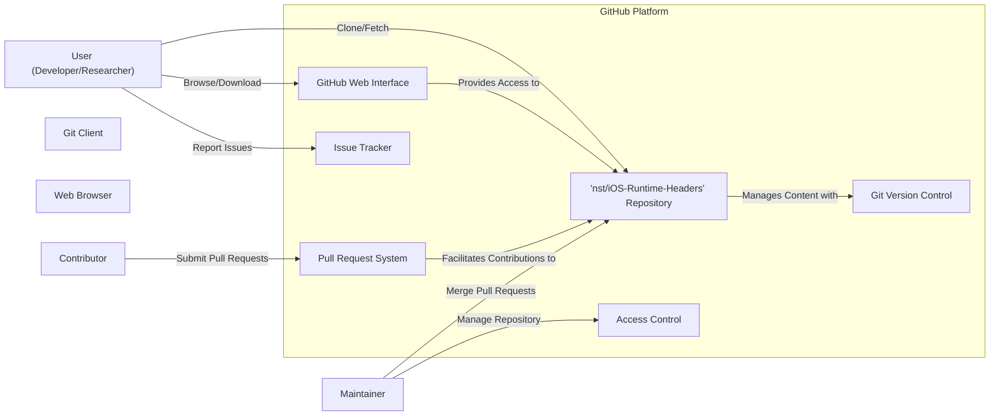

# Project Design Document: iOS Runtime Headers Repository

**Version:** 1.1
**Date:** October 26, 2023
**Author:** AI Software Architect

## 1. Introduction

This document outlines the design of the `nst/iOS-Runtime-Headers` project, a publicly available repository on GitHub containing header files extracted from the iOS runtime. This document serves as a foundation for understanding the project's architecture, data flow, and potential security considerations, which will be crucial for subsequent threat modeling activities. This revision aims to provide more detail and clarity for security analysis.

## 2. Goals and Objectives

The primary goal of this project is to provide developers with access to the internal header files of the iOS runtime. This enables:

*   Reverse engineering efforts to understand iOS frameworks and libraries.
*   Research and development activities exploring undocumented APIs and functionalities.
*   Educational purposes for individuals learning about the structure and implementation of the iOS operating system.

The key objectives are:

*   Maintain an up-to-date and comprehensive collection of iOS runtime headers for various iOS versions and architectures.
*   Provide a readily accessible and easily navigable repository structure.
*   Ensure the integrity and authenticity of the header files within the constraints of a community-driven project.
*   Facilitate easy access through standard Git workflows and web browsing.

## 3. Target Audience

The primary target audience for this project includes:

*   Security researchers actively investigating vulnerabilities and security mechanisms within the iOS ecosystem.
*   Reverse engineers analyzing iOS applications, frameworks, and the operating system itself.
*   Mobile developers seeking deeper insights into the iOS platform's internal workings.
*   Students and educators utilizing the headers for learning about operating system internals and iOS development practices.
*   Potentially malicious actors who might use the headers to identify vulnerabilities for exploitation.

## 4. System Architecture

The project's architecture is straightforward, primarily leveraging the GitHub platform. The key components and their interactions are:

*   **GitHub Repository (`nst/iOS-Runtime-Headers`):**
    *   The central and authoritative storage location for all header files.
    *   Utilizes Git for robust version control, tracking changes, and maintaining history.
    *   Offers a web interface for browsing the file structure and viewing file contents directly.
    *   Supports standard Git protocols (HTTPS, SSH) for cloning, fetching, and pushing (though direct pushing is likely restricted to maintainers).
    *   Includes features like issues and pull requests for community interaction and contributions.
*   **Header Files:**
    *   Plain text files (`.h`) written in C/Objective-C, containing declarations of classes, protocols, structures, constants, and functions from the iOS runtime libraries and frameworks.
    *   Organized into a hierarchical directory structure mirroring the framework organization within iOS.
    *   Represent a snapshot of the iOS runtime at a specific point in time.
*   **Git:**
    *   The distributed version control system managing the repository's history, branches, and merges.
    *   Ensures traceability of changes and allows for reverting to previous states.
*   **GitHub Platform Infrastructure:**
    *   Provides the underlying infrastructure for hosting the Git repository, managing access control, and serving the web interface.
    *   Includes security features implemented by GitHub to protect the platform and its hosted repositories.
*   **Maintainer(s):**
    *   Individuals responsible for curating the repository, merging contributions, and potentially extracting and adding new header files.
    *   Have elevated privileges within the repository to manage its content and settings.
*   **Contributors:**
    *   Community members who may submit pull requests with updates, additions, or corrections to the header files.
    *   Their contributions are subject to review and approval by the maintainer(s).
*   **Users (Developers, Researchers, etc.):**
    *   Interact with the repository to access the header files for their respective purposes.
    *   Utilize various tools like Git clients, command-line interfaces, and web browsers for interaction.

## 5. Data Flow

The primary data flow revolves around users accessing and retrieving the header files and the process of contributing changes. Key data flows include:

*   **Header File Retrieval:**
    1. **User Action:** A user initiates access to the iOS runtime headers.
    2. **Access Method Selection:** The user chooses one of the following methods:
        *   **Browse (Web):** Using a web browser to navigate the GitHub repository and view the contents of individual header files.
        *   **Download (Web):** Using the GitHub web interface to download individual header files.
        *   **Clone (Git):** Using a Git client to clone the entire repository to their local machine, downloading all header files and the repository history.
        *   **Fetch/Pull (Git):** Using a Git client to update their local copy of the repository with the latest changes from the remote repository.
    3. **GitHub Interaction:** The user's request is processed by the GitHub platform. Authentication and authorization may be involved depending on the action.
    4. **Data Retrieval:** GitHub retrieves the requested header files from the repository's storage.
    5. **Data Transmission:** The header files are transmitted to the user's client (web browser or Git client) via secure protocols (HTTPS or SSH).
    6. **Local Storage (Optional):** If the user cloned or downloaded files, the header files are stored locally on their machine.

*   **Contribution Workflow:**
    1. **Contributor Action:** A contributor identifies a need to update or add header files.
    2. **Forking (Optional):** The contributor may fork the repository to their own GitHub account to make changes in isolation.
    3. **Local Changes:** The contributor makes the necessary changes to the header files locally.
    4. **Commit and Push:** The contributor commits their changes and pushes them to their forked repository or a branch in the main repository (if they have write access).
    5. **Pull Request:** The contributor submits a pull request to the main repository, proposing their changes for review and merging.
    6. **Review Process:** Maintainer(s) review the proposed changes, potentially providing feedback and requesting modifications.
    7. **Merging:** If the changes are approved, a maintainer merges the pull request into the main branch of the repository.
    8. **Repository Update:** The main repository is updated with the new header files.

## 6. Security Considerations

Several security considerations are relevant to this project, focusing on the confidentiality, integrity, and availability of the header files and the repository itself:

*   **Integrity of Header Files:**
    *   **Threat:** Malicious actors could attempt to inject malicious code or alter existing header files to mislead researchers or developers.
    *   **Mitigation:** Reliance on GitHub's infrastructure security, Git's content integrity mechanisms (SHA-1/SHA-256 hashes), and the maintainer's review process for contributions. Code signing of commits (if implemented) could further enhance integrity.
*   **Exposure of Internal APIs:**
    *   **Threat:** The very nature of the project exposes internal and potentially undocumented APIs, which could be leveraged by malicious actors to discover vulnerabilities or develop exploits in iOS.
    *   **Mitigation:** This is an inherent risk of the project's purpose. No direct mitigation within the repository itself. Awareness and responsible use by the target audience are crucial.
*   **Repository Security:**
    *   **Threat:** Compromise of the maintainer's GitHub account could lead to unauthorized modifications or the introduction of malicious content.
    *   **Mitigation:** Strong password policies, two-factor authentication for maintainer accounts, and regular security audits of the repository settings. GitHub's security features also play a vital role.
*   **Data Security in Transit:**
    *   **Threat:** Man-in-the-middle attacks could potentially intercept the transmission of header files.
    *   **Mitigation:** Enforced use of HTTPS for web access and SSH for Git operations.
*   **Availability of the Repository:**
    *   **Threat:** Denial-of-service attacks against GitHub could temporarily make the repository inaccessible.
    *   **Mitigation:** Reliance on GitHub's infrastructure and its resilience against DDoS attacks.
*   **Attribution and Licensing:**
    *   **Consideration:** While not a direct security threat, understanding the licensing terms associated with the header files is important for legal compliance and responsible use. The project typically operates under the assumption that these headers are derived from Apple's SDK and are subject to their licensing terms.
*   **Supply Chain Security:**
    *   **Threat:** If the process of extracting or generating the header files is compromised, malicious content could be introduced at the source.
    *   **Mitigation:** Trust in the maintainer's processes and the tools they use for extraction. Transparency in the extraction process can help build trust.

## 7. Assumptions and Constraints

The design is based on the following assumptions and constraints:

*   **Reliance on GitHub:** The project's functionality and availability are heavily dependent on the GitHub platform.
*   **Read-Mostly Access:** The primary mode of interaction for most users is read-only (browsing, downloading, cloning). Write access is typically restricted to maintainers and contributors through pull requests.
*   **Plain Text Content:** The header files are plain text and do not contain executable code, reducing the risk of direct execution-based attacks from the files themselves.
*   **Community-Driven Nature:** The project relies on the efforts of maintainers and contributors for updates and maintenance. The security posture is influenced by the security practices of these individuals.
*   **Implicit Trust:** Users implicitly trust that the maintainers are acting in good faith and are taking reasonable steps to ensure the integrity of the repository.

## 8. Future Considerations

Potential future developments or considerations include:

*   **Automated Header Generation and Updates:** Implementing automated scripts or processes to extract and update header files for new iOS releases, potentially improving the timeliness and accuracy of the repository.
*   **Enhanced Organization and Search Capabilities:** Exploring ways to improve the organization of the header files and implement more robust search functionality within the repository.
*   **Documentation and Usage Guidelines:** Providing more comprehensive documentation or guidelines on how to use the header files effectively and responsibly.
*   **Mirroring or Alternative Hosting Options:** Investigating options for mirroring the repository on other platforms to enhance availability and resilience.
*   **Formalizing Contribution Guidelines:** Establishing clear guidelines for contributing to the repository, including security considerations for submitted changes.
*   **Checksums or Signing:** Implementing mechanisms to provide checksums or digital signatures for the header files to further enhance integrity verification.

This document provides a detailed understanding of the `nst/iOS-Runtime-Headers` project's design, incorporating more specific details relevant to security considerations. This information will serve as a valuable input for a subsequent threat modeling exercise to identify potential security risks and vulnerabilities associated with the project and its usage.