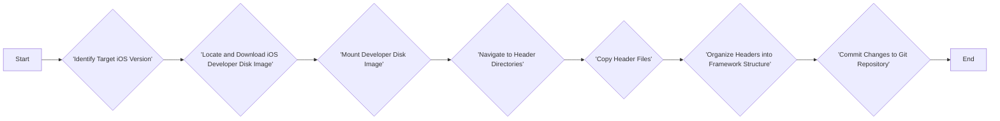

# Project Design Document: iOS Runtime Headers Extraction and Management

**Project Repository:** [https://github.com/nst/ios-runtime-headers](https://github.com/nst/ios-runtime-headers)

**1. Project Overview**

This project provides a systematic and automated approach to extract private header files from the iOS runtime environment. These headers, not included in the official iOS SDK, offer valuable insights into the internal workings of the operating system. This resource is primarily intended for developers engaged in reverse engineering, advanced debugging, and the development of specialized tools that interact directly with the iOS runtime. The project aims to maintain a readily accessible and up-to-date repository of these headers, facilitating deeper exploration and understanding of iOS.

**2. Goals**

*   Establish a robust and automated pipeline for extracting iOS runtime headers.
*   Provide comprehensive support for a wide range of iOS versions, ensuring historical and current header availability.
*   Maintain a meticulously organized directory structure for the extracted headers, mirroring the framework organization within iOS.
*   Publish the extracted headers in a public Git repository, enabling easy access, version control, and collaboration.
*   Minimize the need for manual intervention in the header update process following new iOS releases, ensuring timely updates.
*   Guarantee the integrity and authenticity of the extracted headers to prevent the introduction of malicious or corrupted data.

**3. Non-Goals**

*   Providing any form of official support or guarantees regarding the stability or compatibility of the extracted headers with Apple's frameworks or future iOS versions.
*   Including header files that are already part of the publicly available iOS SDK.
*   Developing specific tools or libraries for utilizing or manipulating the extracted headers. The focus is solely on extraction and organization.
*   Extending support to operating systems other than iOS (e.g., macOS, watchOS, tvOS). The target is exclusively the iOS runtime.
*   Implementing a graphical user interface (GUI) or any interactive elements for managing the header extraction process. The project relies on command-line execution.

**4. High-Level Architecture**

**5. Detailed Design**

The project's core functionality is implemented through a series of shell scripts leveraging standard command-line utilities. The process unfolds as follows:

*   **Identifying the Target iOS Version:**
    *   The script requires a mechanism to determine the specific iOS version for which headers need to be extracted. This can be provided as:
        *   A command-line argument passed to the script.
        *   A configuration file specifying the desired iOS version.

*   **Locating and Downloading the iOS Developer Disk Image:**
    *   The script attempts to locate and download the corresponding Developer Disk Image (`.dmg` file) for the identified iOS version. This involves:
        *   Checking a predefined list of known download URLs for various iOS versions.
        *   Potentially using external tools or APIs (if available and reliable) to find download links.
        *   **Error Handling:** The script must handle cases where the disk image cannot be found or downloaded (e.g., network issues, invalid URLs).
        *   **Integrity Check:** After downloading, the script should verify the integrity of the downloaded image using checksums (e.g., SHA-256) if available from the source.

*   **Mounting the Developer Disk Image:**
    *   The `hdiutil` command-line utility is used to mount the downloaded `.dmg` file to a temporary mount point.
    *   The script needs to:
        *   Create a temporary directory for the mount point if it doesn't exist.
        *   Execute the `hdiutil attach` command.
        *   **Error Handling:** Handle potential errors during the mounting process (e.g., corrupted image, insufficient permissions).

*   **Navigating to Header Directories:**
    *   Once the disk image is mounted, the script navigates to the directories containing the header files. Common locations include:
        *   `/Volumes/DeveloperDiskImage/System/Library/Frameworks/<FrameworkName>.framework/Headers`
        *   `/Volumes/DeveloperDiskImage/System/Library/PrivateFrameworks/<PrivateFrameworkName>.framework/Headers`
    *   The script uses commands like `cd` and `ls` to traverse the file system.

*   **Copying Header Files:**
    *   The `find` command is used to locate all files with the `.h` extension within the relevant framework directories.
    *   The `cp` command is then used to copy these header files to a designated output directory within the project's local repository.
    *   **Preserving Structure:** The copying process should preserve the original directory structure of the frameworks.

*   **Organizing Headers into Framework Structure:**
    *   The copied headers are organized within the project repository, mirroring the framework hierarchy found in the iOS disk image. This typically involves creating subdirectories for each framework.
    *   The script might perform cleanup tasks, such as removing empty directories or handling potential filename conflicts.

*   **Committing Changes to Git Repository:**
    *   Standard Git commands are used to add, commit, and push the extracted headers to the project's Git repository.
    *   This involves:
        *   `git add .` to stage the changes.
        *   `git commit -m "Update headers for iOS version X.Y"` to commit the changes with a descriptive message.
        *   `git push origin main` (or the relevant branch) to push the changes to the remote repository.
    *   **Conflict Resolution:** The script needs to handle potential Git conflicts that might arise if local changes conflict with remote changes. This might involve prompting the user for manual resolution or implementing automated conflict resolution strategies (with caution).

**6. Data Flow**

```mermaid
graph LR
    A["iOS Version Input"] --> B{"'Download Script Execution'"}
    B --> C{"'Developer Disk Image URL (from configuration or lookup)'"}
    C --> D{"'Download Process (e.g., curl, wget)'"}
    D --> E{"'Developer Disk Image (.dmg) File'"}
    E --> F{"'Mounting Process (hdiutil)'"}
    F --> G{"'Mounted Disk Image'"}
    G --> H{"'File System Navigation (cd, ls)'"}
    H --> I{"'Header File Paths'"}
    I --> J{"'Copying Process (cp)'"}
    J --> K{"'Extracted Header Files (local)'"}
    K --> L{"'Directory Organization Script'"}
    L --> M{"'Organized Header Directory Structure (local)'"}
    M --> N{"'Git Staging (git add)'"}
    N --> O{"'Git Commit (git commit)'"}
    O --> P{"'Git Push (git push)'"}
    P --> Q["'Remote Git Repository'"];
```

**7. Security Considerations**

*   **Untrusted Sources for Developer Disk Images:**
    *   **Threat:** Downloading disk images from unofficial or compromised sources introduces the risk of including malware, backdoors, or tampered header files that could mislead developers or introduce vulnerabilities in their projects.
    *   **Vulnerability:** Reliance on hardcoded URLs or scraping methods for obtaining disk images increases the risk of pointing to malicious sources.
    *   **Mitigation:** Prioritize obtaining disk images from official Apple developer portals. Implement verification mechanisms using cryptographic hashes (e.g., SHA-256) to ensure the integrity of downloaded images. If scraping is necessary, implement robust checks and consider using allowlists of trusted sources.

*   **Execution Environment Security:**
    *   **Threat:** The scripts might require elevated privileges (e.g., `sudo` for mounting). If the environment where these scripts are executed is compromised, attackers could leverage these privileges for malicious purposes.
    *   **Vulnerability:** Running scripts with unnecessary elevated privileges expands the attack surface.
    *   **Mitigation:** Minimize the need for elevated privileges. Clearly document the necessary privileges and the rationale behind them. Run the scripts in isolated environments (e.g., containers, virtual machines) with restricted access. Regularly audit the security of the execution environment.

*   **Compromised Extraction Process:**
    *   **Threat:**  Vulnerabilities in the extraction scripts or the utilities they use (e.g., `hdiutil`, `cp`) could be exploited to inject malicious code into the extracted headers or alter their content.
    *   **Vulnerability:**  Lack of input validation or insecure handling of file paths could lead to vulnerabilities.
    *   **Mitigation:**  Regularly review and audit the scripts for security vulnerabilities (e.g., using static analysis tools). Ensure that the used utilities are up-to-date with the latest security patches. Implement input validation to prevent path traversal or command injection attacks.

*   **Exposure of Private Headers as a Security Risk:**
    *   **Threat:** While the project's intent is to provide these headers for research and development, their public availability could potentially be exploited by malicious actors to gain insights into private APIs and identify potential vulnerabilities in iOS.
    *   **Vulnerability:** The public nature of the Git repository makes these headers accessible to anyone.
    *   **Mitigation:**  Clearly state the nature of the headers and the potential risks associated with their use in the project's README. Consider adding a disclaimer about the potential for these headers to change or become invalid in future iOS versions. While not preventing access, this manages expectations and highlights potential risks.

*   **Secrets Management:**
    *   **Threat:** If the download process requires authentication (e.g., for accessing developer portals), storing credentials directly in the scripts or configuration files is a critical security vulnerability.
    *   **Vulnerability:** Hardcoded credentials can be easily discovered and exploited.
    *   **Mitigation:**  Never hardcode credentials. Utilize secure methods for storing and retrieving secrets, such as environment variables, dedicated secrets management tools (e.g., HashiCorp Vault), or credential providers.

*   **Dependency Vulnerabilities:**
    *   **Threat:** The scripts rely on external command-line utilities. Known vulnerabilities in these utilities could be exploited if they are not kept up-to-date.
    *   **Vulnerability:** Outdated dependencies can introduce security risks.
    *   **Mitigation:**  Keep the system and all dependencies (including the operating system and command-line utilities) updated with the latest security patches. Regularly review the security advisories for the tools being used.

*   **Input Validation:**
    *   **Threat:**  The scripts might accept user input (e.g., the target iOS version). Insufficient input validation could allow malicious users to inject commands or manipulate the script's behavior.
    *   **Vulnerability:** Lack of proper input sanitization can lead to command injection or other vulnerabilities.
    *   **Mitigation:** Implement robust input validation to ensure that any user-provided input conforms to the expected format and does not contain malicious characters or commands.

**8. Assumptions**

*   The system running the scripts has the necessary command-line utilities installed (e.g., `hdiutil`, `curl`, `git`).
*   The user executing the scripts has the required permissions to download files, mount disk images (potentially requiring `sudo`), and interact with the Git repository.
*   The directory structure and naming conventions for header files within iOS Developer Disk Images remain relatively consistent across different iOS versions. Significant changes could break the extraction scripts.
*   The primary method for distributing and accessing the extracted headers is through the public Git repository on platforms like GitHub.

**9. Future Considerations**

*   **Automated Testing and Integrity Checks:** Implement a suite of automated tests to verify the integrity of the extracted headers after each extraction process. This could involve comparing checksums against known good copies or performing basic syntax checks on the header files.
*   **Differential Updates:** Optimize the extraction process to identify and only update headers that have changed since the last extraction for a given iOS version, reducing processing time and repository size.
*   **Web Interface for Browsing (Optional):** Explore the possibility of creating a simple web interface to allow users to easily browse and search the extracted headers without needing to clone the entire repository.
*   **Continuous Integration/Continuous Deployment (CI/CD) Integration:** Fully integrate the extraction process into a CI/CD pipeline to automatically trigger header extraction and updates whenever new iOS versions are released, ensuring timely availability of the latest headers.
*   **Handling Variations in Disk Image Formats:**  Adapt the scripts to gracefully handle potential variations or changes in the format of iOS Developer Disk Images in future iOS releases.
*   **Metadata Collection:** Consider collecting and storing metadata about the extracted headers, such as the iOS version they belong to, the framework they are part of, and potentially even basic API documentation if feasible.