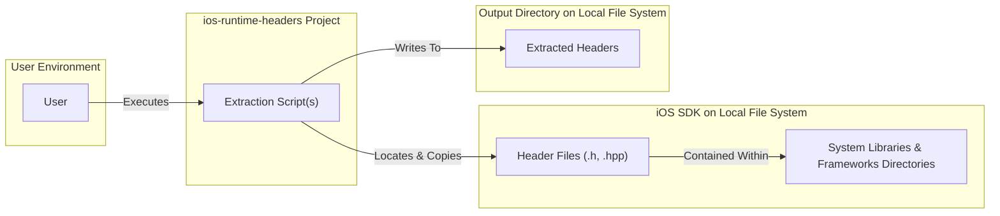
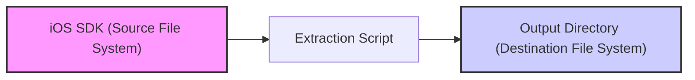

# Project Design Document: iOS Runtime Headers Extraction

**Project Repository:** https://github.com/nst/ios-runtime-headers

**Version:** 1.1
**Date:** October 26, 2023
**Author:** Gemini (AI Language Model)

## 1. Introduction

This document provides a detailed design overview of the `ios-runtime-headers` project. This project aims to extract and organize private and internal header files from the iOS runtime environment as found within the iOS Software Development Kit (SDK). These headers are valuable for purposes such as reverse engineering, security research, and gaining a deeper understanding of the iOS operating system's internal mechanisms. This document is intended to serve as a foundational artifact for subsequent threat modeling activities.

## 2. Goals and Non-Goals

### 2.1. Goals

*   To develop and provide script(s) capable of automatically extracting iOS runtime header files.
*   To organize the extracted header files into a structured directory hierarchy that mirrors their original location within the SDK.
*   To ensure the extraction process is adaptable to different versions of the iOS SDK.
*   To preserve the original directory structure of the header files as closely as possible in the output.
*   To create a tool that is relatively straightforward for developers and researchers to set up and utilize.

### 2.2. Non-Goals

*   To distribute pre-compiled or pre-extracted header file archives.
*   To include header files originating from third-party libraries or frameworks not part of the core iOS runtime.
*   To develop a graphical user interface (GUI) for initiating or managing the header extraction process.
*   To provide tools or functionalities for analyzing or interpreting the content of the extracted header files.
*   To guarantee out-of-the-box compatibility with all future iOS SDK versions without requiring project updates or modifications.

## 3. System Architecture Overview

The project's architecture is centered around the execution of script(s) that interact with the file system of the iOS SDK. These scripts are responsible for locating, copying, and organizing the target header files.



## 4. Detailed Design

### 4.1. Core Components

*   **Extraction Script(s):** This is the primary functional component of the project. It is anticipated to be implemented as one or more scripts, potentially using languages like `bash`, `python`, or a combination thereof. The responsibilities of these scripts include:
    *   **iOS SDK Path Configuration:**  The script needs a mechanism to determine the correct path to the iOS SDK on the user's machine. This can be achieved through:
        *   Reading the value of a specific environment variable (e.g., `$SDKROOT`, `$IOS_SDK_PATH`).
        *   Accepting the SDK path as a command-line argument when the script is executed.
        *   Potentially reading the path from a dedicated configuration file.
    *   **Identification of Target Directories:** The script must identify the specific directories within the iOS SDK that contain the relevant runtime header files. This typically involves:
        *   Using predefined, hardcoded paths based on the known directory structure of iOS SDKs (e.g., `/Applications/Xcode.app/Contents/Developer/Platforms/iPhoneOS.platform/Developer/SDKs/iPhoneOS.sdk/System/Library/Frameworks`, `/Applications/Xcode.app/Contents/Developer/Platforms/iPhoneOS.platform/Developer/SDKs/iPhoneOS.sdk/System/Library/PrivateFrameworks`).
        *   Employing utilities like `find` or `locate` to dynamically search for directories matching specific patterns or names.
    *   **Header File Selection Logic:** The script needs to identify files that are likely to be header files. This is typically done by:
        *   Filtering files based on their file extensions (e.g., `.h`, `.hpp`).
        *   Potentially incorporating more sophisticated logic to exclude non-header files if necessary.
    *   **Recreation of Directory Structure:** The script is responsible for creating an output directory structure that mirrors the directory structure of the source header files within the iOS SDK.
    *   **File Copying Operation:** The core function of the script is to copy the identified header files from their source locations within the SDK to their corresponding locations in the designated output directory.
    *   **Basic Error Handling:** The script should include mechanisms to handle common error scenarios, such as:
        *   An invalid or inaccessible iOS SDK path.
        *   The inability to locate target directories or header files.
        *   Permissions issues preventing file copying or directory creation.

*   **Configuration File (Optional but Recommended):**  A configuration file (e.g., `config.ini`, `config.yaml`, `.env`) could enhance the flexibility and usability of the project by allowing users to:
    *   Explicitly specify the path to the iOS SDK.
    *   Define specific directories to be included or excluded from the header extraction process.
    *   Configure the location of the output directory where the extracted headers will be stored.

### 4.2. Execution Flow

The typical execution flow of the project involves the following steps:

1. **User Invocation:** The user initiates the header extraction process by executing the main script, potentially providing the SDK path as a command-line argument or relying on a pre-configured path.
2. **SDK Path Resolution:** The script first determines the location of the iOS SDK using one of the configured methods (environment variable, command-line argument, configuration file).
3. **Target Directory Identification:** Based on the resolved SDK path, the script identifies the specific directories within the SDK that are expected to contain the target runtime headers.
4. **Header File Discovery:** The script recursively searches within the identified target directories for files that match the criteria for header files (e.g., file extension).
5. **Output Directory Preparation:** The script creates the necessary directory structure within the designated output location to mirror the source directory structure of the extracted headers.
6. **Header File Copying:** The script copies the discovered header files from their original locations in the SDK to their corresponding locations within the output directory.
7. **Process Completion:** The script provides feedback to the user indicating the successful completion of the header extraction process or reports any errors encountered.

```mermaid
graph TD
    A["Start Script Execution"] --> B{"Resolve iOS SDK Path"};
    B -- "Environment Variable" --> C[Read from Environment (e.g., SDKROOT)];
    B -- "Command Line Argument" --> D[Parse Command Line Arguments];
    B -- "Configuration File" --> E[Read from Configuration File];
    C --> F{"Identify Target Directories in SDK"};
    D --> F;
    E --> F;
    F --> G{"Recursively Find Header Files"};
    G --> H{"Create Corresponding Output Directory Structure"};
    H --> I{"Copy Header Files to Output"};
    I --> J["End Script Execution"];
```

### 4.3. Data Flow

The primary data flow within the project involves reading data (header files) from the iOS SDK location on the file system and writing that data to a designated output directory, also on the file system.



### 4.4. Technology Stack

*   **Scripting Language:**  Likely `bash`, `python`, or a combination of both. `python` offers more robust file system manipulation capabilities, while `bash` might be used for simpler tasks or invoking command-line utilities.
*   **Operating System:** The scripts are designed to be executed on macOS, as this is the primary platform for iOS development and where the iOS SDK is typically installed.
*   **Standard Unix Utilities:** The scripts will likely leverage standard command-line utilities available on macOS, such as `find`, `cp`, `mkdir`, and potentially `xargs`.

## 5. Security Considerations (For Threat Modeling)

This section outlines potential security considerations and attack vectors that should be thoroughly examined during the threat modeling process.

*   **Path Traversal Vulnerabilities:** If the script relies on user-provided input for the iOS SDK path or the output directory path without proper validation and sanitization, attackers could potentially manipulate these inputs to access or write files outside of the intended directories.
    *   **Mitigation:** Implement robust input validation to ensure that paths are canonicalized and do not contain malicious sequences like `../`.
*   **Command Injection Vulnerabilities:** If the script constructs and executes shell commands based on user-provided input or data read from the SDK (e.g., file names), there is a risk of command injection. An attacker could inject malicious commands that would be executed with the privileges of the script.
    *   **Mitigation:** Avoid constructing shell commands from untrusted input. If shell commands are necessary, use parameterized commands or safer alternatives provided by the scripting language.
*   **Exposure of Sensitive Information:** The extracted header files themselves might contain sensitive information, such as internal API details, security vulnerabilities, or proprietary algorithms. While the project's goal is to extract these headers, users should be aware of the potential risks associated with storing and sharing this information.
    *   **Mitigation:**  Educate users about the sensitive nature of the extracted data and the importance of securing the output directory.
*   **Dependency Chain Vulnerabilities:** If the script relies on external libraries or packages (especially in the case of `python`), vulnerabilities in those dependencies could be exploited.
    *   **Mitigation:**  Implement dependency management practices, regularly update dependencies, and use tools to scan for known vulnerabilities in dependencies.
*   **Insecure Output Directory Permissions:** If the output directory where the extracted headers are stored is not properly secured with appropriate file system permissions, unauthorized users could gain access to the extracted headers.
    *   **Mitigation:**  Advise users to set restrictive permissions on the output directory to limit access to authorized users only.
*   **Symbolic Link Following Vulnerabilities:** If the script blindly follows symbolic links within the iOS SDK directory structure, an attacker could potentially create malicious symbolic links that point to sensitive files outside of the intended SDK scope, causing the script to copy those files as well.
    *   **Mitigation:** Implement checks to identify and avoid following symbolic links, or explicitly resolve symbolic links to their real paths before performing file operations.
*   **Insufficient Error Handling and Information Disclosure:**  Verbose error messages that reveal internal paths or system information could be exploited by attackers.
    *   **Mitigation:** Implement proper error handling that logs detailed information securely but provides only generic error messages to the user.

## 6. Future Considerations

*   **Support for Incremental Extraction:** Implementing functionality to only extract new or modified headers since the last extraction, improving efficiency.
*   **Filtering and Selection Options:** Providing more granular control over which headers are extracted based on criteria like specific frameworks or directory patterns.
*   **Integration with Development Workflows:** Exploring potential integrations with build systems or CI/CD pipelines to automate header extraction as part of the development process.
*   **Checksum Verification of Copied Files:** Adding functionality to verify the integrity of the copied header files by comparing checksums with the source files.
*   **Support for Other Apple Platform SDKs:**  Potentially extending the script to support the extraction of runtime headers from other Apple platform SDKs (e.g., watchOS, tvOS).

This revised design document provides a more detailed and structured overview of the `ios-runtime-headers` project, with a stronger emphasis on aspects relevant to threat modeling. The enhanced descriptions and the explicit identification of potential security considerations should facilitate a more thorough and effective threat modeling process.