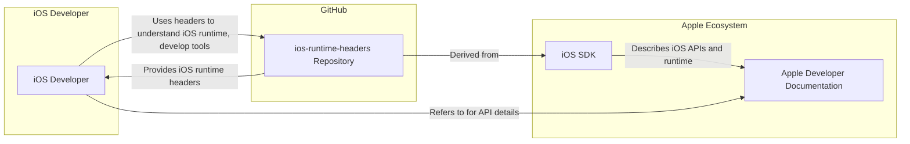
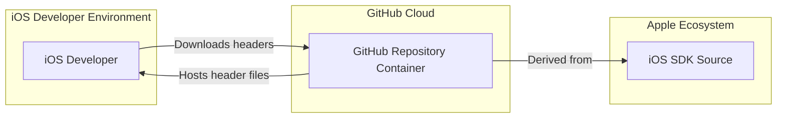
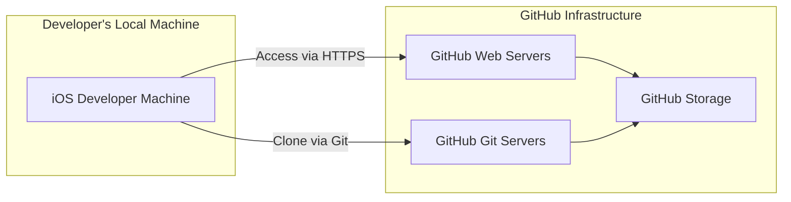
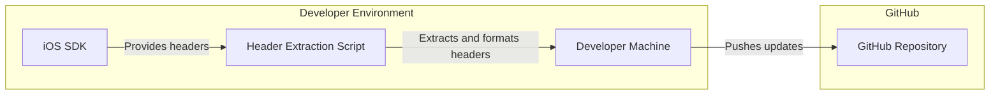

# BUSINESS POSTURE

This project, 'ios-runtime-headers', aims to provide a publicly accessible repository of header files derived from the iOS runtime.

- Business Priorities and Goals:
  - Provide a valuable resource for iOS developers who need to interact with or understand the internal workings of the iOS runtime environment.
  - Facilitate research, development of developer tools, and deeper understanding of iOS internals within the developer community.
  - Contribute to the open-source ecosystem by making these resources freely available.

- Business Risks:
  - Misinterpretation or misuse of the provided headers could lead to unintended application behavior or instability in applications developed using these headers.
  - Potential for the headers to become outdated as iOS evolves, requiring ongoing maintenance and updates to maintain their accuracy and relevance.
  - Lack of official support or endorsement from Apple, meaning developers use these headers at their own risk and without any guarantees of compatibility or correctness.
  - Legal or ethical concerns if the headers are used to bypass security features or violate Apple's terms of service, although the headers themselves are likely derived from publicly accessible SDK components.

# SECURITY POSTURE

The 'ios-runtime-headers' project, being a repository of header files, has a limited security surface area compared to executable software projects. However, certain security considerations are still relevant.

- Existing Security Controls:
  - security control: Public GitHub repository. The project is hosted on GitHub, benefiting from GitHub's platform security features such as access controls, vulnerability scanning for the platform itself, and infrastructure security. Implemented by: GitHub platform.
  - security control: Open Source. The project is open source, allowing for community review and scrutiny of the content. Implemented by: Project licensing and repository visibility.

- Accepted Risks:
  - accepted risk: Potential for outdated or inaccurate headers. The headers are derived from iOS runtime, which evolves. There is a risk that the headers in the repository may not always be perfectly up-to-date with the latest iOS versions, potentially leading to inaccuracies or compatibility issues for users.
  - accepted risk: Misuse of headers by developers. Developers might use these headers in ways not intended or anticipated, potentially leading to application vulnerabilities or instability. This risk is inherent in providing access to low-level system interfaces.

- Recommended Security Controls:
  - security control: Clearly defined license and usage guidelines. Explicitly state the terms of use, disclaimers, and limitations of the headers to mitigate potential misuse and legal risks. This should be documented in the repository (e.g., LICENSE and README files).
  - security control: Contribution guidelines and code review process for updates. If community contributions are accepted, establish guidelines for contributions and implement a review process to ensure the quality and integrity of header updates. Documented in: CONTRIBUTING.md file.
  - security control: Automated checks for header consistency and accuracy. Implement automated scripts or tools to verify the consistency and accuracy of the generated headers against official SDK components or runtime environments, to reduce the risk of outdated or incorrect headers. Implemented in: CI/CD pipeline (if any).

- Security Requirements:
  - Authentication: Not applicable. The project is a public repository of header files; authentication is not a relevant security requirement for accessing or using the headers.
  - Authorization: Not applicable. Access to the repository is public; authorization is not a relevant security requirement.
  - Input Validation: Not applicable. The project primarily provides header files, which are output rather than input. Input validation is not directly applicable to the core function of the repository. However, if contribution mechanisms are in place, input validation would be relevant for contributions (e.g., ensuring file format and content integrity).
  - Cryptography: Not applicable. Cryptography is not a direct security requirement for a repository of header files. The headers themselves do not involve cryptographic operations.

# DESIGN

The 'ios-runtime-headers' project is fundamentally a data repository. Its design is centered around the organization, storage, and accessibility of iOS runtime header files.

## C4 CONTEXT

- Elements of Context Diagram:
  - - Name: iOS Developer
    - Type: Person
    - Description: Software developers creating applications and tools for the iOS platform. They are the primary users of the iOS runtime headers.
    - Responsibilities: Utilize the provided headers to gain insights into the iOS runtime, develop applications, debug issues, and create developer tools.
    - Security controls: Developers are responsible for securely using the headers in their own projects and adhering to Apple's developer guidelines and terms of service.

  - - Name: ios-runtime-headers Repository
    - Type: Software System
    - Description: A public GitHub repository hosting a collection of header files derived from the iOS runtime. It serves as a central source for developers to access these headers.
    - Responsibilities: Store, organize, and provide access to iOS runtime header files. Ensure the headers are reasonably accurate and up-to-date. Manage contributions and maintain the repository.
    - Security controls: GitHub platform security, open-source visibility, potential future implementation of contribution review process and automated consistency checks.

  - - Name: iOS SDK
    - Type: Software System
    - Description: Apple's official Software Development Kit for iOS. It contains header files, libraries, and tools necessary for iOS development. The 'ios-runtime-headers' repository is derived from components within the iOS SDK.
    - Responsibilities: Provide the official APIs and runtime environment for iOS development. Serve as the source of truth for iOS system interfaces.
    - Security controls: Apple's internal security controls for SDK development and distribution. Developers using the SDK are expected to adhere to Apple's security guidelines.

  - - Name: Apple Developer Documentation
    - Type: Information System
    - Description: Apple's official online documentation for iOS development, including API references, guides, and tutorials. It complements the iOS SDK and provides context for using iOS APIs.
    - Responsibilities: Provide comprehensive and authoritative documentation for iOS development, including API descriptions and usage guidelines.
    - Security controls: Apple's controls for managing and publishing developer documentation. Documentation aims to guide developers towards secure and correct API usage.

## C4 CONTAINER

For this project, the C4 Container diagram is essentially a refinement of the Context diagram, as the system is relatively simple. The 'ios-runtime-headers Repository' container is the central component.

- Elements of Container Diagram:
  - - Name: GitHub Repository Container
    - Type: Container (Data Store/Repository)
    - Description: This represents the GitHub repository itself, which acts as the primary container for storing and serving the iOS runtime header files. It leverages GitHub's infrastructure for storage, version control, and access.
    - Responsibilities: Persistently store header files, manage version history using Git, provide access to the files via web interface and Git protocols, manage repository metadata and configurations.
    - Security controls: GitHub platform security features (access control, infrastructure security), Git version control for integrity, potential future implementation of branch protection and access restrictions for contributions.

  - - Name: iOS SDK Source
    - Type: External System/Data Source
    - Description: Represents the source from which the header files are derived, which is the iOS SDK provided by Apple. This is an external system that is not directly part of the 'ios-runtime-headers' project but is the origin of the data.
    - Responsibilities: Provide the source header files that are processed and stored in the GitHub repository. Maintain the official definitions of iOS runtime interfaces.
    - Security controls: Apple's internal security controls for SDK development and release. The security of the 'ios-runtime-headers' project is indirectly dependent on the integrity of the iOS SDK source.

  - - Name: iOS Developer
    - Type: Person
    - Description: Remains the same as in the Context Diagram - the end-user who interacts with the repository to obtain header files.
    - Responsibilities: Same as in the Context Diagram - utilize the headers responsibly and securely in their development activities.
    - Security controls: Developer's own security practices in their development environment.

## DEPLOYMENT

The 'ios-runtime-headers' project is deployed on GitHub. The deployment is straightforward as it's primarily a data repository.

- Elements of Deployment Diagram:
  - - Name: GitHub Web Servers
    - Type: Infrastructure (Web Server)
    - Description: GitHub's web servers that handle HTTP/HTTPS requests for accessing the repository through a web browser.
    - Responsibilities: Serve the repository web interface, handle user authentication and authorization for GitHub platform features (not directly for header access, which is public), provide web-based access to repository content.
    - Security controls: HTTPS encryption, GitHub's web application security measures, access controls for GitHub platform features.

  - - Name: GitHub Git Servers
    - Type: Infrastructure (Git Server)
    - Description: GitHub's Git servers that handle Git repository operations, such as cloning, pulling, and pushing (for contributors).
    - Responsibilities: Manage Git repository data, handle Git protocol requests, provide version control functionality, manage repository access via Git protocols (HTTPS, SSH).
    - Security controls: Git protocol security (HTTPS, SSH), access controls for Git operations, Git repository integrity mechanisms.

  - - Name: GitHub Storage
    - Type: Infrastructure (Data Storage)
    - Description: GitHub's storage infrastructure where the repository data, including header files and Git history, is persistently stored.
    - Responsibilities: Persistently store repository data, ensure data availability and durability, provide storage infrastructure for Git servers and web servers.
    - Security controls: Data encryption at rest (potentially), redundancy and backup mechanisms, physical security of GitHub's data centers.

  - - Name: iOS Developer Machine
    - Type: Environment (Developer Workstation)
    - Description: The local machine of an iOS developer where they access and use the 'ios-runtime-headers' repository.
    - Responsibilities: Provide an environment for developers to download, explore, and utilize the header files. Securely store downloaded files if necessary.
    - Security controls: Security controls are managed by the developer (antivirus, firewall, OS security, etc.). Developers are responsible for the security of their own machines.

## BUILD

For 'ios-runtime-headers', the "build" process is primarily about generating or extracting the header files from the iOS SDK and then publishing them to the GitHub repository. It's not a traditional software build process involving compilation.

- Elements of Build Diagram:
  - - Name: iOS SDK
    - Type: Tool/Data Source
    - Description: Apple's iOS Software Development Kit, which contains the original header files. It's the source from which the 'ios-runtime-headers' are derived.
    - Responsibilities: Provide the official header files.
    - Security controls: Apple's internal security for SDK creation and distribution.

  - - Name: Header Extraction Script
    - Type: Software (Script/Tool)
    - Description: A script or tool used to automate the process of extracting, formatting, and potentially cleaning up the header files from the iOS SDK to prepare them for the repository.
    - Responsibilities: Automate header extraction, ensure consistent formatting, potentially remove unnecessary or sensitive information (though unlikely for public headers).
    - Security controls: Script should be reviewed for any vulnerabilities if it's custom-developed. Access control to the script and its execution environment.

  - - Name: Developer Machine
    - Type: Environment (Build Environment)
    - Description: The developer's local machine where the header extraction script is executed and where the Git repository is managed locally before pushing updates to GitHub.
    - Responsibilities: Execute the header extraction script, manage the local Git repository, test and verify header updates before publishing.
    - Security controls: Security of the developer's machine, access controls to the machine and development tools, secure handling of credentials if any are used for GitHub access.

  - - Name: GitHub Repository
    - Type: Repository (Version Control)
    - Description: The 'ios-runtime-headers' GitHub repository where the extracted and formatted header files are published and made available.
    - Responsibilities: Host the header files, manage versions, provide access to users.
    - Security controls: GitHub platform security, Git version control, potential future implementation of CI/CD for automated updates and checks.

# RISK ASSESSMENT

- Critical Business Processes:
  - Providing access to iOS runtime headers for the developer community. The primary process is the maintenance and availability of the header repository.

- Data to Protect and Sensitivity:
  - Data: iOS runtime header files.
  - Sensitivity: Publicly available information. Header files are derived from the publicly distributed iOS SDK. Sensitivity is considered low as these are intended for developer consumption and do not contain sensitive personal or proprietary business data. However, integrity and accuracy are important to maintain the value and trustworthiness of the repository.

# QUESTIONS & ASSUMPTIONS

- Questions:
  - What is the intended frequency of updates for the headers? Will they be updated with every new iOS release or SDK update?
  - Is there a specific process for verifying the accuracy and completeness of the headers after extraction?
  - Are there plans to expand the repository to include headers for other Apple platforms (macOS, watchOS, tvOS)?
  - Is community contribution to header updates welcomed, and if so, what is the contribution process?

- Assumptions:
  - The headers are derived from legitimate sources, such as the official iOS SDK, and are not obtained through reverse engineering or other potentially legally questionable methods.
  - The primary goal is to provide a helpful resource for the iOS developer community, and there is no malicious intent behind the project.
  - The maintainer(s) of the repository have sufficient knowledge of iOS development and the iOS runtime to ensure the headers are reasonably accurate and useful.
  - Users of the headers understand that they are using them at their own risk and are responsible for ensuring compliance with Apple's developer terms and conditions in their own projects.