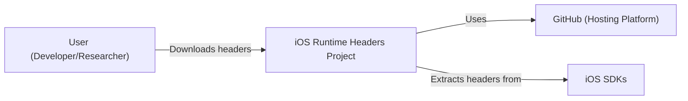
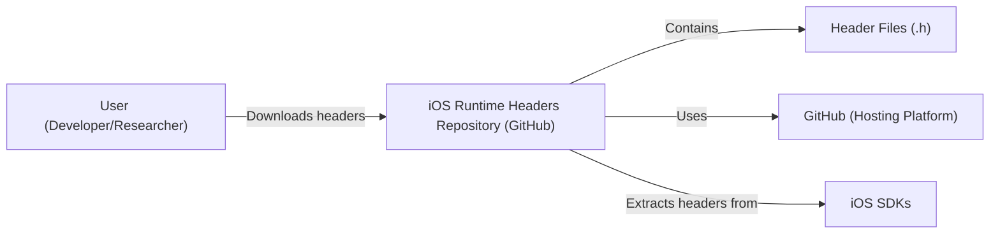
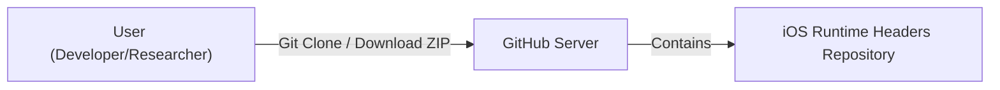
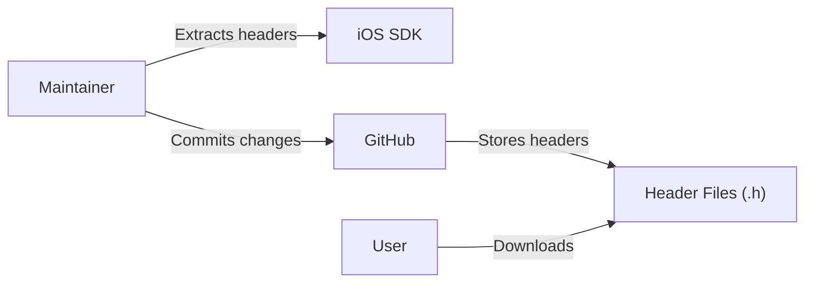

Okay, let's create a design document for the `ios-runtime-headers` project.

# BUSINESS POSTURE

Business Priorities and Goals:

*   Provide easy access to iOS runtime headers for developers and researchers.
*   Maintain a comprehensive and up-to-date collection of headers.
*   Offer a simple and reliable way to obtain these headers without needing a jailbroken device or complex setup.
*   Support multiple iOS versions.

Most Important Business Risks:

*   Legal risks associated with distributing proprietary Apple headers.
*   Maintaining accuracy and preventing the inclusion of incorrect or outdated information.
*   Ensuring the project remains accessible and doesn't get taken down due to copyright claims.
*   The project could become obsolete if Apple significantly changes its header distribution or obfuscation methods.
*   Reputational risk if the project is associated with malicious use (though the project itself is passive).

# SECURITY POSTURE

Existing Security Controls:

*   security control: The project is hosted on GitHub, which provides inherent security features like access control, version control, and infrastructure security.
*   security control: The project is read-only; users download files but cannot directly modify the repository content (except through pull requests, which are reviewed).
*   security control: The project does not execute any code on the user's machine, it is simply a repository of header files.
*   security control: GitHub's pull request system allows for community review of proposed changes, reducing the risk of malicious or incorrect headers being added.
*   security control: The project does not collect any user data.

Accepted Risks:

*   accepted risk: The project distributes Apple's proprietary headers, which carries inherent legal risk. The project operates under the assumption that providing these headers for research and development purposes falls under fair use, but this is not guaranteed.
*   accepted risk: The project does not perform any validation or verification of the header files. It relies on the community and maintainers to ensure accuracy.
*   accepted risk: The project does not provide any guarantees about the availability or longevity of the repository.

Recommended Security Controls:

*   security control: Implement a clear disclaimer stating the project's purpose (research and development), its non-commercial nature, and the potential legal risks. This helps manage user expectations and mitigate some legal risk.
*   security control: Consider adding a mechanism to verify the integrity of downloaded headers, such as providing checksums (e.g., SHA-256 hashes) for each file. This would allow users to confirm that the files haven't been tampered with.
*   security control: Explore options for automated header extraction from iOS SDKs to reduce reliance on manual updates and improve accuracy.

Security Requirements:

*   Authentication: Not applicable, as the project is read-only and doesn't involve user accounts.
*   Authorization: Not applicable, as all users have the same level of access (read-only).
*   Input Validation: Not directly applicable, as the project doesn't process user input in the traditional sense. However, validation of header files (as mentioned in recommended controls) is relevant.
*   Cryptography: Not directly applicable, as the project doesn't handle sensitive data requiring encryption. However, providing checksums (as mentioned above) uses cryptographic hashing.

# DESIGN

## C4 CONTEXT

C4 Context Element List:

*   User (Developer/Researcher):
    *   Name: User (Developer/Researcher)
    *   Type: Person
    *   Description: Individuals who need access to iOS runtime headers for development, research, or security analysis.
    *   Responsibilities: Download and use the header files.
    *   Security controls: None specific to this element, as they interact with the project in a read-only manner.

*   iOS Runtime Headers Project:
    *   Name: iOS Runtime Headers Project
    *   Type: Software System
    *   Description: A repository containing a collection of iOS runtime headers.
    *   Responsibilities: Provide access to the header files.
    *   Security controls: Read-only access, hosted on GitHub, community review of pull requests.

*   GitHub (Hosting Platform):
    *   Name: GitHub (Hosting Platform)
    *   Type: External System
    *   Description: The platform hosting the project's repository.
    *   Responsibilities: Provide version control, access control, and infrastructure security.
    *   Security controls: GitHub's built-in security features.

*   iOS SDKs:
    *   Name: iOS SDKs
    *   Type: External System
    *   Description: Official Apple Software Development Kits for iOS.
    *   Responsibilities: Source of the original header files.
    *   Security controls: Controlled by Apple.

## C4 CONTAINER

Since this project is essentially a static file repository, the Container diagram is very similar to the Context diagram. The main "container" is the repository itself.

C4 Container Element List:

*   User (Developer/Researcher):
    *   Name: User (Developer/Researcher)
    *   Type: Person
    *   Description: Individuals who need access to iOS runtime headers for development, research, or security analysis.
    *   Responsibilities: Download and use the header files.
    *   Security controls: None specific to this element.

*   iOS Runtime Headers Repository (GitHub):
    *   Name: iOS Runtime Headers Repository (GitHub)
    *   Type: Container (Repository)
    *   Description: The Git repository hosted on GitHub containing the header files.
    *   Responsibilities: Store and provide access to the header files.
    *   Security controls: GitHub's access control and security features, read-only access for most users.

*   Header Files (.h):
    *   Name: Header Files (.h)
    *   Type: Component
    *   Description: The actual iOS runtime header files.
    *   Responsibilities: Provide declarations of classes, methods, and properties.
    *   Security controls: None directly; integrity could be checked via checksums (recommended).

*   GitHub (Hosting Platform):
    *   Name: GitHub (Hosting Platform)
    *   Type: External System
    *   Description: The platform hosting the project's repository.
    *   Responsibilities: Provide version control, access control, and infrastructure security.
    *   Security controls: GitHub's built-in security features.

*   iOS SDKs:
    *   Name: iOS SDKs
    *   Type: External System
    *   Description: Official Apple Software Development Kits for iOS.
    *   Responsibilities: Source of the original header files.
    *   Security controls: Controlled by Apple.

## DEPLOYMENT

Deployment is straightforward, as the project is simply a repository hosted on GitHub. There are no multiple deployment environments.

Possible Deployment Solutions:

1.  GitHub Pages (Not applicable, as the project doesn't serve a website).
2.  Direct download from GitHub (Current solution).
3.  Mirroring to other repositories (Possible for redundancy).

Chosen Solution: Direct download from GitHub.

Deployment Element List:

*   User (Developer/Researcher):
    *   Name: User (Developer/Researcher)
    *   Type: Person
    *   Description: Individuals downloading the headers.
    *   Responsibilities: Initiate the download.
    *   Security controls: None specific to this element.

*   GitHub Server:
    *   Name: GitHub Server
    *   Type: Server
    *   Description: The server infrastructure provided by GitHub.
    *   Responsibilities: Host the repository and handle download requests.
    *   Security controls: GitHub's infrastructure security.

*   iOS Runtime Headers Repository:
    *   Name: iOS Runtime Headers Repository
    *   Type: Repository
    *   Description: The Git repository containing the header files.
    *   Responsibilities: Store the header files.
    *   Security controls: GitHub's access control.

## BUILD

The project doesn't have a traditional build process in the sense of compiling code. However, the process of updating the repository with new headers can be considered the "build."  Currently, this is a manual process.

Build Process Description:

1.  A maintainer obtains a new iOS SDK.
2.  The maintainer manually extracts the relevant header files.
3.  The maintainer commits the changes to the GitHub repository.
4.  GitHub's version control system tracks the changes.
5.  Users can then download the updated headers.

Security Controls in Build Process:

*   security control: Manual review of changes by maintainers before committing.
*   security control: GitHub's version control system provides an audit trail of all changes.
*   security control: GitHub's pull request system (if used) allows for community review before merging changes.

# RISK ASSESSMENT

Critical Business Processes:

*   Providing access to iOS runtime headers.
*   Maintaining the accuracy and completeness of the header collection.

Data to Protect and Sensitivity:

*   The header files themselves are the primary data. Their sensitivity is debatable, as they are technically proprietary Apple information but are also widely available through other means (e.g., within the iOS SDK). The risk is primarily legal, not data leakage in the traditional sense.

# QUESTIONS & ASSUMPTIONS

Questions:

*   What is the specific process used by maintainers to extract headers? Are there any tools used, or is it entirely manual?
*   Are there any plans to automate the header extraction process?
*   Has legal counsel been consulted regarding the distribution of these headers?
*   What is the process for handling updates and corrections to the headers?
*   How are different iOS versions managed within the repository? (Folder structure, branches, etc.)

Assumptions:

*   BUSINESS POSTURE: The project operates under the assumption that providing these headers for research and development falls under fair use.
*   SECURITY POSTURE: The project assumes that GitHub's security infrastructure is sufficient for hosting the repository.
*   DESIGN: The project assumes that manual updates and community contributions are sufficient for maintaining accuracy.
*   DESIGN: The project assumes users will download the entire repository or specific files, rather than relying on a web interface.
*   DESIGN: The project assumes that users have a basic understanding of Git and how to download files from GitHub.