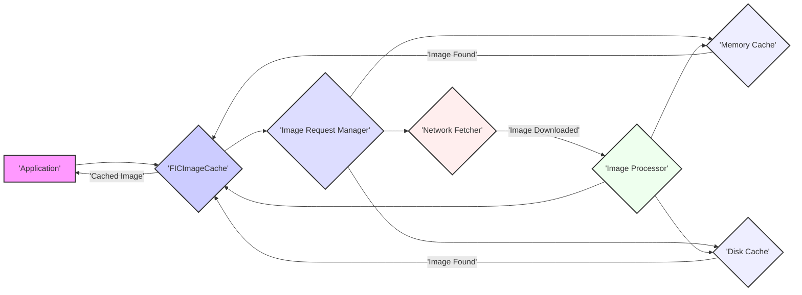
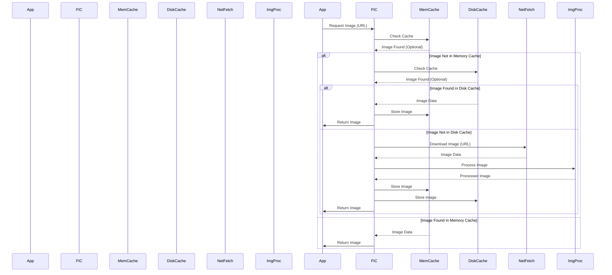

# Project Design Document: FastImageCache

**Version:** 1.1
**Date:** October 26, 2023
**Author:** AI Software Architect

## 1. Introduction

This document provides an enhanced and detailed design overview of the FastImageCache project, an open-source library designed for the efficient caching and retrieval of images. This document is intended to serve as a comprehensive reference for understanding the system's architecture, components, and data flow, specifically for facilitating thorough threat modeling activities. The core objective of this project is to significantly improve application performance by minimizing redundant network requests and enabling rapid access to frequently used image resources.

## 2. Goals

The primary goals of the FastImageCache project are:

*   **Highly Efficient Image Caching:** Implement a robust and performant caching mechanism for storing and retrieving images effectively.
*   **Significant Performance Optimization:** Reduce network latency, decrease bandwidth consumption, and improve the perceived and actual speed of image loading within applications.
*   **Intelligent Resource Management:** Manage memory and disk resources judiciously to prevent excessive consumption and ensure smooth application operation, even under heavy load.
*   **Seamless Integration:** Provide a simple, well-documented, and intuitive API that allows developers to easily integrate the library into their existing applications with minimal effort.
*   **Configurable Flexibility:** Offer a range of configurable options for cache policies (e.g., eviction strategies), storage mechanisms (memory and disk), and other parameters to suit diverse application needs.

## 3. Architecture Overview

The FastImageCache architecture is centered around the efficient management of image requests and the seamless retrieval of images, whether from local caches or remote network sources. The core components are designed to work in concert to deliver a transparent and high-performance caching experience.

## 4. Detailed Design

The system comprises the following key components, each with specific responsibilities:

*   **FICImageCache:** This serves as the primary interface for interacting with the library. It exposes the API for requesting images and orchestrates the entire caching workflow.
    *   Responsibilities:
        *   Receiving image requests from the application, typically identified by a unique URL or identifier.
        *   Performing an initial check of the **Memory Cache** for the requested image.
        *   If not found in memory, proceeding to check the **Disk Cache**.
        *   If the image is absent from both caches, initiating a network retrieval via the **Network Fetcher**.
        *   Upon successful retrieval, storing the image in both the **Memory Cache** and the **Disk Cache**, adhering to configured policies.
        *   Notifying the requesting application with the retrieved image (either from cache or network).
*   **Image Request Manager:** This component is responsible for managing the lifecycle of individual image requests, ensuring efficient and orderly processing.
    *   Responsibilities:
        *   Maintaining a queue of pending image requests, potentially prioritizing them based on factors like request time or perceived importance.
        *   Coordinating access to the **Memory Cache** and **Disk Cache**, ensuring thread safety and preventing race conditions.
        *   Handling concurrent requests for the same image by deduplicating them, preventing redundant downloads and processing.
        *   Potentially implementing mechanisms for cancelling pending requests if they are no longer needed.
*   **Memory Cache:** This is an in-memory storage mechanism designed for rapid access to frequently used images. Its volatile nature means data is lost when the application terminates.
    *   Responsibilities:
        *   Storing decoded image data in system memory for extremely fast retrieval.
        *   Providing near-instantaneous read access to cached images, significantly improving performance.
        *   Implementing a memory eviction policy (e.g., Least Recently Used (LRU), First-In-First-Out (FIFO), or a size-based policy) to automatically remove less frequently accessed images and manage memory usage effectively.
*   **Disk Cache:** This component provides persistent storage for images on the device's file system, ensuring they are available even after the application is closed and reopened.
    *   Responsibilities:
        *   Storing image data persistently on the device's storage.
        *   Providing relatively fast read access to cached images from disk, slower than memory but faster than a network request.
        *   Implementing a disk eviction policy (e.g., LRU, total size limit, or age-based) to manage disk space and prevent it from being filled indefinitely.
        *   Organizing cached files in a structured manner, often using hashed filenames based on the image URL to ensure uniqueness and efficient retrieval.
*   **Network Fetcher:** This component is responsible for downloading images from remote servers via network requests.
    *   Responsibilities:
        *   Making asynchronous HTTP(S) requests to retrieve images from specified URLs.
        *   Handling various network-related issues, such as timeouts, connection failures, and server errors, potentially with retry mechanisms.
        *   Supporting the configuration of request headers (e.g., for authentication or custom parameters).
        *   Potentially leveraging platform-specific networking features like connection pooling for efficiency.
*   **Image Processor:** This component handles any necessary processing of the image data after it has been retrieved (either from the network or the disk cache).
    *   Responsibilities:
        *   Decoding the raw image data from various formats (e.g., JPEG, PNG, GIF, WebP) into a usable image representation.
        *   Applying any configured image transformations, such as resizing, cropping, or applying filters.
        *   Ensuring the image is in the correct format and orientation for display within the application.

## 5. Data Flow

The typical sequence of actions for an image request within FastImageCache is as follows:

1. The **Application** initiates an image request by calling a method on the `FICImageCache`, providing the unique identifier (typically a URL) of the desired image.
2. The `FICImageCache` immediately checks the **Memory Cache**.
    *   If the image is found in the memory cache (a "cache hit"), the cached image data is returned directly to the **Application**, bypassing further steps.
3. If the image is not in the memory cache (a "cache miss"), the `FICImageCache` then consults the **Disk Cache**.
    *   If the image is found on disk, the **Disk Cache** retrieves the image data. This data is then potentially moved into the **Memory Cache** for faster future access before being returned to the **Application**.
4. If the image is not present in either cache, the `FICImageCache` instructs the **Network Fetcher** to download the image from the remote server specified by the image URL.
5. The **Network Fetcher** performs the network request and retrieves the raw image data.
6. The downloaded image data is then passed to the **Image Processor**.
7. The **Image Processor** decodes the image data into a usable format and applies any configured transformations.
8. The processed image is then stored in both the **Memory Cache** and the **Disk Cache**, making it available for subsequent requests.
9. Finally, the processed image is returned to the requesting **Application**.

## 6. Key Components in Detail

*   **FICImageCache:**
    *   Offers configuration options for setting maximum cache sizes (both memory and disk), defining custom eviction policies, and specifying the location for disk storage.
    *   Implements robust synchronization mechanisms (e.g., locks, queues) to ensure thread-safe access to the cache and prevent data corruption in concurrent environments.
    *   Includes comprehensive error handling for managing network failures, disk access issues, and other potential problems during the caching process.
*   **Image Request Manager:**
    *   Provides sophisticated request prioritization based on various factors, such as image visibility on screen or the urgency of the request based on user interaction.
    *   Employs intelligent deduplication logic to identify and merge concurrent requests for the same image, thereby avoiding redundant network activity and processing overhead.
    *   Offers mechanisms for explicitly cancelling pending image requests, which can be useful when views are no longer visible or data dependencies have changed.
*   **Memory Cache:**
    *   Typically implemented using efficient data structures like `NSCache` (on Apple platforms) or `LruCache` (on Android), which provide built-in support for eviction policies.
    *   Allows for configurable memory limits, enabling developers to fine-tune memory usage based on application requirements and device capabilities.
    *   May include optional callbacks or notifications that are triggered when images are evicted from the cache, allowing for custom handling or logging.
*   **Disk Cache:**
    *   Utilizes a well-defined file system organization, often employing subdirectories based on hash values of image URLs to ensure efficient storage and retrieval.
    *   May store metadata alongside the image data, such as timestamps of last access, image sizes, or other relevant information for eviction policies or debugging.
    *   Often performs background tasks for cache maintenance, such as deleting expired or least-used files to reclaim disk space.
*   **Network Fetcher:**
    *   Leverages platform-specific networking APIs (e.g., `URLSession` on Apple platforms, `HttpURLConnection` or `OkHttp` on Android) for robust and efficient network communication.
    *   Supports honoring HTTP caching headers (e.g., `Cache-Control`, `Expires`) provided by the server to avoid unnecessary downloads.
    *   May integrate with external networking libraries (e.g., Alamofire, Retrofit) to simplify network request management and provide additional features.
*   **Image Processor:**
    *   Utilizes platform-provided image decoding capabilities (e.g., `UIImage` and Core Graphics on Apple platforms, `BitmapFactory` on Android) for optimal performance.
    *   Supports a wide range of common image formats, ensuring compatibility with various image sources.
    *   Provides options for applying various image transformations, such as resizing to specific dimensions, cropping to fit certain layouts, or applying visual effects.

## 7. Security Considerations (for Threat Modeling)

This section details potential security vulnerabilities and threats relevant to the FastImageCache project, crucial for effective threat modeling:

*   **Data Integrity Threats:**
    *   **Cache Poisoning:** An attacker could potentially inject malicious or corrupted images into the cache, leading to the application displaying harmful content. This could occur if the image source is compromised or if vulnerabilities exist in the caching mechanism.
        *   Mitigation Considerations: Implement robust validation of downloaded image data (e.g., verifying file signatures or checksums). Enforce secure communication channels (HTTPS) to prevent man-in-the-middle attacks that could alter image data in transit. Consider implementing integrity checks for cached files on disk.
*   **Availability Threats:**
    *   **Denial of Service (DoS) via Cache Flooding:** An attacker could flood the cache with requests for a large number of unique, large images, rapidly consuming available disk space or memory, potentially making the cache unusable and impacting application performance.
        *   Mitigation Considerations: Implement rate limiting for image requests to prevent excessive downloading. Enforce maximum cache size limits for both memory and disk, coupled with effective eviction policies. Monitor resource usage (CPU, memory, disk I/O) to detect and respond to potential attacks.
*   **Confidentiality Threats:**
    *   **Information Disclosure via Cache Metadata:** Sensitive information might be inadvertently included in cache metadata (e.g., user-specific identifiers in URLs that become part of the cache key or file names).
        *   Mitigation Considerations: Carefully consider what metadata is stored and avoid including sensitive information. If necessary, encrypt cached data at rest on disk. Implement secure deletion practices to ensure sensitive data is not recoverable after eviction.
*   **Access Control and Authorization Threats:**
    *   **Unauthorized Access to Cached Data:** If the disk cache is not properly protected, malicious applications or users with access to the device's file system might be able to access cached images they are not authorized to view.
        *   Mitigation Considerations: Utilize platform-provided mechanisms for secure storage and file permissions. Educate users about device security best practices. Consider encrypting the disk cache.
*   **Code Injection and Execution Threats:**
    *   **Path Traversal Vulnerabilities:** If the disk cache implementation does not properly sanitize filenames derived from URLs, an attacker might be able to craft malicious URLs that, when cached, could write files to arbitrary locations on the file system, potentially leading to code execution.
        *   Mitigation Considerations: Implement strict validation and sanitization of filenames derived from URLs before using them for file storage. Use secure file system APIs and avoid constructing file paths dynamically based on user-provided input without thorough validation.
*   **Network Security Threats:**
    *   **Man-in-the-Middle Attacks (Downgrade Attacks):** If HTTPS is not strictly enforced for image downloads, an attacker could intercept network traffic and potentially serve modified or malicious images.
        *   Mitigation Considerations: Enforce HTTPS for all image downloads. Implement certificate pinning to prevent attackers from using compromised or fraudulent certificates.

## 8. Assumptions and Constraints

*   It is assumed that the underlying operating system and file system provide a baseline level of security.
*   The library relies on the accuracy and integrity of the image URLs provided by the integrating application. It does not inherently validate the source of these URLs.
*   Performance characteristics will vary based on factors such as network conditions, device hardware capabilities (CPU, memory, storage speed), and the specific configuration of the cache.
*   The primary focus of the library is caching static image resources. It may not be optimally designed for frequently changing or highly dynamic image content without careful configuration.

## 9. Future Considerations

*   Implementation of more advanced and configurable caching policies, such as time-based expiration with fine-grained control.
*   Seamless integration with Content Delivery Networks (CDNs) to optimize image delivery from geographically closer servers.
*   Comprehensive metrics and monitoring capabilities to track cache performance (hit rate, eviction counts) and effectiveness.
*   More robust and granular error handling and reporting mechanisms to aid in debugging and issue resolution.
*   Exploration of advanced image compression techniques to reduce storage footprint and bandwidth usage.
*   Support for more sophisticated image transformations and processing options.

This enhanced design document provides a more detailed and comprehensive overview of the FastImageCache project. It serves as a solid foundation for understanding the system's architecture and will be invaluable for conducting thorough threat modeling activities. By proactively addressing the security considerations outlined, developers can build more secure, performant, and reliable applications that effectively leverage the benefits of image caching.