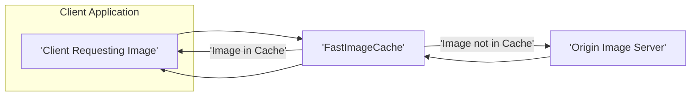
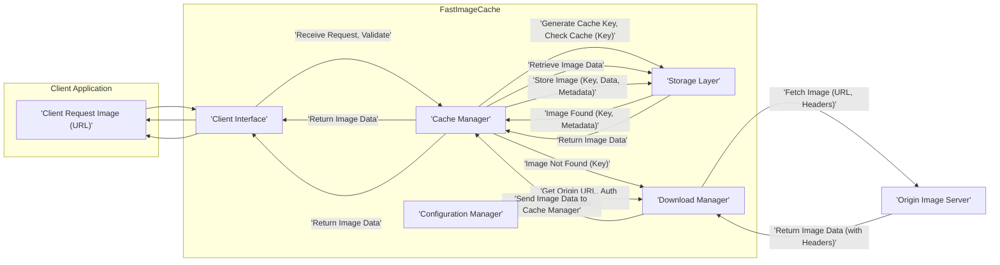

# Project Design Document: Fast Image Cache

**Project Repository:** [https://github.com/path/fastimagecache](https://github.com/path/fastimagecache)

**Document Version:** 1.1
**Date:** October 26, 2023
**Author:** AI Software Architect

## 1. Introduction

This document provides a detailed design overview of the `fastimagecache` project. The purpose of this document is to clearly articulate the system's architecture, components, data flow, and key considerations, specifically for the purpose of subsequent threat modeling activities.

### 1.1. Purpose

The primary purpose of `fastimagecache` is to provide a fast and efficient mechanism for caching images retrieved from remote sources. This caching layer aims to reduce latency experienced by clients, decrease bandwidth consumption on origin servers and the network, and improve the overall performance and responsiveness of applications that rely on fetching and displaying images.

### 1.2. Scope

This document covers the core architecture and functionality of the `fastimagecache` system. It includes the key components involved in fetching, storing, and retrieving cached images. It focuses on the logical and physical design aspects relevant to understanding the system's behavior, data flow, and potential security vulnerabilities. This document does not cover specific implementation details, programming languages, or deployment environments.

### 1.3. Goals

*   Provide a clear and comprehensive understanding of the `fastimagecache` system's architecture and its components.
*   Identify the key components and detail their interactions and responsibilities.
*   Describe the complete data flow within the system, highlighting potential transformation points.
*   Highlight important design decisions and considerations relevant to security and functionality.
*   Serve as a foundational document for threat modeling, enabling the identification of potential security risks and vulnerabilities.

## 2. System Overview

`fastimagecache` acts as an intermediary, a caching proxy, between clients requesting images and the original image sources (e.g., web servers, cloud storage). It intercepts image requests, uses the request to generate a cache key, checks its cache for the requested image, and serves it if available (cache hit). If the image is not in the cache (cache miss), it fetches it from the origin, stores it in the cache using the generated key, and then serves it to the client.

### 2.1. High-Level Architecture

### 2.2. Key Components

*   **Client Interface:** The entry point for clients to request images. This could be an API (e.g., HTTP endpoint, SDK functions) that accepts image URLs or identifiers.
*   **Cache Manager:** The central component responsible for managing the image cache lifecycle. This includes:
    *   Generating cache keys from image requests.
    *   Checking if an image exists in the cache based on the key.
    *   Retrieving images from the Storage Layer.
    *   Storing new images received from the Download Manager into the Storage Layer.
    *   Implementing and enforcing cache eviction policies (e.g., LRU, FIFO, TTL).
    *   Managing cache metadata.
*   **Download Manager:** Responsible for fetching images from the origin server when they are not found in the cache. This component handles communication with external systems.
*   **Storage Layer:** The mechanism used to persist cached images. This could be:
    *   Local file system with a defined directory structure.
    *   In-memory store for temporary caching.
    *   Distributed cache (e.g., Redis, Memcached) for scalability and shared caching.
*   **Configuration Manager:** Handles the configuration of the `fastimagecache` system, including:
    *   Cache size limits and thresholds.
    *   Cache eviction policy selection and parameters.
    *   Origin server details and access credentials (if required).
    *   Time-to-live (TTL) settings for cached images.
    *   Security settings and access controls.
    *   Logging and monitoring configurations.

## 3. Detailed Design

### 3.1. Component Breakdown

#### 3.1.1. Client Interface

*   **Responsibilities:**
    *   Receives image requests from clients (e.g., by URL or a unique identifier).
    *   Performs initial request validation and sanitization.
    *   Forwards processed requests to the Cache Manager.
    *   Receives cached images from the Cache Manager.
    *   Constructs and returns image responses to the requesting client.
    *   Handles potential errors (e.g., invalid request format, image not found, network issues) and provides appropriate error responses.
    *   May implement authentication and authorization mechanisms to control access to the cache.
*   **Inputs:** Image request (typically a URL or identifier, along with potential headers or parameters).
*   **Outputs:** Image data (with appropriate headers) or error response (with status code and message).
*   **Interactions:** Interacts primarily with the Cache Manager.

#### 3.1.2. Cache Manager

*   **Responsibilities:**
    *   Generates a unique cache key based on the incoming image request (e.g., hashing the URL).
    *   Checks if an image exists in the Storage Layer using the generated cache key.
    *   Retrieves image data and metadata from the Storage Layer.
    *   Stores image data received from the Download Manager into the Storage Layer, associating it with the generated cache key.
    *   Enforces configured cache eviction policies to manage cache size and ensure freshness.
    *   Manages image metadata (e.g., creation time, last access time, expiration time, content type).
    *   Handles concurrent access to the cache to prevent race conditions and data corruption.
    *   May implement mechanisms to prevent cache stampedes (where multiple requests for the same uncached image overload the origin server).
*   **Inputs:** Image request (URL or identifier), image data from Download Manager.
*   **Outputs:** Image data (if found in cache), instruction to Download Manager to fetch the image (if not found).
*   **Interactions:** Interacts with the Client Interface, the Storage Layer, and the Download Manager.

#### 3.1.3. Download Manager

*   **Responsibilities:**
    *   Receives requests to fetch images from the origin server based on the provided URL.
    *   Resolves the origin server address from the URL.
    *   Handles network communication with the origin server, including establishing connections and managing timeouts.
    *   Manages HTTP requests, including setting appropriate headers (e.g., User-Agent, Accept).
    *   Handles HTTP responses, including status codes and response headers.
    *   Potentially handles authentication and authorization with the origin server (e.g., using API keys, OAuth tokens) based on configuration.
    *   May implement retry mechanisms and backoff strategies for failed downloads.
    *   Performs basic validation of the downloaded image (e.g., checking content type, size limits).
*   **Inputs:** Image URL.
*   **Outputs:** Image data (as a stream or byte array).
*   **Interactions:** Interacts with the Cache Manager and the Configuration Manager (for origin server details, authentication credentials, and timeout settings).

#### 3.1.4. Storage Layer

*   **Responsibilities:**
    *   Provides a persistent or temporary storage mechanism for cached image data.
    *   Offers operations for storing, retrieving, and deleting images based on cache keys.
    *   Manages storage space and organization, potentially including directory structures or database schemas.
    *   Ensures data integrity and consistency.
    *   May implement mechanisms for data compression or encryption at rest.
    *   Handles potential storage errors (e.g., disk full, read/write failures).
*   **Inputs:** Image data, cache key (image identifier).
*   **Outputs:** Image data.
*   **Interactions:** Interacts primarily with the Cache Manager.

#### 3.1.5. Configuration Manager

*   **Responsibilities:**
    *   Loads configuration parameters from various sources (e.g., configuration files, environment variables, command-line arguments).
    *   Provides a centralized access point for configuration settings for other components.
    *   May support dynamic configuration updates and reloading without service interruption.
    *   Performs validation of configuration parameters to prevent invalid settings.
    *   Manages sensitive configuration data (e.g., API keys, credentials) securely.
*   **Inputs:** Configuration files, environment variables, command-line arguments.
*   **Outputs:** Configuration parameters.
*   **Interactions:** Used by all other components to retrieve configuration settings.

### 3.2. Data Flow

The following diagram illustrates the typical data flow for an image request, highlighting the interactions between components:

**Detailed Data Flow Steps:**

1. **Client Request:** The client application initiates a request for an image, typically by providing its URL.
2. **Client Interface Receives Request:** The Client Interface component receives the image request.
3. **Request Validation:** The Client Interface performs initial validation of the request (e.g., checking URL format).
4. **Forward to Cache Manager:** The Client Interface forwards the validated request (or relevant information like the URL) to the Cache Manager.
5. **Cache Key Generation and Lookup:** The Cache Manager generates a unique cache key based on the request (e.g., hashing the URL). It then checks the Storage Layer for the image using this key.
6. **Cache Hit:**
    *   If the image is found in the cache, the Storage Layer retrieves the image data and associated metadata.
    *   The Storage Layer returns the image data to the Cache Manager.
    *   The Cache Manager returns the image data to the Client Interface.
    *   The Client Interface constructs the response (including appropriate headers based on metadata) and sends the image data back to the client application.
7. **Cache Miss:**
    *   If the image is not found in the cache, the Cache Manager instructs the Download Manager to fetch the image from the origin server.
    *   The Download Manager retrieves the origin server URL and any necessary authentication details from the Configuration Manager.
    *   The Download Manager initiates a request to the Origin Image Server, including appropriate headers.
    *   The Origin Image Server processes the request and returns the image data along with response headers.
    *   The Download Manager sends the received image data to the Cache Manager.
    *   The Cache Manager stores the image data in the Storage Layer, associating it with the generated cache key and relevant metadata.
    *   The Cache Manager returns the image data to the Client Interface.
    *   The Client Interface constructs the response and sends the image data back to the client application.

### 3.3. Key Design Considerations

*   **Cache Key Generation Strategy:** The method used to generate cache keys is critical for cache efficiency and correctness. It should be deterministic and handle variations in URLs appropriately.
*   **Cache Eviction Policy Details:** The specific implementation and parameters of the chosen eviction policy (e.g., LRU with a specific time window, TTL with configurable durations).
*   **Storage Layer Implementation:** The choice of storage mechanism significantly impacts performance, scalability, persistence, and security. Considerations include data encryption, access controls, and storage limits.
*   **Concurrency Control:** Mechanisms to handle concurrent requests and prevent race conditions, especially during cache updates and evictions.
*   **Error Handling and Resilience:** Strategies for handling network failures, origin server errors, storage issues, and other potential failures. This includes retry mechanisms, circuit breakers, and fallback strategies.
*   **Scalability and Performance:** Design considerations to ensure the cache can handle increasing request volumes and maintain low latency. This may involve horizontal scaling, load balancing, and efficient data structures.
*   **Security Best Practices:** Implementing security measures throughout the system, including input validation, secure communication, access control, and protection of sensitive data.

## 4. Security Considerations (For Threat Modeling)

This section expands on the initial security considerations, providing more specific examples of potential threats and vulnerabilities that will be further explored during the threat modeling process.

*   **Cache Poisoning:**
    *   **Threat:** An attacker injects malicious or incorrect image data into the cache, which is then served to legitimate clients.
    *   **Vulnerabilities:** Exploiting vulnerabilities in the Download Manager to fetch malicious content, compromising the origin server, or manipulating the cache storage directly if access controls are weak.
*   **Data Integrity:**
    *   **Threat:** Cached images are tampered with or corrupted during storage or retrieval.
    *   **Vulnerabilities:** Lack of integrity checks on stored data, unauthorized access to the storage layer, or vulnerabilities in the storage mechanism itself.
*   **Access Control:**
    *   **Threat:** Unauthorized access to the cache management functions (e.g., clearing the cache, modifying configurations) or to the cached data itself.
    *   **Vulnerabilities:** Weak or missing authentication and authorization mechanisms for administrative interfaces or access to the storage layer.
*   **Storage Security:**
    *   **Threat:** Unauthorized access, modification, or deletion of cached images in the storage layer.
    *   **Vulnerabilities:** Inadequate file system permissions, lack of encryption at rest, insecure network configurations for distributed caches, or vulnerabilities in the storage software.
*   **Configuration Vulnerabilities:**
    *   **Threat:** Misconfigurations that expose the system to security risks.
    *   **Vulnerabilities:** Insecure default configurations, lack of input validation for configuration parameters, storing sensitive information in plaintext, or allowing overly permissive access controls.
*   **Denial of Service (DoS):**
    *   **Threat:** An attacker overwhelms the cache with requests, leading to resource exhaustion or service unavailability.
    *   **Vulnerabilities:** Lack of rate limiting or request throttling, inefficient cache eviction policies that allow the cache to be filled with useless data, or vulnerabilities that cause excessive resource consumption during image processing.
*   **Information Disclosure:**
    *   **Threat:** Sensitive information about the origin server, cached content, or internal system workings is exposed.
    *   **Vulnerabilities:** Verbose error messages, insecure logging practices, exposing cache metadata without proper authorization, or vulnerabilities that allow attackers to enumerate cached content.
*   **Man-in-the-Middle (MitM) Attacks:**
    *   **Threat:** An attacker intercepts communication between `fastimagecache` and the origin server, potentially modifying image data or injecting malicious content.
    *   **Vulnerabilities:** Lack of encryption (HTTPS) for communication with origin servers, failure to validate server certificates, or vulnerabilities in the communication protocols.
*   **Cache Snooping:**
    *   **Threat:** An attacker infers information about user activity or accessed content by observing the cache contents or access patterns.
    *   **Vulnerabilities:** Predictable cache key generation, lack of access controls on cache metadata, or vulnerabilities that allow attackers to enumerate cached content.

## 5. Assumptions and Constraints

*   The system assumes that image URLs are the primary identifier for cached images, and variations in query parameters or fragments may need to be handled consistently in cache key generation.
*   The system assumes reliable but not necessarily always available network connectivity to the origin server, requiring robust error handling and retry mechanisms.
*   The specific implementation details and security posture of the origin server are outside the direct control of `fastimagecache`, but interactions with it must be secured.
*   The choice of programming language and specific libraries for implementation will influence the available security features and potential vulnerabilities.
*   The deployment environment (e.g., cloud, on-premises) will impose its own set of security considerations and constraints.

## 6. Future Considerations

*   **Advanced Cache Invalidation Strategies:** Implementing more sophisticated mechanisms for cache invalidation, such as using webhooks or polling mechanisms to detect changes on the origin server.
*   **Content Delivery Network (CDN) Integration:** Designing the system to seamlessly integrate with CDNs for improved global performance and scalability, considering CDN security implications.
*   **Metrics, Monitoring, and Alerting:** Implementing comprehensive monitoring of cache performance, hit rates, error conditions, and security-related events, with alerting for anomalies.
*   **Advanced Caching Techniques:** Exploring more advanced caching strategies like content-aware caching, edge caching, or tiered caching for further optimization.
*   **Security Auditing and Logging:** Implementing detailed logging of security-relevant events and regular security audits to identify and address potential vulnerabilities.
*   **Rate Limiting and Abuse Prevention:** Implementing robust rate limiting and abuse prevention mechanisms to protect against DoS attacks and other malicious activities.
*   **Support for Signed URLs:** Integrating support for signed URLs from origin servers to enhance security and control access to cached content.

This document provides a detailed and improved design overview of the `fastimagecache` project, specifically tailored for threat modeling activities. It highlights key components, data flows, and security considerations to facilitate the identification and mitigation of potential security risks.